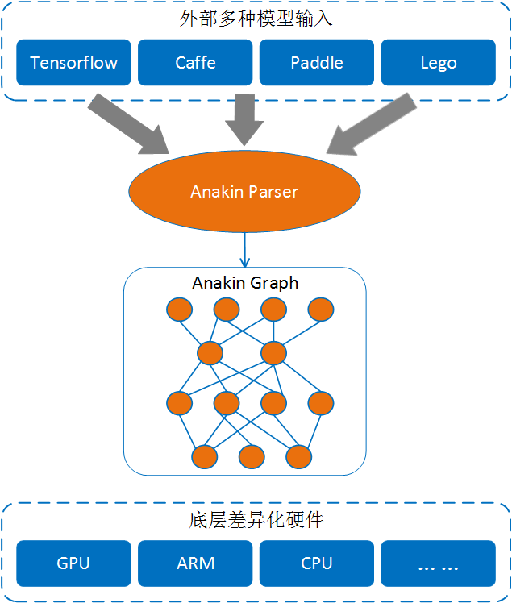

# Anakin 使用教程 ##

本教程将会简略的介绍Anakin的工作原理，一些基本的Anakin API，以及如何调用这些API。

## 内容 ###

- [Anakin的工作原理](#principle)
- [Anakin APIs](#api)
- [示例代码](#example)

## <span id = 'principle'> Anakin的工作原理</span> ###



用Anakin来进行前向计算主要分为三个步骤：

  - 将外部模型通过[Anakin Parser](./convert_paddle_to_anakin.html)解析为Anakin模型
    在使用Anakin之前，用户必须将所有其他模型转换成Anakin模型，我们提供了转换脚本，用户可通过[Anakin Parser](./convert_paddle_to_anakin.html)进行模型转换。
  - 生成Anakin计算图
    加载Anakin模型生成原始计算图，然后需要对原始计算图进行优化。你只需要调用相应的API优化即可。
  - 执行计算图
    Anakin会选择不同硬件平台执行计算图。


## <span id ='api'>Anakin APIs </span> ###

### Tensor ####

`Tensor`提供基础的数据操作和管理，为ops提供统一的数据接口。`Tensor`包含以下几个属性：

- Buffer
  数据存储区
- Shape
  数据的维度信息
- Event
  用于异步计算的同步

`Tensor`类包含三个`Shape`对象， 分别是`_shape`, `_valid_shape`和 `offset`

  - `_shape`为`tensor`真正空间信息
  - `_valid_shape`表示当前`tensor`使用的空间信息
  - `tensor`使用的空间信息
  - `_offset`表示当前`tensor`数据指针相对于真正数据空间的信息

`Tensor`不同维度与分别与数学中的向量、矩阵等相对应如下表所示

Dimentions | Math entity |
:----: | :----:
1 | vector
2 | matrix
3 | 3-tensor
n | n-tensor

#### 声明tensor对象

`Tensor`接受三个模板参数:


```c++
 template<typename TargetType, DataType datatype, typename LayOutType = NCHW>
 class Tensor .../* Inherit other class */{
  //some implements
  ...
 };
```

TargetType是平台类型，如X86，GPU等等，在Anakin内部有相应的标识与之对应；datatype是普通的数据类型，在Anakin内部也有相应的标志与之对应
[LayOutType](#layout)是数据分布类型，如batch x channel x height x width [NxCxHxW], 在Anakin内部用一个struct来标识

Anakin中数据类型与基本数据类型的对应如下:

  1. <span id = 'target'> TargetType </span>

    Anakin TargetType | platform
    :----: | :----:
    NV | NVIDIA GPU
    ARM | ARM
    AMD | AMD GPU
    X86 | X86
    NVHX86 | NVIDIA GPU with Pinned Memory

  2. <sapn id='datatype'> DataType </span>

    Anakin DataType | C++ | Description
    :---: | :---: | :---:
    AK_HALF | short | fp16
    AK_FLOAT | float | fp32
    AK_DOUBLE | double | fp64
    AK_INT8 | char | int8
    AK_INT16 | short | int16
    AK_INT32 | int | int32
    AK_INT64 | long | int64
    AK_UINT8 | unsigned char | uint8
    AK_UINT16 | unsigned short | uint8
    AK_UINT32 | unsigned int | uint32
    AK_STRING | std::string | /
    AK_BOOL | bool | /
    AK_SHAPE | / | Anakin Shape
    AK_TENSOR | / | Anakin Tensor

  3. <span id = 'layout'> LayOutType </span>

    Anakin LayOutType ( Tensor LayOut ) | Tensor Dimention | Tensor Support | Op Support
    :---: | :---: | :---: | :---:
    W | 1-D | YES | NO
    HW | 2-D | YES | NO
    WH | 2-D | YES | NO
    NW | 2-D | YES | YES
    NHW | 3-D | YES |YES
    NCHW ( default ) | 4-D | YES | YES
    NHWC | 4-D | YES | NO
    NCHW_C4 | 5-D | YES | YES

  理论上，Anakin支持申明1维以上的tensor，但是对于Anakin中的Op来说，只支持NW、NHW、NCHW、NCHW_C4这四种LayOut，其中NCHW是默认的LayOuteType，NCHW_C4是专门针对于int8这种数据类型的。

  **例子：**

下面的代码将展示如何使用tensor， 我们建议先看看这些示例。

要想获得更多关于tensor的信息， 请参考 *soure_path/core/tensor.h*

1. 使用shape对象初始化tensor

    ```cpp
    //create a null tensor. A null tensor holds for nothing.
    //tensor's buffer  is resident at CPU and its datatype is AK_FLOAT.
    //tensor's Layout is NCHW(default)
    Tensor<X86, AK_FLOAT> mytensor;

    //1. using shape object to create a tensor.
    Shape shape1(NUM); //1-D shape. NUM is the number of dimention.
    Tensor<X86, AK_FLOAT, W> mytensor1(shape1); //1-D tensor.

    // A 4-D shape
    Shape shape2(N, C, H, W); // batch x channel x height x width
    ```

    `注意：Shape的维度必须和tensor的`[LayoutType](#layout)`相同，比如Shape(N,C,H,W), 那么Tensor的 LayoutType必须是NCHW，否则会出错。如下列代码所示`

    ```c++
    // A 4-D tensor.
    Tensor<X86, AK_FLOAT> mytensor2(shape2);  //right

    //A 4-D tensor which is resident at GPU and its datatype is AK_INT8
    Tensor<NV, AK_INT8> mytensor3(shape2);   //right

    Tensor<X86, AK_FLOAT, NHW> mytensor4(shape2); //wrong!! shape's dimetion must be equal to tensor's Layout.
    Tensor<NV, AK_FLOAT, NCHW_C4> mytensor5(shape2); //wrong!!!!
    ```

2. 使用现有的数据和shape初始化tensor

    ```c++
    /**
    *  A construtor of Tensor.
    *  data_ptr is a pointer to any data type of data
    *  TargetType is type of a platform [Anakin TargetType]
    *  id : device id
    *  shape: a Anakin shape
    */
    Tensor(Dtype* data_ptr, TargetType_t target, int id, Shape shape);

    //using existing data feed to a tensor
    Tensor<X86, AK_FLOAT> mytensor(data_ptr, TargetType, device_id, shape); //shape must has dimention (N, C, H, W).
    ```

3. 使用tensor初始化tensor

    ```c++
    Tensor<NV, AK_FLOAT> tensor(exist_tensor);
    ```

>提示： 你可以用` typedef Tensor<X86, AK_FLOAT> Tensor4d_X86 `方便定义tensor

#### 填充tensor数据区

填充数据区得看你申明tensor的方式， 下面展示了如何填充tensor的数据区。

首先来看看tensor的四种声明方式：

```c++
  1. Tensor<X86, AK_FLOAT> mytensor;
  2. Tensor<X86, AK_FLOAT, W> mytensor1(shape1);
  3. Tensor<X86, AK_FLOAT> mytensor(data_ptr, TargetType, device_id, shape);
  4. Tensor<NV, AK_FLOAT> tensor(exist_tensor);
```

相关的声明方式的数据填充方法如下：

- 声明一个空的tensor，此时没有为其分配内存，所以，我们需要手动的为其分配内存。

```c++
  1. Tensor<X86, AK_FLOAT> mytensor;
  2. Tensor<X86, AK_FLOAT, W> mytensor1(shape1);
  3. Tensor<X86, AK_FLOAT> mytensor(data_ptr, TargetType, device_id, shape);
  4. Tensor<NV, AK_FLOAT> tensor(exist_tensor);
  
        //Get writable pointer to mytensor.
        //parama index (int): where you start to write.
        //Dtype is your data type such int, float or double.
        Dtype *p = mytensor.mutable_data(index/*=0*/);
        //write data to mytensor
        for(int i = 0; i < mytensor.size(); i++){
            p[i] = 1.0f;
        }
        //do something ...
```

- 这种声明方式会自动分配内存

```c++
        //Get writable pointer to mytensor.
        //parama index (int): where you start to write.
        //Dtype is your data type such int, float or double.
        Dtype *p = mytensor1.mutable_data(index/*=0*/);
        //write data to mytensor
        for(int i = 0; i < mytensor.size(); i++){
           p[i] = 1.0f;
        }
        //do something ...
```

- 在该种声明方式中，我们仍不需要手动为其分配内存。但在构造函数内部是否为其分配内存，得依情况而定。如果data_ptr和申明的
  tensor都在都一个目标平台上，那么该tensor就会与data_ptr共享内存空间，相反，如果他们不在同一个平台上（如data_ptr在X86上，而
  tensor在GPU上），那么此时tensor就会开辟一个新的内存空间，并将data_ptr所指向的数据拷贝到tensor的buffer中。

- 声明一个空的tensor，此时没有为其分配内存，所以，我们需要手动的为其分配内存。

```c++

        //parama shape
        mytensor.re_alloc(Shape shape);

        //Get writable pointer to mytensor.
        //parama index (int): where you start to write.
        //Dtype is your data type such int, float or double.
        Dtype *p = mytensor.mutable_data(index/*=0*/);
        //write data to mytensor
        for(int i = 0; i < mytensor.size(); i++){
            p[i] = 1.0f;
        }
        //do something ...
```

- 这种声明方式会自动分配内存

```c++
        //Get writable pointer to mytensor.
        //parama index (int): where you start to write.
        //Dtype is your data type such int, float or double.
        Dtype *p = mytensor1.mutable_data(index/*=0*/);
        //write data to mytensor
        for(int i = 0; i < mytensor.size(); i++){
           p[i] = 1.0f;
        }
        //do something ...
```

- 在该种声明方式中，我们仍不需要手动为其分配内存。但在构造函数内部是否为其分配内存，得依情况而定。如果data_ptr和申明的
  tensor都在都一个目标平台上，那么该tensor就会与data_ptr共享内存空间，相反，如果他们不在同一个平台上（如data_ptr在X86上，而
  tensor在GPU上），那么此时tensor就会开辟一个新的内存空间，并将data_ptr所指向的数据拷贝到tensor的buffer中。

```c++
        //Get writable pointer to mytensor.
        //parama index (int): where you start to write.
        //Dtype is your data type such int, float or double.
        Dtype *p = mytensor.mutable_data(index/*=0*/);
        //write data to mytensor
        for(int i = 0; i < mytensor.size(); i++){
          p[i] = 1.0f;
        }
        //do something ...
```

- 该种方式仍不需要手动分配内存

