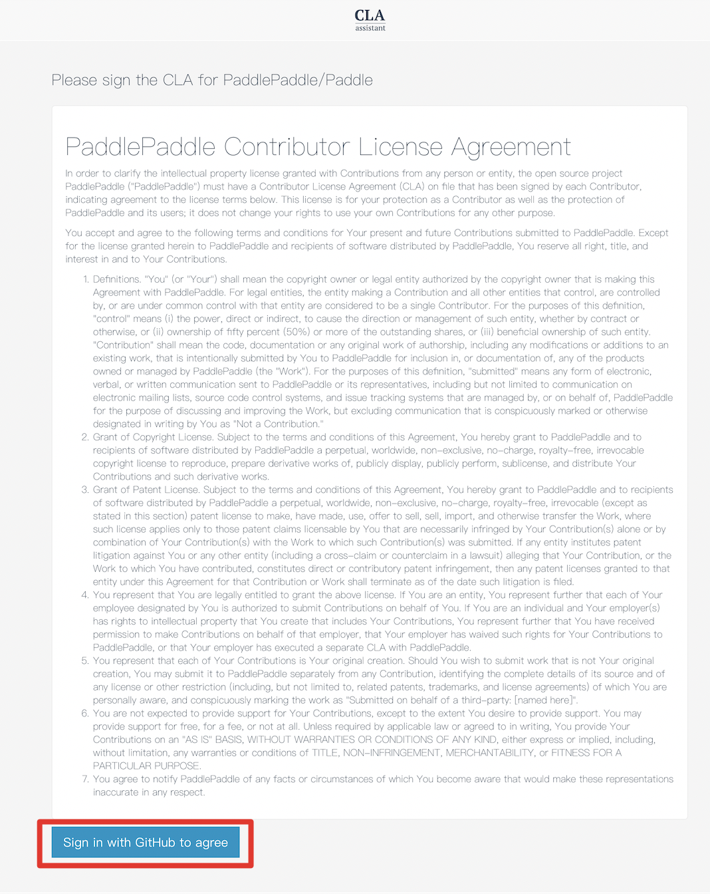

# Github提交PR指南

## 建立 Issue 并完成 Pull Request

建立一个 Issue 描述问题，并记录它的编号。

切换到所建分支，然后点击 `New pull request`。


选择目标分支：


在 PR 的描述说明中，填写 `resolve #Issue编号` 可以在这个 PR 被 merge 后，自动关闭对应的 Issue，具体请见[这里](https://help.github.com/articles/closing-issues-via-commit-messages/)。

接下来等待 review，如果有需要修改的地方，参照上述步骤更新 origin 中的对应分支即可。

## 签署CLA协议和通过单元测试

### 签署CLA

在首次向PaddlePaddle提交Pull Request时，您需要您签署一次CLA(Contributor License Agreement)协议，以保证您的代码可以被合入，具体签署方式如下：

- 请您查看PR中的Check部分，找到license/cla，并点击右侧detail，进入CLA网站

<div align="center">


 </div>


- 请您点击CLA网站中的“Sign in with GitHub to agree”,点击完成后将会跳转回您的Pull Request页面

<div align="center">



 </div>


### 通过单元测试

您在Pull Request中每提交一次新的commit后，会触发CI单元测试，请确认您的commit message中已加入必要的说明，请见[提交（commit）](local_dev_guide.html#permalink-8--commit-)

- 请您关注您Pull Request中的CI单元测试进程，它将会在几个小时内完成

- 您仅需要关注和自己提交的分支相关的CI项目，例如您向develop分支提交代码，则无需关注release/1.1一栏是否通过测试

- 当所需的测试后都出现了绿色的对勾，表示您本次commit通过了各项单元测试

- 如果所需的测试后出现了红色叉号，代表您本次的commit未通过某项单元测试，请您按照以下步骤查看报错信息：

	* 点击出现报错的CI测试项栏最右边的“detail”

	* 如果您未登陆过CI网站，您会看到一个登陆窗口，此时请您点击“Log in as guest”(如下图)，即可查看报错信息

	<div align="center">

	

	</div>


 3）修复与反馈

 请您根据报错信息自行修复，如果确定本地commit不会触发报错，则报错可能是由CI不稳定引起的。这种情况下，请将报错详情以评论的方式添加在您的Pull Request中，我们的工作人员将帮您查看，这里提供一个[例子](https://github.com/PaddlePaddle/Paddle/pull/14337#issuecomment-437398972)。

## 删除远程分支

在 PR 被 merge 进主仓库后，我们可以在 PR 的页面删除远程仓库的分支。


也可以使用 `git push origin :分支名` 删除远程分支，如：

```bash
➜  git push origin :my-cool-stuff
```

## 删除本地分支

最后，删除本地分支。

```bash
# 切换到 develop 分支
➜  git checkout develop

# 删除 my-cool-stuff 分支
➜  git branch -D my-cool-stuff
```

至此，我们就完成了一次代码贡献的过程。

## 提交代码的一些约定

为了使评审人在评审代码时更好地专注于代码本身，请您每次提交代码时，遵守以下约定：

1）请保证Travis-CI 中单元测试能顺利通过。如果没过，说明提交的代码存在问题，评审人一般不做评审。

2）提交Pull Request前：

- 请注意commit的数量：

	* 原因：如果仅仅修改一个文件但提交了十几个commit，每个commit只做了少量的修改，这会给评审人带来很大困扰。
	评审人需要逐一查看每个commit才能知道做了哪些修改，且不排除commit之间的修改存在相互覆盖的情况。

	* 建议：每次提交时，保持尽量少的commit，可以通过`git commit --amend`补充上次的commit。对已经Push到远程仓库的多个commit，可以参考[squash commits after push](http://stackoverflow.com/questions/5667884/how-to-squash-commits-in-git-after-they-have-been-pushed)。

- 请注意每个commit的名称：应能反映当前commit的内容，不能太随意。

3）如果解决了某个Issue的问题，请在该PUll Request的**第一个**评论框中加上：`fix #issue_number`，这样当该PUll Request被合并后，会自动关闭对应的Issue。关键词包括：close, closes, closed, fix, fixes, fixed, resolve, resolves, resolved，请选择合适的词汇。详细可参考[Closing issues via commit messages](https://help.github.com/articles/closing-issues-via-commit-messages)。

此外，在回复评审人意见时，请您遵守以下约定：

1）评审人的每个意见都必须回复（这是开源社区的基本礼貌，别人帮了忙，应该说谢谢）：

   - 对评审意见同意且按其修改完的，给个简单的`Done`即可；

   - 对评审意见不同意的，请给出您自己的反驳理由。

2）如果评审意见比较多：

   - 请给出总体的修改情况。

   - 请采用[start a review](https://help.github.com/articles/reviewing-proposed-changes-in-a-pull-request/)进行回复，而非直接回复的方式。原因是每个回复都会发送一封邮件，会造成邮件灾难。
