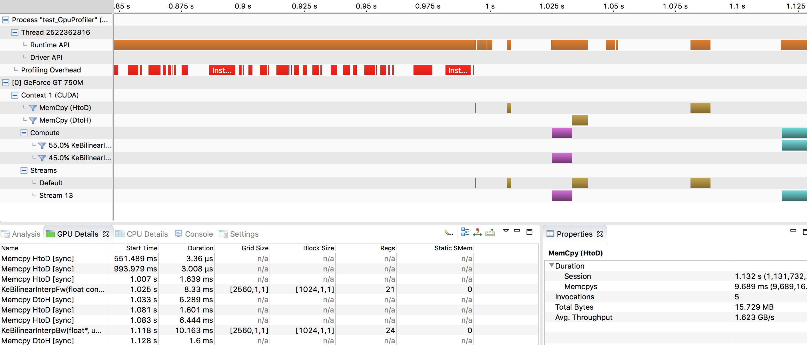
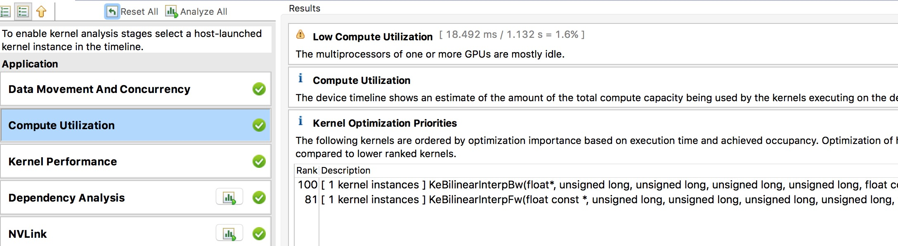

============
optimize GPU performance
============

.. contents::

This tutorial will take step-by-step introduction on how to use the built-in timer wrapper, **nvprof** or **nvvp** to run performance analysis and tuning.

- What is performance profiling?
- Why do you need performance profiling?
- How to perform performance profiling?
- Introduction to performance profiling tools
- Detailed tutorial
- Performance profiling tips

What is performance analysis?
================
In the context of software engineering, performance profiling is a term for dynamic program analysis that can measure the spatial (memory) complexity or time complexity of a program.It can also be said that the use of certain specific instructions, or the frequency and time consumption of calling  function. Normally, the information obtained from the profiling is used to assist in the optimization of the program.

In simple terms, performance profiling tools are used to quantify the performance of an application. If you want to understand the behavior of the program well, the program analysis tool is an essential tool. A simple performance profiling can tell you how long an operation took? And a deeper analysis can even explain why an operation took a long time?

Why do you need performance analysis?
==============================
Training a deep neural network usually takes a very long time, so performance has gradually become the most important metric in the field of deep learning. The first task of optimizing performance is to understand which steps are slowing down the overall. If some block of code doesn't take much time at all, then you don't need to rush to optimize performance!

How to perform performance analysis?
==========================
To achieve optimal performance, you can take the following five steps:

- Performance analysis of the code
- Find the part that runs slowly
- Find the reason for slow operation
- Change to a faster version
- Perform performance analysis on the code again

Usually, processor has two key performance limits include float point
Memory throughput. For GPU, it also need more parallelism to fulfill its potential.This is why they can be so fast.

Introduction to performance profiling tools
=======================
For the usual GPU performance profiling, there are many tools available from NVIDIA or third parties.

**nvprof** is the Nvidia performance analysis tool, and **nvvp** is the Nvidia visual performance analysis tool with GUI.
In this tutorial, we will mainly introduce nvprof and nvvp.

:code:`test_GpuProfiler` from :code:`paddle/legacy/math/tests` directory will be used to evaluate
the above profilers.

The :code:`test_GpuProfiler` in the :code:`paddle/legacy/math/test` directory is used to demonstrate the usage of the above profiling tools.

.. literalinclude:: ../../../../paddle/legacy/math/tests/test_GpuProfiler.cpp
   :language: c++
   :lines: 137-151
   :linenos:

The above code snippet contains two methods, you can use one or two to perform performance profiling on the code segment of interest.

1. :code:`REGISTER_TIMER_INFO` is a built-in timer wrapper that can be used to calculate the time consumption of CPU functions or cuda kernels.
2. :code:`REGISTER_GPU_PROFILER` is a generic wrapper object for :code:`cudaProfilerStart` and :code:`cudaProfilerStop` to avoid program crashes when the CPU version of PaddlePaddle calls them.
3. :code:`REGISTER_GPU_PROFILER` is a wrapper object that wraps two  operations :code:`cudaProfilerStart` and :code:`cudaProfileStop`; its internal implementation prevents the pure CPU version of PaddlePaddle from crashing when executing this statement.

You will find more details in the next section.

Detailed tutorial
============

Built-in timer
------------

If you want to use PaddlePaddle's built-in timer, you first need to include :code:`REGISTER_TIMER_INFO` in the relevant code snippet. Then you can use the :code:`printStatus` or :code:`printAllStatus` function to output the information to interface.
Here's a simple example:

1. Add the :code:`REGISTER_TIMER_INFO` and :code:`printAllStatus` functions (such as highlight parts).

	.. literalinclude:: ../../../../paddle/legacy/math/tests/test_GpuProfiler.cpp
		:language: c++
		:lines: 137-151
		:emphasize-lines: 8-12,14
		:linenos:

2. Open **WITH_TIMER** in the cmake configuration and recompile PaddlePaddle.

	.. code-block:: bash

		cmake .. -DWITH_TIMER=ON
		make

3. Execute your code and observe the results (such as highlight parts).

	.. code-block:: bash
		:emphasize-lines: 1,12-15

		> ./paddle/legacy/math/tests/test_GpuProfiler
		I1117 11:13:42.313065 2522362816 Util.cpp:155] commandline: ./paddle/legacy/math/tests/test_GpuProfiler
		I1117 11:13:42.845065 2522362816 Util.cpp:130] Calling runInitFunctions
		I1117 11:13:42.845208 2522362816 Util.cpp:143] Call runInitFunctions done.
		[==========] Running 1 test from 1 test case.
		[----------] Global test environment set-up.
		[----------] 1 test from Profiler
		[ RUN ] Profiler.BilinearFwdBwd
		I1117 11:13:42.845310 2522362816 test_GpuProfiler.cpp:114] Enable GPU Profiler Stat: [testBilinearFwdBwd] "numSamples = 10, channels = 16, im
		gSizeX = 64, imgSizeY = 64"
		I1117 11:13:42.850154 2522362816 ThreadLocal.cpp:37] thread use undeterministic rand seed:20659751
		I1117 11:13:42.981501 2522362816 Stat.cpp:130] ======= StatSet: [GlobalStatInfo] status ======
		I1117 11:13:42.981539 2522362816 Stat.cpp:133] Stat=testBilinearFwdBwd total=136.141 avg=136.141 max=136.141 min=136.141 count=1
		I1117 11:13:42.981572 2522362816 Stat.cpp:141] ======= BarrierStatSet status ======
		I1117 11:13:42.981575 2522362816 Stat.cpp:154] ------------------------------------- -------------
		[ OK ] Profiler.BilinearFwdBwd (136 ms)
		[----------] 1 test from Profiler (136 ms total)

		[----------] Global test environment tear-down
		[==========] 1 test from 1 test case ran. (136 ms total)
		[ PASSED ] 1 test.

Nvprof tool
----------------

To use the command line analysis tool **nvprof**, you can do the following:

1. Add the :code:`REGISTER_GPU_PROFILER` function to the code (see the emphasized section).

	.. literalinclude:: ../../../../paddle/legacy/math/tests/test_GpuProfiler.cpp
		:language: c++
		:lines: 137-151
		:emphasize-lines: 6-7
		:linenos:

2. Open the **WITH_PROFILER** configuration in cmake and recompile PaddlePaddle.

	.. code-block:: bash

		cmake .. -DWITH_PROFILER=ON
		make

3. Use **nvprof** to analyze the executable file.

	.. code-block:: bash
		
		nvprof ./paddle/legacy/math/tests/test_GpuProfiler

Then you can get the following analysis results:

.. code-block:: bash

	==78544== Profiling application: ./paddle/legacy/math/tests/test_GpuProfiler
	==78544== Profiling result:
	Time(%) Time Calls Avg Min Max Name
	27.60% 9.6305ms 5 1.9261ms 3.4560us 6.4035ms [CUDA memcpy HtoD]
	26.07% 9.0957ms 1 9.0957ms 9.0957ms 9.0957ms KeBilinearInterpBw
	23.78% 8.2977ms 1 8.2977ms 8.2977ms 8.2977ms KeBilinearInterpFw
	22.55% 7.8661ms 2 3.9330ms 1.5798ms 6.2863ms [CUDA memcpy DtoH]

	==78544== API calls:
	Time(%) Time Calls Avg Min Max Name
	46.85% 682.28ms 8 85.285ms 12.639us 682.03ms cudaStreamCreateWithFlags
	39.83% 580.00ms 4 145.00ms 302ns 550.27ms cudaFree
	9.82% 143.03ms 9 15.892ms 8.7090us 142.78ms cudaStreamCreate
	1.23% 17.983ms 7 2.5690ms 23.210us 6.4563ms cudaMemcpy
	1.23% 17.849ms 2 8.9247ms 8.4726ms 9.3768ms cudaStreamSynchronize
	0.66% 9.5969ms 7 1.3710ms 288.43us 2.4279ms cudaHostAlloc
	0.13% 1.9530ms 11 177.54us 7.6810us 591.06us cudaMalloc
	0.07% 1.0424ms 8 130.30us 1.6970us 453.72us cudaGetDevice
	0.04% 527.90us 40 13.197us 525ns 253.99us cudaEventCreateWithFlags
	0.03% 435.73us 348 1.2520us 124ns 42.704us cuDeviceGetAttribute
	0.03% 419.36us 1 419.36us 419.36us 419.36us cudaGetDeviceCount
	0.02% 260.75us 2 130.38us 129.32us 131.43us cudaGetDeviceProperties
	0.02% 222.32us 2 111.16us 106.94us 115.39us cudaLaunch
	0.01% 214.06us 4 53.514us 28.586us 77.655us cuDeviceGetName
	0.01% 115.45us 4 28.861us 9.8250us 44.526us cuDeviceTotalMem
	0.01% 83.988us 4 20.997us 578ns 77.760us cudaSetDevice
	0.00% 38.918us 1 38.918us 38.918us 38.918us cudaEventCreate
	0.00% 34.573us 31 1.1150us 279ns 12.784us cudaDeviceGetAttribute
	0.00% 17.767us 1 17.767us 17.767us 17.767us cudaProfilerStart
	0.00% 15.228us 2 7.6140us 3.5460us 11.682us cudaConfigureCall
	0.00% 14.536us 2 7.2680us 1.1490us 13.387us cudaGetLastError
	0.00% 8.6080us 26 331ns 173ns 783ns cudaSetupArgument
	0.00% 5.5470us 6 924ns 215ns 2.6780us cuDeviceGet
	0.00% 5.4090us 6 901ns 328ns 3.3320us cuDeviceGetCount
	0.00% 4.1770us 3 1.3920us 1.0630us 1.8300us cuDriverGetVersion
	0.00% 3.4650us 3 1.1550us 1.0810us 1.2680us cuInit
	0.00% 830ns 1 830ns 830ns 830ns cudaRuntimeGetVersion

nvvp tool
--------------

If you want to use the visual parser **nvvp**, you can import the output of :code:`nvprof -o ...` or run your app from the tool's interface.

**Remarks: nvvp also supports CPU performance profiling** (need to be selected in the nvvp interface to open)

From the perspective of kernel functions, **nvvp** can precisely explain the specific cause of a long time-consuming operation.
At the same time, as shown in the following figure, **nvvp**'s kernel block usage, register usage and shared memory usage give us a better understanding of the overall use of the GPU.

.. image:: nvvp2.png
	:align: center
	:scale: 33%

From an application perspective, **nvvp** can help you with some suggestions for locating performance bottlenecks.
For example, the following figure shows some suggestions for memory data migration and computing resource utilization, which provides direction for performance tuning.

.. image:: nvvp3.png
	:align: center
	:scale: 33%

Performance profiling tips
==================

- At the beginning, it is a good choice to start with the output of **nvprof** and **nvvp**.
- Next, you can consider the analysis of the timeline.
- If you really want to dig into a secret in the depths of the kernel, you should first confirm that the time-consuming ratio of this block of the code is really too high and worthy of in-depth analysis.
- If possible, try to make the analytical data of the output correspond to the theoretical value.

	1) For example, if I know that the kernel took 10ms to move 1GB of data, then I would expect the analysis tool to count the speed to 100GB/s.
	2) If there are inconsistencies, it is very likely that the actual application is not operating as you expected.
- Know about your hardware: If your GPU theory can reach 6 TFLOPs (6 trillion floating-point operations per second), and there are currently 5.5 TFLOPs, it is estimated that the potential here is not digging...

Performance profiling is a critical step in performance optimization. Sometimes simple changes can produce significant optimizations in performance!
Of course, the specific situation varies from person to person.

Reference material
===========
Jeremy Appleyard, [GPU Profiling for Deep Learning](http://www.robots.ox.ac.uk/~seminars/seminars/Extra/2015_10_08_JeremyAppleyard.pdf), 2015

	
