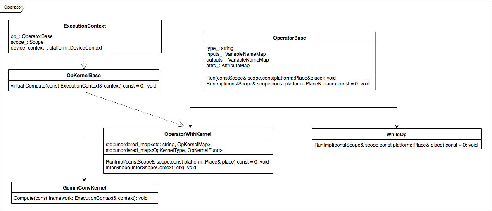

# Op相关的一些注意事项

## Fluid中Op的构建逻辑
### 1.Fluid中Op的构建逻辑
Fluid中所有的Op都继承自`OperatorBase`，且所有的Op都是无状态的，每个Op包含的成员变量只有四个：type、inputs、outputs、attribute。

Op的核心方法是Run，Run方法需要两方面的资源：数据资源和计算资源，这两个资源分别通过`Scope`和`Place`获取。框架内部有一个全局的`DeviceContextPool`，用来记录`Place`和`DeviceContext`之间的对应的关系，即每个`Place`有且仅有一个`DeviceContext`与之对应，`DeviceContext`中存放了当前设备的计算资源。比如对于GPU，这些资源包括`cudnn_handle`、`cublas_handle`、`stream`等，Op内部所有的计算（数据拷贝和CUDA Kernel等）都必须在`DeviceContext`中进行。

Fluid框架的设计理念是可以在多种设备及第三方库上运行，有些Op的实现可能会因为设备或者第三方库的不同而不同。为此，Fluid引入了OpKernel的方式，即一个Op可以有多个OpKernel，这类Op继承自`OperatorWithKernel`，这类Op的代表是conv，conv_op的OpKerne有：`GemmConvKernel`、`CUDNNConvOpKernel`、`ConvMKLDNNOpKernel`，且每个OpKernel都有double和float两种数据类型。不需要OpKernel的代表有`WhileOp`等。

Operator继承关系图： 


进一步了解可参考：[multi_devices](https://github.com/PaddlePaddle/FluidDoc/tree/develop/doc/fluid/design/multi_devices)，[scope](https://github.com/PaddlePaddle/FluidDoc/blob/develop/doc/fluid/design/concepts/scope.md)，[Developer's_Guide_to_Paddle_Fluid](https://github.com/PaddlePaddle/FluidDoc/blob/develop/doc/fluid/getstarted/Developer's_Guide_to_Paddle_Fluid.md)    

### 2.Op的注册逻辑
每个Operator的注册项包括：
    ```C++
    OpCreator creator_;
    GradOpMakerFN grad_op_maker_;
    proto::OpProto* proto_{nullptr};
    OpAttrChecker* checker_{nullptr};
    InferVarTypeFN infer_var_type_;
    InferShapeFN infer_shape_;
    ```

<table>
<thead>
<tr>
<th>注册项</th>
<th>类型</th>
<th>说明</th>
<th>调用</th>
</tr>
</thead>
<tbody>
<tr>
<td>proto::OpProto </td>
<td>Class </td>
<td>存放Op的输入/输出/属性/Op类型 </td>
<td>编译时调用 </td>
</tr>
<tr>
<td>GradOpMakerFN </td>
<td>Functor </td>
<td>返回当前Op对应的反向Op的一组OpDesc，因为正向Op的反向可能有多个Op构成 </td>
<td>编译时调用 </td>
</tr>
<tr>
<td>OpAttrChecker </td>
<td>Class </td>
<td>对Op的attr进行check </td>
<td>编译时调用</td>
</tr>
<tr>
<td>InferVarTypeFN </td>
<td>Functor </td>
<td>用于推断输出Var的Type，比如是LoDTensor还是SelectedRows，或者其他 </td>
<td>编译时调用 </td>
</tr>
<tr>
<td>InferShapeFN </td>
<td>Functor </td>
<td>用于推断Output的Shape </td>
<td>分为编译时和运行时，编译时是在Python端调用；如果Op继承自OperatorWithKernel，运行时是在op.run时调用 </td>
</tr>
<tr>
<td>OpCreator </td>
<td>Functor </td>
<td>每次调用都会创建一个新的OperatorBase </td>
<td>运行时调用 </td>
</tr>
</tbody>
</table>

通常Op注释时需要调用REGISTER_OPERATOR，即：
    ```
    REGISTER_OPERATOR(op_type, 
                      OperatorBase
                      op_maker_and_checker_maker,
                      op_grad_opmaker,
                      op_infer_var_shape,
                      op_infer_var_type)
    ```

**注意：**   

1. 对于所有Op，前三个参数是必须的，op_type指明op的名字，OperatorBase是该Op的对象，op_maker_and_checker_maker是op的maker和op中attr的checker。
2. 如果该Op有反向，则必须要有op_grad_opmaker，因为在backward会根据正向的Op中获取反向Op的Maker。
3. 框架提供了一个默认的op_grad_opmaker：`DefaultGradOpDescMaker`，这个Maker会将前向Op的输入和输出都作为反向Op的输入，将前向Op的输入的梯度作为反向Op的输出，并将前向Op的属性拷贝过来。**注意：**DefaultGradOpDescMaker会将前向Op的所有输入输出都做反向Op的输入，即使这个输入是没有必要的，这将会导致无法对没有用到的变量做内存优化。
4. 框架没有提供默认的op_infer_var_shape方法。如果该Op是无OpKernel的，通常需要用户添加对应的op_infer_var_shape方法；如果该Op是有OpKernel的，需要实现`OperatorWithKernel`中的`InferShape`方法，此时不需要提供op_infer_var_shape方法。具体实现可参考[while_op.cc](https://github.com/PaddlePaddle/Paddle/blob/develop/paddle/fluid/operators/controlflow/while_op.cc)，[conv_op.cc](https://github.com/PaddlePaddle/Paddle/blob/develop/paddle/fluid/operators/conv_op.cc)。
5. 框架没有提供默认的op_infer_var_type方法，用户需要根据实际情况添加op_infer_var_shape。严格来说每个Op都应该注册一个InferVarType，op_infer_var_type根据输入的Var的type和dtype推断输出Var的type和dtype。**注意：**在Python端的LayerHelper中create_variable_for_type_inference操作返回的Variable里面是LoDTensor，C++端的InferVarType可以修改`Variable`的type和dtype。


更多内容请参考: [如何写新的Op](./new_op.html)

## 写Op注意事项
### 1.Op可以支持输入输出类型
Fluid的Op的输入输出都是`Variable`，从设计上讲，`Variable`中可以存放任意类型，Op的输入输出`Variable`可能是是任意类型，通常情况下`Variable`中存放的是`LoDTensor`、`SlelecteRows`。

**注意：**

- 代码中经常出现`context.Input<Tensor>("Input")`，并不表示"Input"的`Variable`是`Tensor`，而是从"Input"的`Variable`的`LoDTensor`中获取`Tensor`。如果"Input"的`Variable`是`SelecetedRows`，则会报错。
- 如果”Input”是`SelectedRows`，`context->GetInputDim("Input")`返回的是`var->Get<SelectedRows>().GetCompleteDims()`，而不是`SelectedRows`中`Tensor`的Dim。

### 2.在Op内部不能对输入的数据做任何的改写
在Op内部绝不允许对输入数据做任何改写，因为可能存在其他Op需要读这个数据。

### 3.OpKernel需要注册的数据类型
目前要求所有OpKernel都要注册double和float数据类型。

### 4.Op兼容性问题
对Op的修改需要考虑兼容性问题，要保证Op修改之后，之前的模型都能够正常加载及运行。<font color="#FF0000">**所以现在不允许对已有的Op新增输入或者输出，不允许减去Op的已有属性及修改默认值**</font> 。

### 5.ShareDataWith的调用
ShareDataWith的功能是使两个Tensor共享底层buffer，在调用这个操作的时候需要特别注意，在Op内部不能将ShareDataWith作用在Op的输出上，即Op输出的Tensor必须是Malloc出来的。

### 6.稀疏梯度参数更新方法
目前稀疏梯度在做更新更新的时候会先对梯度做merge，即对相同参数的梯度做累加，然后做参数以及附加参数（如velocity）的更新。

### 7.显存优化
如果Op的反向不需要将前向op的所有输入输出作为其输入，则不要用`DefaultGradOpDescMaker`，这将会导致无法对没有用到的变量做内存/显存优化。

### 8.混合设备调用
由于GPU是异步执行的，当CPU调用返回之后，GPU端可能还没有真正的执行，所以如果在Op中创建了GPU运行时需要用到的临时变量，当GPU开始运行的时候，该临时变量可能在CPU端已经被释放，这样可能会导致GPU计算出错。

关于GPU中的一些同步和异步操作：
```
The following device operations are asynchronous with respect to the host:
    Kernel launches;
    Memory copies within a single device's memory;
    Memory copies from host to device of a memory block of 64 KB or less;
    Memory copies performed by functions that are suffixed with Async;
    Memory set function calls.
```

关于cudaMemCpy和cudaMemCpyAsync注意事项：

- 如果数据传输是从GPU端到非页锁定的CPU端，数据传输将是同步，即使调用的是异步拷贝操作。
- 如果数据传输时从CPU端到CPU端，数据传输将是同步的，即使调用的是异步拷贝操作。

更多内容可参考：[Asynchronous Concurrent Execution](https://docs.nvidia.com/cuda/cuda-c-programming-guide/#asynchronous-concurrent-execution)，[API synchronization behavior](https://docs.nvidia.com/cuda/cuda-runtime-api/api-sync-behavior.html#api-sync-behavior)  

## Op性能优化
### 1.第三方库的选择
在写Op过程中优先使用高性能（如cudnn、mkldnn、mklml、eigen等）中提供的操作，但是一定要做benchmark，有些库中的操作在深度学习任务中可能会比较慢。因为高性能库（如eigen等）中提供的操作为了更为通用，在性能方面可能并不是很好，通常深度学习模型中数据量较小，所以有些情况下可能高性能库中提供的某些操作速度较慢。比如Elementwise系列的所有Op（前向和反向），Elementwise操作在模型中调用的次数比较多，尤其是Elementwise_add，在很多操作之后都需要添加偏置项。在之前的实现中Elementwise_op直接调用Eigen库，由于Elementwise操作在很多情况下需要对数据做Broadcast，而实验发现Eigen库做Broadcast的速度比较慢，慢的原因在这个PR[#6229](https://github.com/PaddlePaddle/Paddle/pull/6229)中有描述。

### 2.Op性能优化
Op的计算速度与输入的数据量有关，对于某些Op可以根据输入数据的Shape和Op的属性参数来选择不同的计算方式。比如concat_op，当axis>=1时，在对多个tensor做拼接过程中需要对每个tensor做很多次拷贝，如果是在GPU上，需要调用cudaMemCopy。相对CPU而言，GPU属于外部设备，所以每次调用GPU的操作都会有一定的额外开销，并且当需要拷贝的次数较多时，这种开销就更为凸现。目前concat_op的实现会根据输入数据的Shape以及axis值来选择不同的调用方式，如果输入的tensor较多，且axis不等于0，则将多次拷贝操作转换成一个CUDA Kernel来完成；如果输入tensor较少，且axis等于0，使用直接进行拷贝。相关实验过程在该PR（[#8669](https://github.com/PaddlePaddle/Paddle/pull/8669)）中有介绍。

由于CUDA Kernel的调用有一定的额外开销，所以如果Op中出现多次调用CUDA Kernel，可能会影响Op的执行速度。比如之前的sequence_expand_op中包含很多CUDA Kernel，通常这些CUDA Kernel处理的数据量较小，所以频繁调用这样的Kernel会影响Op的计算速度，这种情况下最好将这些小的CUDA Kernel合并成一个。在优化sequence_expand_op过程（相关PR[#9289](https://github.com/PaddlePaddle/Paddle/pull/9289)）中就是采用这种思路，优化后的sequence_expand_op比之前的实现平均快出约1倍左右，相关实验细节在该PR（[#9289](https://github.com/PaddlePaddle/Paddle/pull/9289)）中有介绍。

减少CPU与GPU之间的拷贝和同步操作的次数。比如fetch操作，在每个迭代之后都会对模型参数进行更新并得到一个loss，并且数据从GPU端到没有页锁定的CPU端的拷贝是同步的，所以频繁的fetch多个参数会导致模型训练速度变慢。

## Op数值稳定性问题
### 1.有些Op存在数值稳定性问题
出现数值稳定性的主要原因程序在多次运行时，对浮点型数据施加操作的顺序可能不同，进而导致最终计算结果不同。而GPU是通过多线程并行计算的方式来加速计算的，所以很容易出现对浮点数施加操作的顺序不固定现象。

目前发现cudnn中的卷积操作、cudnn中的MaxPooling、CUDA中CudaAtomicXX、ParallelExecutor的Reduce模式下参数梯度的聚合等操作运行结果是非确定的。

为此Fluid中添加了一些FLAGS，比如使用FLAGS_cudnn_deterministic来强制cudnn使用确定性算法、FLAGS_cpu_deterministic强制CPU端的计算使用确定性方法。

### 2.WITH_FAST_MATH的开与关
如果WITH_FAST_MATH是ON，NVCC在编译Paddle和Egien的时候会使用--use_fast_math，这样可能会使CUDA中的一些操作在损失一定精度的情况下变快，比如log、exp、tanh等，但也会使一些操作的计算结果是错的，比如pow操作，具体原因请查看[torch/DEPRECEATED-torch7-distro#132](https://github.com/torch/DEPRECEATED-torch7-distro/issues/132)。

## 其他
### 1.报错信息
Enforce提示信息不能为空，并且需要写明，因为报错信息可以更快更方便地分析出错误的原因。

### 2.Op的数学公式
如果Op有数学公式，一定要在代码中将数学公式写明，并在Python API的Doc中显示，因为用户在对比不同框架的计算结果时可能需要了解Paddle对Op是怎么实现的。

**注意：**在merge到develop分支之前一定进行公式预览。可参考[dynamic_lstmp](http://paddlepaddle.org/documentation/docs/zh/1.1/api/layers.html#dynamic-lstmp)。

### 3.Python端Op接口中参数的顺序
Python API中参数的顺序一般按照重要性来排，以fc为例：
```
def fc(input,
       size,
       num_flatten_dims=1,
       param_attr=None,
       bias_attr=None,
       act=None,
       is_test=False,
       name=None)
```