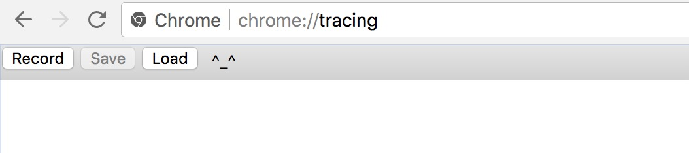

# timeline工具简介

## <span id="local">本地使用</span>

1. 在训练的主循环外加上`profiler.start_profiler(...)`和`profiler.stop_profiler(...)`。运行之后，代码会在`/tmp/profile`目录下生成一个profile的记录文件。

	**提示：**
	请不要在timeline记录信息时运行太多次迭代，因为timeline中的记录数量和迭代次数是成正比的。

	```python
    import numpy as np
    import paddle
    import paddle.fluid as fluid
    from paddle.fluid import profiler

    place = fluid.CPUPlace()

    def reader():
        for i in range(100):
            yield [np.random.random([4]).astype('float32'), np.random.random([3]).astype('float32')],

    main_program = fluid.Program()
    startup_program = fluid.Program()

    with fluid.program_guard(main_program, startup_program):
        data_1 = fluid.layers.data(name='data_1', shape=[1, 2, 2])
        data_2 = fluid.layers.data(name='data_2', shape=[1, 1, 3])
        out = fluid.layers.fc(input=[data_1, data_2], size=2)
        # ...

        feeder = fluid.DataFeeder([data_1, data_2], place)
        exe = fluid.Executor(place)
        exe.run(startup_program)
        pass_num = 10

        for pass_id in range(pass_num):
            for batch_id, data in enumerate(reader()):
                if pass_id == 0 and batch_id == 5:
                    profiler.start_profiler("All")
                elif pass_id == 0 and batch_id == 10:
                    profiler.stop_profiler("total", "/tmp/profile")
                outs = exe.run(program=main_program,
                               feed=feeder.feed(data),
                               fetch_list=[out])

	```

1. 运行`python paddle/tools/timeline.py`来处理`/tmp/profile`，这个程序默认会生成一个`/tmp/timeline`文件，你也可以用命令行参数来修改这个路径，请参考[timeline.py](https://github.com/PaddlePaddle/Paddle/blob/develop/tools/timeline.py)。
```python
python Paddle/tools/timeline.py --profile_path=/tmp/profile --timeline_path=timeline
```

1. 打开chrome浏览器，访问<chrome://tracing/>，用`load`按钮来加载生成的`timeline`文件。

	

1. 结果如下图所示，可以放到来查看timetime的细节信息。

	

## 分布式使用
一般来说，分布式的训练程序都会有两种程序：pserver和trainer。我们提供了把pserver和trainer的profile日志用timeline来显示的方式。

1. trainer打开方式与[本地使用](#local)部分的第1步相同

1. pserver可以通过加两个环境变量打开profile，例如：
```
FLAGS_rpc_server_profile_period=10 FLAGS_rpc_server_profile_path=./tmp/pserver python train.py
```

3. 把pserver和trainer的profile文件生成一个timeline文件，例如：
```
python /paddle/tools/timeline.py
    --profile_path trainer0=local_profile_10_pass0_0,trainer1=local_profile_10_pass0_1,pserver0=./pserver_0,pserver1=./pserver_1
    --timeline_path ./dist.timeline
```

4. 在chrome中加载dist.timeline文件，方法和[本地使用](#local)第4步相同。
