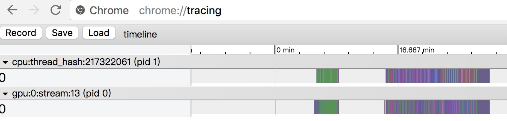

# How to use timeline tool to do profile

## <span id="local">Local</span>

1. Add `profiler.start_profiler(...)` and `profiler.stop_profiler(...)` to the main training loop. After run, the code will generate a profile record file `/tmp/profile`. **Warning**: Please do not run too many batches when use profiler to record timeline information, for the profile record will grow with the batch number.

	```python

    import numpy as np
    import paddle
    import paddle.fluid as fluid
    from paddle.fluid import profiler

    place = fluid.CPUPlace()

    def reader():
        for i in range(100):
            yield [np.random.random([4]).astype('float32'), np.random.random([3]).astype('float32')],

    main_program = fluid.Program()
    startup_program = fluid.Program()

    with fluid.program_guard(main_program, startup_program):
    	 data_1 = fluid.layers.data(name='data_1', shape=[1, 2, 2])
         data_2 = fluid.layers.data(name='data_2', shape=[1, 1, 3])
	 out = fluid.layers.fc(input=[data_1, data_2], size=2)
	 # ...

	 feeder = fluid.DataFeeder([data_1, data_2], place)
         exe = fluid.Executor(place)
	 exe.run(startup_program)
	 pass_num = 10

	 for pass_id in range(pass_num):
            for batch_id, data in enumerate(reader()):
	        if pass_id == 0 and batch_id == 5:
		     profiler.start_profiler("All")
		elif pass_id == 0 and batch_id == 10:
		     profiler.stop_profiler("total", "/tmp/profile")
		outs = exe.run(program=main_program,
		               feed=feeder.feed(data),
		               fetch_list=[out])

	```

2. Run `python paddle/tools/timeline.py` to process `/tmp/profile`, it will generate another
file `/tmp/timeline` by default. You can change the path by cmd parameter, please take a look at
[timeline.py](https://github.com/PaddlePaddle/Paddle/blob/develop/tools/timeline.py) for details.
```python
python Paddle/tools/timeline.py --profile_path=/tmp/profile --timeline_path=timeline
```

3. Open chrome and visit <chrome://tracing/>, use `load` button to load the generated `timeline` file.

	


4. The result timeline should be like:<a name="local_step_4"></a>

    
	
## Distributed
This tool can support distributed train programs(pserver and trainer) too.

1. Open traniner profiler just like how to use in [local](#local).

2. Open pserver profiler: add two environment variables, e.g.:
```
FLAGS_rpc_server_profile_period=10 FLAGS_rpc_server_profile_path=./tmp/pserver python train.py
```

3. Merge pservers' and trainers' profiler file, e.g.:
```
python /paddle/tools/timeline.py
    --profile_path trainer0=local_profile_10_pass0_0,trainer1=local_profile_10_pass0_1,pserver0=./pserver_0,pserver1=./pserver_1
    --timeline_path ./dist.timeline
```
 
4. Load `dist.timeline` in chrome just like the [fourth step in Local](#local_step_4)
