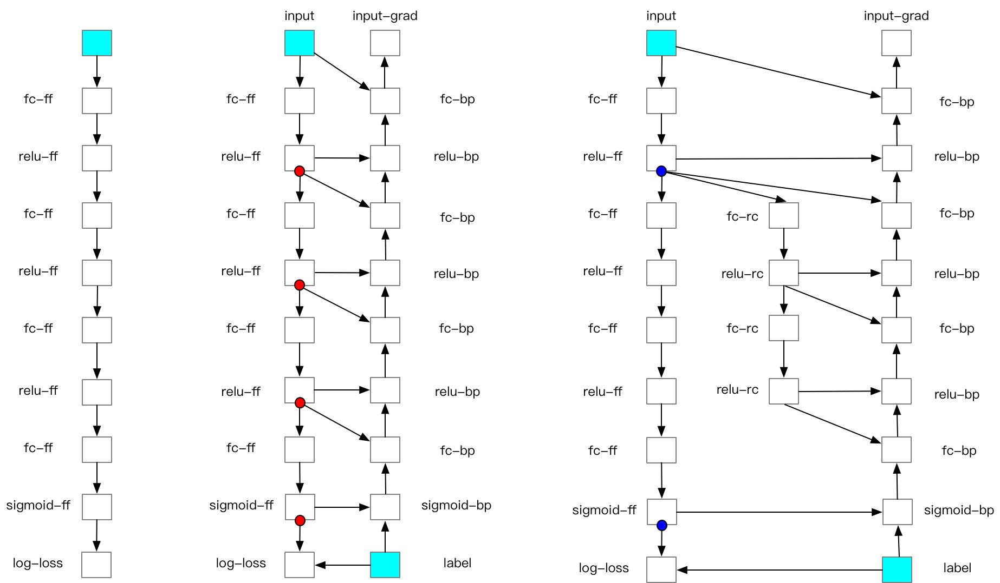

Forward Recomputation Backpropagation
=============

背景
---------
 
随着训练数据规模的逐渐增加，训练更大、更深的深度学习模型成为一个主流趋势。目前的深度学习模型训练，通常要求保留前向计算的隐层结果，并且需要保存结果的数量会随着模型层数的增加线性增加，这对于目前能够使用的AI芯片的内存大小是个挑战。Forward Recomputation Backpropagation（FRB）可以在额外增加少量计算的情况下，显著增加模型的层数和宽度，同时也可以显著提升模型训练的batch大小。

原理
---------

我们知道，深度学习网络的一次训练迭代包含三个步骤：

- **前向计算**：运行前向算子(Operator) 来计算前向Variable的值
- **反向计算**：运行反向算子来计算参数(Parameter)的梯度
- **优化**：应用优化算法以更新参数值

在前向计算过程中，前向算子会输出大量的中间计算结果(Variables)，当模型层数加深时，其数量可达成千上万个，占据大量的内存。Fluid的Garbage Collection机制[链接]会及时清除无用的中间结果，以节省内存。然而，有些中间结果是反向算子的输入，这些Variable必须存储在内存中，直到相应的反向算子计算完毕。

举个简单的例子, 我们定义一个由mul算子构成的网络，其前向计算为：

.. math::

    y = W_1 * x

    z = W_2 * y

其中 :math:`x, y, z` 为向量， :math:`W_1, W_2` 为矩阵。容易知道，求 :math:`W_2` 梯度的反向计算为：

.. math::
    W_{2}^{'} = z^{'} / y 

可以看到反向计算中用到了前向计算生成的变量 :math:`y` ，因此变量 :math:`y` 必须存储在内存中，直到这个反向算子计算完毕。当模型加深时，我们会有大量的“ :math:`y` ”，占据了大量的内存。

Forward Recomputation Backpropagation（FRB）的思想是将深度学习网络切分为k个部分（segments）。对每个segment而言：前向计算时，除了小部分必须存储在内存中的Variable外(我们后续会讨论这些特殊Variable)，其他中间结果都将被删除；在反向计算中，首先重新计算一遍前向算子，以获得中间结果，再运行反向算子。简而言之，FRB和普通的网络迭代相比，多计算了一遍前向算子。

那么问题来了，如何切分网络呢？我们知道深度学习网络通常是由一个个模块串联得到的，比如ResNet-50由16个block串联而成，Bert-Large由24个transformer串联而成，那么以两个子模块中间的变量作为切分点就是一个很好的选择。我们把切分segments的变量叫做checkpoints。

下图是由4个fc Layer、3个relu Layer、1个sigmoid Layer和1个log-loss Layer串联而成的一个网络：最左侧为其前向计算流程、中间是普通的前向计算和反向计算流程、最右侧为添加FRB后的前向计算和反向计算流程。其中方框代表算子(Operator)，红点代表前向计算的中间结果、蓝点代表checkpoints。

注：该例子完整代码位于 `source <https://github.com/PaddlePaddle/examples/blob/master/community_examples/recompute/demo.py>`_

添加FRB后，前向计算中需要存储的中间Variable从4个(红点)变为2个(蓝点)，
从而节省了这部分内存。当然了，重计算的部分也产生了新的中间变量，
这就需要根据实际情况来做权衡了。这个例子里的网络比较浅，通常来讲，
对层数较深的网络，FRB节省的内存要远多于新增加的内存。

使用方法
---------

我们实现了基于Fluid的FRB算法，叫做RecomputeOptimizer，
您可以根据其 `源码 <https://github.com/PaddlePaddle/Paddle/blob/develop/python/paddle/fluid/optimizer.py>`_
与
`文档 <https://www.paddlepaddle.org.cn/documentation/docs/zh/api_cn/optimizer_cn/RecomputeOptimizer_cn.html>`_
更深入地了解这一算法。我们为用户提供了两个使用RecomputeOptimizer的方法:
直接调用与Fleet API中使用。在单机单卡或者CPU训练中建议您直接调用RecomputeOptimizer，
在多卡训练或者多机训练任务上建议您在Fleet API中使用Recompute。

**1. 直接调用**
 
直接调用RecomputeOptimizer非常简单，首先要定义一个经典的Optimizer，比如Adam；
然后在外面包一层RecomputeOptimizer；最后设置checkpoints即可。
 
.. code-block:: python

            import paddle.fluid as fluid
            # 定义网络
            def mlp(input_x, input_y, hid_dim=128, label_dim=2):
                print(input_x)
                fc_1 = fluid.layers.fc(input=input_x, size=hid_dim)
                prediction = fluid.layers.fc(input=[fc_1], size=label_dim, act='softmax')
                cost = fluid.layers.cross_entropy(input=prediction, label=input_y)
                sum_cost = fluid.layers.reduce_mean(cost)
                return sum_cost, fc_1, prediction
            input_x = fluid.layers.data(name="x", shape=[32], dtype='float32')
            input_y = fluid.layers.data(name="y", shape=[1], dtype='int64')
            cost, fc_1, pred = mlp(input_x, input_y)
            # 定义RecomputeOptimizer
            sgd = fluid.optimizer.Adam(learning_rate=0.01)
            sgd = fluid.optimizer.RecomputeOptimizer(sgd)
            # 设置checkpoints
            sgd._set_checkpoints([fc_1, pred])
            # 运行优化算法
            sgd.minimize(cost)

**2. 在Fleet API中使用Recompute**

`Fleet API <https://github.com/PaddlePaddle/Fleet>`_ 
是基于Fluid的分布式计算高层API。在Fleet API中添加RecomputeOptimizer
仅需要2步：
- 设置dist_strategy.forward_recompute为True；
- 设置recompute_checkpoints。

.. code-block:: python

    from paddle.fluid.incubate.fleet.collective import fleet, DistributedStrategy
    dist_strategy = DistributedStrategy()
    dist_strategy.forward_recompute = True
    dist_strategy.recompute_checkpoints=checkpoints
    optimizer = fleet.distributed_optimizer(optimizer, strategy=dist_strategy)
    optimizer.minimize(loss)

为了帮助您快速地用Fleet API使用Recompute任务，我们提供了一些例子：

- 用Recompute做Bert Fine-tuning:  `source? <???>`_

- 用Recompute做Bert Pre-training: `source? <???>`_

Q&A
-------

- **是否支持带有随机性的Op？**

  目前Fluid中带随机性的Op有：dropout，Recompute支持
  dropout Operator，可以保证重计算与初次计算结果保持一致。

- **有没有更多Recompute的官方例子？**

  更多Recompute的例子将更新在 `examples <https://github.com/PaddlePaddle/examples/tree/master/community_examples/recompute>`_ 
  和 `Fleet <https://github.com/PaddlePaddle/Fleet>`_ 库下，欢迎关注。
  
- **有没有添加checkpoints的建议？**

  我们建议将子网络连接部分的变量添加为checkpoints，即：
  如果一个变量能将网络完全分为前后两部分，那么建议将其
  加入checkpoints。checkpoints的数目对内存消耗影响也很
  大，如果checkpoints很少，那么Recompute起的作用有限；
  如果checkpoints数量过多，那么checkpoints本身占用的内
  存量就很大，内存消耗可能不降反升。

  我们后续会添加一个估算内存用量的工具，可以对每个Operator
  运算前后的显存用量做可视化，帮助用户定位问题。
