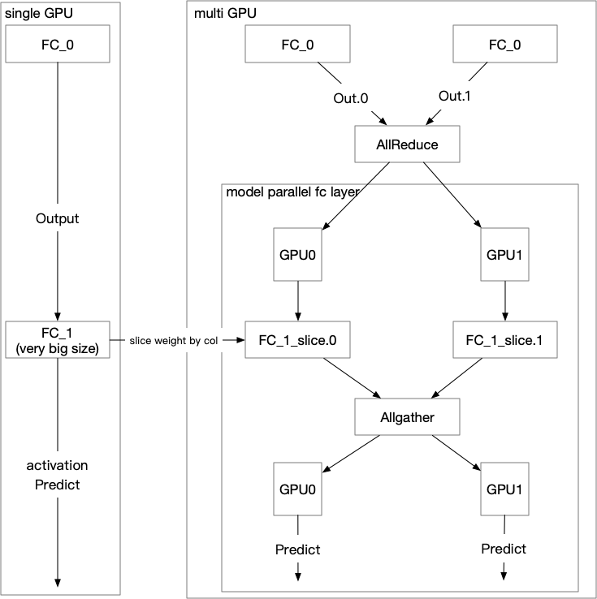

# Distributed Model-Parallel Pass (DMPP)

In this doc, we introduce a design to enable Large-Scale-Model-Parallel model training by
changing the IR graph using a pass. We slice weights to several shard and distribute them
on different devices (e.g. GPU) or nodes. When training the model, these layers can
communicate with each other to do the computation as if this layer is on a single device.

Note that this may not be the final design since we have to implement "AllReduce" and
"AllGather" operators using "OpHandle" but not the original "Operator", this design can be
further updated when we have a new framework skeleton.

## Background

For some classification models, we may have too many classes, like face recognization,
the pre-training model may have several millions of classes to distinguish, then the last
prediction fc layer's weight size may not be able to store on a single device, DMPP is intended
to solve this case.

## The Data Flow

The below diagram shows an example of how we can achieve this for the case when the last
predicating fc layer have very large size (a classification model have so many classes
causing the fc weight size too large).

We can see that when the original training program is running on multiple devices (2 GPUs,
and these 2 GPUs can locate on different nodes), we can first do "AllReduce" on previous
layer's output, this will actually sum the output tensors and put them on every GPU.

The original "FC_1" weight is sliced by column evenly to 2 parts, each GPU stores 1 part
of the weight slices. Then each GPU can do the forward computation using their own part
of the weight, then we use "AllGather" to concat all output from those 2 GPUs, then the following
computation should be the same as the original program.

## Implementaion

The implementation should contain below components.

1. Define an attribute for fc layer whether to enable model parallel (we can support only fc for now)
1. IR pass can update "startup program"
1. Implement "AllGather" OpHandle
1. Add an IR pass to update the graph, removing original fc layer ops and replace them with 
   distributed ops like we described in above section
1. Update "startup program" to initialize fc weights as column splited weights.

## Validation

We need a baseline classification model with many classes, we'll need to train this model
using the original method and model parallel method, the result accuracy should stay almost
the same.

We choose to use image [classification model](https://github.com/PaddlePaddle/models/tree/develop/fluid/PaddleCV/image_classification) as a our baseline. 
