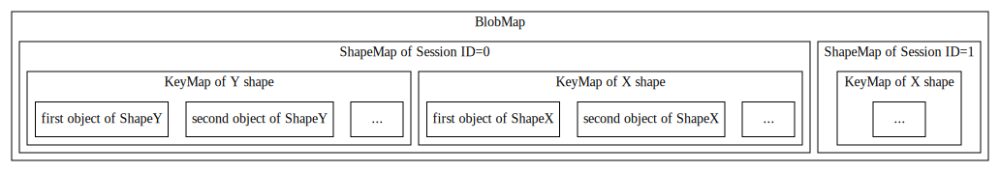
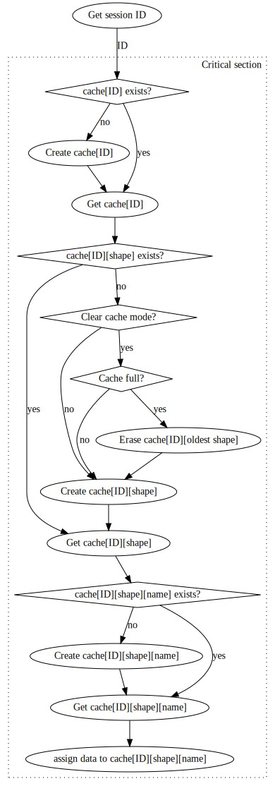
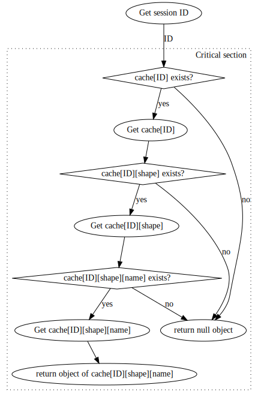

# Design Doc: MKL-DNN Data Caching

Fluid MKL-DNN integration is having caching mechanism to store MKL-DNN objects. Purpose of storing MKL-DNN objects is:
* Transfer of MKL-DNN objects from Forward ops to Grad ops.
* Store once created MKL-DNN objects in order To avoid MKL-DNN recreation

### 1. General architecture
Basic idea is that MKL-DNN cache is hash map where [key](./keys.md) name is pointing to MKL-DNN object stored in mentioned hash map.
In more detail MKL-DNN Cache is stored inside MKL-DNN Device Context and it consists of three level of unordered maps based structure. Picture below outlines mentioned architecture:

MKL-DNN cache is to work in both single-threaded and multi-threaded execution scenarios (both inference and training) as well as in a situation when memory constraints are applied. To address memory constraint problem, clear cache mode was introduced.

To make MKL-DNN cache working with multi-threading scenarios:
* Top level cache separates entries per session
* reading and modifying operations on MKL-DNN cache are ensured to be thread safe
* cache key contains Thread ID (when applicable)

The design of MKL-DNN cache is to support dynamic shapes scenario (BERT model for example). Since MKLDNN primitives are sensitive to src/dst shape, if new input shape comes, new primitive needs to be created. That means there will be many primitives cached and MKL-DNN cache would consume lots of memory. By introducing second level cache, we can consider these kind of primitive as a group, once reach memory limitation, we can clear a whole group instead of just one primitive, and release more memory.

Performance-wise it is better to clear group of primitives at once rather than to erase one primitive based on FIFO. More over when searching a cache it is also more efficient to have grouped primitives via input shape , so
we referring to specific primitive we consider only primitives in a group not all registered MKL-DNN cached objects.

Currently model's input shape that is a key for second level cache is not related to input shape which is part of key in first level cache.

##### a. Operational modes of MKL-DNN cache
Cache default mode is normal operating mode of MKL-DNN cache, suitable for single and multi-threaded execution e.g. Thread ID is part of cache key name that is used for referring cached objects.

Cache clearing mode is a special operation mode designed for single threaded usage e.g. (Thread ID is not part of cache key). In this mode when set capacity of cache is to be exceeded (by adding next entry) then the registered entries corresponding to oldest input shape used by PaddlePaddle in given session , are erased (Refer to  _section b._ for details on erasing cache entries based on input shape). Input shape is registered as a key for second level cache in _AnalysisPredictor::MkldnnPreSet()_.

##### b. Adding object to MKL-DNN cache

Picture |  Description
---------------|---------------------------------------------------
 | Updating an object to be stored by given key (name) is done via  _SetBlob_ method. As mentioned earlier MKL-DNN cache is a  three level based architecture(session, input shape and name),  hence we start by getting current session ID and right after that  critical section is set to make sure no two threads are updating  MKL-DNN cache at the same time. Having session ID we check if  there exists cache for given session ID (third level cache). If  answer is negative then new cache object is created. Inside cache  object corresponding to running session, a check if currently used  *input shape* is having its own cache object (second level cache). In a situation that no cache object for currently used object  exists, then corresponding cache object has to be created. If  MKL-DNN cache is operating in cache clear mode, then when number of cached objects (second level cache) within currently active  session, exceeds set capacity then the cache entries for the oldest input shape are removed e.g. one cached object (second level cache) corresponding to oldest input shape ,that contains number of first level cache objects , are erased and then cache object for current input shape is created. Finally when second level cache object for given input shape was acquired, then we look for cached object pointed by hash key (name) inside of it (first level cache). If requesting object does not exist then it is created and if it does exist then given **data** is assigned as a cached object pointed by **name**.

##### c. Getting object from MKL-DNN cache
Picture |  Description
---------------|---------------------------------------------------
 | Getting an cached objected (given by key (name) is done via  _GetBlob_ method. General idea e.g. traversing through three  level cache is the same as in _SetBlob_ it is just in case of when cached object (of any cache level) does not exist then null object is returned.

### 2. Clearing MKL-DNN cache
MKL-DNN cache clearing is a solution created to address situation when memory consumed by cache outgrown physically available resources on given instance (Virtual Machine running PaddlePaddle).

MKL-DNN Device context provide a method for erasing cache entries eg. _MKLDNNDeviceContext::ResetBlobMap()_. Currently _ResetBlobMap()_ is used in two situations:
* Inference of integer based MKL-DNN models
* Releasing Executor object.
* Cache clear mode

##### a. Inference of integer based MKL-DNN models
Execution of Int8 MKL-DNN models consists of two stages:
* Warm-up up run
* Int8 inference execution

At warm-up stage FP32 inference is performed and range of signal and weights is gathered for MKL-DNN kernels that are having int8 implementation. Based on recorded ranges , scale parameters are determined to be passed to MKL-DNN
int8 primitives. This stage is executed by FP32 kernels and once Int8 inference execution starts we no longer need to have cached FP32 MKL-DNN primitives. This is the reason why clearing of cache is called after warm-up run stage.

##### b. Releasing Executor object
Additionally erasing MKL-DNN cache is performed when Executor object is to be destroyed. Here clearing procedure was introduced to enforce having empty MKL-DNN cache when starting to execute MKL-DNN unit tests.
To be more precise MKL-DNN unit tests file like *test_conv2d_mkldnn_op.py* are containing number of testing scenarios. Without clearing the MKL-DNN cache all of those tests are sharing cached primitives. This is totally not needed
and made an impact on shape of hashing key, which was modified (extended) to make sure cached primitive is not reused for a situation when it should be recreated. In other words unit tests are sharing input and output
names of Tensors which require that hash key is equipped with attributes data of given MKL-DNN primitive to avoid false reusing of MKL-DNN primitives. Hence in order not too complicate hashing key Clearing of cache was
introduced when Executor object is destroyed, that way testing scenarios are isolated from each other e.g. Each scenario is executed with cleared MKL-DNN cache.

##### c. Cache clearing mode
Another situation is when clearing of cache does happen is cache clearing mode: *platform::kMKLDNNSessionID_CacheClearing*. At that mode when new Entry to be added to cache then size of cache is compared with given capacity and once
no space for next objects is in a cache , then MKL-DNN cache is partially cleared. By default cache is NOT working in clearing mode e.g. cache will store all objects it was given. To enable MKL-DNN cache clearing mode one needs to
set capacity of MKL-DNN cache with  *SetMkldnnCacheCapacity* (by default capacity is set to 0, meaning no clearing depending on size of cache, any non-negative value is allowed and its meaning is:  size of second level cache e.g. number of different input shapes cached groups that can be cached).

Cache clearing mode is to use in single-threaded scenario where available memory resources are limited. In particular it is to be used when executed model accept inputs of various shapes (NLP models).

### 3. Transfer of MKL-DNN objects & Tensors from Forward ops to Grad ops.

Best performance of MKL-DNN kernels is achieved when efficient data arrangement (memory layout) is used as a holder for input/output memory objects and when
number of conversions (reorders) among memory objects is limited to minimum (Not much time is wasted on rearranging data).
Choosing optimal memory layout is done by allowing MKL-DNN computationally heavy primitives (convolution, Inner Product) to choose best memory arrangement based on requested size of data,  attributes of algorithm to be executed and architecture of platform. To help limit number of conversions (reorders), information on chosen memory layout and chosen MKL-DNN implementation, is shared among Forward and backward (grad) kernels of given operator instance. In particular forward MKL-DNN kernel decides which MKL-DNN implementation to use and then its decision (in a form of MKL-DNN primitive descriptor) is send to backward MKL-DNN operator. Transfer of MKL-DNN primitive descriptor from
Forward to backward kernel is done via Caching mechanism.

Also MKL-DNN caching mechanism is used for transferring whole MKL-DNN memory allocations when there is no Tensor connecting Forward and Backward kernels available to be used for that purpose. An example could be a workspace MKL-DNN memory object in pooling (Max pooling) MKL-DNN kernel which transfers indices of maximal values (inside each pooling window) to the backward kernel where those indices are utilized for fast backward pooling computation.

##### Note on multi threading execution scenario
PaddlePaddle's program(models) can be executed by single thread as well as multiple threads. Graph's operators can be executed by different threads . In particular forward kernel of given operator may be executed by different thread
than backward kernel of the same instance of operator. In that situation hashing keys used for transferring MKL-DNN primitive descriptors cannot contain Thread ID specific values as key has to be shared among forward and backward kernel. Hence primitive descriptors (to be transfered to backward kernel) are using hashing key that does not contain any thread ID based value. As a result thread safety mechanics (critical section etc.) was employed to
ensure MKL-DNN cache consistency.

### 4. Store once created MKL-DNN objects in order To avoid MKL-DNN recreation
While MKL-DNN computational algorithms are fast to be executed, preparing to execution e.g. Creation of computational primitives and its primitive descriptors takes significant time (From 2% up to 40% for latency mode inference, depends on Platform instruction sets and MKL-DNN version). We can save some time on recreation
of computational MKL-DNN primitives and its primitive descriptors, by storing once created MKL-DNN objects in a cache and refer to them in subsequent iterations when needed.
