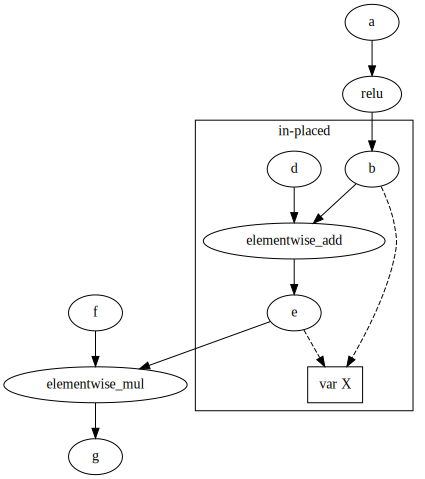
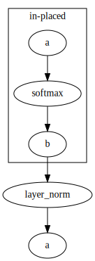

## Introduction

PaddlePaddle is implementing concept of in-place execution of some of operators.
Idea of In-place execution is present on following picture:

   

Examplary graph presents three operators where one of them (type of elementwise_add) is to be performing in-place computation. In-place computation means that input variable(Tensor) is used for both input and output. This means that one of inputs will be overwritten with computational results. In presented picture in-place operator (elementwise_add) is 
having two input nodes: *b* and *d*  and output *e*. *b* and *e* are underneath represented by a one, shared variable
*X*. So this means that variable *X* is initially holding some input data and afer the operator computation , input data is lost and replaced by computation's result.

Currently assumption is that if operator can have in-place processing then all its kernel (including oneDNN) should be able to work properly in in-place mode. To match this functionality oneDNN integration was extended to support in-place execution for some of its operators:
- activations
- softmax
- elementwise_add
- gelu*
- sum**

Adventages of in-place computation is:
* lower memory usage.
* improved performance of operators.

To have in-place computation We need to analyze graph to search for where in-place execution could happen
and then make some of variables to be shared by input and output of in-place capable operator.

Hence there are two parts of in-place support:
- in-place execution support within an operator
- onednn inplace C-API pass

#### in-place execution support within an operator
oneDNN primitive to have in-place execution needs to have same oneDNN memory object passed as input (src) and output(dst). In details we check if holded pointers to allocated buffers are the same for input and output
and this indicated if we use one oneDNN memory object or two. for example:

`auto src_memory_p = handler.AcquireSrcMemory(x);`

`auto dst_memory_p = x->IsSharedBufferWith(*y) ? 
           src_memory_p : handler.AcquireDstMemory(y);`

#### oneDNN in-place pass
As mentioned earlier idea of in-place pass is to locate operators with oneDNN kerenels that can perform in-place execution and then modify output node's variables to match input node's variable of the operator. 

##### Identifying operators with oneDNN kernels capable of in-place execution
This identification is a result of two checks:
- Whether operator does have *inplaceinferer* structure
- Whether operator is on a list of oneDNN's in-place supported operators

*InplaceInferer* is a struct that declares a mapping (one of inputs to one of outputs) indicating that
considerable operator can perform in-place execution and both vars (mentioned input and output in *InplaceInferer*) will
share a tensor. This is not enough for oneDNN in-place C-API execution as oneDNN library may not provide in-place 
computation for all required (to have in-place execution) operators of PaddlePaddle and some of operators wouldb have to
simulare in-place computation through the external buffer which would not bring any benefits, so there is no point enabling those in-place computations for C-API inference.

oneDNN in-place pass is taking adventage of graph pattern detector. So pattern consists of :
Node(Var 1) -> Node(Op to be inplaced) -> Node(Var2) -> Node (next op after in-placed one) -> Node (Var3)
Pattern is restricted so that in-placed to be op is of is oneDNN type. Due to fact that some operators have
more than  onei input and their output may be consumed by more than one operator it is expected that pattern
maybe detected multiple times for the same operator e.g. once for one input, then for second intpu etc..

Just having oneDNN operator capable of in-place is not enough to have in-place execution enabled, hence follwing rules
are checked by oneDNN in-place pass:
1. If intput node to in-place operator is also an input to diffrent operator , then in-place computation cannot be performed , as there is a risk that other operator consuming in-placed op operator will be executed after in-placed operator and therfore get invalid input data (overwritten by in-place computation)
2. If after in-placed operator there is another operator that is reusing in-place op's input var then in-place cannot happen. Next picture presents the idea.

   

\* onednn gelu kernel is able to perform in-place execution , but currently gelu op does not support in-place support
