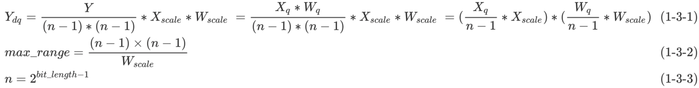
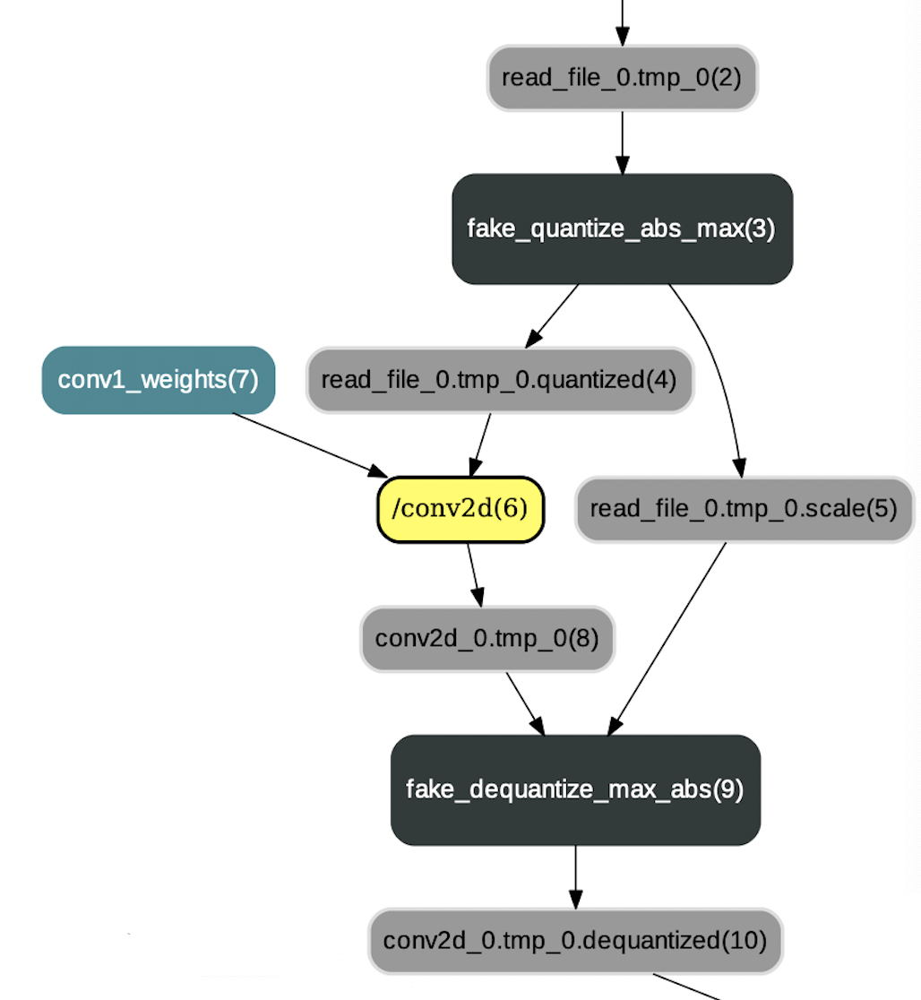
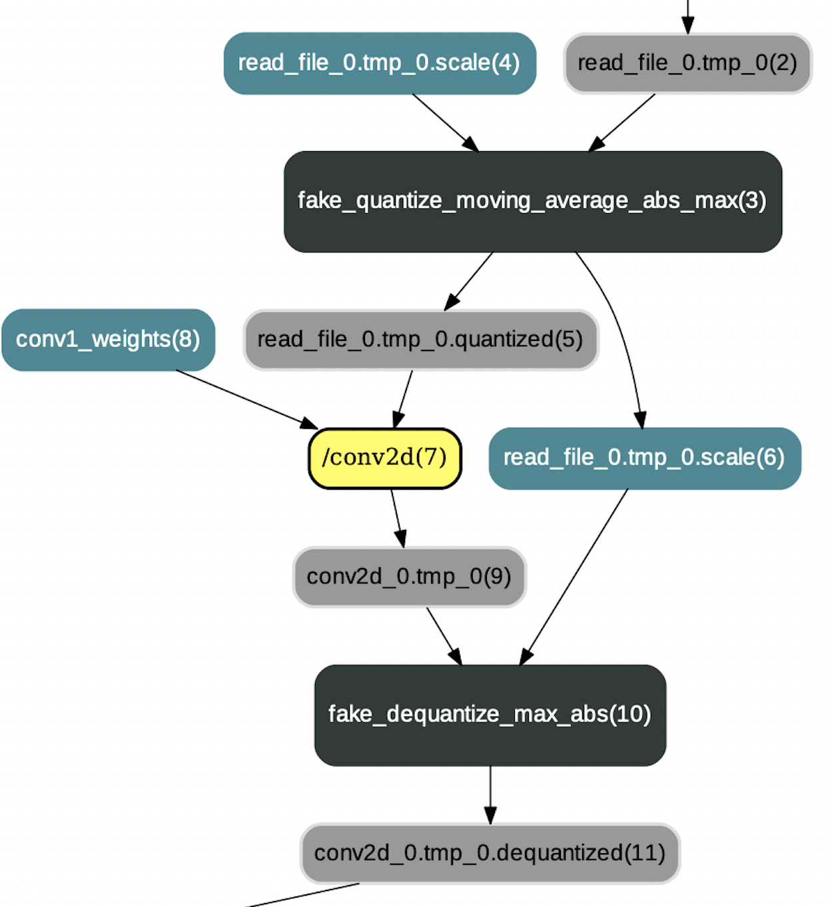
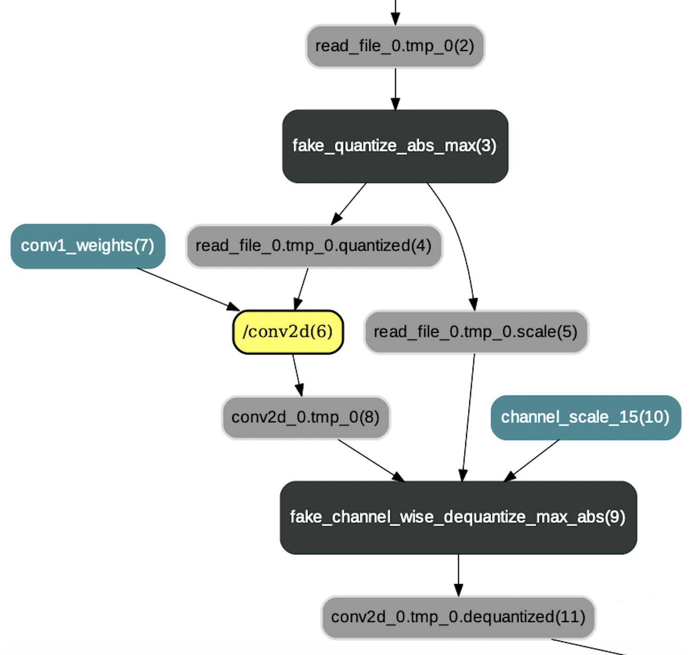

# 量化训练模型格式说明

## 1. Tensor-wise量化
### 1.1 动态量化

动态量化主要通过`fake_quantize_abs_max`op实现，该op对输入tensor进行量化并输出值域在-127～+127范围内的量化tensor。`fake_quantize_abs_max`op在对输入tensor进行量化时使用的量化scale是动态计算出来的，即取输入tensor元素的绝对值最大值。动态计算出的量化scale会作为反量化op的一个输入，用于求取反量化tensor。下面是对`fake_quantize_abs_max`op的整体描述：

```
fake_quantize_abs_max {
    inputs {
    X(Tensor): 激活tensor或权重tensor
    }

    outputs {
    Out(Tensor): 已量化tensor
    OutScale(Tensor): 动态计算得到的量化scale，其元素个数为1(tensor-wise量化)
    }

    attrs {
    bit_length(int): 量化bit数，如8-bit
    }
}
```

### 1.2 静态量化

与动态量化不同，静态量化的量化scale是在量化训练时通过**窗口滑动平均**或者**窗口绝对值最大值**等方法计算求得的。静态量化主要通过`fake_quantize_moving_average_abs_max`op或者`fake_quantize_range_abs_max`op实现，它们利用输入的量化scale将输入tensor量化到-127～127值域范围内。`fake_quantize_moving_average_abs_max`op和`fake_quantize_range_abs_max`op的输入和输出格式都是一样的，不同点在于op内部计算量化scale时使用的策略不同。`fake_quantize_moving_average_abs_max`op使用一个窗口内绝对值最大值的滑动平均值作为量化sacle，而`fake_quantize_range_abs_max`op使用一个窗口内绝对值最大值的最大值作为量化sacle。下面以`fake_quantize_moving_average_abs_max`op为例，对其进行整体描述：

```
fake_quantize_moving_average_abs_max {
    inputs {
    X(Tensor): 一般为激活tensor
    InScale(Tensor): 量化训练中计算求得的scale 
    }

    outputs {
    Out(Tensor): 已量化tensor
    OutScale(Tensor): 量化训练中计算求得的scale，用于继续传递到反量化op
    }

    attrs {
    is_test(bool): 指明是量化训练过程还是预测推断过程
    bit_length(int): 量化bit数，如8-bit
    moving_rate(float): 滑动平均衰减系数
    }
}
```

### 1.3 反量化

无论是静态量化还是动态量化，在量化计算完成后都需要进行反量化操作，该操作即是通过`fake_dequantize_abs_max`op实现的。具体来说，`fake_quantize_abs_max`op负责将fp32数值映射到int8值域（-127～127），而`fake_dequantize_abs_max` op是将int8数值映射到fp32值域。

<p align="center">
 <br />
</p>

根据[量化训练的原理](https://github.com/PaddlePaddle/models/blob/develop/PaddleSlim/docs/tutorial.md#1-quantization-aware-training%E9%87%8F%E5%8C%96%E4%BB%8B%E7%BB%8D)可知，`fake_dequantize_abs_max` op主要通过公式1-3-1进行反量化操作。在实现中，`fake_dequantize_abs_max` op将激活scale作为Variable（Tensor）进行输入（$X_{scale}$），将公式1-3-1中关于scale的剩余部分作为max\_range属性(即公式1-3-2)。`fake_dequantize_abs_max` op的整体描述如下：

```
fake_dequantize_abs_max {
    inputs {
    X(Tensor): 输入tensor
    Scale(Tensor): 激活scale
    }

    outputs {
    Out(Tensor): 已反量化tensor
    }

    attrs {
    max_range(float): 根据公式1-3-2和公式1-3-3计算所得
    }
}
```

## 2. Channel-wise量化
### 2.1 分channel量化

分channel量化与动态量化类似，也是将输入tensor量化到-127～+127值域范围内，不同之处在于分channel量化会对tensor按照channel维度进行分片，然后求取每个通道tensor的scale值。在Paddle中，`fake_channel_wise_quantize_abs_max`op实现了分channel量化的逻辑。注意，目前仅对权重进行分channel量化，对激活是不进行分channel量化的，并且分channel量化只作用在卷积操作上(包括`conv2d`和`depthwise_conv2d`）。下面是对`fake_channel_wise_quantize_abs_max`op的整体描述：

```
fake_channel_wise_quantize_abs_max {
    inputs {
    X(Tensor): 权重tensor
    }

    outputs {
    Out(Tensor): 已量化tensor
    OutScale(Tensor): 分channel计算得到的scale，其元素个数与输入tensor的通道数相同
    }

    attrs {
    bit_length(int): 量化bit数，如8-bit
    }
}
```

### 2.2 分channel反量化
若对卷积权重进行了分channel量化，则反量化操作时必须采用分channel反量化。`fake_channel_wise_dequantize_max_abs`op实现了分channel反量化的逻辑，它的输入Scales包括两个scale tensor，即激活scale和权重scale。根据2.1节的描述可知，权重采用的是channel-wise量化而激活采用的是tensor-wise量化，所以激活scale对应的tensor仅包含一个值而权重scale对应的tensor包括输出通道数个值。下面是对`fake_channel_wise_dequantize_max_abs`op的整体描述：

```
fake_channel_wise_dequantize_max_abs {
    inputs {
    X(Tensor): 输入tensor
    Scales(Tensor List): 一般包括两个tensor，且第一个为权重scale，第二个为激活scale
    }

    outputs {
    Out(Tensor): 已反量化tensor
    }

    attrs {
    quant_bits(int list): 一般包括两个整数值，分别为求取Scales中不同scale值时对应的量化bit数。
    }
}
```

## 3. 注意点

1） 8-bit量化训练中采用有符号的int8进行量化，且所有的scale都是没有除以127。

2）以上描述中仅`fake_dequantize_abs_max`op将scale的一部分作为属性值，其他op的scale均作为输入Variable（Tensor）。

3）若之后为量化训练添加新的量化op或反量化op，**建议使用Variable（Tensor）作为scale的数据传递方式**。因为量化训练的主要目的就是为了求取合适的量化/反量化scale，而将这些scale信息作为tensor的方式存储下来会方便后续scale数据向其他格式的转换。

## 4. 附录图解

<p align="center">
 <br />
<strong>图1: 动态量化，其中卷积权重已预先进行量化</strong>
</p>

<p align="center">
 <br />
<strong>图2: 静态量化，其中卷积权重已预先进行量化</strong>
</p>

<p align="center">
 <br />
<strong>图3: 分channel量化，其中卷积权重已预先进行分channel量化</strong>
</p>
