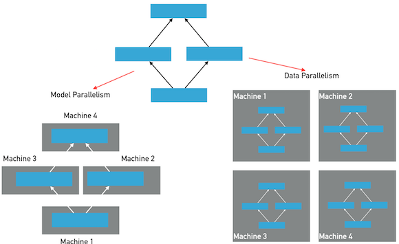

.. _cluster_howto:

分布式训练使用手册
====================

分布式训练基本思想
---------------

分布式深度学习训练通常分为两种并行化方法：数据并行，模型并行，参考下图：

在模型并行方式下，模型的层和参数将被分布在多个节点上，模型在一个mini-batch的前向和反向训练中，将经过多次跨\
节点之间的通信。每个节点只保存整个模型的一部分；在数据并行方式下，每个节点保存有完整的模型的层和参数，每个节点\
独自完成前向和反向计算，然后完成梯度的聚合并同步的更新所有节点上的参数。Fluid目前版本仅提供数据并行方式，另外\
诸如模型并行的特例实现（超大稀疏模型训练）功能将在后续的文档中予以说明。

在数据并行模式的训练中，Fluid使用了两种通信模式，用于应对不同训练任务对分布式训练的要求，分别为RPC通信和Collective
通信。其中RPC通信方式使用 `gRPC <https://github.com/grpc/grpc/>`_ ，Collective通信方式使用
`NCCL2 <https://developer.nvidia.com/nccl>`_ 。

**RPC通信和Collective通信的横向对比如下：**

.. csv-table:: 
   :header: "Feature", "Collective", "RPC"

   "Ring-Based通信", "Yes", "No"
   "异步训练", "Yes", "Yes"
   "分布式模型", "No", "Yes"
   "容错训练", "No", "Yes"
   "性能", "Faster", "Fast"

- RPC通信方式的结构：

  .. image:: src/dist_train_pserver.png

  使用RPC通信方式的数据并行分布式训练，会启动多个pserver进程和多个trainer进程，每个pserver进程\
  会保存一部分模型参数，并负责接收从trainer发送的梯度并更新这些模型参数；每个trainer进程会保存一份\
  完整的模型，并使用一部分数据进行训练，然后向pserver发送梯度，最后从pserver拉取更新后的参数。

  pserver进程可以在和trainer完全不同的计算节点上，也可以和trainer公用节点。一个分布式任务所需要的\
  pserver进程个数通常需要根据实际情况调整，以达到最佳的性能，然而通常来说pserver的进程不会比trainer\
  更多。

  pserver可以选择使用GPU或只使用CPU，如果pserver也使用GPU，则会增加一次从CPU拷贝\
  接收到的梯度数据到GPU的开销，在某些情况下会导致整体训练性能降低。

- NCCL2通信方式的结构：

  .. image:: src/dist_train_nccl2.png

  使用NCCL2（Collective通信方式）进行分布式训练，是不需要启动pserver进程的，每个trainer进程都保存\
  一份完整的模型参数，在完成计算梯度之后通过trainer之间的相互通信，Reduce梯度数据到所有节点的所有设备\
  然后每个节点在各自完成参数更新。

使用parameter server方式的训练
------------------------------

使用 :code:`transpiler` API可以把单机可以执行的程序快速转变成可以分布式执行的程序。在不同的服务器节点
上，通过传给 :code:`transpiler` 对应的参数，以获取当前节点需要执行的 :code:`Program` 。

需要配置参数包括
++++++++++++++++++
.. csv-table:: 
   :header: "参数", "说明"

   "role", "\ **必选**\ 区分作为pserver启动还是trainer启动，不传给transpile，也可以用其他的变量名或环境变量"
   "trainer_id", "\ **必选**\ 如果是trainer进程，用于指定当前trainer在任务中的唯一id，从0开始，在一个任务中需保证不重复"
   "pservers", "\ **必选**\ 当前任务所有pserver的ip:port列表字符串，形式比如：127.0.0.1:6170,127.0.0.1:6171"
   "trainers", "\ **必选**\ trainer节点的个数"
   "sync_mode", "\ **可选**\ True为同步模式，False为异步模式"
   "startup_program", "\ **可选**\ 如果startup_program不是默认的fluid.default_startup_program()，需要传入此参数"
   "current_endpoint", "\ **可选**\ 只有NCCL2模式需要传这个参数"

一个例子，假设有两个节点，分别是 :code:`192.168.1.1` 和 :code:`192.168.1.2` ，使用端口6170，启动4个trainer，
则代码可以写成：

.. code-block:: python

   role = "PSERVER"
   trainer_id = 0  # get actual trainer id from cluster
   pserver_endpoints = "192.168.1.1:6170,192.168.1.2:6170"
   current_endpoint = "192.168.1.1:6170" # get actual current endpoint
   trainers = 4
   t = fluid.DistributeTranspiler()
   t.transpile(trainer_id, pservers=pserver_endpoints, trainers=trainers)
   if role == "PSERVER":
       pserver_prog = t.get_pserver_program(current_endpoint)
       pserver_startup = t.get_startup_program(current_endpoint,
                                               pserver_prog)
       exe.run(pserver_startup)
       exe.run(pserver_prog)
   elif role == "TRAINER":
       train_loop(t.get_trainer_program())

选择同步或异步训练
++++++++++++++++++

Fluid分布式任务可以支持同步训练或异步训练，在同步训练方式下，所有的trainer节点，会在每个mini-batch
同步地合并所有节点的梯度数据并发送给parameter server完成更新，在异步训练方式下，每个trainer没有相互\
同步等待的过程，可以独立地更新parameter server的参数。通常情况下，使用异步训练方式，可以在trainer节点\
更多的时候比同步训练方式有更高的总体吞吐量。

在调用 :code:`transpile` 函数时，默认会生成同步训练的分布式程序，通过指定 :code:`sync_mode=False`
参数即可生成异步训练的程序：

.. code-block:: python

   t.transpile(trainer_id, pservers=pserver_endpoints, trainers=trainers, sync_mode=False)

选择是否使用分布式embedding表进行训练
++++++++++++++++++++++++++++++++++++

embedding被广泛应用在各种网络结构中，尤其是文本处理相关的模型。在某些场景，例如推荐系统或者搜索引擎中，
embedding的feature id可能会非常多，当feature id达到一定数量时，embedding参数会变得很大，一方面可能
单机内存无法存放导致无法训练，另一方面普通的训练模式每一轮迭代都需要同步完整的参数，参数太大会让通信变得
非常慢，进而影响训练速度。

Fluid支持千亿量级超大规模稀疏特征embedding的训练，embedding参数只会保存在parameter server上，通过
参数prefetch和梯度稀疏更新的方法，大大减少通信量，提高通信速度。

该功能只对分布式训练有效，单机无法使用。
需要配合稀疏更新一起使用。

使用方法，在配置embedding的时候，加上参数 :code:`is_distributed=True` 以及 :code:`is_sparse=True` 即可。
参数 :code:`dict_size` 定义数据中总的id的数量，id可以是int64范围内的任意值，只要总id个数小于等于dict_size就可以支持。
所以配置之前需要预估一下数据中总的feature id的数量。

.. code-block:: python

  emb = fluid.layers.embedding(
      is_distributed=True,
      input=input,
      size=[dict_size, embedding_width],
      is_sparse=True)

选择参数分布方法
++++++++++++++++

参数 :code:`split_method` 可以指定参数在parameter server上的分布方式。

Fluid默认使用 `RoundRobin <https://en.wikipedia.org/wiki/Round-robin_scheduling>`_
方式将参数分布在多个parameter server上。此方式在默认未关闭参数切分的情况下，参数会较平均的分布在所有的
parameter server上。如果需要使用其他，可以传入其他的方法，目前可选的方法有： :code:`RoundRobin` 和
:code:`HashName` 。也可以使用自定义的分布方式，只需要参考
`这里 <https://github.com/PaddlePaddle/Paddle/blob/develop/python/paddle/fluid/transpiler/ps_dispatcher.py#L44>`_
编写自定义的分布函数。

关闭切分参数
++++++++++++

参数 :code:`slice_var_up` 指定是否将较大（大于8192个元素）的参数切分到多个parameter server以均衡计算负载，默认为开启。

当模型中的可训练参数体积比较均匀或者使用自定义的参数分布方法是参数均匀分布在多个parameter server上，
可以选择关闭切分参数，这样可以降低切分和重组带来的计算和拷贝开销：

.. code-block:: python

   t.transpile(trainer_id, pservers=pserver_endpoints, trainers=trainers, slice_var_up=False)

开启内存优化
++++++++++++

在parameter server分布式训练模式下，要开启内存优化 :code:`memory_optimize` 和单机相比，需要注意按照下面的规则配置：

* 在pserver端，\ **不要**\ 执行 :code:`memory_optimize`
* 在trainer端，先执行 :code:`fluid.memory_optimize` 再执行 :code:`t.transpile()`
* 在trainer端，调用 :code:`memory_optimize` 需要增加 :code:`skip_grads=True` 确保发送的梯度不会被重命名： :code:`fluid.memory_optimize(input_program, skip_grads=True)`

示例：

.. code-block:: python

  if role == "TRAINER":
      fluid.memory_optimize(fluid.default_main_program(), skip_grads=True)
  t = fluid.DistributeTranspiler()
  t.transpile(trainer_id, pservers=pserver_endpoints, trainers=trainers)
  if role == "PSERVER":
      # start pserver here
  elif role == "TRAINER":
      # start trainer here

使用NCCL2通信方式的训练
--------------------

NCCL2模式的分布式训练，由于没有parameter server角色，是trainer之间互相通信，使用时注意：

* 配置 :code:`fluid.DistributeTranspilerConfig` 中 :code:`mode="nccl2"` 。
* 调用 :code:`transpile` 时，:code:`trainers` 传入所有trainer节点的endpoint，并且传入参数 :code:`current_endpoint` 。
* 初始化 :code:`ParallelExecutor` 时传入 :code:`num_trainers` 和 :code:`trainer_id` 。

一个例子：

.. code-block:: python

  trainer_id = 0 # get actual trainer id here
  trainers = "192.168.1.1:6170,192.168.1.2:6170"
  current_endpoint = "192.168.1.1:6170"
  config = fluid.DistributeTranspilerConfig()
  config.mode = "nccl2"
  t = fluid.DistributeTranspiler(config=config)
  t.transpile(trainer_id, trainers=trainers, current_endpoint=current_endpoint)
  exe = fluid.ParallelExecutor(use_cuda,
    loss_name=loss_name, num_trainers=len(trainers.split(",")), trainer_id=trainer_id)
  ...

NCCL2模式必要参数说明
++++++++++++++++++++++++++++++++++++++
.. csv-table:: 
   :header: "参数", "说明"

   "trainer_id", "任务中每个trainer节点的唯一ID，从0开始，不能有重复"
   "trainers", "任务中所有trainer节点的endpoint，用于在NCCL2初始化时，广播NCCL ID"
   "current_endpoint", "当前节点的endpoint"

目前使用NCCL2进行分布式训练仅支持同步训练方式。使用NCCL2方式的分布式训练，更适合模型体积较大，并需要使用\
同步训练和GPU训练，如果硬件设备支持RDMA和GPU Direct，可以达到很高的分布式训练性能。

启动多进程模式 NCCL2 分布式训练作业
+++++++++++++++++++++++++++++++++

通常情况下使用多进程模式启动 NCCL2 分布式训练作业可以获得更好多训练性能，Paddle 提供了
:code:`paddle.distributed.launch` 模块可以方便地启动多进程作业，启动后每个训练进程将会使用一块独立的 GPU 设备。
使用时需要注意：

* 设置节点数：通过环境变量 :code:`PADDLE_NUM_TRAINERS` 设置作业的节点数，此环境变量也会被设置在每个训练进程中。
* 设置每个节点的设备数：通过启动参数 :code:`--gpus` 可以设置每个节点的 GPU 设备数量，每个进程的序号将会被自动设置在环境变量
  :code:`PADDLE_TRAINER_ID` 中。
* 数据切分： 多进程模式是每个设备一个进程，一般来说需要每个进程处理一部分训练数据，并且保证所有进程能够处理完整的数据集。
* 入口文件：入口文件为实际启动的训练脚本。
* 日志：每个训练进程的日志默认会保存在 :code:`./mylog` 目录下，您也可以通过参数 :code:`--log_dir` 进行指定。

启动样例:

.. code-block:: bash

    > PADDLE_NUM_TRAINERS=<TRAINER_COUNT> python -m paddle.distributed.launch train.py --gpus <NUM_GPUS_ON_HOSTS> <ENTRYPOINT_SCRIPT> --arg1 --arg2 ...

NCCL2分布式训练注意事项
+++++++++++++++++++++

**注意：** 使用NCCL2模式分布式训练时，需要确保每个节点训练等量的数据，防止在最后一轮训练中任务不退出。通常有两种方式：

- 随机采样一些数据，补全分配到较少数据的节点上。（推荐使用这种方法，以训练完整的数据集）。
- 在python代码中，每个节点每个pass只训练固定的batch数，如果这个节点数据较多，则不训练这些多出来的数据。

**注意：** 如果系统中有多个网络设备，需要手动指定NCCL2使用的设备，假设需要使用 :code:`eth2` 为通信设备，需要设定如下环境变量：

.. code-block:: bash

   export NCCL_SOCKET_IFNAME=eth2

另外NCCL2提供了其他的开关环境变量，比如指定是否开启GPU Direct，是否使用RDMA等，详情可以参考
`ncclknobs <https://docs.nvidia.com/deeplearning/sdk/nccl-developer-guide/index.html#ncclknobs>`_ 。
