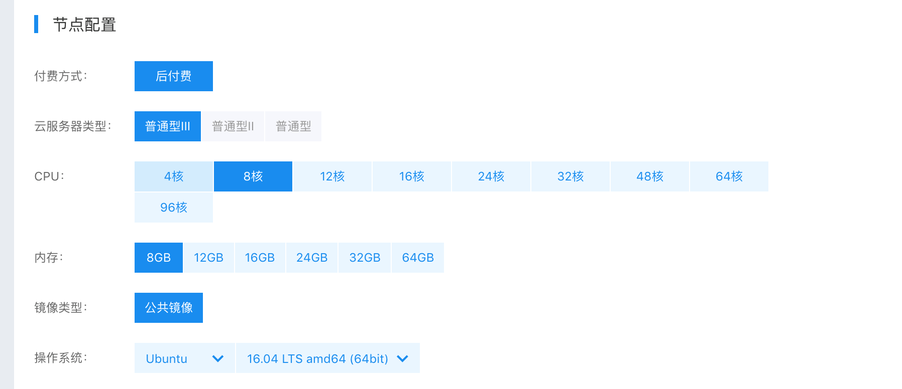
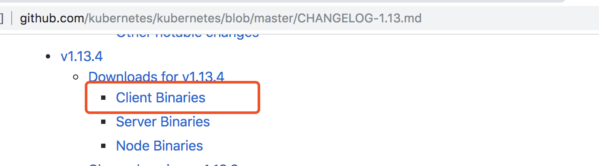
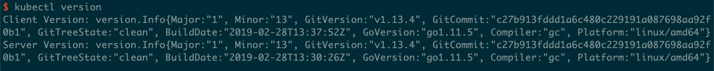
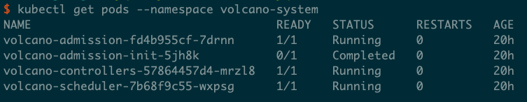
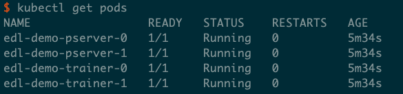
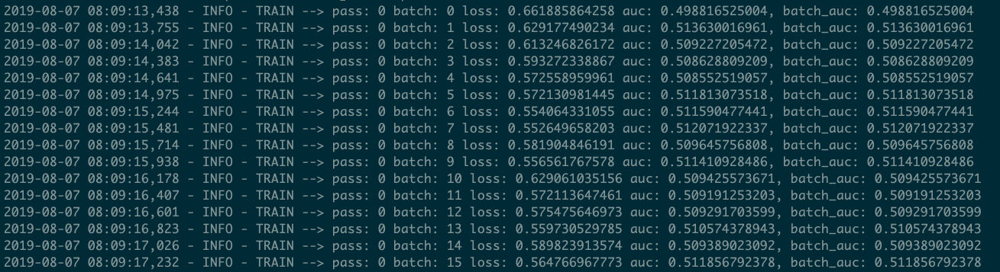
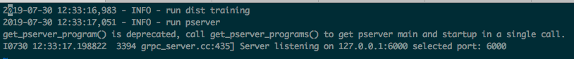

..  _deploy_ctr_on_baidu_cloud_cn:

在百度云分布式训练CTR
=========================

Fluid支持数据并行的分布式训练，也支持基于Kubernetes的分布式部署。本文以百度云为例，说明如何通过在云服务器上基于Volcano框架实施分布式训练Click-Through-Rate（以下简称ctr）任务。

1. 使用前的准备
----------------

百度云容器引擎的使用流程基本概念可以参考 `官网文档 <https://cloud.baidu.com/doc/CCE/GettingStarted/24.5C.E6.93.8D.E4.BD.9C.E6.B5.81.E7.A8.8B.html#.E6.93.8D.E4.BD.9C.E6.B5.81.E7.A8.8B>`_ 做了解

Volcano的使用流程基本概念可以参考 `Github项目主页 <https://github.com/volcano-sh/volcano>`_ 做了解

2. 创建集群
----------------
具体请参考 `帮助文档 <https://cloud.baidu.com/doc/CCE/GettingStarted/24.5C.E5.88.9B.E5.BB.BA.E9.9B.86.E7.BE.A4.html#.E6.93.8D.E4.BD.9C.E6.AD.A5.E9.AA.A4>`_ 说明文档来建立一个集群。

集群配置需要满足如下要求

- CPU核数 > 4

示例图

创建完成后，即可查看 `集群信息 <https://cloud.baidu.com/doc/CCE/GettingStarted.html#.E6.9F.A5.E7.9C.8B.E9.9B.86.E7.BE.A4>`_ 。

3. 操作集群
----------------

3.1. 配置集群环境
^^^^^^^^^^^^^^^^

需要注意的是，本操作指南给出的操作步骤都是基于linux操作环境的。

- 进入“产品服务>容器引擎CCE”，点击“集群管理>集群列表”，可看到用户已创建的集群列表。从集群列表中查看创建的集群信息。

3.2. 配置开发机环境
^^^^^^^^^^^^^^^^^

需要注意的是，配置过程需要开发机的root权限。

集群的操作可以通过百度云web或者通过kubectl工具进行，推荐用 `kubectl工具 <https://kubernetes.io/docs/tasks/tools/install-kubectl/>`_ 。

从Kubernetes 版本下载页面下载对应的 kubectl 客户端（1.13.4），关于kubectl 的其他信息，可以参见kubernetes官方安装和设置 kubectl文档。

- 接下来是安装kubectl，解压下载后的文件，为kubectl添加执行权限，并放在PATH下

.. code-block:: bash

	cd kubernetes/client/bin && chmod +x ./kubectl && sudo mv ./kubectl /usr/local/bin/kubectl

- 配置kubectl，下载集群凭证。在集群界面下载集群配置文件，放在kubectl的默认配置路径（请检查~/.kube 目录是否存在，若没有请创建）

.. code-block:: bash

	mv kubectl.conf  ~/.kube/config

- 配置完成后，您即可以使用 kubectl 从本地计算机访问 Kubernetes 集群

.. code-block:: bash

	kubectl get node

- 执行`kubectl version`，如果返回client端与server端信息，则证明配置成功。

- 如果只返回client端信息，server端信息显示"Forbidden"，检查开发机是否使用了代理，若有可以尝试关闭代理再次执行命令检查。

- 按照volcano的Github主页的说明进行安装

安装完成后执行

.. code-block:: bash
	
	kubectl get pods --namespace volcano-system
	
若出现以下信息则证明安装成功：

4. 部署任务
----------------

- CTR模型的训练镜像存放在`Docker Hub <https://hub.docker.com/>`_网站，通过kubectl加载yaml文件启动训练任务，CTR预估模型训练任务的yaml文件为ctr-paddlepaddle-on-volcano.yaml.

- 任务的所有脚本文件可以访问 `这里 <https://github.com/volcano-sh/volcano/blob/master/example/integrations/paddlepaddle>`_ 获取。

执行

.. code-block:: bash
	
	kubectl apply -f ctr-paddlepaddle-on-volcano.yaml
	
文件内容如下
	
.. code-block:: yaml

	apiVersion: batch.volcano.sh/v1alpha1
	kind: Job
	metadata:
	  name: ctr-volcano
	spec:
	  minAvailable: 4
	  schedulerName: volcano
	  policies:
	  - event: PodEvicted
	    action: RestartJob
	  - event: PodFailed
	    action: RestartJob
	  tasks:
	  - replicas: 2
	    name: pserver
	    template:
	      metadata:
		labels:
		  paddle-job-pserver: fluid-ctr
	      spec:
		imagePullSecrets:
		- name: default-secret
		volumes:
		- hostPath:
		    path: /home/work/
		    type: ""
		  name: seqdata
		containers:
		- image: volcanosh/edlctr:v1
		  command:
		  - paddle_k8s
		  - start_fluid
		  imagePullPolicy: IfNotPresent
		  name: pserver
		  volumeMounts:
		  - mountPath: /mnt/seqdata
		    name: seqdata
		  resources:
		    limits:
		      cpu: 10
		      memory: 30Gi
		      ephemeral-storage: 10Gi
		    requests:
		      cpu: 1
		      memory: 100M
		      ephemeral-storage: 1Gi
		  env:
		  - name: GLOG_v
		    value: "0"
		  - name: GLOG_logtostderr
		    value: "1"
		  - name: TOPOLOGY
		    value: ""
		  - name: TRAINER_PACKAGE
		    value: /workspace
		  - name: NAMESPACE
		    valueFrom:
		      fieldRef:
			apiVersion: v1
			fieldPath: metadata.namespace
		  - name: POD_IP
		    valueFrom:
		      fieldRef:
			apiVersion: v1
			fieldPath: status.podIP
		  - name: POD_NAME
		    valueFrom:
		      fieldRef:
			apiVersion: v1
			fieldPath: metadata.name
		  - name: PADDLE_CURRENT_IP
		    valueFrom:
		      fieldRef:
			apiVersion: v1
			fieldPath: status.podIP
		  - name: PADDLE_JOB_NAME
		    value: fluid-ctr
		  - name: PADDLE_IS_LOCAL
		    value: "0"
		  - name: PADDLE_TRAINERS_NUM
		    value: "2"
		  - name: PADDLE_PSERVERS_NUM
		    value: "2"
		  - name: FLAGS_rpc_deadline
		    value: "36000000"
		  - name: ENTRY
		    value: cd /workspace/ctr && python train.py --is_local 0 --cloud_train 1
		  - name: PADDLE_PORT
		    value: "30236"
		  - name: LD_LIBRARY_PATH
		    value: /usr/local/lib:/usr/local/nvidia/lib64:/usr/local/rdma/lib64:/usr/lib64/mlnx_ofed/valgrind
		  - name: PADDLE_TRAINING_ROLE
		    value: PSERVER
		  - name: TRAINING_ROLE
		    value: PSERVER
		restartPolicy: OnFailure
	  - replicas: 2
	    policies:
	    - event: TaskCompleted
	      action: CompleteJob
	    name: trainer
	    template:
	      metadata:
		labels:
		  paddle-job: fluid-ctr
	      spec:
		imagePullSecrets:
		- name: default-secret
		volumes:
		- hostPath:
		    path: /home/work/
		    type: ""
		  name: seqdata
		containers:
		- image: volcanosh/edlctr:v1
		  command:
		  - paddle_k8s
		  - start_fluid
		  imagePullPolicy: IfNotPresent
		  name: trainer
		  volumeMounts:
		  - mountPath: /mnt/seqdata
		    name: seqdata
		  resources:
		    limits:
		      cpu: 10
		      memory: 30Gi
		      ephemeral-storage: 10Gi
		    requests:
		      cpu: 1
		      memory: 100M
		      ephemeral-storage: 10Gi
		  env:
		  - name: GLOG_v
		    value: "0"
		  - name: GLOG_logtostderr
		    value: "1"
		  - name: TOPOLOGY
		  - name: TRAINER_PACKAGE
		    value: /workspace
		  - name: CPU_NUM
		    value: "2"
		  - name: NAMESPACE
		    valueFrom:
		      fieldRef:
			apiVersion: v1
			fieldPath: metadata.namespace
		  - name: POD_IP
		    valueFrom:
		      fieldRef:
			apiVersion: v1
			fieldPath: status.podIP
		  - name: POD_NAME
		    valueFrom:
		      fieldRef:
			apiVersion: v1
			fieldPath: metadata.name
		  - name: PADDLE_CURRENT_IP
		    valueFrom:
		      fieldRef:
			apiVersion: v1
			fieldPath: status.podIP
		  - name: PADDLE_JOB_NAME
		    value: fluid-ctr
		  - name: PADDLE_IS_LOCAL
		    value: "0"
		  - name: FLAGS_rpc_deadline
		    value: "36000000"
		  - name: PADDLE_PORT
		    value: "30236"
		  - name: PADDLE_PSERVERS_NUM
		    value: "2"
		  - name: PADDLE_TRAINERS_NUM
		    value: "2"
		  - name: PADDLE_TRAINING_ROLE
		    value: TRAINER
		  - name: TRAINING_ROLE
		    value: TRAINER
		  - name: LD_LIBRARY_PATH
		    value: /usr/local/lib:/usr/local/nvidia/lib64:/usr/local/rdma/lib64:/usr/lib64/mlnx_ofed/valgrind
		  - name: ENTRY
		    value: cd /workspace/ctr && python train.py --is_local 0 --cloud_train 1
		restartPolicy: OnFailure
	

即可成功提交任务

需要说明的是 在 ctr-paddlepaddle-on-volcano.yaml 当中定义了Pod所需的image，这些image如上文，存放在Docker Hub。

6. 查看结果
----------------
百度云容器引擎CCE提供了web操作台方便查看pod的运行状态。

本次训练任务将启动2个pserver节点，2个trainer节点，示例图如下

执行

.. code-block:: bash
	
	kubectl get pods
	

可以通过检查pserver和trainer的log来检查任务运行状态。

执行

.. code-block:: bash
	
	kubectl log $POD_NAME
	
Trainer日志示例：

Pserver日志示例：

