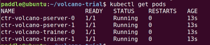

..  _deploy_ctr_on_baidu_cloud_cn:

在百度云分布式训练CTR
=========================

Fluid支持数据并行的分布式训练，也支持基于Kubernetes的分布式部署。本文以百度云为例，说明如何通过在云服务器上基于Volcano框架实施分布式训练Click-Through-Rate（以下简称ctr）任务。

1. 使用前的准备
----------------

百度云容器引擎的使用流程基本概念可以参考 `官网文档 <https://cloud.baidu.com/doc/CCE/GettingStarted/24.5C.E6.93.8D.E4.BD.9C.E6.B5.81.E7.A8.8B.html#.E6.93.8D.E4.BD.9C.E6.B5.81.E7.A8.8B>`_ 做了解

Volcano的使用流程基本概念可以参考 `Github项目主页 <https://github.com/volcano-sh/volcano>`_ 做了解

2. 创建集群
----------------
具体请参考 `帮助文档 <https://cloud.baidu.com/doc/CCE/GettingStarted/24.5C.E5.88.9B.E5.BB.BA.E9.9B.86.E7.BE.A4.html#.E6.93.8D.E4.BD.9C.E6.AD.A5.E9.AA.A4>`_ 说明文档来建立一个集群。

集群配置需要满足如下要求

- CPU核数 > 4

示例图

.. image:: src/ctr_node.png

创建完成后，即可查看 `集群信息 <https://cloud.baidu.com/doc/CCE/GettingStarted.html#.E6.9F.A5.E7.9C.8B.E9.9B.86.E7.BE.A4>`_ 。

3. 操作集群
----------------

3.1. 配置集群环境
^^^^^^^^^^^^^^^^

集群的操作可以通过百度云web或者通过kubectl工具进行，推荐用 `kubectl工具 <https://kubernetes.io/docs/tasks/tools/install-kubectl/>`_ 。

从Kubernetes 版本下载页面下载对应的 kubectl 客户端，关于kubectl 的其他信息，可以参见kubernetes官方安装和设置 kubectl文档。

.. image:: src/ctr_kubectl_download.png

* 注意：
本操作指南给出的操作步骤都是基于linux操作环境的。

- 进入“产品服务>容器引擎CCE”，点击“集群管理>集群列表”，可看到用户已创建的集群列表。从集群列表中查看创建的集群信息。

- 点击左侧的"Helm>Helm实例"，点击安装链接为集群一键安装helm。百度智能云为集群安装的helm版本为2.12.3，kubectl版本为1.13.4

- 为了能够从外部登录集群节点，需要为集群中安装了tiller的节点申请弹性公网。点击"更多操作>控制台"。

- 点击"命名空间"选择kube-system，点击"容器组"，查看tiller开头的节点。

- 点击"产品服务>网络>弹性公网"

- 创建弹性公网实例，完成后选择创建的实例，点击"更多操作>绑定到BCC"，填写tiller开头的节点信息进行绑定。

3.2. 配置开发机环境
^^^^^^^^^^^^^^^^^

配置过程需要开发机的root权限。

- 接下来是安装kubectl，解压下载后的文件，为kubectl添加执行权限，并放在PATH下

.. code-block:: bash

	cd kubernetes/client/bin && chmod +x ./kubectl && sudo mv ./kubectl /usr/local/bin/kubectl

- 配置kubectl，下载集群凭证。在集群界面下载集群配置文件，放在kubectl的默认配置路径（请检查~/.kube 目录是否存在，若没有请创建）

.. code-block:: bash

	mv kubectl.conf  ~/.kube/config

- 配置完成后，您即可以使用 kubectl 从本地计算机访问 Kubernetes 集群

.. code-block:: bash

	kubectl get node

- 接下来是安装客户端的helm，用于与上面提到的Helm实例进行交互，解压下载后的文件,按照   `官网说明 <https://helm.sh/docs/using_helm/>`_ 安装helm客户端，然后执行

.. code-block:: bash

	helm init --client-only
	
- 通过之前创建的弹性公网ip登录运行tiller的节点，账户密码为创建集群时设置的账户和密码，默认账户为root。

将节点上的以下三个文件

.. code-block:: bash

	/etc/kubernetes/pki/ca.pem
	/etc/kubernetes/pki/admin.pem
	/etc/kubernetes/pki/admin-key.pem

- 下载至开发机并放在相同的路径，添加四个环境变量

.. code-block:: bash

	export HELM_TLS_ENABLE=true
	export HELM_TLS_CA_CERT=/etc/kubernetes/pki/ca.pem
	export HELM_TLS_CERT=/etc/kubernetes/pki/admin.pem
	export HELM_TLS_KEY=/etc/kubernetes/pki/admin-key.pem
	
- 分别执行`kubectl version`与`helm version`，如果返回client端与server端信息，则证明配置成功。

.. image:: src/baidu_cloud/kubectl-version.png

- 如果只返回client端信息，server端信息显示"Forbidden"，检查开发机是否使用了代理，若有可以尝试关闭代理再次执行命令检查。

- Git Clone `Volcano <https://github.com/volcano-sh/volcano>`_ 项目，推荐安装 Go 1.12 及以上版本，参考 `Volcano Quick Start Guide <https://github.com/volcano-sh/volcano#quick-start-guide>`_ 

安装完成后执行

.. code-block:: bash
	
	kubectl get pods --namespace volcano-syste
	
若出现以下信息则证明安装成功：

.. image:: src/baidu_cloud/volcano.png

4. 设置访问权限
----------------
建立分布式任务需要pod间有API互相访问的权限，可以按如下步骤

执行

.. code-block:: bash

	kubectl create -f defaultserviceaccountclusterrole.yaml 
	

5. 部署任务
----------------

- CTR模型的训练镜像存放在`Docker Hub <https://hub.docker.com/>`_网站，通过kubectl加载yaml文件启动训练任务，CTR预估模型训练任务的yaml文件为volcano-ctr-demo-baiduyun.yaml.

- 任务的所有脚本文件可以访问 `这里 <https://github.com/PaddlePaddle/edl/tree/develop/example/ctr>`_ 获取。

执行

.. code-block:: bash
	
	kubectl apply -f volcano-ctr-demo-baiduyun.yaml
	

即可成功提交任务

需要说明的是 在 volcano-ctr-demo-baiduyun.yaml 当中定义了Pod所需的image，这些image如上文，存放在Docker Hub。此镜像的Dockerfile就在ctr文件夹下。

6. 查看结果
----------------
百度云容器引擎CCE提供了web操作台方便查看pod的运行状态。

本次训练任务将启动2个pserver节点，2个trainer节点，示例图如下

执行

.. code-block:: bash
	
	kubectl get pods
	

可以通过检查pserver和trainer的log来检查任务运行状态。

执行

.. code-block:: bash
	
	kubectl log $POD_NAME
	
Trainer日志示例：

