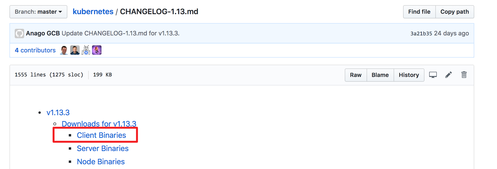
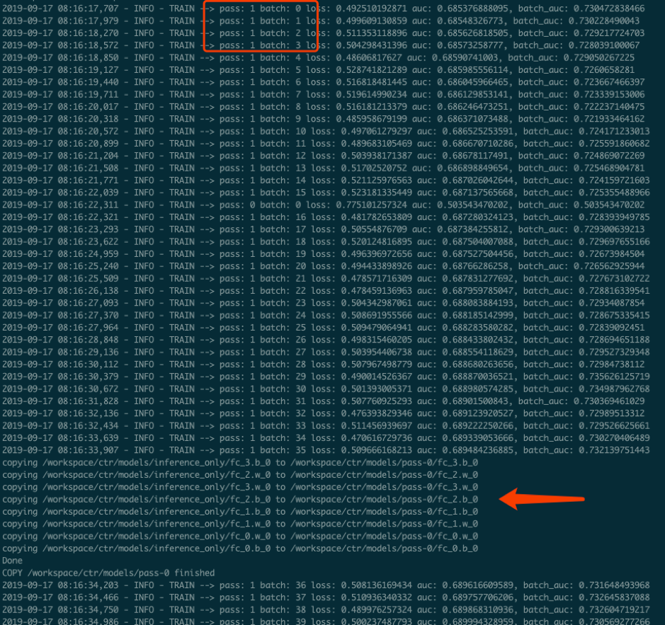
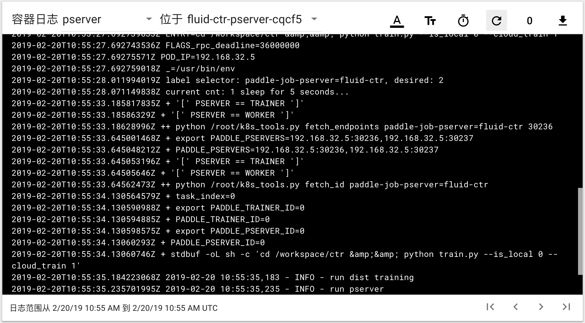

..  _deploy_ctr_on_baidu_cloud_cn:

百度云分布式训练CTR
=========================

Fluid支持数据并行的分布式训练，也支持基于k8s的分布式部署。用户可以利用百度云，来分布式训练ctr任务。

1. 概念了解
----------------
基本概念可以参考 `官网文档 <https://cloud.baidu.com/doc/CCE/GettingStarted/24.5C.E6.93.8D.E4.BD.9C.E6.B5.81.E7.A8.8B.html#.E6.93.8D.E4.BD.9C.E6.B5.81.E7.A8.8B>`_ 做了解

2. 创建集群
----------------
登陆百度云官网，按照 `帮助文档 <https://cloud.baidu.com/doc/CCE/GettingStarted/24.5C.E5.88.9B.E5.BB.BA.E9.9B.86.E7.BE.A4.html#.E6.93.8D.E4.BD.9C.E6.AD.A5.E9.AA.A4>`_ 建立一个集群。

集群配置需要满足如下要求

- 集群名称定义为 `default`

    + 集群名称对后续操作有影响，如果用其它名称，请修改后面步骤的集群名字，使其保持一致

- CPU核数 > 4

示例图

创建完成后，即可查看 `集群信息 <https://cloud.baidu.com/doc/CCE/GettingStarted.html#.E6.9F.A5.E7.9C.8B.E9.9B.86.E7.BE.A4>`_ 。

3. 操作集群
----------------
集群的操作可以通过百度云web或者通过kubectl工具进行，推荐用 `kubectl工具 <https://cloud.baidu.com/doc/CCE/GettingStarted.html#.9A.A4.11.34.30.82.16.52.AD.4D.B9.72.E8.10.44.C0>`_ 。

从Kubernetes 版本下载页面下载对应的 kubectl 客户端，关于kubectl 的其他信息，可以参见kubernetes官方安装和设置 kubectl文档。

* 注意：
本操作指南给出的操作步骤都是基于linux操作环境的。

- 解压下载后的文件，为kubectl添加执行权限，并放在PATH下

.. code-block:: bash

	cd kubernetes/client/bin && chmod +x ./kubectl && sudo mv ./kubectl /usr/local/bin/kubectl

- 配置kubectl，下载集群凭证。在集群界面下载集群配置文件，放在kubectl的默认配置路径（请检查~/.kube 目录是否存在，若没有请创建）

.. code-block:: bash

	mv kubectl.conf  ~/.kube/config

- 配置完成后，您即可以使用 kubectl 从本地计算机访问 Kubernetes 集群

.. code-block:: bash

	kubectl get node

4. 设置访问权限
----------------
建立分布式任务需要pod间有API互相访问的权限，可以按如下步骤

.. code-block:: bash

	sudo kubectl create rolebinding default-view --clusterrole=view --serviceaccount=default:default --namespace=default

* 注意：  --namespace 指定的default 为创建集群时候的名称

5. 部署任务
----------------
任务的所有脚本文件可以访问 https://github.com/PaddlePaddle/edl/tree/develop/example 地址拿到。

- ctr：ctr任务对应的python脚本
- ps-train：k8s任务对应的yaml文件

	+ pserver.yaml: 部署psever任务

	+ trainer.yaml: 部署trainer任务

- Dockerfile：pod文件的docker镜像生成文件
- Script：pod文件docker镜像中包含的脚本

直接通过

.. code-block:: bash

	kubectl apply -f ps-train

即可以成功部署任务

6. 查看结果
----------------
百度云容器引擎CCE提供了web操作台方便查看pod的运行状态。

本次训练任务将启动2个pserver节点，2个trainer节点，示例图如下

可以通过检查pserver和trainer的log来检查任务运行状态。
Trainer日志示例：

pserver日志示例：

