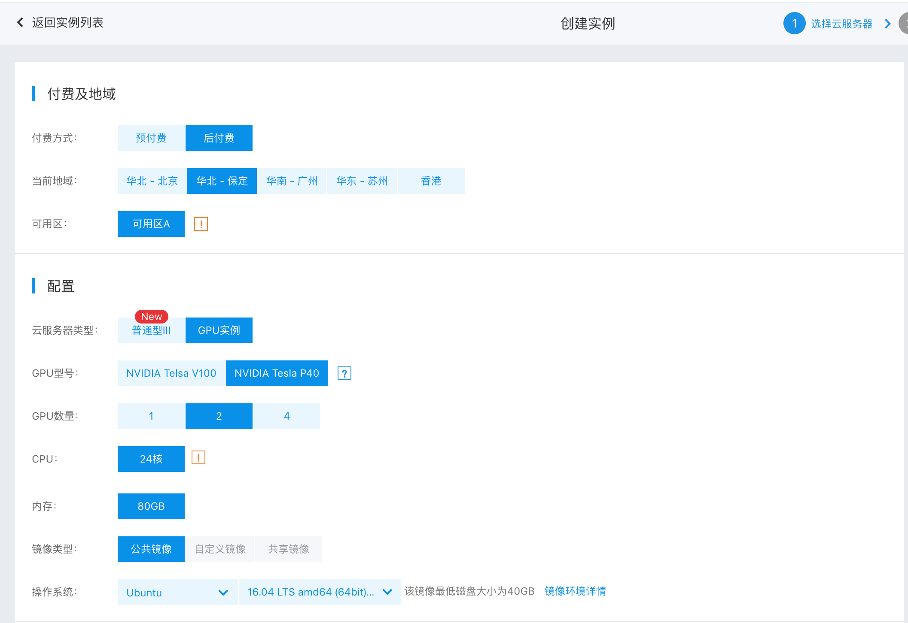
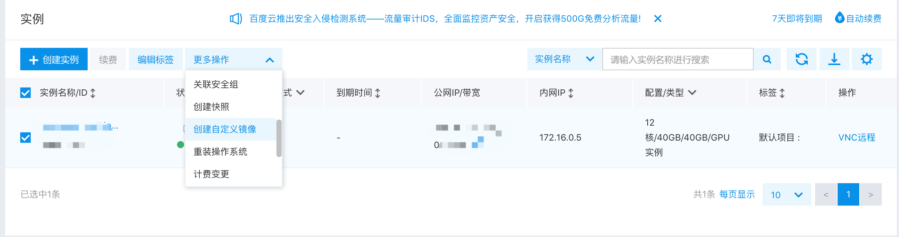
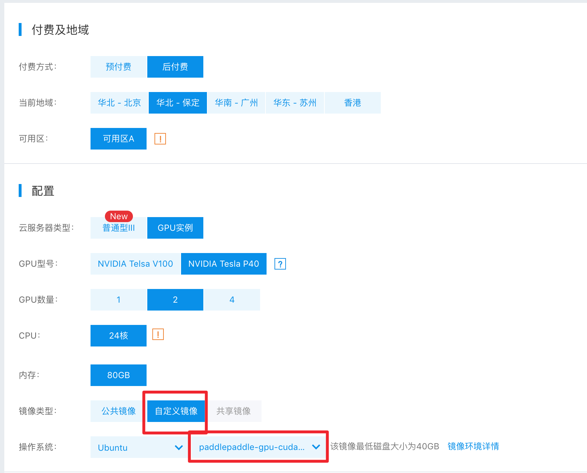
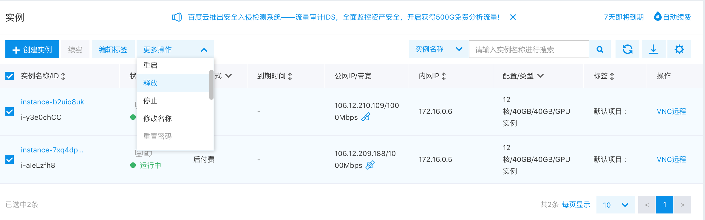

.. _train_on_baidu_cloud_cn

在百度云上启动Fluid分布式训练
=========================

PaddlePaddle Fluid分布式训练，可以不依赖集群系统（比如MPI，Kubernetes）启动分布式训练。
本章节将会以 `百度云 <https://cloud.baidu.com/>`_ 为实例，说明如何在云端环境，甚至云端GPU环境启动
大规模分布式任务。

创建集群模板
----------

登录到百度云控制台，选择BCC服务，点击“创建实例”。选择地域，注意，只有一些地域有GPU服务器可选，
选择合适的地域之后，再选择对应型号，然后创建一个空的服务器，如下图：

* 在操作系统选项中，可以根据需要选择对应的版本，注意根据实际情况选择CUDA版本，这里我们选择CUDA-9.2。
* 示例中选择机器付费方式为后付费，表示随着机器的释放，收费也会对应停止，对运行一次性任务会比较划算。

在机器创建成功之后，执行下面的命令安装paddlepaddle GPU版本和相关依赖。

.. code-block:: bash

  apt-get update && apt-get install -y python python-pip python-opencv
  # 注：百度云cuda-9.2镜像默认没有安装cudnn和nccl2，需要手动安装，如果自行安装，需要从官网下载
  wget -q "http://paddle-train-on-cloud.cdn.bcebos.com/libcudnn7_7.2.1.38-1+cuda9.2_amd64.deb"
  wget -q "http://paddle-train-on-cloud.cdn.bcebos.com/nccl_2.2.13-1+cuda9.0_x86_64.txz"
  dpkg -i libcudnn7_7.2.1.38-1+cuda9.2_amd64.deb
  ln -s /usr/lib/x86_64-linux-gnu/libcudnn.so.7 /usr/lib/libcudnn.so
  unxz nccl_2.2.13-1+cuda9.0_x86_64.txz
  tar xf nccl_2.2.13-1+cuda9.0_x86_64.tar
  cp -r nccl_2.2.13-1+cuda9.0_x86_64/lib/* /usr/lib
  # 注：可以选择是否使用下面的pip镜像加速下载
  pip install -i https://pypi.tuna.tsinghua.edu.cn/simple matplotlib==2.2.3
  pip install -i https://pypi.tuna.tsinghua.edu.cn/simple paddlepaddle-gpu==0.15.0.post97

完成安装后，使用下面的测试程序，测试当前机器是否可以正确运行GPU训练程序，如果遇到报错，请根据报错提示修复
运行环境问题。为了方便启动GPU集群，测试程序执行成功之后，选择当前服务器，然后选择“创建自定义镜像”，后续
创建GPU集群时即可选择配置好的镜像。

* 测试程序：

.. code-block:: python

  from __future__ import print_function

  import paddle.fluid.core as core
  import math
  import os
  import sys

  import numpy

  import paddle
  import paddle.fluid as fluid

  BATCH_SIZE = 64
  PASS_NUM = 1

  def loss_net(hidden, label):
      prediction = fluid.layers.fc(input=hidden, size=10, act='softmax')
      loss = fluid.layers.cross_entropy(input=prediction, label=label)
      avg_loss = fluid.layers.mean(loss)
      acc = fluid.layers.accuracy(input=prediction, label=label)
      return prediction, avg_loss, acc

  def conv_net(img, label):
      conv_pool_1 = fluid.nets.simple_img_conv_pool(
          input=img,
          filter_size=5,
          num_filters=20,
          pool_size=2,
          pool_stride=2,
          act="relu")
      conv_pool_1 = fluid.layers.batch_norm(conv_pool_1)
      conv_pool_2 = fluid.nets.simple_img_conv_pool(
          input=conv_pool_1,
          filter_size=5,
          num_filters=50,
          pool_size=2,
          pool_stride=2,
          act="relu")
      return loss_net(conv_pool_2, label)

  def train(use_cuda):
      if use_cuda and not fluid.core.is_compiled_with_cuda():
          return
      img = fluid.layers.data(name='img', shape=[1, 28, 28], dtype='float32')
      label = fluid.layers.data(name='label', shape=[1], dtype='int64')
      prediction, avg_loss, acc = conv_net(img, label)

      test_program = fluid.default_main_program().clone(for_test=True)

      optimizer = fluid.optimizer.Adam(learning_rate=0.001)
      optimizer.minimize(avg_loss)

      place = fluid.CUDAPlace(0) if use_cuda else fluid.CPUPlace()
      exe = fluid.Executor(place)

      train_reader = paddle.batch(
          paddle.reader.shuffle(
              paddle.dataset.mnist.train(), buf_size=500),
          batch_size=BATCH_SIZE)
      test_reader = paddle.batch(
          paddle.dataset.mnist.test(), batch_size=BATCH_SIZE)
      feeder = fluid.DataFeeder(feed_list=[img, label], place=place)

      exe.run(fluid.default_startup_program())

      
      for pass_id in range(PASS_NUM):
          for batch_id, data in enumerate(train_reader()):
              acc_np, avg_loss_np = exe.run(fluid.default_main_program(),
                                            feed=feeder.feed(data),
                                            fetch_list=[acc, avg_loss])
              if (batch_id + 1) % 10 == 0:
                  print(
                      'PassID {0:1}, BatchID {1:04}, Loss {2:2.2}, Acc {3:2.2}'.
                      format(pass_id, batch_id + 1,
                              float(avg_loss_np.mean()), float(acc_np.mean())))

  if __name__ == '__main__':
      train(True)

创建集群
------

完成创建镜像之后，可以使用这个配置好的镜像创建一个GPU集群，根据您的实际需求创建足够数量的GPU服务器，
作为示例，这里启动2台GPU服务器，包括上一步创建的服务器，所以这里再启动一台新的服务器。

点击“创建实例”，在相同地域选择同样配置的GPU服务器，注意选择刚才创建的镜像作为操作系统。

编写集群任务启动脚本
----------------

为了方便在更多的GPU服务器上启动分布式训练任务，我们将使用
`fabric <http://www.fabfile.org/>`_
作为集群任务启动管理工具，您可以选择其他熟悉的集群框架，比如MPI, Kubernetes，本示例演示的方法
仅针对简单集群环境，而且服务器之间可以互相ssh登录。

安装fabric，需要执行：

.. code-block:: bash

  pip install fabric

假设我们创建了2台GPU服务器，ip分别是 :code:`172.16.0.5,172.16.0.6` ，然后在第一台服务器上，
先创建训练程序文件 :code:`dist_train_demo.py` ，从
`这里 <https://raw.githubusercontent.com/PaddlePaddle/FluidDoc/develop/doc/fluid/user_guides/howto/training/src/dist_train_demo.py>`_ 
下载代码。然后编写 :code:`fabfile.py` 脚本，用于控制在不同服务器上启动训练任务的parameter server和trainer：

.. code-block:: python

  from fabric import Group, task

  endpoints = "172.16.0.5:6173,172.16.0.6:6173"
  port = "6173"
  pservers = 2
  trainers = 2

  hosts = []
  eps = []
  for ep in endpoints.split(","):
      eps.append(ep)
      hosts.append(ep.split(":")[0])

  def start_server(c):
      current_endpoint = "%s:%s" % (c.host, port)
      trainer_id = hosts.index(c.host)
      cmd = "python /root/work/dist_train_demo.py pserver %s %s %d %d &> /root/work/server.log.%s &" % (
          endpoints, current_endpoint, trainer_id, trainers, c.host)
      c.run(cmd)

  def start_trainer(c):
      current_endpoint = "%s:%s" % (c.host, port)
      trainer_id = hosts.index(c.host)
      cmd = "python /root/work/dist_train_demo.py trainer %s %s %d %d &> /root/work/trainer.log.%s &" % (
          endpoints, current_endpoint, trainer_id, trainers, c.host)
      c.run(cmd)

  @task
  def start(c):
      c.connect_kwargs.password = "work@paddle123"
      c.run("mkdir -p /root/work")
      c.put("dist_train_demo.py", "/root/work")
      start_server(c)
      start_trainer(c)

  @task
  def tail_log(c):
      c.connect_kwargs.password = "work@paddle123"
      c.run("tail /root/work/trainer.log.%s" % c.host)

保存上述代码到 :code:`fabfile.py` 之后，执行

.. code-block:: bash

  fab -H 172.16.0.5,172.16.0.6 start

就可以开始一个分布式训练任务。这个任务会在两台GPU服务器分别启动2个pserver进程和2个trainer进程开始训练。

获取分布式训练结果
---------------

示例任务会在 :code:`/root/work` 下记录日志，分别为
:code:`pserver.log.[IP]` 和 :code:`trainer.log.[IP]` 的形式，可以手动在
服务器上查看这些日志文件观察结果，也可以使用fabric获取所有节点的日志信息，比如：

.. code-block:: bash

  fab -H 172.16.0.5,172.16.0.6 tail-log

关闭集群
------

任务执行完成后，不要忘记释放掉GPU集群资源，勾选选择需要释放的服务器，选择“释放”，则会关闭机器并释放资源。
如果需要执行新的任务，可以直接使用之前保存的镜像，启动新的集群，并参照前面的步骤开始训练。

