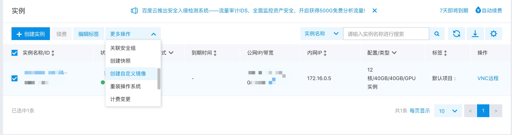
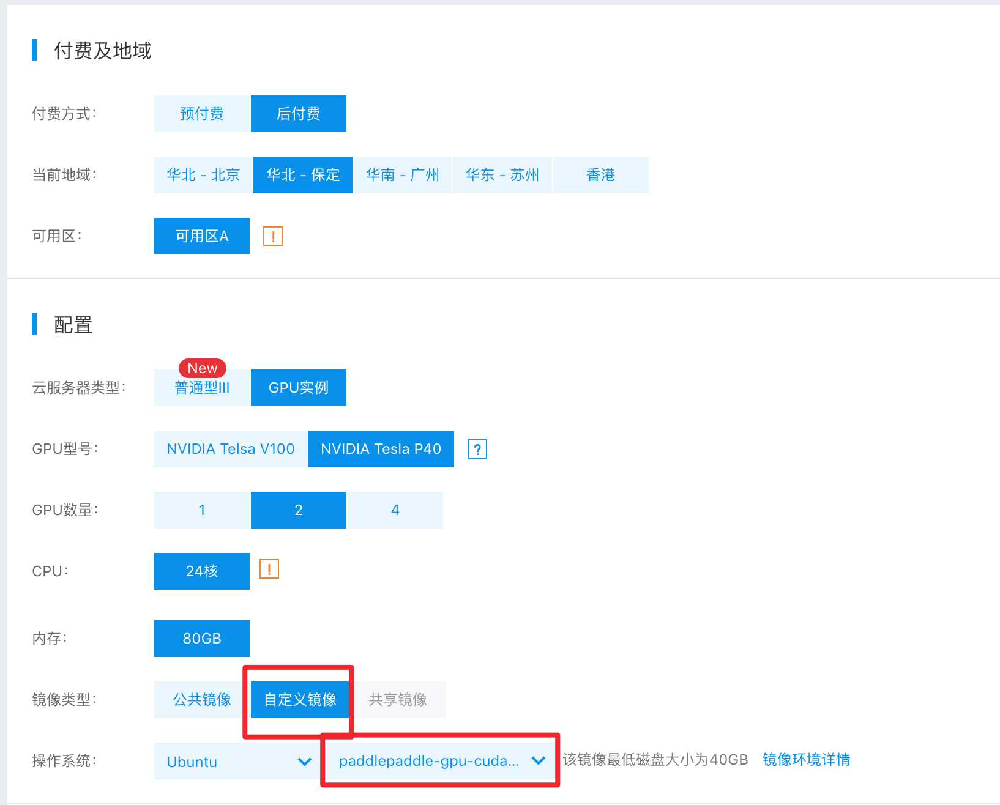
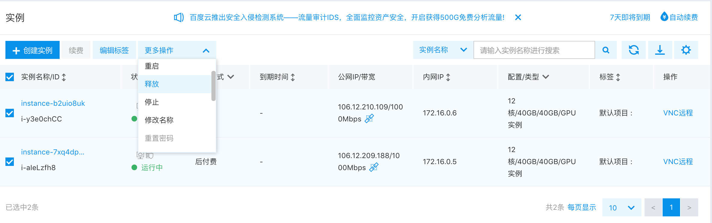

.. _train_on_baidu_cloud_en:

Distributed Training on Baidu Cloud
=====================================

PaddlePaddle Fluid distributed training allows you to start distributed training without relying on cluster systems (such as MPI, Kubernetes).
This chapter will use `Baidu Cloud <https://cloud.baidu.com/>`_ as an example to show you how to perform large-scale distributed tasks in a cloud environment or even a cloud GPU environment.

Create a cluster template
---------------------------

Log in to Baidu Cloud Console, select BCC Service, and click "Create Instance". Select the region, and note that only some regions have GPU servers available.
After selecting an appropriate region, select the corresponding model and create an empty server, as shown below:

.. image:: src/create_gpu_machine.png

* In the operating system options, you can select the corresponding version according to your needs. Note that the CUDA version is selected based on the actual situation. Here we choose CUDA-9.2.
* In the example, the payment method is selected as post-paid, which means that as the machine is released, the charge will stop correspondingly, which is more cost-effective for running a one-time task.

After the machine is created successfully, execute the following command to install the paddlepaddle GPU version and related dependencies.

.. code-block:: bash

  apt-get update && apt-get install -y python python-pip python-opencv
  # Note: Baidu cloud cuda-9.2 image does not have cudnn and nccl2 installed by default. It needs to be installed manually. If you intend to install it by yourself, you need to download it from the official website.
  wget -q "http://paddle-train-on-cloud.cdn.bcebos.com/libcudnn7_7.2.1.38-1+cuda9.2_amd64.deb"
  wget -q "http://paddle-train-on-cloud.cdn.bcebos.com/nccl_2.2.13-1+cuda9.0_x86_64.txz"
  dpkg -i libcudnn7_7.2.1.38-1+cuda9.2_amd64.deb
  ln -s /usr/lib/x86_64-linux-gnu/libcudnn.so.7 /usr/lib/libcudnn.so
  unxz nccl_2.2.13-1+cuda9.0_x86_64.txz
  tar xf nccl_2.2.13-1+cuda9.0_x86_64.tar
  cp -r nccl_2.2.13-1+cuda9.0_x86_64/lib/* /usr/lib
  # Note: You can choose whether to use the following pip image to speed up the download.(for users within China)
  pip install -i https://pypi.tuna.tsinghua.edu.cn/simple matplotlib==2.2.3
  pip install -i https://pypi.tuna.tsinghua.edu.cn/simple paddlepaddle-gpu==0.15.0.post97

After the installation is completed, use the following test program to test whether the current machine can run the GPU training program correctly. If an error is encountered, please fix the running environment problem according to the error message. In order to facilitate the startup of the GPU cluster, after the test program is successfully executed, select the current server and select "Create Customized Image" . You can select the configured image when you create the GPU cluster later.

* test program:

.. code-block:: python

  from __future__ import print_function

  import paddle.fluid.core as core
  import math
  import os
  import sys

  import numpy

  import paddle
  import paddle.fluid as fluid

  BATCH_SIZE = 64
  PASS_NUM = 1

  def loss_net(hidden, label):
      Prediction = fluid.layers.fc(input=hidden, size=10, act='softmax')
      Loss = fluid.layers.cross_entropy(input=prediction, label=label)
      Avg_loss = fluid.layers.mean(loss)
      Acc = fluid.layers.accuracy(input=prediction, label=label)
      Return prediction, avg_loss, acc

  def conv_net(img, label):
      conv_pool_1 = fluid.nets.simple_img_conv_pool(
          input=img,
          filter_size=5,
          num_filters=20,
          pool_size=2,
          pool_stride=2,
          act="relu")
      conv_pool_1 = fluid.layers.batch_norm(conv_pool_1)
      conv_pool_2 = fluid.nets.simple_img_conv_pool(
          input=conv_pool_1,
          filter_size=5,
          num_filters=50,
          pool_size=2,
          pool_stride=2,
          act="relu")
      return loss_net(conv_pool_2, label)

  def train(use_cuda):
      if use_cuda and not fluid.core.is_compiled_with_cuda():
          return
      img = fluid.layers.data(name='img', shape=[1, 28, 28], dtype='float32')
      label = fluid.layers.data(name='label', shape=[1], dtype='int64')
      prediction, avg_loss, acc = conv_net(img, label)

      test_program = fluid.default_main_program().clone(for_test=True)

      optimizer = fluid.optimizer.Adam(learning_rate=0.001)
      optimizer.minimize(avg_loss)

      place = fluid.CUDAPlace(0) if use_cuda else fluid.CPUPlace()
      exe = fluid.Executor(place)

      train_reader = paddle.batch(
          paddle.reader.shuffle(
              paddle.dataset.mnist.train(), buf_size=500),
          batch_size=BATCH_SIZE)
      test_reader = paddle.batch(
          paddle.dataset.mnist.test(), batch_size=BATCH_SIZE)
      feeder = fluid.DataFeeder(feed_list=[img, label], place=place)

      exe.run(fluid.default_startup_program())

      for pass_id in range(PASS_NUM):
          for batch_id, data in enumerate(train_reader()):
              acc_np, avg_loss_np = exe.run(fluid.default_main_program(),
                                            feed=feeder.feed(data),
                                            fetch_list=[acc, avg_loss])
              if (batch_id + 1) % 10 == 0:
                  print(
                       'PassID {0:1}, BatchID {1:04}, Loss {2:2.2}, Acc {3:2.2}'.
                      format(pass_id, batch_id + 1,
                              float(avg_loss_np.mean()), float(acc_np.mean())))

  if __name__ == '__main__':
      train(True)

Create a cluster
------------------

After creating the image, you can use this configured image to create a GPU cluster and create a sufficient number of GPU servers according to your actual needs.As an example, here are two GPU servers started, including the one created in the previous step, and a new server here.

Click "Create Instance" to select GPU servers with the same settings in the same region. Especially, the image you just created should be selected as the operating system.

Write cluster task startup scripts
------------------------------------

In order to facilitate the launch of distributed training tasks on more GPU servers, we will use
`fabric <http://www.fabfile.org/>`_
as a cluster task launch management tool. You can choose other familiar cluster frameworks, such as MPI, Kubernetes. 

The methods demonstrated in this example are only proposed for simple cluster environments, and servers can log in to each other through SSH.

To install the fabric, you need to execute:

.. code-block:: bash

  pip install fabric

Suppose we have created two GPU servers, the ip addresses of them are :code:`172.16.0.5, 172.16.0.6` . On the first server,
create the training program file :code:`dist_train_demo.py`, from
`here <https://raw.githubusercontent.com/PaddlePaddle/FluidDoc/develop/doc/fluid/user_guides/howto/training/src/dist_train_demo.py>`_
to download the code. Then write the :code:`fabfile.py` script to control the parameter servers and trainers that start the training task on different servers:

.. code-block:: python

  from fabric import Group, task

  endpoints = "172.16.0.5:6173,172.16.0.6:6173"
  port = "6173"
  pservers = 2
  trainers = 2

  hosts = []
  eps = []
  for ep in endpoints.split(","):
      eps.append(ep)
      hosts.append(ep.split(":")[0])

  def start_server(c):
      current_endpoint = "%s:%s" % (c.host, port)
      trainer_id = hosts.index(c.host)
      cmd = "python /root/work/dist_train_demo.py pserver %s %s %d %d &> /root/work/server.log.%s &" % (
          endpoints, current_endpoint, trainer_id, trainers, c.host)
      c.run(cmd)

  def start_trainer(c):
      current_endpoint = "%s:%s" % (c.host, port)
      trainer_id = hosts.index(c.host)
      cmd = "python /root/work/dist_train_demo.py trainer %s %s %d %d &> /root/work/trainer.log.%s &" % (
          endpoints, current_endpoint, trainer_id, trainers, c.host)
      c.run(cmd)

  @task
  def start(c):
      c.connect_kwargs.password = "work@paddle123"
      c.run("mkdir -p /root/work")
      c.put("dist_train_demo.py", "/root/work")
      start_server(c)
      start_trainer(c)

  @task
  def tail_log(c):
      c.connect_kwargs.password = "work@paddle123"
      c.run("tail /root/work/trainer.log.%s" % c.host)

Save the above code to :code:`fabfile.py` and execute

.. code-block:: bash

  fab -H 172.16.0.5,172.16.0.6 start

Right now, you can start a distributed training task. This task will start training on two GPU servers by starting two pserver processes and two trainer processes respectively.

Get distributed training results
---------------------------------

The example task will be logged under :code:`/root/work`, respectively
:code:`pserver.log.[IP]` and :code:`trainer.log.[IP]` can be manually
view the results of these log files on the server. You can also use the fabric to obtain log information of all nodes, for example:

.. code-block:: bash

  fab -H 172.16.0.5,172.16.0.6 tail-log

Terminate the cluster
------------------------

After the task is executed, don't forget to release the GPU cluster resources. To do this, firstly select the servers you want to release, and then select "Release" to shut down the machine and release the resources.
If you need to perform a new task, you can use the previously saved image directly, start a new cluster, and start the training by following the previous steps.

