ELASTIC CTR
===================

——Distributed Training on Baidu Cloud CTR estimated task and Serving workflow deployment in one click


* [1. Overview](#head1)
* [2. Preconditions](#head2)
* [3. Distributed Training+ Serving program deployment in one click](#head3)
* [4. Check the Result](#head4)
* [5. Custom Development Guidelines](#head5)


## <span id='head_1'>1. Overview</span>

This project aims to provide end to end CTR training and redevelopment. Main features include:

- Entire program is deployed in k8s environment within one click. The process is fast to be built and tested. 
- Large Scale Distribution high-speed training based on the Paddle transpiler model
- Auto Scaling of the training resources
- Industrial level Sparse Feature Serving components, under High Concurrency Condition, qps is 13 times those of redis. \[[注1](#annotation_1)\]

The program chart is shown below:

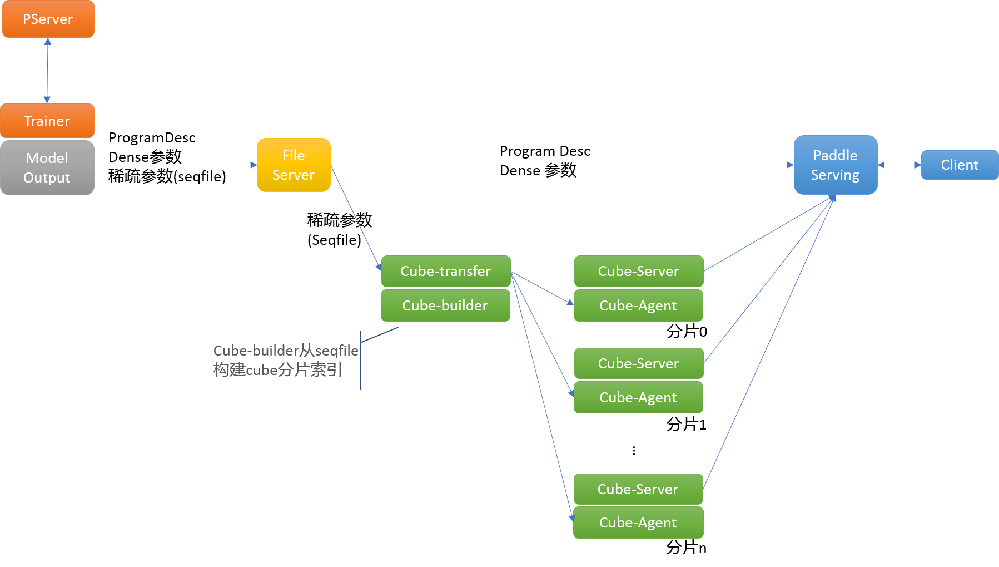

In the chart：

- trainer/pserver: The training use PaddlePaddle parameter server mode, with respect to the role of trainer and pserver. Distributed training use [volcano](https://volcano.sh/) for batch production management tools.
- file server: Training produces modelling document, hosted on File Server, for the downstream module to download. The documents training produces include: ProgramDesc and model parameters, the largest in the model parameter is transformed from tools to seqfile format.
- cube-transfer: In charge of monitoring the hadoop sequence file produced by the up-stream training assignment, save locally, and use cube-builder to build cube dictionary documents; Inform cube-agent nodes to pull out the latest dictionary documents and maintain consistency on each cube-server.
- cube-builder: In charge of transferring the model documents (in hadoop sequence file mode) to dictionary documents that can be loaded by cube-server. Dictionary documents have certain data structure, and are highly optimized the visits contingent upon the size and RAM
- Cube-Server: Provide shards key values read and write ability’s service nodes
- Cube-agent: Deploy on the same machine with cube-server, receive the dictionary documents renew command under cube-transfer, pull the data to local storage, inform the cube-server to update
- Paddle Serving: Load CTR task inference model ProgramDesc and dense parameter, provide inference service.
- Client: CTR Inference demo client end

The above components are connected to conduct the whole process from training to estimation deployment. The one-click deployment script [paddle-suite.sh](https://github.com/PaddlePaddle/Serving/blob/master/doc/resource/paddle-suite.sh) provided by this document can conduct the deployment of the above components with one click. 

Users can refer to this deployment program to apply the PaddlePaddle Distribution training and Serving applications to business environment and can also add or improve functions on the basis of this program to use directly. Specially speaking:

-   Assign the way the datasets feed, and feed different datasets and dataset formats; respectively modify Serving codes to adapt to the new model
-   Assign the training scale, including the number of parameter servers and the training nodes
-   Assign the number of Cube parameter server Sharding and replica

Detailed explanations on how to execute the above custom development can be found in Chapter 5 

Summary of the content:

** Chapter 2 Preconditions ** Guide the users to start from 0 Apply for CCE group on Baidu Cloud, and install [volcano](https://volcano.sh/) tools. This program requires using volcano for training batch tasks management tools, currently meet the testing requirement on Baidu Cloud

** Chapter 3 Distributed training + serving program installment ** Use paddle-suite.sh, deploy distributed training and serving entire process with one click. Explain in details every step of the work and its meaning in the footnote script.

** Chapter 4 Check the result ** Produce output according to each pod, check the installation status with one click.

** Chapter 5 Custom Development ** Propose the parts that can be improved in a customized manner with one click; provide the detailed location for modification

## <span id='head2'>2. Preconditions</span>

Before running this program, users must build the k8s group, and install the components of volcano. The k8s environment installment is quite complicated. This issue won’t be addressed in the book. Baidu Cloud CCE container engine can be used after application, just taking building k8s on Baidu Cloud as an example. 

### 2.1	Build the k8s cluster

Please refer to 
[百度智能云CCE容器引擎帮助文档-创建集群](https://cloud.baidu.com/doc/CCE/GettingStarted/24.5C.E5.88.9B.E5.BB.BA.E9.9B.86.E7.BE.A4.html#.E6.93.8D.E4.BD.9C.E6.AD.A5.E9.AA.A4)，Build a computer cluster on Baidu Cloud, node settlement needs to meet the following requirement:

- CPU Cores \> 4

Apply for container engines example: 


After the establishment，you can refer to [百度智能云CCE容器引擎帮助文档-查看集群](https://cloud.baidu.com/doc/CCE/GettingStarted.html#.E6.9F.A5.E7.9C.8B.E9.9B.86.E7.BE.A4)，to check the computer cluster information that you just apply for.

### 2.2 How to operate the computer cluster

Computer clusters can be conducted using Baidu Cloud Web or the kubectl tools. Kubectl tools are highly recommended. 

In terms of Baidu Cloud k8s computer clusters, client end kubectl needs to match with kubernetes on Baidu Cloud. Please refer to [百度智能云CCE容器引擎帮助文档-kubectl管理配置](https://cloud.baidu.com/doc/CCE/Developer-GettingStarted.html#.84.1C.DF.97.63.35.64.3B.1A.6E.7D.B1.E4.5B.E3.66)to check the current kubernetes version in use. You can also refer to kubernetes official document to download and install the respective kubernetes version. 

\* Attention: This steps given by this guideline are for linux operating system.

- First, refer to the [official installation guidelines](https://kubernetes.io/docs/tasks/tools/install-kubectl/) , install the kubectl with repect to the version in Baidu Cloud kubernetes.

- Configure kubectl, download computer cluster kubernetes certificate. Download computer cluster configuration documents in the configuration UI, put it in the kubectl tacitly approved route (Please check if the kube category exists, if not please establish one)

```bash
$ mv kubectl.conf  ~/.kube/config
```

-  After the configuration, you can use kubectl to visit the Kubernetes computer cluster from local computer

```bash
$ kubectl get node
```

- About the other information of kubectl, please refer to the[Overview of kubectl](https://kubernetes.io/docs/reference/kubectl/overview/)。

### 2.3 Setting Access Authentication

Setting up a distributed training requires mutual access authority between pods, please do

```bash
$ kubectl create rolebinding default-view --clusterrole=view --serviceaccount=default:default --namespace=default
```

Attention: --namespace should be the namespace used in this cluster

## 2.4 Install Volcano

we use volcano as the batch task manage tool during training period. Refer to official documentation about [volcano](https://volcano.sh/).

Execute the following command to install volcano in K8S cluster.

```bash
$ kubectl apply -f https://raw.githubusercontent.com/volcano-sh/volcano/master/installer/volcano-development.yaml
```

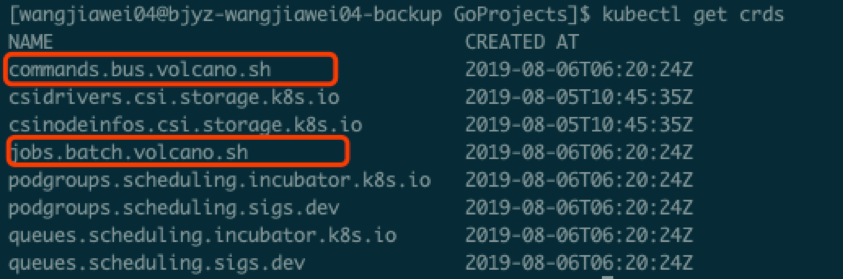


## 3. <span id='head3'>Distributed Training+ Serving program deployment in one click</span>

### 3.1 Download deployment solution script file

Please download all [scripts](https://github.com/PaddlePaddle/Serving/tree/master/doc/resource) required.

### 3.2 Deployment in one click

Run the following script, deploy all applications by one-click.

```bash
$ bash paddle-suite.sh
```

Please refer to **Chapter 3.3-3.8**to check if every stop is current. And in **Chapter 4** verify the training process and inference results.

**[Attention！！！]**：以下**The content between Chapter 3.3 - 3.8 are all included in one-click deployment script, no need to carry out manually**. But to make it easier to comprehend, the details and principles are given in the following.

### 3.3 Pick one node for output model

```bash
$ kubectl label nodes $NODE_NAME nodeType=model
```

The meaning of this command is to mark this node. After that, the file service and model output are forcibly allocated on this node. Replace the string of NAME with \$NODE\_NAME.

### 3.4 Start File Server

```bash
$ kubectl apply -f fileserver.yaml
```

Run the file server startup script kubectl apply -f ftp.yaml to start the file server

Verification: Use the `kubectl get pod` command to see if the file-server pod is running, and use the kubectl get service command to see if the file-server service exists:

```bash
$ kubectl get pod
```
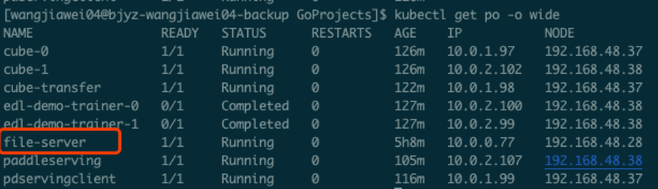

```
$ kubectl get service
```

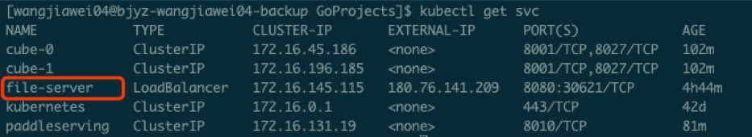


### 3.5 Run Cube Sparse Param Servers

```bash
$ kubectl apply -f cube.yaml
```

Verification: Use the `kubectl get service` command to see if two services, cube-0 and cube-1, exist, then the cube server / agent is successfully started.

```
$ kubectl get service
```

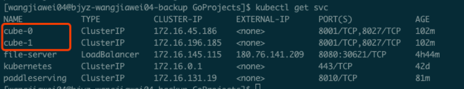

**Tips**：Shard num can be modified by the size of sparse dictionary, refer to Chapter 5.3

### 3.6 Run Paddle Serving

```bash
$ kubectl apply -f paddleserving.yaml
```

Verification: Check whether the serving pod is running through `kubectl get pod`; check whether the paddleserving service exists through kubectl get service:

```bash
$ kubectl get pod
```
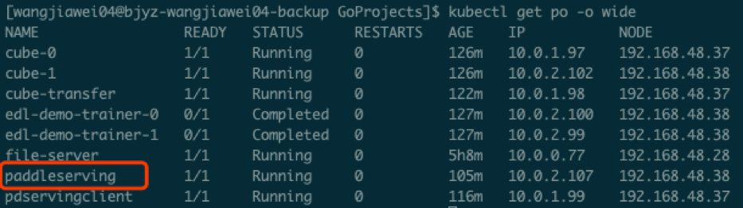

```bash
$ kubectl get service
```
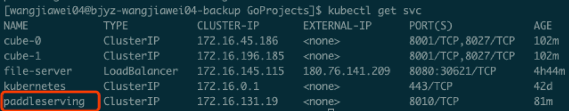

### 3.7 Start Cube Param Server Transfer 

```bash
$ kubectl apply -f transfer.yaml
```

Verification: Check whether the cube-transfer pod is running through `kubectl get pod`

```bash
$ kubectl get pod
```

This cube-transfer tool will pull the trained model from the edl-demo-trainer-0 to be introduced below to the local through the file-server service. After the cube-builder does the format conversion, it will be distributed to each cube- The server, the ultimate purpose is to query PaddleServing for sparse parameters.

**Before the training task ends, cube-transfer will wait for the upstream data output. Until the generation of the upstream model file is detected, distribution is started. You can observe the working status of cube-transfer through the logs: **

```
$ kubectl logs cube-transfer
```

If the word "wait 5min" appears last, it means that the last round of the model has been successfully delivered, and then you can do the final PaddleServing test.

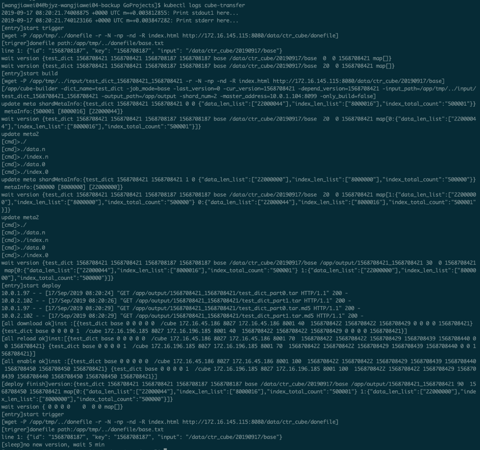


### 3.8 Start Paddle CTR Distributed Training

```bash
$ kubectl apply -f ctr.yaml
```
Verification: use `kubectl get pod` to check whether the pod such as edl-demo-trainer-0 / edl-demo-trainer-1, edl-demo-pserver-0 / edl-demo-pserver-1 / edl-demo-pserver-2, edl-demo-model-out-trainer-0 is running

```bash
$ kubectl get pod
```

We can check the progress of training through `kubectl logs edl-demo-trainer-0`. If pass is always 0, we will continue to wait. Generally, it takes about 3-5 minutes to complete the first pass. At this time, we will generate an inference\_model.

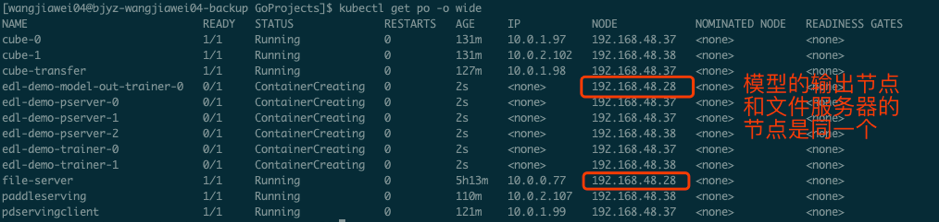

## 4. <span id='head4'>Check the Result<span>

### 4.1 View training log

CCE, a Baidu cloud container engine, provides a web console for easy viewing of the running status of pod.

This training task will start three pserver nodes and three trainer nodes.

You can check the running status of tasks by checking the logs of pserver and trainer. Example trainer log:

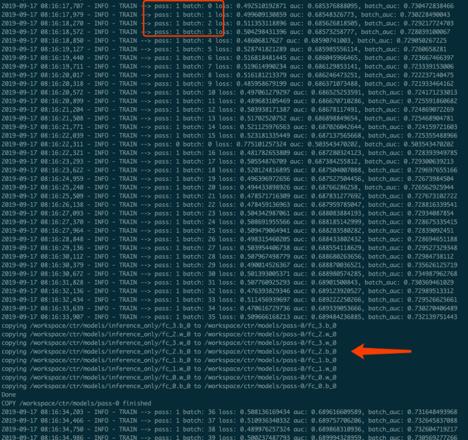

Example Pserver log：

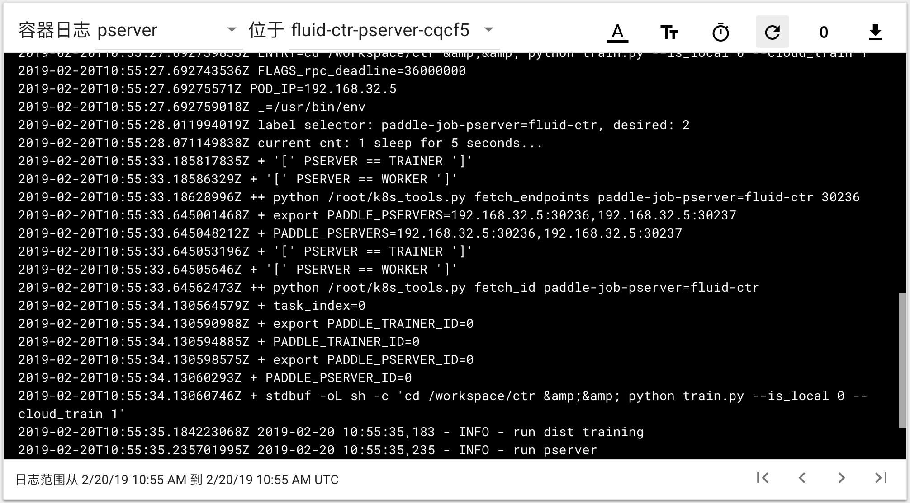

### 4.2 Verify Paddle Serving prediction results 

Run

```bash
$ kubectl apply -f paddleclient.yaml
```

Enter the container with the following command, start the CTR inference client in the directory /client/ctr\_prediction, and view the prediction result through the log

```bash
# Enter container
$ kubectl exec -ti pdservingclient /bin/bash

# execute this command in container
$ bin/ctr_prediction
```

If it runs normally, it will exit after a period of time, and you can see a log similar to this in the last few lines of log/ctr\_prediction.INFO

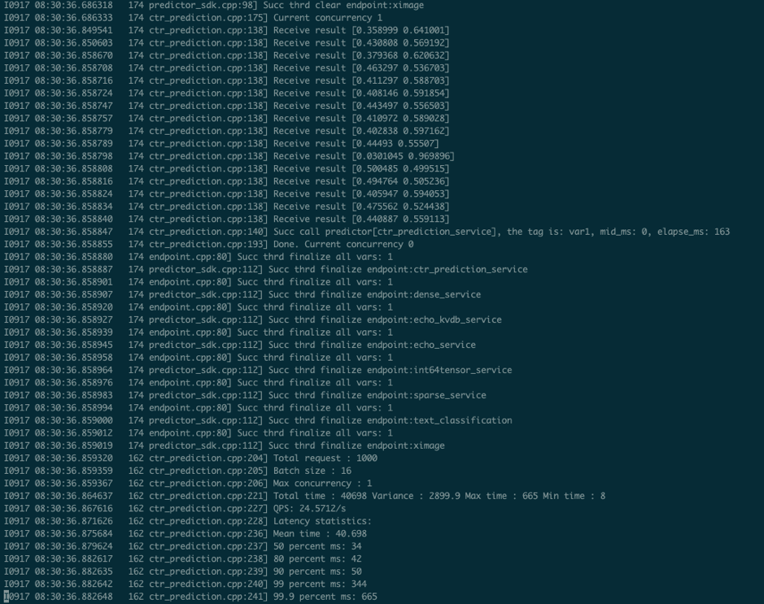

## 5. <span id='head5'>Custom Development Guidelines</span>

### 5.1 Specifying how to read datasets

The input of existing data is downloaded from the /workspace/ctr/data/download.sh directory in the edldemo image. After downloading, it will be decompressed in the /workspace/ctr/data/raw folder, which contains train.txt and test.txt. Each line of all data is separated by 40 attributes by spaces.

Then read the data set in train.py

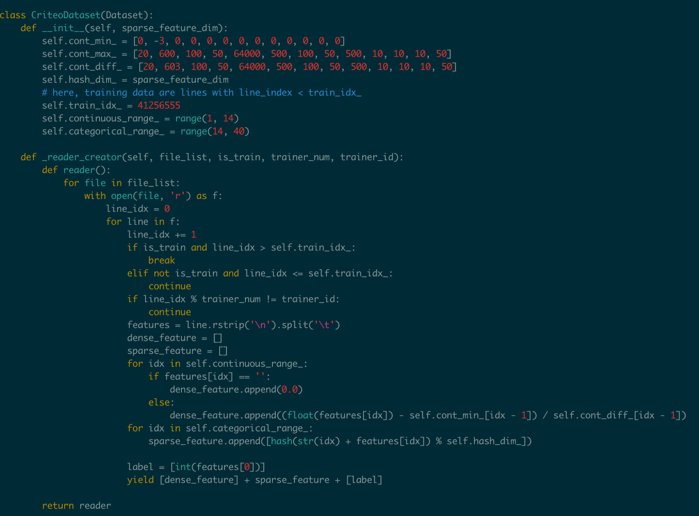

This contains both continuous and discrete data. The continuous data is index [1,14), the categorical data is index [14, 40), and the label is index 0, corresponding to the last yield [dense\_feature] + sparse\_feature + [label]. When the categorical data and continuous data have different formats and samples, users need to specify here, and the continuous data can be normalized by referring to the writing of the samples in the \_\_init\_\_ function.

For the source of the data, the article gives download.sh to download the dataset from the Criteo official, and then extract it and place it in the raw folder.

You can use HDFS / AFS or other methods to distribute the data set, and add related commands to the startup item.

After making changes, remember to save the relevant docker image and push it to the image repository.

```bash
$ docker commit ${DOCKER_CONTAINER_NAME} ${DOCKER_IMAGE_NAME}
$ docker push  ${DOCKER_IMAGE_NAME}
```

Can also be modified in the Dockerfile

```bash
$ docker build -t ${DOCKER_IMAGE_NAME} .
$ docker push  ${DOCKER_IMAGE_NAME}
```

It is recommended to use the image repository provided by Baidu Cloud. Here is the description document [推送镜像到镜像仓库](https://cloud.baidu.com/doc/CCE/s/Yjxppt74z/#%E6%8E%A8%E9%80%81%E9%95%9C%E5%83%8F%E5%88%B0%E9%95%9C%E5%83%8F%E4%BB%93%E5%BA%93)

### 5.2 Specify training scale

the ctr.yaml file, we will find that this is a job defined under the framework of volcano. In the job, we gave many definitions of Pserver and Trainer, and in the overall job, we also gave the definition of MinAvailable quantity. Pserver and Trainer have their own Replicas. The environment variables include the number of PSERVER\_NUM and TRAINER\_MODEL and TRAINER_NUM. Usually MinAvailable = PServer Num + Trainer Num, so we can start the corresponding service.

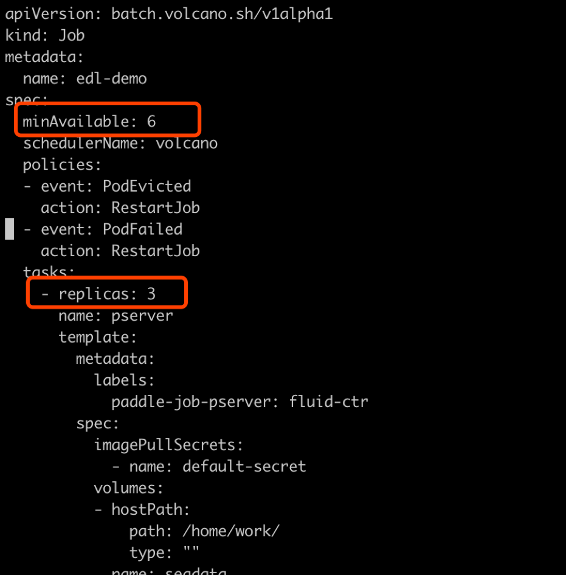

As shown above, we need to set a reasonable number at min\_available. For example, a POD occupies a CPU, then we must have an estimate of the total number of CPUs in the cluster. Otherwise, Volcano's Gang-Schedule mechanism cannot be met, and resources cannot be allocated, and the situation is always Pending. Then in the second red box is

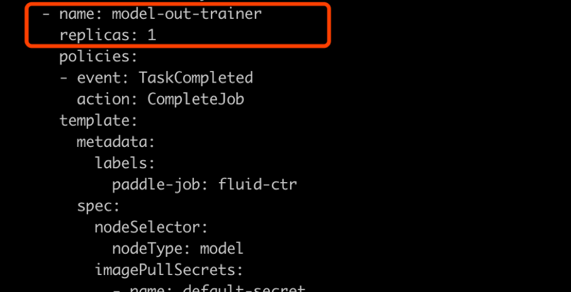

As shown in the figure above, this part is used to specifically output the model. Here we don't need to make any changes, just keep a copy.

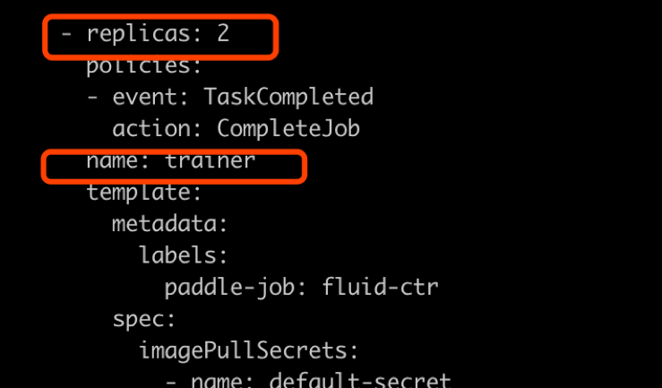

如上图所示

### 5.3 指定cube参数服务器的分片数量和副本数量

In the cube.yaml file, we can see the definition of each cube node, there is a `cubeserver pod` and `cube serverservice`. If we need to increase the number of cube copies and shards, we only need to copy the relevant definitions and environment variables in the yaml file.

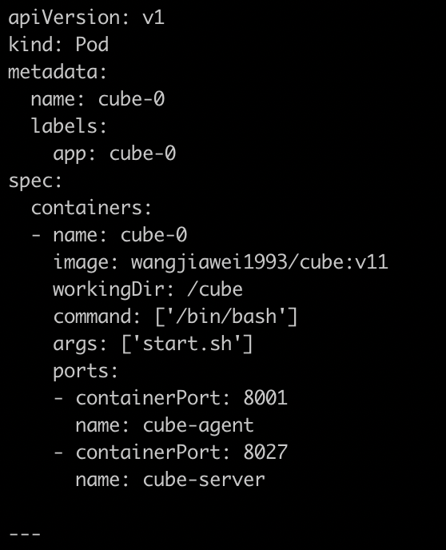

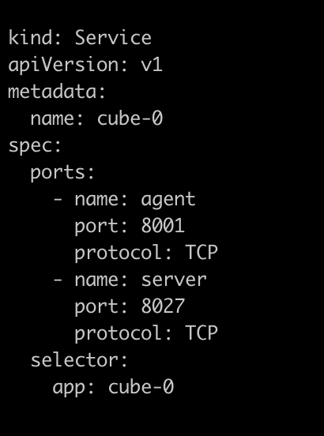

The above two images, one is the definition of cube POD, and the other is the definition of cubeSERVICE. If you need to expand the number of cube shards, you can copy the definitions of POD and SERVICE and rename them. The example program gives 2 shards. After copying, the third one can be named cube-2.

### 5.4 Serving adapts to the new model

In this example, if we modified the feed data format of the CTR model training script according to the method in Chapter 5.1, we need to modify the serving code accordingly to accommodate the new feed sample field number and data type.

The prediction service and client code of Paddle Serving in this deployment scheme are:

Server: https://github.com/PaddlePaddle/Serving/blob/develop/demo-serving/op/ctr_prediction_op.cpp

Client：https://github.com/PaddlePaddle/Serving/blob/develop/demo-client/src/ctr_prediction.cpp

Users can modify it on this basis.

For the complete development mode of Paddle Serving, please refer to the Paddle Serving documentation[Paddle Serving Documentation](https://github.com/PaddlePaddle/Serving/tree/develop/doc)

## Notes

## Note 1. <span id='annotation_1'>Cube and Redis performance comparison </span>

Cube and Redis are deployed on the Baidu Cloud. During the test, only the performance of a single cube server and single redis server is tested.

The client and server are located on two independent cloud hosts, and the ping delay between machines is 0.3ms-0.5ms.

Machine configuration: Intel (R) Xeon (R) Gold 6148 CPU @ 2.40GHz 32 core


### Cube test environment

Test key 64bit integer, value is 10 floats (40 bytes)

First deploy it using the one-click deployment script of this solution.

Use the Cube Client SDK of Paddle Serving to write test code

The basic principle is to start k threads, each thread accesses the cube server M times, and each time obtains N keys in batches, the total time is added and averaged.


Concurrency （Threads Num） | batch size | Average Response Time (us) | Total QPS
-------|------------|-------------|---------------------------
1	| 1000 | 1312 | 762
4	| 1000 | 1496 | 2674
8	| 1000 | 1585 | 5047
16 | 1000 | 1866 | 8574
24 | 1000 | 2236 | 10733
32 | 1000 | 2602 | 12298

### Redis test environment

Test a random integer between key 1-1000000, and the value is a 40-byte string

Redis-server (latest stable 5.0.6) deployed on the server side

The client is the client get_values.cpp based on 
[redisplusplus](https://github.com/sewenew/redis-plus-plus), and the client here [get_values.cpp](https://github.com/PaddlePaddle/Serving/blob/master/doc/resource/get_value.cpp)

Principle: start k threads, each thread accesses the redis server M times, and each time obtains N keys in batches using mget. The total time is summed and averaged.

Run the command：

```bash
$ ./get_values -h 192.168.1.1 -t 3 -r 10000 -b 1000
```

In the commnad:
\-h server hostname
\-t concurrent thread num
\-r request times per thread
\-b number of keys per mget request

Concurrency （Threads Num） | batch size | Average Response Time (us) | Total QPS
-------|------------|-------------|---------------------------
1  | 1000 | 1643 | 608
4  | 1000 | 4878  | 819
8  | 1000 | 9870  | 810
16 | 1000 | 22177  | 721
24 | 1000 | 30620  | 783 
32 | 1000 | 37668 | 849


### RocksDB test environment 

Test a random integer between key 1-1000000, and the value is a 40-byte string

Principle：start K threads，visit RocksDB M times by calling mget() per thread，fetching N keys per mget request. The total time is summed and averaged.

Concurrency （Threads Num） | batch size | Average Response Time (us) | Total QPS
-------|------------|-------------|---------------------------
1  | 1000 | 11345 | 88
4  | 1000 | 11210 | 357
8  | 1000 | 11475 | 697
16 | 1000 | 12822  | 1248
24 | 1000 | 14220  | 1688 
32 | 1000 | 17256 | 1854


### Test Conclusion

Due to Redis' efficient time-driven model and in-memory operation, the average response time of redis is almost the same as that of the cube when single concurrency (1643us vs. 1312us)

In terms of scalability, redis is subject to the single-threaded model. As the number of concurrent thread increases, the response time increase a lot, and the total throughput does not increase around 1000qps. The cube, as the number of concurrent pressure tests increases, the total qps continues to increase. It shows that the cube can handle concurrent requests well and has good scalability.

RocksDB has slower average response time and qps than Redis when the number of threads is small, but in tests with 16 and more threads, RocksDB provides faster response time and larger qps.
 

