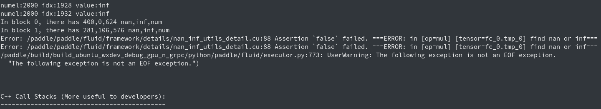
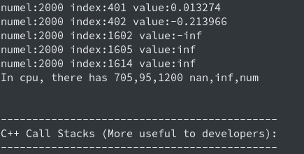
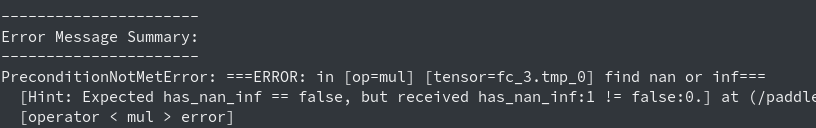

# check nan inf工具

check nan inf工具用于检查Operator的结果是否含有nan(not a number，非有效数)或inf(infinite，无穷大数)。支持float32、double、float16三类浮点型，整型由于不存在nan、inf不作检查。

## <span id="use">使用</span>

#### 1. 使用方法
设置环境变量为FLAGS_check_nan_inf为True或者1即可。
```
export FLAGS_check_nan_inf=1   # 或者=True
```

#### 2. 进阶使用
添加上述环境变量后，可以通过设置环境变量跳过op、op类型及op变量的检查。设置的格式如下：
```
PADDLE_INF_NAN_SKIP_OP="op0,op1,op2"
PADDLE_INF_NAN_SKIP_ROLE="role1,role2,role3"
PADDLE_INF_NAN_SKIP_VAR="op0:var0,op0:var1,op1:var0"
```
其中上面三个环境变量分别表示跳过op、op类型和op里变量的检查。
##### 2.1 跳过op检查
如下设置中前一个只跳过mul op的nan inf检查，后一个设置则跳过mul、softmax_with_cross_entropy这两个op的检查。
`注意`：op跳过只接受精准匹配，要跳过softmax_with_cross_entropy的检查，不能设置环境变量为softmax_with或者with_cross进行模糊匹配，必须设置softmax_with_cross_entropy全名。
```
export PADDLE_INF_NAN_SKIP_OP="mul"
export PADDLE_INF_NAN_SKIP_OP="mul,softmax_with_cross_entropy"
```
##### 2.2 跳过op类型检查
目前接受的类型有: forward、backward、optimize、rpc、dist、lrsched、loss、default。正常fp32训练中，不需要跳过op类型进行nan inf检查。但在`fp16`中，在反向过程出现inf会对其进行修正，所以一般需要跳过backward的检查，这也是添加该功能的缘由。
如下设置中前一个只跳过backward的检查，后一个设置跳过backward、optimize两种类型的检查。同上，op类型跳过也只支持精准匹配。
```
export PADDLE_INF_NAN_SKIP_ROLE="backward"
export PADDLE_INF_NAN_SKIP_ROLE="backward,optimize"
```
##### 2.3 跳过指定op中变量的检查
如下设置中前一个跳过mul op中fc_0.tmp_0变量，后一个设置则跳过mul op中fc_0.tmp_0和fc_0.tmp_1变量及 dropout op的new_relative变量。
```
export PADDLE_INF_NAN_SKIP_VAR="mul:fc_0.tmp_0"
export PADDLE_INF_NAN_SKIP_VAR="mul:fc_0.tmp_0,mul:fc_0.tmp_1,dropout:new_relative"
```
`注意`：指定op变量检查中，对于op只接受精准匹配，对于变量则为模糊匹配，如上述的mlu op中的fc_0.tmp_0和fc_0.tmp_1变量可用c_0.tmp进行匹配。

## <span id="test">试用</span>
可以使用单测中的[check_nan_inf_base.py](https://github.com/PaddlePaddle/Paddle/blob/develop/python/paddle/fluid/tests/unittests/check_nan_inf_base.py)文件进行试用。该脚本已设置FLAGS_check_nan_inf=1打开check nan inf功能。直接python check_nan_inf_base.py执行即可。
#### 1. GPU日志信息
其中GPU的check nan信息由于在GPU中打印，所以nan inf信息会出现在出错信息栈前面。工具中会打印出现inf、nan的op及tensor名称，每个block会打印nan、inf、num中的3个值，并打印各自block中nan、inf、num的数量。

#### 2. CPU日志信息
CPU中打印的nan、inf、num会在出错信息栈前面显示，同样打印了nan、inf、num中的三个值，并打印nan、inf、num的数量。check nan信息中op及tensor的名称会在最后显示。





## <span id="speed">速度</span>
测试环境：v100 32G单卡测试，Resnet50模型，imagenet数据集。`不同环境模型数据集下速度可能不同，以下速度仅供参考`
>不检查nan inf速度，每张卡307.7 images/s。
检查nan inf速度，每张卡250.2 images/s。

## <span id="principle">原理</span>
#### 1. 工具原理
对于浮点类型操作，正常数值num，无穷大inf，非数值nan有如下运行关系。更详细可查看[INF, NAN, and NULL](https://wiki.analytica.com/index.php?title=INF,_NAN,_and_NULL_-_Exception_values&title=INF,_NAN,_and_NULL_-_Exception_values)
```
nan - nan = nan, inf - inf = nan, num - num = 0,
nan + nan = nan, inf + inf = inf, nan + 0 = nan,
inf + 0 = inf, nan + inf = nan, 0 + 0 = 0
```
基于此使用如下操作仅需最后检查sum是否为nan或者inf就行了。
```
for(value:values): sum += (value-value)
```

***`注意`：本文档的进阶使用、速度、原理目前仅在develop版本的paddle生效，并将随1.7版本的paddle发布。
此前版本的check nan inf工具在GPU上不推荐使用，旧工具速度为0.25 images/s，测试会拖慢1000多倍的训练速度。***
