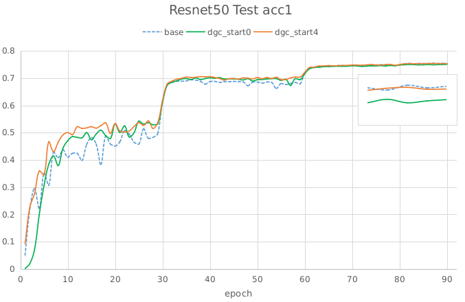

# 低配网络的分布式GPU训练

## 1. 背景
  大规模分布式训练需要较高的网络带宽以便进行梯度的聚合更新，这限制了多节点训练时的可扩展性同时也需要昂贵的高带宽设备。在低带宽云网络等环境下进行分布式训练会变得更加糟糕。现有[Deep Gradient Compression](https://arxiv.org/abs/1712.01887)研究表明，分布式SGD中有99.9%的梯度交换都是冗余的，可以使用深度梯度压缩选择重要梯度进行通信来减少通信量，降低对通信带宽的依赖。Paddle目前实现了DGC的稀疏通信方式，可有效在低配网络下进行GPU分布式训练。下面将介绍DGC稀疏通信方式的使用方法、适用场景及基本原理。

## 2. 使用方法
`注意：使用DGC请使用1.6.2及其之后版本，之前版本存在有若干bug。`
DGC稀疏通信算法以DGCMomentumOptimizer接口的形式提供，目前只支持GPU多卡及GPU多机分布式，由于现有fuse策略会造成DGC失效，所以使用DGC时需设置`strategy.fuse_all_reduce_ops=False`关闭fuse。DGC只支持Momentum优化器，使用时把当前代码中的Momentum优化器替换为DGCMomentumOptimizer，并添加DGC所需参数即可。如下代码所示，其中rampup_begin_step表示从第几步开始使用DGC，更详细参数可见[api文档](https://www.paddlepaddle.org.cn/documentation/docs/zh/api_cn/optimizer_cn/DGCMomentumOptimizer_cn.html#dgcmomentumoptimizer)。
``` python
import paddle.fluid as fluid
# optimizer = fluid.optimizer.Momentum(learning_rate=0.001, momentum=0.9)
# 替换Momentum优化器，添加DGC所需参数
optimizer = fluid.optimizer.DGCMomentumOptimizer(
    learning_rate=0.001, momentum=0.9, rampup_begin_step=0)
optimizer.minimize(cost)
```
在fleet中我们提供了[DGC的示例](https://github.com/PaddlePaddle/Fleet/tree/develop/examples/dgc_example)。示例中以数字手写体识别为例，将程序移植为分布式版本（注：DGC亦支持单机多卡），再加上DGC优化器。可参照此示例将单机单卡程序迁移到DGC。在单机单卡迁移到DGC过程中，一般需要先对齐多机Momentum的精度，再对齐DGC的精度。

## 3. 调参&适用场景
### 3.1 预热调参
对于正常的训练，使用DGC一般需进行预热训练，否则可能会有精度损失。如下图是ResNet50模型Imagenet数据集的训练结果，未进行预热训练的DGC最终损失了约0.3%的精度。
<div align=center>

</div>

预热训练调参可参照论文的设置。对图像分类，论文在Cifar10和ImageNet数据集上共164和90个epochs的训练中都采用了4个epochs的预热训练。在语言模型PTB数据集上，在共40个epochs的训练中选择了1个epoch进行预热训练。在语音识别AN4数据集上，80个epochs中选择1个epoch进行预热训练。
论文中使用了75%, 93.75%, 98.4375%, 99.6%, 99.9%稀疏度逐渐提升的策略。由于paddle稀疏梯度聚合通信使用了AllGather，通信量会随卡数增加而增长，所以在卡数较多时不推荐较低稀疏度的预热训练。如75%稀疏度时每张卡会选择25%的梯度进行通信，卡数为32时通信量是正常dense通信的32\*(1-0.75)=8倍，所以前几个epoch使用正常的dense通信为佳。可参照如下写法
``` python
# 1. 以1252个step为一个epoch，前2个epochs使用正常dense通信，后3个epochs逐步提升稀疏度为99.9%
optimizer = fluid.optimizer.DGCMomentumOptimizer(
    learning_rate=0.001, momentum=0.9, rampup_begin_step=1252*2,
    rampup_step=1252*3, sparsity=[0.984375, 0.996, 0.999])
# 2. 前面4个epochs都使用dense通信，之后默认0.999稀疏度运行
optimizer = fluid.optimizer.DGCMomentumOptimizer(
    learning_rate=0.001, momentum=0.9, rampup_begin_step=1252*4)
```
对于Fine-tuning训练，现测试可无需预热训练，从第0个epoch直接使用DGC即可。
``` python
# 从第0步开始DGC稀疏通信
optimizer = fluid.optimizer.DGCMomentumOptimizer(
    learning_rate=0.001, momentum=0.9, rampup_begin_step=0)
```
### 3.2 适用场景
DGC稀疏通信在低带宽通信瓶颈时会有较大的性能提升，但在单机多卡及RDMA网络通信并非瓶颈情况下，并不会带来性能上的提升。同时由于AllGather的通信量会随卡数的增多而增大，所以DGC的多机训练规模也不宜过大。故DGC适用于低配网络，同时节点规模不宜过大，如>128张卡。在云网络或高带宽网络设备昂贵时，DGC可有效降低训练成本。

## 4. 原理
本节原理部分基本来自[Deep Gradient Compression](https://arxiv.org/abs/1712.01887)论文，本文进行了部分理解翻译，英文较好者建议直接阅读论文。
### 4.1 梯度稀疏
DGC的基本思路是通过只传送重要梯度，即只发送大于给定阈值的梯度来减少通信带宽的使用。为避免信息的丢失，DGC会将剩余梯度在局部累加起来，最终这些梯度会累加大到足以传输。
换个角度，从理论依据上来看，局部梯度累加等同于随时间推移增加batch size，（DGC相当于每一个梯度有自己的batch size）。设定 $F(w)$ 为需要优化的loss函数，则有着N个训练节点的同步分布式SGD更新公式如下
$$
F(w)=\\frac{1}{\|\\chi\|}\\sum\_{x\\in\\chi}f(x, w), \\qquad w\_{t+1}=w\_{t}-\\eta\\frac{1}{N b}\\sum\_{k=0}^{N}\\sum\_{x\\in\\mathcal{B}\_{k,t}}\\nabla f\\left(x, w\_{t}\\right) \\tag{1}
$$
其中$\chi$是训练集，$w$是网络权值，$f(x, w)$是每个样本$x \in \chi$的loss，$\eta$是学习率，N是训练节点个数，$\mathcal{B}_{k, t}$代表第$k$个节点在第$t$个迭代时的minibatch，大小为b。
考虑权重的第i个值，在T次迭代后，可获得
$$
w\_{t+T}^{(i)}=w\_{t}^{(i)}-\\eta T \\cdot \\frac{1}{N b T} \\sum\_{k=1}^{N}\\left(\\sum\_{\\tau=0}^{T-1} \\sum\_{x \\in \\mathcal{B}\_{k, t+\\tau}} \\nabla^{(i)} f\\left(x, w\_{t+\\tau}\\right)\\right)  \\tag{2}
$$
等式2表明局部梯度累加可以被认为batch size从$Nb$增大为$NbT$，其中T是$w^{(i)}$两次更新的稀疏通信间隔。
### 4.2 局部梯度累加改进
正常情况，稀疏更新会严重影响收敛性。DGC中采用动量修正(Momentum Correction)和局部梯度裁减(local gradient clipping)来解决这个问题。
#### 4.2.1 动量修正
有着N个节点分布式训练中vanilla momentum SGD公式，
$$
u\_{t}=m u\_{t-1}+\\sum\_{k=1}^{N}\\left(\\nabla\_{k, t}\\right), \\quad w\_{t+1}=w\_{t}-\\eta u\_{t}  \\tag{3}
$$
其中$m$是动量因子，$N$是节点数，$\nabla_{k, t}=\frac{1}{N b} \sum_{x \in \mathcal{B}_{k, t}} \nabla f\left(x, w_{t}\right)$。
考虑第i个权重$w^{(i)}$，在T次迭代后，权重更新公式如下，
$$
w\_{t+T}^{(i)}=w\_{t}^{(i)}-\\eta\\left[\\cdots+\\left(\\sum\_{\\tau=0}^{T-2} m^{\\tau}\\right) \\nabla\_{k, t+1}^{(i)}+\\left(\\sum\_{\\tau=0}^{T-1} m^{\\tau}\\right) \\nabla\_{k, t}^{(i)}\\right]  \\tag{4}
$$
如果直接应用动量SGD到稀疏梯度更新中，则有公式，
$$
v_{k, t}=v_{k, t-1}+\\nabla_{k, t}, \\quad u_{t}=m u_{t-1}+\\sum_{k=1}^{N} \\operatorname{sparse}\\left(v_{k, t}\\right), \\quad w_{t+1}=w_{t}-\\eta u_{t} \\tag{5}
$$
其中$v_k$是训练节点k上的局部梯度累加项，一旦$v_k$大于某一阈值，则会在第二项中压缩梯度进行动量更新，并使用sparse()函数获得mask清空大于阈值的梯度。
$w^{(i)}$在T次稀疏更新后的权重为,
$$
w_{t+T}^{(i)}=w_{t}^{(i)}-\\eta\\left(\\cdots+\\nabla_{k, t+1}^{(i)}+\\nabla_{k, t}^{(i)}\\right) \\tag{6}
$$
相比传统动量SGD，方程6缺失了累积衰减因子$\sum_{\tau=0}^{T-1} m^{\tau}$，会导致收敛精度的损失。如下图A，正常梯度更新从A点到B点，但是方程6则从A点到C点。当稀疏度很高时，会显著降低模型性能，所以需要在方程5基础上对梯度进行修正。
<div align=center>


</div>
若将方程3中速度项$u_t$当作“梯度”，则方程3第二项可认为是在”梯度“$u_t$上应用传统SGD，前面已经证明了局部梯度累加在传统SGD上是有效的。因此，可以使用方程3局部累加速度项$u_t$而非累加真实的梯度$\nabla_{k, t}$来修正方程5，
$$
u_{k, t}=m u_{k, t-1}+\\nabla_{k, t}, \\quad v_{k, t}=v_{k, t-1}+u_{k, t}, \\quad w_{t+1}=w_{t}-\\eta \\sum_{k=1}^{N} \\operatorname{sparse}\\left(v_{k, t}\\right)  \\tag{7}
$$
修正后，如上图(b)，方程可正常从A点到B点。除了传统动量方程修正，论文还给出了Nesterov动量SGD的修正方程。
#### 4.2.2 局部梯度修剪
梯度修剪是防止梯度爆炸的常用方法。这方法由Pascanu等人在2013年提出，当梯度的l2-norms和大于给定阈值时，就对梯度rescale。正常梯度修剪在梯度聚合后使用，而DGC因为每个节点独立的进行局部梯度累加，所以DGC在使用$G_t$累加前对其进行局部梯度修剪。阈值缩放为原来的$N^{-1/2}$
$$
thr_{G^{k}}=N^{-1 / 2} \\cdot thr_{G}  \\tag{8}
$$
### 4.3 克服迟滞效应
因为推迟了较小梯度更新权重的时间，所以会有权重陈旧性问题。稀疏度为99.9%时大部分参数需600到1000步更新一次。迟滞效应会减缓收敛并降低模型精度。DGC中采用动量因子掩藏和预热训练来解决这问题。
#### 4.3.1 动量因子掩藏
DGC中使用下面方程来掩藏动量因子减缓陈旧性问题。
$$
Mask \\leftarrow\\left|v_{k, t}\\right|>t h r, \\quad v_{k, t} \\leftarrow v_{k, t} \\odot \\neg Mask, \\quad u_{k, t} \\leftarrow u_{k, t} \\odot \\neg Mask \\tag{9}
$$
此掩码可以停止延迟梯度产生的动量，防止陈旧梯度把权重引入错误的方向。

#### 4.3.2 预热训练
在训练初期，梯度变动剧烈，需要及时更新权重，此时迟滞效应影响会很大。为此DGC采用预热训练的方法，在预热期间使用更小的学习率来减缓网络的变化速度，并使用较小的稀疏度来减少需推迟更新的梯度数量。预热期间会线性增大学习率，指数型增加稀疏度到最终值。

### 4.4 正则化(Weight Decay)项修正
Paddle框架以Weight Decay的形式实现正则化。以L2Decay为例，公式(3)中传统momentum添加weight decay后公式为
$$
G_{t}=\\sum_{k=1}^{N}\\left(\\nabla_{k, t}\\right)+\\lambda w_{t}, \\quad  u_{t}=m u_{t-1}+G_{t}, \\quad w_{t+1}=w_{t}-\\eta u_{t} \\tag{10}
$$
其中$\lambda$为Weight Decay系数，$G_{t}$为添加L2Decay项之后的聚合梯度。由于在公式7中进行了局部动量修正，所以按照相同思路在局部梯度上运用修正的Weight Decay项。如下公式在局部梯度上添加局部Weight Decay项即可。
$$
\\nabla_{k, t}=\\nabla_{k, t}+\\frac{\\lambda}{N} w_{t} \\tag{11}
$$
在模型实际训练中，通常会设置weight decay的系数$\lambda=10^{-4}$，在卡数较多如4机32卡的情况下局部weight decay系数为$\frac{\lambda}{N}=\frac{10^{-4}}{32}=3.125*10^{-6}$，在数值精度上偏低，测试训练时会损失一定精度。为此还需对局部weight decay项进行数值修正。如下公式，
$$
\\nabla_{k, t}^{'}=N \\nabla_{k, t}+\\lambda w_{t}, \\quad
G_{t}^{'}=\\sum_{k=1}^{N}\\left(\\nabla_{k, t}^{'}\\right)=N\\sum_{k=1}^{N}\\left(\\nabla_{k, t}\\right)+N\\lambda w_{t}, \\quad
G_{t}=\\frac{G_{t}^{'}}{N}=\\sum_{k=1}^{N}\\left(\\nabla_{k, t}\\right)+\\lambda w_{t} \\tag{12}
$$
具体做法为对局部梯度乘以卡数求得$\nabla_{k, t}^{'}$，此时$\lambda$项则无需除以卡数，聚合梯度求得$G_{t}^{'}$再对聚合梯度除以卡数得到$G_{t}$即可。
