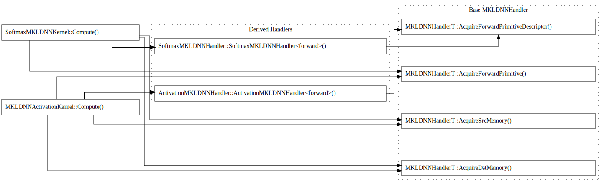

# Design Doc: MKL-DNN Acquire API

MKL-DNN kernels that are using MKL-DNN API tend to be quite complex due to:
* number of MKL-DNN api calls needed, which in fact are mostly repeated across all  MKL-DNN kernels
* caching mechanism of MKL-DNN objects  (conceptually the same across all paddle MKL-DNN kernels)
* still evolving MKL-DNN API which makes paddle MKL-DNN kernels difficult to maintain

Hence Acquire API was created to wrap around MKL-DNN API that address above defined issues.

### Common functionality
Each MKL-DNN kernel is essentially creating MKL-DNN memory objects followed by creation of MKL-DNN computational primitives and as a last step, execution
of created MKL-DNN primitives is triggered. Creation of mentioned MKL-DNN primitives require at least few calls to MKL-DNN API (for each MKL-DNN object) and code is much more complex when caching of created objects is added. Moreover code is pretty similar across MKL-DNN kernels, hence Acquire API was designed to provide easy to use way of creating and caching mentioned MKL-DNN objects.  Having common code implemented inside Acquire API, to be used in operators, require less effort when creating given operator. It also  makes integration of MKL-DNN kernels shorter and less prone to errors.

### Details of Acquire API
Basic element of Acquire API is so called Handler. There is Basic MKLDNNHandler class which is implementing a code common to all operators using Acquire API . On the picture below rightmost nodes (Nodes grouped with "Basic MKLDNNHandler") represent common functionality used by Softmax and activation MKL-DNN kernels. Apart from basic MKLDNNHandler, there are derived handlers that are implementing functionality that is specific to given operator eg. Constructing caching key for given operator and add some non-standard function for getting workspace memory objects (Nodes grouped with "Derived handlers"). Leftmost nodes are entry functions (Compute) of Softmax and activation MKL-DNN kernels.

Caching MKL-DNN objects is already implemented in Basic MKLDNNHandler, so most of the time when implementing derived handler you do not have to consider caching.

### Usage of Acquire MKL-DNN for MKL-DNN kernels implementation

#### 1. Creating MKLDNNHandler
As a first step one need to create derived handler for his target MKL-DNN kernel (operator). For LRN op it would be LRNMKLDNNHandler that inherits from MKLDNNHandlerT.
Goal of derived handler is to provide operator specific functionality: creating key to caching, creation of Forward and Backward MKL-DNN primitive descriptors.
It is best to look into existing examples of derived handlers and implement new one by analogy.

Example code of calling created LRN MKLDNNHandler:

    const float alpha = ctx.Attr<float>("alpha") * static_cast<float>(n);
    const float beta = ctx.Attr<float>("beta");
    const float k = ctx.Attr<float>("k");
    bool is_test = ctx.Attr<bool>("is_test");

    auto dims = paddle::framework::vectorize<int>(x->dims());

    platform::LRNMKLDNNHandler<T> handler(dims, n, alpha, beta, k, x->format(),
                                          is_test, dev_ctx, ctx.GetPlace(),
                                          ctx.op().Output("Out"));

#### 2. Creating MKL-DNN Memory objects
Once we have a derived handler, then it is time to get needed MKL-DNN memory objects. Memory objects either can wrap Tensor data or allocate data on its own.
Family of functions to get Memory objects are:
* AcquireSrcMemory
* AcquireDstMemory
* AcquireDiffDstMemory
* etc...

They do expect Tensor to be passed as a parameter to each of them so then MKL-DNN memory object is wrapping Tensor (recommended way). If this is not possible
like in a case of some of workspace memory objects then avoiding passing Tensor will trigger creation of MKL-DNN memory object with its own allocation.

Example usage based on LRN MKL-DNN kernel:

    auto src_memory = handler.AcquireSrcMemory(x);    // x is input tensor of LRN
    auto dst_memory = handler.AcquireDstMemory(out);  // out is output tensor of LRN

#### 3. Creating MKL-DNN computational primitives
Once We got Handler and MKL-DNN memory objects then we are to get computational MKL-DNN primitive. This is done with AcquireForwardPrimitive (For forward pass op) and AcquireBackwardPrimitive (for grad pass op).

Example usage based on LRN MKL-DNN kernel:

      lrn_p = handler.AcquireForwardPrimitive(*src_memory, *dst_memory);

#### 4. Execution of MKL-DNN computational primitives
Having memory objects and computational primitive we may trigger its execution . Example for LRN op:

    std::vector<mkldnn::primitive> pipeline = {*lrn_p};
    mkldnn::stream(mkldnn::stream::kind::eager).submit(pipeline).wait();

#### 5. Registering MKL-DNN memory format in corresponding Tensor
Last step is to register MKL-DNN output memory object format inside of Output tensor eg. set Tensor::format_ to MKL-DNN enum that corresponds the way Tensor data is arranged (NCHW, NCHW16C etc.) This enum can be taken from dst memory object (wrapper to Output tensor) in Forward pass or from diff_src memory object (wrapper to X_grad Tensor).

Example of registring MKL-DNN format in output tensor:

    out->set_layout(framework::DataLayout::kMKLDNN);
    out->set_format(platform::GetMKLDNNFormat(*dst_memory));
