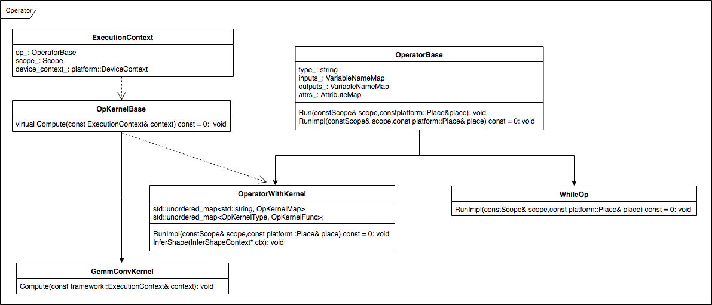

# C++ OP相关注意事项

## Paddle中Op的构建逻辑
### 1.Paddle中Op的构建逻辑
Paddle中所有的Op都继承自`OperatorBase`，且所有的Op都是无状态的，每个Op包含的成员变量只有四个：type、inputs、outputs、attribute。

Op的核心方法是Run，Run方法需要两方面的资源：数据资源和计算资源，这两个资源分别通过`Scope`和`Place`获取。框架内部有一个全局的`DeviceContextPool`，用来记录`Place`和`DeviceContext`之间的对应的关系，即每个`Place`有且仅有一个`DeviceContext`与之对应，`DeviceContext`中存放了当前设备的计算资源。比如对于GPU，这些资源包括`cudnn_handle`、`cublas_handle`、`stream`等，**Op内部所有的计算（数据拷贝和CUDA Kernel等）都必须在`DeviceContext`中进行**。

Paddle框架的设计理念是可以在多种设备及第三方库上运行，有些Op的实现可能会因为设备或者第三方库的不同而不同。为此，Paddle引入了OpKernel的方式，即一个Op可以有多个OpKernel，这类Op继承自`OperatorWithKernel`，这类Op的代表是conv_op，conv_op的OpKernel有：`GemmConvKernel`、`CUDNNConvOpKernel`、`ConvMKLDNNOpKernel`，且每个OpKernel都有double和float两种数据类型。不需要OpKernel的代表有`WhileOp`等。

Operator继承关系图：


进一步了解可参考：[multi_devices](https://github.com/PaddlePaddle/FluidDoc/tree/develop/doc/fluid/design/multi_devices)，[scope](https://github.com/PaddlePaddle/FluidDoc/blob/develop/doc/fluid/design/concepts/scope.md)，[Developer's_Guide_to_Paddle_Fluid](https://github.com/PaddlePaddle/FluidDoc/blob/release/1.2/doc/fluid/getstarted/Developer's_Guide_to_Paddle_Fluid.md)

### 2.Op的注册逻辑
每个Operator的注册项包括：
    ```C++
    OpCreator creator_;
    GradOpMakerFN grad_op_maker_;
    proto::OpProto* proto_{nullptr};
    OpAttrChecker* checker_{nullptr};
    InferVarTypeFN infer_var_type_;
    InferShapeFN infer_shape_;
    ```

<table>
<thead>
<tr>
<th>注册项</th>
<th>类型</th>
<th>说明</th>
<th>调用</th>
</tr>
</thead>
<tbody>
<tr>
<td>proto::OpProto </td>
<td>Class </td>
<td>存放Op的输入/输出/属性/Op类型 </td>
<td>编译时调用 </td>
</tr>
<tr>
<td>GradOpMakerFN </td>
<td>Functor </td>
<td>返回当前Op对应的反向Op的一组OpDesc，因为正向Op的反向可能有多个Op构成 </td>
<td>编译时调用 </td>
</tr>
<tr>
<td>OpAttrChecker </td>
<td>Class </td>
<td>对Op的attr进行check </td>
<td>编译时调用</td>
</tr>
<tr>
<td>InferVarTypeFN </td>
<td>Functor </td>
<td>用于推断输出Var的Type，比如是LoDTensor还是SelectedRows，或者其他 </td>
<td>编译时调用 </td>
</tr>
<tr>
<td>InferShapeFN </td>
<td>Functor </td>
<td>用于推断Output的Shape </td>
<td>分为编译时和运行时，编译时是在Python端调用；如果Op继承自OperatorWithKernel，运行时是在op.run中调用 </td>
</tr>
<tr>
<td>OpCreator </td>
<td>Functor </td>
<td>每次调用都会创建一个新的OperatorBase </td>
<td>运行时调用 </td>
</tr>
</tbody>
</table>

通常Op注释时需要调用REGISTER_OPERATOR，即：
    ```
    REGISTER_OPERATOR(op_type,
                      OperatorBase
                      op_maker_and_checker_maker,
                      op_grad_opmaker,
                      op_infer_var_shape,
                      op_infer_var_type)
    ```

**注意：**

1. 对于所有Op，前三个参数是必须的，op_type指明op的名字，OperatorBase是该Op的对象，op_maker_and_checker_maker是op的maker以及Op中attr的checker。
2. 如果该Op有反向，则必须要有op_grad_opmaker，因为在backward会根据正向的Op中获取反向Op的Maker。
3. 框架提供了一个默认的op_grad_opmaker：`DefaultGradOpDescMaker`，这个Maker会将前向Op的输入和输出都作为反向Op的输入，将前向Op的输入的梯度作为反向Op的输出，并将前向Op的属性拷贝过来。**注意：DefaultGradOpDescMaker会将前向Op的所有输入输出都做反向Op的输入，即使这个输入是没有必要的，这将会导致无法对没有用到的变量做内存优化**。
4. 框架没有提供默认的op_infer_var_shape方法。如果该Op是无OpKernel的，通常需要用户添加对应的op_infer_var_shape方法；如果该Op是有OpKernel的，需要实现`OperatorWithKernel`中的`InferShape`方法，此时不需要提供op_infer_var_shape方法。具体实现可参考[while_op.cc](https://github.com/PaddlePaddle/Paddle/blob/develop/paddle/fluid/operators/controlflow/while_op.cc)，[conv_op.cc](https://github.com/PaddlePaddle/Paddle/blob/develop/paddle/fluid/operators/conv_op.cc)。
5. 框架没有提供默认的op_infer_var_type方法，用户需要根据实际情况添加op_infer_var_type。严格来说每个Op都应该注册一个InferVarType，op_infer_var_type根据输入的Var的type和dtype推断输出Var的type和dtype。**注意：在Python端的LayerHelper中create_variable_for_type_inference操作返回的Variable里面是LoDTensor，C++端的InferVarType可以修改`Variable`的type和dtype**。


更多内容请参考: [如何写新的Op](new_op.html)

## 写Op注意事项
### 1.Op可以支持输入输出类型
Paddle的Op的输入输出都是`Variable`，从设计上讲，`Variable`中可以存放任意类型，Op的输入输出`Variable`可能是是任意类型，通常情况下`Variable`中存放的是`LoDTensor`、`SelectedRows`。

**注意：**

- 代码中经常出现`context.Input<Tensor>("Input")`，并不表示"Input"的`Variable`是`Tensor`，而是从"Input"的`Variable`的`LoDTensor`中获取`Tensor`。如果"Input"的`Variable`是`SelectedRows`，则会报错。
- 如果”Input”是`SelectedRows`，`context->GetInputDim("Input")`返回的是`var->Get<SelectedRows>().GetCompleteDims()`，而不是`SelectedRows`中`Tensor`的Dim。

### 2.在Op内部不能对输入的数据做任何的改写
在Op内部绝不允许对输入数据做任何改写，因为可能存在其他Op需要读这个数据。

### 3.OpKernel需要注册的数据类型
目前要求所有OpKernel都要注册double和float数据类型。

### 4.GetExpectedKernelType方法重写
GetExpectedKernelType方法是OperatorWithKernel类中用于获取指定设备（例如CPU，GPU）上指定数据类型（例如double，float）的OpKernel的方法。该方法通过获取输入变量内部的Tensor数据类型得知需要的Kernel数据类型，但是由于Tensor在此处可能尚未被初始化，所以在该方法内使用输入变量时需要进行必要的初始化检查。在新增含Kernel的Op的时候，关于该方法的重写需要注意以下两点。

#### 4.1 仅在必要时重写此方法

基类OperatorWithKernel中的GetExpectedKernelType方法对于派生类Op的所有输入变量进行了完备的初始化检查，建议在新增的Op中直接使用基类的此方法，例如：

- [MeanOp](https://github.com/PaddlePaddle/Paddle/blob/3556514e971bdbb98fdf0f556371c527f4dfa98c/paddle/fluid/operators/mean_op.cc#L39)：该Op的所有输入变量在Run之前应该全部被初始化，初始化检查是必要且合理的

但是在一些情况下，直接使用基类的GetExpectedKernelType方法无法满足需求，则需要对该方法进行重写，具体情况及示例如下：

1. OP的输入有多个，且数据类型不同，例如 [AccuracyOp](https://github.com/PaddlePaddle/Paddle/blob/370f0345b6d35a513c8e64d519a0edfc96b9276c/paddle/fluid/operators/metrics/accuracy_op.cc#L80)，需要重写GetExpectedKernelType方法，指定用某一输入变量获取kernel类型

2. Op包含Dispensable的输入变量，该类输入变量是可选的，当用户未输入时，该类变量未被初始化属于合理情况，例如 [ConvOp](https://github.com/PaddlePaddle/Paddle/blob/250e72d254ccbe3521c29aa2801a1cb15b75ea73/paddle/fluid/operators/conv_op.cc#L206)，存在Bias等可选的输入变量，需要重写GetExpectedKernelType方法，指定用必须提供的输入变量获取kernel类型

3. Op的部分输入变量即使未被初始化也属于合理情况，例如 [ConcatOp](https://github.com/PaddlePaddle/Paddle/blob/250e72d254ccbe3521c29aa2801a1cb15b75ea73/paddle/fluid/operators/concat_op.cc#L90)，输入变量X中有个Tensor需要连接，其中可能包含未被初始化的Tensor，需要重写GetExpectedKernelType方法，使用输入变量X获取kernel的过程中，合理忽略掉部分Tensor为空的情况

4. OP的Kernel类型与输入变量无关（可能由其他参数指定），例如 [FillOp](https://github.com/PaddlePaddle/Paddle/blob/efbdad059634bef022d4a3f5b00aef6ef8e88ed6/paddle/fluid/operators/one_hot_op.cc#L72)，该Op没有输入，Kernel类型通过Op的dtype参数指定，因此需要重写GetExpectedKernelType方法，用参数指定的数据类型获取kernel类型

5. Op Kernel的部分参数在使用某些库时，需要指定为相应的值，因此需要重写GetExpectedKernelType方法，覆盖默认参数
    - 使用CUDNN库：需要指定OpKernel的LibraryType为kCUDNN，例如 [AffineGridOp](https://github.com/PaddlePaddle/Paddle/blob/370f0345b6d35a513c8e64d519a0edfc96b9276c/paddle/fluid/operators/affine_grid_op.cc#L78)
    - 使用MKLDNN库：需要指定OpKernel的LibraryType和DataLayout为kMKLDNN [MulOp](https://github.com/PaddlePaddle/Paddle/blob/250e72d254ccbe3521c29aa2801a1cb15b75ea73/paddle/fluid/operators/mul_op.cc#L89)

#### 4.2 重写此方法时需要对输入变量进行初始化检查

在需要重写GetExpectedKernelType方法时，一般会根据某一输入变量获取Kernel的数据类型，此时请使用`OperatorWithKernel::IndicateVarDataType`接口获取变量的dtype，该方法对指定的输入变量进行了必要的初始化检查，详见[Paddle PR #20044](https://github.com/PaddlePaddle/Paddle/pull/20044)，实现示例如下，：

```
  framework::OpKernelType GetExpectedKernelType(
      const framework::ExecutionContext& ctx) const override {
    return framework::OpKernelType(
        OperatorWithKernel::IndicateVarDataType(ctx, "X"), ctx.GetPlace());
  }
```

如果未使用带有初始化检查的方法，直接使用了`Tensor->type()`，可能会导致报出`holder_ should not be null. Tensor not initialized yet when Tensor::type()`的错误，例如[Paddle issue #19522](https://github.com/PaddlePaddle/Paddle/issues/19522) ，用户仅凭该错误信息将无法得知具体出错的Op，不利于调试。

### 5.Op兼容性问题
对Op的修改需要考虑兼容性问题，要保证Op修改之后，之前的模型都能够正常加载及运行，即新版本的Paddle预测库能成功加载运行旧版本训练的模型。<font color="#FF0000">**所以，需要保证Op的Input、Output和Attribute不能被修改（文档除外）或删除，可以新增Input、Output和Attribute，但是新增的Input，Output必须设置AsDispensable，新增的Attribute必须设置默认值。更多详细内容请参考[OP修改规范：Input/Output/Attribute只能做兼容修改](https://github.com/PaddlePaddle/Paddle/wiki/OP-Input-Output-Attribute-Compatibility-Modification)**</font> 。

### 6.ShareDataWith的调用
ShareDataWith的功能是使两个Tensor共享底层buffer，在调用这个操作的时候需要特别注意，在Op内部不能将ShareDataWith作用在Op的输出上，即Op输出的Tensor必须是Malloc出来的。

### 7.稀疏梯度参数更新方法
目前稀疏梯度在做更新的时候会先对梯度做merge，即对相同参数的梯度做累加，然后做参数以及附加参数（如velocity）的更新。

### 8.显存优化

#### 8.1 为可原位计算的Op注册Inplace
有些Op的计算逻辑中，输出可以复用输入的显存空间，也可称为原位计算。例如[reshape_op](https://github.com/PaddlePaddle/Paddle/blob/develop/paddle/fluid/operators/reshape_op.cc)中，输出`Out`可以复用输入`X`的显存空间，因为该Op的计算逻辑不会改变`X`的实际数据，只是修改它的shape，输出和输入复用同一块显存空间不影响结果。对于这类OP，可以注册`Inlace`，从而让框架在运行时自动地进行显存优化。

Paddle提供了`DECLARE_INPLACE_OP_INFERER`宏用于注册`Inplace`，该宏第一个参数是一个类名，如`ReshapeOpInplaceInToOut`；第二个参数是一对复用的输入输出，以`{"X", "Out"}`的形式给出。在`REGISTER_OPERATOR`时，
可以将类名传传入，从而为该Op注册`Inplace`。

```
DECLARE_INPLACE_OP_INFERER(ReshapeOpInplaceInToOut, {"X", "Out"});

REGISTER_OPERATOR(
    reshape, ops::ReshapeOp, ops::ReshapeOpMaker,
    paddle::framework::DefaultGradOpMaker<paddle::framework::OpDesc, true>,
    paddle::framework::DefaultGradOpMaker<paddle::imperative::OpBase, true>,
    ops::ReshapeOpInplaceInToOut);
```

#### 8.2 减少OP中的无关变量
通常反向Op会依赖于前向Op的某些输入(Input)、输出(Output)，以供反向Op计算使用。但有些情况下，反向Op不需要前向Op的所有输入和输出；有些情况下，反向Op只需要前向Op的部分输入和输出；有些情况下，反向Op只需要使用前向Op中输入和输出变量的Shape和LoD信息。若Op开发者在注册反向Op时，将不必要的前向Op输入和输出作为反向Op的输入，会导致这部分显存无法被框架现有的显存优化策略优化，从而导致模型显存占用过高。

所以在写注册反向Op时需要注意以下几点：

- Paddle提供的`DefaultGradOpMaker`，默认会将前向op的所有输入(`Input`）、输出(`Output`)以及输出变量所对应的梯度(`Output@Grad`)作为反向Op的输入，将前向Op输入所对应的梯度(`Input@Grad`)作为反向Op的输出。所以在使用`DefaultGradOpMaker`时需要考虑是否有些变量在计算中不被用到。
- 如果`DefaultGradOpMaker`不能够满足需求，需要用户自己手动构建`GradOpMaker`，具体实现请参考[相关文档](new_op.html#gradopmaker);
- 如果有些反向Op需要依赖前向Op的输入或输出变量的的Shape或LoD，但不依赖于变量中Tensor的Buffer，且不能根据其他变量推断出该Shape和LoD，则可以通过`DECLARE_NO_NEED_BUFFER_VARS_INFERER`接口对该变量（以下称该变量为`X`）在反向Op中进行注册`NoNeedBufferVars`。**一旦注册了`NoNeedBufferVars`，反向op中就不能读写该变量对应的Tensor中的buffer，只能调用Tensor的dims()和lod()方法，同时，反向Op中的`GetExpectedKernelType()`必须要重写，并且`GetExpectedKernelType()`中不能访问`X`变量中Tensor的type()方法**。比如在`SliceOpGrad`中只会用到`Input`中变量的Shape信息，所以需要为对`Input`在`SliceOpGrad`上进行注册：
```
namespace paddle {
namespace operators {
// ...
class SliceOpGrad : public framework::OperatorWithKernel {
 public:
  using framework::OperatorWithKernel::OperatorWithKernel;

  void InferShape(framework::InferShapeContext* ctx) const override {
    // ...
  }

  framework::OpKernelType GetExpectedKernelType(
      const framework::ExecutionContext& ctx) const override {
    // Note: don't get data type from ctx.Input<framework::Tensor>("Input");  
    auto dtype = ctx.Input<framework::Tensor>(framework::GradVarName("Out"))->type();  
    return framework::OpKernelType( dtype, ctx.GetPlace());
  }
};


template <typename T>
class SliceOpGradMaker : public framework::SingleGradOpMaker<T> {
 public:
  using framework::SingleGradOpMaker<T>::SingleGradOpMaker;

 protected:
  void Apply(GradOpPtr<T> bind) const override {
    bind->SetInput("Input", this->Input("Input"));
    if (this->HasInput("StartsTensor")) {
      bind->SetInput("StartsTensor", this->Input("StartsTensor"));
    }
    if (this->HasInput("EndsTensor")) {
      bind->SetInput("EndsTensor", this->Input("EndsTensor"));
    }
    if (this->HasInput("StartsTensorList")) {
      bind->SetInput("StartsTensorList", this->Input("StartsTensorList"));
    }
    if (this->HasInput("EndsTensorList")) {
      bind->SetInput("EndsTensorList", this->Input("EndsTensorList"));
    }
    bind->SetInput(framework::GradVarName("Out"), this->OutputGrad("Out"));
    bind->SetOutput(framework::GradVarName("Input"), this->InputGrad("Input"));
    bind->SetAttrMap(this->Attrs());
    bind->SetType("slice_grad");
  }
};

DECLARE_NO_NEED_BUFFER_VARS_INFERER(SliceOpGradNoNeedBufferVarsInference,
                                    "Input");
}  // namespace operators
}  // namespace paddle
namespace ops = paddle::operators;
REGISTER_OPERATOR(slice, ops::SliceOp, ops::SliceOpMaker,
                  ops::SliceOpGradMaker<paddle::framework::OpDesc>,
                  ops::SliceOpGradMaker<paddle::imperative::OpBase>);
REGISTER_OPERATOR(slice_grad, ops::SliceOpGrad,
                  ops::SliceDoubleOpGradMaker<paddle::framework::OpDesc>,
                  ops::SliceDoubleOpGradMaker<paddle::imperative::OpBase>,
                  ops::SliceOpGradNoNeedBufferVarsInference);
```

### 9.混合设备调用
由于GPU是异步执行的，当CPU调用返回之后，GPU端可能还没有真正的执行，所以如果在Op中创建了GPU运行时需要用到的临时变量，当GPU开始运行的时候，该临时变量可能在CPU端已经被释放，这样可能会导致GPU计算出错。

关于GPU中的一些同步和异步操作：
```
The following device operations are asynchronous with respect to the host:
    Kernel launches;
    Memory copies within a single device's memory;
    Memory copies from host to device of a memory block of 64 KB or less;
    Memory copies performed by functions that are suffixed with Async;
    Memory set function calls.
```

关于cudaMemCpy和cudaMemCpyAsync注意事项：

- 如果数据传输是从GPU端到非页锁定的CPU端，数据传输将是同步，即使调用的是异步拷贝操作。
- 如果数据传输是从CPU端到CPU端，数据传输将是同步的，即使调用的是异步拷贝操作。

更多内容可参考：[Asynchronous Concurrent Execution](https://docs.nvidia.com/cuda/cuda-c-programming-guide/#asynchronous-concurrent-execution)，[API synchronization behavior](https://docs.nvidia.com/cuda/cuda-runtime-api/api-sync-behavior.html#api-sync-behavior)

### 10. LoD 在 Op 内部的传导规范

[LoD](https://github.com/PaddlePaddle/FluidDoc/blob/develop/doc/fluid/design/concepts/lod_tensor.md) 是 Paddle 框架用来表示变长序列数据的属性，除了仅支持输入是 padding  data 的 Op 外，所有 Op 的实现都要考虑 LoD 的传导问题。

根据 OP 的计算过程中是否用到 LoD，我们可以将涉及到 LoD 传导问题的 OP 分为两类: LoD-Transparent 与 LoD-Based。

<table>
<thead>
<tr>
<th>类型</th>
<th>特点</th>
<th>示例</th>
</tr>
</thead>
<tbody>
<tr>
<td>LoD-Transparent </td>
<td>计算过程不依赖 LoD，输入是否有 LoD 不会影响计算的结果，通常是 position-wise 的计算 </td>
<td>conv2d_op、batch_norm_op、dropout_op 等 </td>
</tr>
<tr>
<td>LoD-Based </td>
<td>计算以序列为单位， 计算过程依赖 LoD </td>
<td> lstm_op、gru_op、sequence_ops 等 </td>
</tr>
</tbody>
</table>

这两类 OP 的 LoD 传导需要考虑前向和反向两个过程。

#### 前向传导

在前向传导过程，与输入的 LoD 相比较，Op 输出的 LoD 可能出现不变、改变和消失这三种情况：

  - 不变：适用于所有的 LoD-Transparent OP 与部分的 LoD-Based OP。可以在`InferShape` 中调用 `ShareLoD()` 直接将输入 Var 的 LoD 共享给输出 Var, 可参考 [lstm_op](https://github.com/PaddlePaddle/Paddle/blob/a88a1faa48a42a8c3737deb0f05da968d200a7d3/paddle/fluid/operators/lstm_op.cc#L92); 如果有多个输入且都可能存在 LoD 的情况，通常默认共享第一个输入, 例如 [elementwise_ops forward](https://github.com/PaddlePaddle/Paddle/blob/5d6a1fcf16bcb48d2e66306b27d9994d9b07433c/paddle/fluid/operators/elementwise/elementwise_op.h#L69)；

  - 改变：适用于部分 LoD-Based OP。在实现 OpKernel 时需考虑输出 LoD 的正确计算，真实的 LoD 在前向计算结束后才能确定，此时仍需要在`InferShape` 中调用 `ShareLoD()`，以确保CompileTime 时对 LoD Level 做了正确的传导，可参考 [sequence_expand_op](https://github.com/PaddlePaddle/Paddle/blob/565d30950138b9f831caa33904d9016cf53c6c2e/paddle/fluid/operators/sequence_ops/sequence_expand_op.cc)；

  - 消失：适用于输出不再是序列数据的 LoD-Based OP。此时不用再考虑前向的 LoD 传导问题，可参考 [sequence_pool_op](https://github.com/PaddlePaddle/Paddle/blob/develop/paddle/fluid/operators/sequence_ops/sequence_pool_op.cc)；

其它重要的注意事项：

  - 实现 LoD-Based OP 时，需要处理好 LoD 传导的边界情况，例如对长度为零的输入的支持，并完善相应的单测，单测 case 覆盖空序列出现在 batch 开头、中间和末尾等位置的情况，可参考 [test_lstm_op.py](https://github.com/PaddlePaddle/Paddle/blob/4292bd8687ababc7737cffbddc0d38ead2138c00/python/paddle/fluid/tests/unittests/test_lstm_op.py#L203-L216)

  - 对 LoD Level 有明确要求的 OP，推荐的做法是在 `InferShape` 中即完成 LoD Level的检查，例如 [sequence_pad_op](https://github.com/PaddlePaddle/Paddle/blob/4292bd8687ababc7737cffbddc0d38ead2138c00/paddle/fluid/operators/sequence_ops/sequence_pad_op.cc#L79)。


#### 反向传导

通常来讲，OP 的某个输入 Var 所对应的梯度 GradVar 的 LoD 应该与 Var 自身相同，所以应直接将 Var 的 LoD 共享给 GradVar，可以参考 [elementwise ops 的 backward](https://github.com/PaddlePaddle/Paddle/blob/a88a1faa48a42a8c3737deb0f05da968d200a7d3/paddle/fluid/operators/elementwise/elementwise_op.h#L189-L196)


## Op性能优化
### 1.第三方库的选择
在写Op过程中优先使用高性能（如cudnn、mkldnn、mklml、eigen等）中提供的操作，但是一定要做benchmark，有些库中的操作在深度学习任务中可能会比较慢。因为高性能库（如eigen等）中提供的操作为了更为通用，在性能方面可能并不是很好，通常深度学习模型中数据量较小，所以有些情况下可能高性能库中提供的某些操作速度较慢。比如Elementwise系列的所有Op（前向和反向），Elementwise操作在模型中调用的次数比较多，尤其是Elementwise_add，在很多操作之后都需要添加偏置项。在之前的实现中Elementwise_op直接调用Eigen库，由于Elementwise操作在很多情况下需要对数据做Broadcast，而实验发现Eigen库做Broadcast的速度比较慢，慢的原因在这个PR[#6229](https://github.com/PaddlePaddle/Paddle/pull/6229)中有描述。

### 2.Op性能优化
Op的计算速度与输入的数据量有关，对于某些Op可以根据输入数据的Shape和Op的属性参数来选择不同的计算方式。比如concat_op，当axis>=1时，在对多个tensor做拼接过程中需要对每个tensor做很多次拷贝，如果是在GPU上，需要调用cudaMemCopy。相对CPU而言，GPU属于外部设备，所以每次调用GPU的操作都会有一定的额外开销，并且当需要拷贝的次数较多时，这种开销就更为凸现。目前concat_op的实现会根据输入数据的Shape以及axis值来选择不同的调用方式，如果输入的tensor较多，且axis不等于0，则将多次拷贝操作转换成一个CUDA Kernel来完成；如果输入tensor较少，且axis等于0，使用直接进行拷贝。相关实验过程在该PR（[#8669](https://github.com/PaddlePaddle/Paddle/pull/8669)）中有介绍。

由于CUDA Kernel的调用有一定的额外开销，所以如果Op中出现多次调用CUDA Kernel，可能会影响Op的执行速度。比如之前的sequence_expand_op中包含很多CUDA Kernel，通常这些CUDA Kernel处理的数据量较小，所以频繁调用这样的Kernel会影响Op的计算速度，这种情况下最好将这些小的CUDA Kernel合并成一个。在优化sequence_expand_op过程（相关PR[#9289](https://github.com/PaddlePaddle/Paddle/pull/9289)）中就是采用这种思路，优化后的sequence_expand_op比之前的实现平均快出约1倍左右，相关实验细节在该PR（[#9289](https://github.com/PaddlePaddle/Paddle/pull/9289)）中有介绍。

减少CPU与GPU之间的拷贝和同步操作的次数。比如fetch操作，在每个迭代之后都会对模型参数进行更新并得到一个loss，并且数据从GPU端到没有页锁定的CPU端的拷贝是同步的，所以频繁的fetch多个参数会导致模型训练速度变慢。

## Op数值稳定性问题
### 1.有些Op存在数值稳定性问题
出现数值稳定性的主要原因程序在多次运行时，对浮点型数据施加操作的顺序可能不同，进而导致最终计算结果不同。而GPU是通过多线程并行计算的方式来加速计算的，所以很容易出现对浮点数施加操作的顺序不固定现象。

目前发现cudnn中的卷积操作、cudnn中的MaxPooling、CUDA中CudaAtomicXX、ParallelExecutor的Reduce模式下参数梯度的聚合等操作运行结果是非确定的。

为此Paddle中添加了一些FLAGS，比如使用FLAGS_cudnn_deterministic来强制cudnn使用确定性算法、FLAGS_cpu_deterministic强制CPU端的计算使用确定性方法。

### 2.WITH_FAST_MATH的开与关
如果WITH_FAST_MATH是ON，NVCC在编译Paddle和Egien的时候会使用--use_fast_math，这样可能会使CUDA中的一些操作在损失一定精度的情况下变快，比如log、exp、tanh等，但也会使一些操作的计算结果是错的，比如pow操作，具体原因请查看[torch/DEPRECEATED-torch7-distro#132](https://github.com/torch/DEPRECEATED-torch7-distro/issues/132)。

## 其他
### 1.报错信息
Enforce提示信息不能为空，并且需要写明，因为报错信息可以更快更方便地分析出错误的原因。

### 2.Op的数学公式
如果Op有数学公式，一定要在代码中将数学公式写明，并在Python API的Doc中显示，因为用户在对比不同框架的计算结果时可能需要了解Paddle对Op是怎么实现的。

**注意：**在merge到develop分支之前一定进行公式预览。可参考[dynamic_lstmp](../../../api_cn/layers_cn/nn_cn.html#dynamic-lstmp)。

### 3.Op变量名的命名要规范
在定义Op时，Op的输入输出以及属性的命名需要符合规范，具体命名规则请参考：[name_convention](https://github.com/PaddlePaddle/FluidDoc/blob/release/1.2/doc/fluid/dev/name_convention.md)。

### 4.Python端Op接口中参数的顺序
Python API中参数的顺序一般按照重要性来排，以fc为例：
```
def fc(input,
       size,
       num_flatten_dims=1,
       param_attr=None,
       bias_attr=None,
       act=None,
       is_test=False,
       name=None)
```
