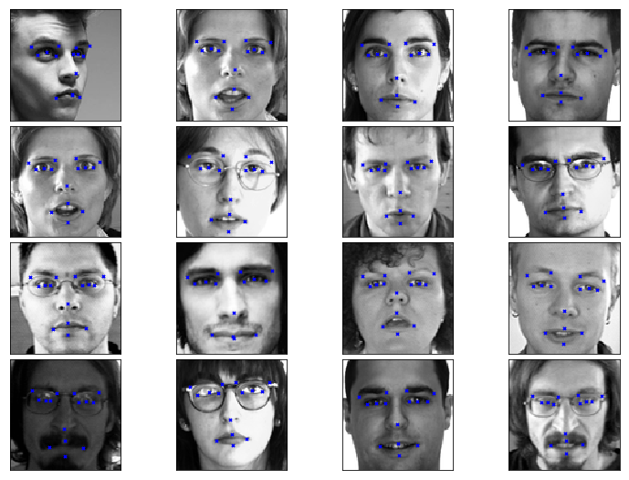

人脸关键点检测
==============

**作者:** `ssz95 <https://github.com/zzs95>`__ **日期:** 2021.01
**摘要:** 本示例教程将会演示如何使用飞桨实现人脸关键点检测。

一、简介
--------

在图像处理中，关键点本质上是一种特征。它是对一个固定区域或者空间物理关系的抽象描述，描述的是一定邻域范围内的组合或上下文关系。它不仅仅是一个点信息，或代表一个位置，更代表着上下文与周围邻域的组合关系。关键点检测的目标就是通过计算机从图像中找出这些点的坐标，作为计算机视觉领域的一个基础任务，关键点的检测对于高级别任务，例如识别和分类具有至关重要的意义。

关键点检测方法总体上可以分成两个类型，一个种是用坐标回归的方式来解决，另一种是将关键点建模成热力图，通过像素分类任务，回归热力图分布得到关键点位置。这两个方法，都是一种手段或者是途径，解决的问题就是要找出这个点在图像当中的位置与关系。

其中人脸关键点检测是关键点检测方法的一个成功实践，本示例简要介绍如何通过飞桨开源框架，实现人脸关键点检测的功能。这个案例用到的是第一种关键点检测方法——坐标回归。我们将使用到新版的paddle2.0的API，集成式的训练接口，能够很方便对模型进行训练和预测。

二、环境设置
------------

本教程基于Paddle 2.0
编写，如果您的环境不是本版本，请先参考官网\ `安装 <https://www.paddlepaddle.org.cn/install/quick>`__
Paddle 2.0 。

如果是cpu环境，请安装cpu版本的paddle2.0环境，在 ``paddle.set_device()``
输入对应运行设备。

.. code:: ipython3

    import numpy as np
    import matplotlib.pyplot as plt
    import pandas as pd
    import os
    
    import paddle
    from paddle.io import Dataset
    from paddle.vision.transforms import transforms
    from paddle.vision.models import resnet18
    from paddle.nn import functional as F
    print(paddle.__version__)
    # evice = paddle.set_device('cpu') 
    device = paddle.set_device('gpu') 

.. parsed-literal::

    2.0.0

三、数据集
----------

3.1 数据集下载
~~~~~~~~~~~~~~

本案例使用了Kaggle官方举办的人脸关键点检测challenge数据集，官网：\ https://www.kaggle.com/c/facial-keypoints-detection

官方数据集将人脸图像和标注数据打包成了csv文件，我们使用panda来读取。其中数据集中的文件：
training.csv: 包含了用于训练的人脸关键点坐标和图像。 test.csv:
包含了用于测试的人脸关键点图像, 没有标注关键点坐标。 IdLookupTable.csv:
测试集关键点的位置的对应名称。

图像的长和宽都为96像素，所需要检测的一共有15个关键点。

.. code:: ipython3

    !unzip -o ./test.zip -d data/data60
    !unzip -o ./training.zip -d data/data60

.. parsed-literal::

    unzip:  cannot find or open ./test.zip, ./test.zip.zip or ./test.zip.ZIP.
    unzip:  cannot find or open ./training.zip, ./training.zip.zip or ./training.zip.ZIP.

3.2 数据集定义
~~~~~~~~~~~~~~

飞桨（PaddlePaddle）数据集加载方案是统一使用Dataset（数据集定义） +
DataLoader（多进程数据集加载）。

首先我们先进行数据集的定义，数据集定义主要是实现一个新的Dataset类，继承父类paddle.io.Dataset，并实现父类中以下两个抽象方法，__getitem__和\ **len**\ ：

.. code:: ipython3

    Train_Dir = './data/data60/training.csv'
    Test_Dir = './data/data60/test.csv'
    lookid_dir = './data/data60/IdLookupTable.csv'
    class ImgTransforms(object):
        """
        图像预处理工具，用于将图像进行升维(96, 96) => (96, 96, 3)，
        并对图像的维度进行转换从HWC变为CHW
        """
        def __init__(self, fmt):
            self.format = fmt
    
        def __call__(self, img):
            if len(img.shape) == 2:
                img = np.expand_dims(img, axis=2)
            img =  img.transpose(self.format)
    
            if img.shape[0] == 1:
                img = np.repeat(img, 3, axis=0)
            return img
    
    class FaceDataset(Dataset):
        def __init__(self, data_path, mode='train', val_split=0.2):
            self.mode = mode
            assert self.mode in ['train', 'val', 'test'], \
                "mode should be 'train' or 'test', but got {}".format(self.mode)
            self.data_source = pd.read_csv(data_path)
            # 清洗数据, 数据集中有很多样本只标注了部分关键点, 这里有两种策略
            # 第一种, 将未标注的位置从上一个样本对应的关键点复制过来
            # self.data_source.fillna(method = 'ffill',inplace = True)
            # 第二种, 将包含有未标注的样本从数据集中移除
            self.data_source.dropna(how="any", inplace=True)  
            self.data_label_all = self.data_source.drop('Image', axis = 1)
            
            # 划分训练集和验证集合
            if self.mode in ['train', 'val']:
                np.random.seed(43)
                data_len = len(self.data_source)
                # 随机划分
                shuffled_indices = np.random.permutation(data_len)
                # 顺序划分
                # shuffled_indices = np.arange(data_len)
                self.shuffled_indices = shuffled_indices
                val_set_size = int(data_len*val_split)
                if self.mode == 'val':
                    val_indices = shuffled_indices[:val_set_size]
                    self.data_img = self.data_source.reindex().iloc[val_indices]
                    self.data_label = self.data_label_all.reindex().iloc[val_indices]
                elif self.mode == 'train':
                    train_indices = shuffled_indices[val_set_size:]
                    self.data_img = self.data_source.reindex().iloc[train_indices]
                    self.data_label = self.data_label_all.reindex().iloc[train_indices]
            elif self.mode == 'test':
                self.data_img = self.data_source
                self.data_label = self.data_label_all
    
            self.transforms = transforms.Compose([
                ImgTransforms((2, 0, 1))
            ])
    
        # 每次迭代时返回数据和对应的标签
        def __getitem__(self, idx):
    
            img = self.data_img['Image'].iloc[idx].split(' ')
            img = ['0' if x == '' else x for x in img]
            img = np.array(img, dtype = 'float32').reshape(96, 96)
            img = self.transforms(img)
            label = np.array(self.data_label.iloc[idx,:],dtype = 'float32')/96
            return img, label
    
        # 返回整个数据集的总数
        def __len__(self):
            return len(self.data_img)
    # 训练数据集和验证数据集
    train_dataset = FaceDataset(Train_Dir, mode='train')
    val_dataset = FaceDataset(Train_Dir, mode='val')
    
    # 测试数据集
    test_dataset = FaceDataset(Test_Dir,  mode='test')

3.3 数据集抽样展示
~~~~~~~~~~~~~~~~~~

实现好Dataset数据集后，我们来测试一下数据集是否符合预期，因为Dataset是一个可以被迭代的Class，我们通过for循环从里面读取数据来用matplotlib进行展示。关键点的坐标在数据集中进行了归一化处理，这里乘以图像的大小恢复到原始尺度，并用scatter函数将点画在输出的图像上。

.. code:: ipython3

    def plot_sample(x, y, axis):
        img = x.reshape(96, 96)
        axis.imshow(img, cmap='gray')
        axis.scatter(y[0::2], y[1::2], marker='x', s=10, color='b')
    
    fig = plt.figure(figsize=(10, 7))
    fig.subplots_adjust(
        left=0, right=1, bottom=0, top=1, hspace=0.05, wspace=0.05)
    
    # 随机取16个样本展示
    for i in range(16):
        axis = fig.add_subplot(4, 4, i+1, xticks=[], yticks=[])
        idx = np.random.randint(train_dataset.__len__())
        # print(idx)
        img, label = train_dataset[idx]
        label = label*96
        plot_sample(img[0], label, axis)
    plt.show()

四、定义模型
------------

这里使用到 ``paddle.vision.models`` 中定义的 ``resnet18``
网络模型。在ImageNet分类任务中，图像分成1000类，在模型后接一个全连接层，将输出的1000维向量映射成30维，对应15个关键点的横纵坐标。

.. code:: ipython3

    class FaceNet(paddle.nn.Layer):
        def __init__(self, num_keypoints, pretrained=False):
            super(FaceNet, self).__init__()
            self.backbone = resnet18(pretrained)
            self.outLayer1 = paddle.nn.Sequential(
                paddle.nn.Linear(1000, 512),
                paddle.nn.ReLU(),
                paddle.nn.Dropout(0.1))
            self.outLayer2 = paddle.nn.Linear(512, num_keypoints*2)
        def forward(self, inputs):
            out = self.backbone(inputs)
            out = self.outLayer1(out)
            out = self.outLayer2(out)
            return out

4.1 模型可视化
~~~~~~~~~~~~~~

调用飞桨提供的summary接口对组建好的模型进行可视化，方便进行模型结构和参数信息的查看和确认。

.. code:: ipython3

    from paddle.static import InputSpec
    
    num_keypoints = 15
    model = paddle.Model(FaceNet(num_keypoints))
    model.summary((1,3, 96, 96))

.. parsed-literal::

    -------------------------------------------------------------------------------
       Layer (type)         Input Shape          Output Shape         Param #    
    ===============================================================================
         Conv2D-1         [[1, 3, 96, 96]]     [1, 64, 48, 48]         9,408     
       BatchNorm2D-1     [[1, 64, 48, 48]]     [1, 64, 48, 48]          256      
          ReLU-1         [[1, 64, 48, 48]]     [1, 64, 48, 48]           0       
        MaxPool2D-1      [[1, 64, 48, 48]]     [1, 64, 24, 24]           0       
         Conv2D-2        [[1, 64, 24, 24]]     [1, 64, 24, 24]        36,864     
       BatchNorm2D-2     [[1, 64, 24, 24]]     [1, 64, 24, 24]          256      
          ReLU-2         [[1, 64, 24, 24]]     [1, 64, 24, 24]           0       
         Conv2D-3        [[1, 64, 24, 24]]     [1, 64, 24, 24]        36,864     
       BatchNorm2D-3     [[1, 64, 24, 24]]     [1, 64, 24, 24]          256      
       BasicBlock-1      [[1, 64, 24, 24]]     [1, 64, 24, 24]           0       
         Conv2D-4        [[1, 64, 24, 24]]     [1, 64, 24, 24]        36,864     
       BatchNorm2D-4     [[1, 64, 24, 24]]     [1, 64, 24, 24]          256      
          ReLU-3         [[1, 64, 24, 24]]     [1, 64, 24, 24]           0       
         Conv2D-5        [[1, 64, 24, 24]]     [1, 64, 24, 24]        36,864     
       BatchNorm2D-5     [[1, 64, 24, 24]]     [1, 64, 24, 24]          256      
       BasicBlock-2      [[1, 64, 24, 24]]     [1, 64, 24, 24]           0       
         Conv2D-7        [[1, 64, 24, 24]]     [1, 128, 12, 12]       73,728     
       BatchNorm2D-7     [[1, 128, 12, 12]]    [1, 128, 12, 12]         512      
          ReLU-4         [[1, 128, 12, 12]]    [1, 128, 12, 12]          0       
         Conv2D-8        [[1, 128, 12, 12]]    [1, 128, 12, 12]       147,456    
       BatchNorm2D-8     [[1, 128, 12, 12]]    [1, 128, 12, 12]         512      
         Conv2D-6        [[1, 64, 24, 24]]     [1, 128, 12, 12]        8,192     
       BatchNorm2D-6     [[1, 128, 12, 12]]    [1, 128, 12, 12]         512      
       BasicBlock-3      [[1, 64, 24, 24]]     [1, 128, 12, 12]          0       
         Conv2D-9        [[1, 128, 12, 12]]    [1, 128, 12, 12]       147,456    
       BatchNorm2D-9     [[1, 128, 12, 12]]    [1, 128, 12, 12]         512      
          ReLU-5         [[1, 128, 12, 12]]    [1, 128, 12, 12]          0       
         Conv2D-10       [[1, 128, 12, 12]]    [1, 128, 12, 12]       147,456    
      BatchNorm2D-10     [[1, 128, 12, 12]]    [1, 128, 12, 12]         512      
       BasicBlock-4      [[1, 128, 12, 12]]    [1, 128, 12, 12]          0       
         Conv2D-12       [[1, 128, 12, 12]]     [1, 256, 6, 6]        294,912    
      BatchNorm2D-12      [[1, 256, 6, 6]]      [1, 256, 6, 6]         1,024     
          ReLU-6          [[1, 256, 6, 6]]      [1, 256, 6, 6]           0       
         Conv2D-13        [[1, 256, 6, 6]]      [1, 256, 6, 6]        589,824    
      BatchNorm2D-13      [[1, 256, 6, 6]]      [1, 256, 6, 6]         1,024     
         Conv2D-11       [[1, 128, 12, 12]]     [1, 256, 6, 6]        32,768     
      BatchNorm2D-11      [[1, 256, 6, 6]]      [1, 256, 6, 6]         1,024     
       BasicBlock-5      [[1, 128, 12, 12]]     [1, 256, 6, 6]           0       
         Conv2D-14        [[1, 256, 6, 6]]      [1, 256, 6, 6]        589,824    
      BatchNorm2D-14      [[1, 256, 6, 6]]      [1, 256, 6, 6]         1,024     
          ReLU-7          [[1, 256, 6, 6]]      [1, 256, 6, 6]           0       
         Conv2D-15        [[1, 256, 6, 6]]      [1, 256, 6, 6]        589,824    
      BatchNorm2D-15      [[1, 256, 6, 6]]      [1, 256, 6, 6]         1,024     
       BasicBlock-6       [[1, 256, 6, 6]]      [1, 256, 6, 6]           0       
         Conv2D-17        [[1, 256, 6, 6]]      [1, 512, 3, 3]       1,179,648   
      BatchNorm2D-17      [[1, 512, 3, 3]]      [1, 512, 3, 3]         2,048     
          ReLU-8          [[1, 512, 3, 3]]      [1, 512, 3, 3]           0       
         Conv2D-18        [[1, 512, 3, 3]]      [1, 512, 3, 3]       2,359,296   
      BatchNorm2D-18      [[1, 512, 3, 3]]      [1, 512, 3, 3]         2,048     
         Conv2D-16        [[1, 256, 6, 6]]      [1, 512, 3, 3]        131,072    
      BatchNorm2D-16      [[1, 512, 3, 3]]      [1, 512, 3, 3]         2,048     
       BasicBlock-7       [[1, 256, 6, 6]]      [1, 512, 3, 3]           0       
         Conv2D-19        [[1, 512, 3, 3]]      [1, 512, 3, 3]       2,359,296   
      BatchNorm2D-19      [[1, 512, 3, 3]]      [1, 512, 3, 3]         2,048     
          ReLU-9          [[1, 512, 3, 3]]      [1, 512, 3, 3]           0       
         Conv2D-20        [[1, 512, 3, 3]]      [1, 512, 3, 3]       2,359,296   
      BatchNorm2D-20      [[1, 512, 3, 3]]      [1, 512, 3, 3]         2,048     
       BasicBlock-8       [[1, 512, 3, 3]]      [1, 512, 3, 3]           0       
    AdaptiveAvgPool2D-1   [[1, 512, 3, 3]]      [1, 512, 1, 1]           0       
         Linear-1            [[1, 512]]           [1, 1000]           513,000    
         ResNet-1         [[1, 3, 96, 96]]        [1, 1000]              0       
         Linear-2           [[1, 1000]]            [1, 512]           512,512    
          ReLU-10            [[1, 512]]            [1, 512]              0       
         Dropout-1           [[1, 512]]            [1, 512]              0       
         Linear-3            [[1, 512]]            [1, 30]            15,390     
    ===============================================================================
    Total params: 12,227,014
    Trainable params: 12,207,814
    Non-trainable params: 19,200
    -------------------------------------------------------------------------------
    Input size (MB): 0.11
    Forward/backward pass size (MB): 10.51
    Params size (MB): 46.64
    Estimated Total Size (MB): 57.26
    -------------------------------------------------------------------------------
    

.. parsed-literal::

    {'total_params': 12227014, 'trainable_params': 12207814}

五、训练模型
------------

在这个任务是对坐标进行回归，我们使用均方误差（Mean Square error
）损失函数\ ``paddle.nn.MSELoss()``\ 来做计算，飞桨2.0中，在nn下将损失函数封装成可调用类。我们这里使用paddle.Model相关的API直接进行训练，只需要定义好数据集、网络模型和损失函数即可。

使用模型代码进行Model实例生成，使用prepare接口定义优化器、损失函数和评价指标等信息，用于后续训练使用。在所有初步配置完成后，调用fit接口开启训练执行过程，调用fit时只需要将前面定义好的训练数据集、测试数据集、训练轮次（Epoch）和批次大小（batch_size）配置好即可。

.. code:: ipython3

    model = paddle.Model(FaceNet(num_keypoints=15))
    optim = paddle.optimizer.Adam(learning_rate=1e-3,
        parameters=model.parameters())
    model.prepare(optim, paddle.nn.MSELoss())
    model.fit(train_dataset, val_dataset, epochs=60, batch_size=256)

.. parsed-literal::

    The loss value printed in the log is the current step, and the metric is the average value of previous step.
    Epoch 1/60
    step 7/7 - loss: 0.1134 - 611ms/step
    Eval begin...
    The loss value printed in the log is the current batch, and the metric is the average value of previous step.
    step 2/2 - loss: 6.2252 - 502ms/step
    Eval samples: 428
    Epoch 2/60
    step 7/7 - loss: 0.0331 - 591ms/step
    Eval begin...
    The loss value printed in the log is the current batch, and the metric is the average value of previous step.
    step 2/2 - loss: 0.4000 - 506ms/step
    Eval samples: 428
    Epoch 3/60
    step 7/7 - loss: 0.0241 - 592ms/step
    Eval begin...
    The loss value printed in the log is the current batch, and the metric is the average value of previous step.
    step 2/2 - loss: 0.0677 - 509ms/step
    Eval samples: 428
    Epoch 4/60
    step 7/7 - loss: 0.0187 - 590ms/step
    Eval begin...
    The loss value printed in the log is the current batch, and the metric is the average value of previous step.
    step 2/2 - loss: 0.0171 - 490ms/step
    Eval samples: 428
    Epoch 5/60
    step 7/7 - loss: 0.0153 - 598ms/step
    Eval begin...
    The loss value printed in the log is the current batch, and the metric is the average value of previous step.
    step 2/2 - loss: 0.0059 - 508ms/step
    Eval samples: 428
    Epoch 6/60
    step 7/7 - loss: 0.0134 - 593ms/step
    Eval begin...
    The loss value printed in the log is the current batch, and the metric is the average value of previous step.
    step 2/2 - loss: 0.0031 - 495ms/step
    Eval samples: 428
    Epoch 7/60
    step 7/7 - loss: 0.0107 - 594ms/step
    Eval begin...
    The loss value printed in the log is the current batch, and the metric is the average value of previous step.
    step 2/2 - loss: 0.0023 - 510ms/step
    Eval samples: 428
    Epoch 8/60
    step 7/7 - loss: 0.0100 - 590ms/step
    Eval begin...
    The loss value printed in the log is the current batch, and the metric is the average value of previous step.
    step 2/2 - loss: 0.0014 - 503ms/step
    Eval samples: 428
    Epoch 9/60
    step 7/7 - loss: 0.0102 - 595ms/step
    Eval begin...
    The loss value printed in the log is the current batch, and the metric is the average value of previous step.
    step 2/2 - loss: 0.0017 - 535ms/step
    Eval samples: 428
    Epoch 10/60
    step 7/7 - loss: 0.0088 - 599ms/step
    Eval begin...
    The loss value printed in the log is the current batch, and the metric is the average value of previous step.
    step 2/2 - loss: 0.0029 - 501ms/step
    Eval samples: 428
    Epoch 11/60
    step 7/7 - loss: 0.0090 - 600ms/step
    Eval begin...
    The loss value printed in the log is the current batch, and the metric is the average value of previous step.
    step 2/2 - loss: 0.0011 - 505ms/step
    Eval samples: 428
    Epoch 12/60
    step 7/7 - loss: 0.0076 - 597ms/step
    Eval begin...
    The loss value printed in the log is the current batch, and the metric is the average value of previous step.
    step 2/2 - loss: 0.0017 - 503ms/step
    Eval samples: 428
    Epoch 13/60
    step 7/7 - loss: 0.0071 - 603ms/step
    Eval begin...
    The loss value printed in the log is the current batch, and the metric is the average value of previous step.
    step 2/2 - loss: 0.0028 - 504ms/step
    Eval samples: 428
    Epoch 14/60
    step 7/7 - loss: 0.0077 - 595ms/step
    Eval begin...
    The loss value printed in the log is the current batch, and the metric is the average value of previous step.
    step 2/2 - loss: 0.0044 - 501ms/step
    Eval samples: 428
    Epoch 15/60
    step 7/7 - loss: 0.0076 - 600ms/step
    Eval begin...
    The loss value printed in the log is the current batch, and the metric is the average value of previous step.
    step 2/2 - loss: 0.0013 - 502ms/step
    Eval samples: 428
    Epoch 16/60
    step 7/7 - loss: 0.0072 - 599ms/step
    Eval begin...
    The loss value printed in the log is the current batch, and the metric is the average value of previous step.
    step 2/2 - loss: 9.3609e-04 - 498ms/step
    Eval samples: 428
    Epoch 17/60
    step 7/7 - loss: 0.0076 - 584ms/step
    Eval begin...
    The loss value printed in the log is the current batch, and the metric is the average value of previous step.
    step 2/2 - loss: 0.0036 - 482ms/step
    Eval samples: 428
    Epoch 18/60
    step 7/7 - loss: 0.0077 - 566ms/step
    Eval begin...
    The loss value printed in the log is the current batch, and the metric is the average value of previous step.
    step 2/2 - loss: 0.0011 - 485ms/step
    Eval samples: 428
    Epoch 19/60
    step 7/7 - loss: 0.0057 - 586ms/step
    Eval begin...
    The loss value printed in the log is the current batch, and the metric is the average value of previous step.
    step 2/2 - loss: 0.0019 - 486ms/step
    Eval samples: 428
    Epoch 20/60
    step 7/7 - loss: 0.0061 - 570ms/step
    Eval begin...
    The loss value printed in the log is the current batch, and the metric is the average value of previous step.
    step 2/2 - loss: 0.0012 - 485ms/step
    Eval samples: 428
    Epoch 21/60
    step 7/7 - loss: 0.0055 - 591ms/step
    Eval begin...
    The loss value printed in the log is the current batch, and the metric is the average value of previous step.
    step 2/2 - loss: 0.0018 - 499ms/step
    Eval samples: 428
    Epoch 22/60
    step 7/7 - loss: 0.0067 - 588ms/step
    Eval begin...
    The loss value printed in the log is the current batch, and the metric is the average value of previous step.
    step 2/2 - loss: 8.7753e-04 - 500ms/step
    Eval samples: 428
    Epoch 23/60
    step 7/7 - loss: 0.0056 - 588ms/step
    Eval begin...
    The loss value printed in the log is the current batch, and the metric is the average value of previous step.
    step 2/2 - loss: 9.4301e-04 - 511ms/step
    Eval samples: 428
    Epoch 24/60
    step 7/7 - loss: 0.0054 - 598ms/step
    Eval begin...
    The loss value printed in the log is the current batch, and the metric is the average value of previous step.
    step 2/2 - loss: 0.0010 - 505ms/step
    Eval samples: 428
    Epoch 25/60
    step 7/7 - loss: 0.0056 - 608ms/step
    Eval begin...
    The loss value printed in the log is the current batch, and the metric is the average value of previous step.
    step 2/2 - loss: 8.5451e-04 - 498ms/step
    Eval samples: 428
    Epoch 26/60
    step 7/7 - loss: 0.0286 - 600ms/step
    Eval begin...
    The loss value printed in the log is the current batch, and the metric is the average value of previous step.
    step 2/2 - loss: 0.0165 - 505ms/step
    Eval samples: 428
    Epoch 27/60
    step 7/7 - loss: 0.0082 - 610ms/step
    Eval begin...
    The loss value printed in the log is the current batch, and the metric is the average value of previous step.
    step 2/2 - loss: 0.0065 - 500ms/step
    Eval samples: 428
    Epoch 28/60
    step 7/7 - loss: 0.0085 - 610ms/step
    Eval begin...
    The loss value printed in the log is the current batch, and the metric is the average value of previous step.
    step 2/2 - loss: 0.0021 - 506ms/step
    Eval samples: 428
    Epoch 29/60
    step 7/7 - loss: 0.0048 - 597ms/step
    Eval begin...
    The loss value printed in the log is the current batch, and the metric is the average value of previous step.
    step 2/2 - loss: 0.0027 - 496ms/step
    Eval samples: 428
    Epoch 30/60
    step 7/7 - loss: 0.0051 - 604ms/step
    Eval begin...
    The loss value printed in the log is the current batch, and the metric is the average value of previous step.
    step 2/2 - loss: 0.0010 - 524ms/step
    Eval samples: 428
    Epoch 31/60
    step 7/7 - loss: 0.0049 - 600ms/step
    Eval begin...
    The loss value printed in the log is the current batch, and the metric is the average value of previous step.
    step 2/2 - loss: 7.4699e-04 - 506ms/step
    Eval samples: 428
    Epoch 32/60
    step 7/7 - loss: 0.0051 - 598ms/step
    Eval begin...
    The loss value printed in the log is the current batch, and the metric is the average value of previous step.
    step 2/2 - loss: 7.6433e-04 - 505ms/step
    Eval samples: 428
    Epoch 33/60
    step 7/7 - loss: 0.0049 - 588ms/step
    Eval begin...
    The loss value printed in the log is the current batch, and the metric is the average value of previous step.
    step 2/2 - loss: 0.0013 - 515ms/step
    Eval samples: 428
    Epoch 34/60
    step 7/7 - loss: 0.0054 - 598ms/step
    Eval begin...
    The loss value printed in the log is the current batch, and the metric is the average value of previous step.
    step 2/2 - loss: 7.3304e-04 - 502ms/step
    Eval samples: 428
    Epoch 35/60
    step 7/7 - loss: 0.0044 - 607ms/step
    Eval begin...
    The loss value printed in the log is the current batch, and the metric is the average value of previous step.
    step 2/2 - loss: 8.8994e-04 - 494ms/step
    Eval samples: 428
    Epoch 36/60
    step 7/7 - loss: 0.0043 - 629ms/step
    Eval begin...
    The loss value printed in the log is the current batch, and the metric is the average value of previous step.
    step 2/2 - loss: 0.0011 - 499ms/step
    Eval samples: 428
    Epoch 37/60
    step 7/7 - loss: 0.0045 - 601ms/step
    Eval begin...
    The loss value printed in the log is the current batch, and the metric is the average value of previous step.
    step 2/2 - loss: 7.7268e-04 - 535ms/step
    Eval samples: 428
    Epoch 38/60
    step 7/7 - loss: 0.0045 - 594ms/step
    Eval begin...
    The loss value printed in the log is the current batch, and the metric is the average value of previous step.
    step 2/2 - loss: 6.8808e-04 - 506ms/step
    Eval samples: 428
    Epoch 39/60
    step 7/7 - loss: 0.0040 - 590ms/step
    Eval begin...
    The loss value printed in the log is the current batch, and the metric is the average value of previous step.
    step 2/2 - loss: 7.0140e-04 - 522ms/step
    Eval samples: 428
    Epoch 40/60
    step 7/7 - loss: 0.0061 - 593ms/step
    Eval begin...
    The loss value printed in the log is the current batch, and the metric is the average value of previous step.
    step 2/2 - loss: 0.0029 - 496ms/step
    Eval samples: 428
    Epoch 41/60
    step 7/7 - loss: 0.0046 - 601ms/step
    Eval begin...
    The loss value printed in the log is the current batch, and the metric is the average value of previous step.
    step 2/2 - loss: 6.9420e-04 - 573ms/step
    Eval samples: 428
    Epoch 42/60
    step 7/7 - loss: 0.0077 - 590ms/step
    Eval begin...
    The loss value printed in the log is the current batch, and the metric is the average value of previous step.
    step 2/2 - loss: 0.0029 - 522ms/step
    Eval samples: 428
    Epoch 43/60
    step 7/7 - loss: 0.0038 - 591ms/step
    Eval begin...
    The loss value printed in the log is the current batch, and the metric is the average value of previous step.
    step 2/2 - loss: 7.0032e-04 - 523ms/step
    Eval samples: 428
    Epoch 44/60
    step 7/7 - loss: 0.0042 - 598ms/step
    Eval begin...
    The loss value printed in the log is the current batch, and the metric is the average value of previous step.
    step 2/2 - loss: 0.0025 - 519ms/step
    Eval samples: 428
    Epoch 45/60
    step 7/7 - loss: 0.0054 - 616ms/step
    Eval begin...
    The loss value printed in the log is the current batch, and the metric is the average value of previous step.
    step 2/2 - loss: 7.9877e-04 - 515ms/step
    Eval samples: 428
    Epoch 46/60
    step 7/7 - loss: 0.0047 - 607ms/step
    Eval begin...
    The loss value printed in the log is the current batch, and the metric is the average value of previous step.
    step 2/2 - loss: 0.0021 - 504ms/step
    Eval samples: 428
    Epoch 47/60
    step 7/7 - loss: 0.0047 - 609ms/step
    Eval begin...
    The loss value printed in the log is the current batch, and the metric is the average value of previous step.
    step 2/2 - loss: 6.5195e-04 - 559ms/step
    Eval samples: 428
    Epoch 48/60
    step 7/7 - loss: 0.0046 - 626ms/step
    Eval begin...
    The loss value printed in the log is the current batch, and the metric is the average value of previous step.
    step 2/2 - loss: 0.0013 - 523ms/step
    Eval samples: 428
    Epoch 49/60
    step 7/7 - loss: 0.0039 - 597ms/step
    Eval begin...
    The loss value printed in the log is the current batch, and the metric is the average value of previous step.
    step 2/2 - loss: 6.3211e-04 - 521ms/step
    Eval samples: 428
    Epoch 50/60
    step 7/7 - loss: 0.0035 - 600ms/step
    Eval begin...
    The loss value printed in the log is the current batch, and the metric is the average value of previous step.
    step 2/2 - loss: 6.7967e-04 - 514ms/step
    Eval samples: 428
    Epoch 51/60
    step 7/7 - loss: 0.0033 - 605ms/step
    Eval begin...
    The loss value printed in the log is the current batch, and the metric is the average value of previous step.
    step 2/2 - loss: 6.4899e-04 - 521ms/step
    Eval samples: 428
    Epoch 52/60
    step 7/7 - loss: 0.0046 - 606ms/step
    Eval begin...
    The loss value printed in the log is the current batch, and the metric is the average value of previous step.
    step 2/2 - loss: 0.0017 - 520ms/step
    Eval samples: 428
    Epoch 53/60
    step 7/7 - loss: 0.0036 - 633ms/step
    Eval begin...
    The loss value printed in the log is the current batch, and the metric is the average value of previous step.
    step 2/2 - loss: 6.4985e-04 - 524ms/step
    Eval samples: 428
    Epoch 54/60
    step 7/7 - loss: 0.0038 - 601ms/step
    Eval begin...
    The loss value printed in the log is the current batch, and the metric is the average value of previous step.
    step 2/2 - loss: 0.0017 - 531ms/step
    Eval samples: 428
    Epoch 55/60
    step 7/7 - loss: 0.0057 - 598ms/step
    Eval begin...
    The loss value printed in the log is the current batch, and the metric is the average value of previous step.
    step 2/2 - loss: 0.0032 - 509ms/step
    Eval samples: 428
    Epoch 56/60
    step 7/7 - loss: 0.0042 - 597ms/step
    Eval begin...
    The loss value printed in the log is the current batch, and the metric is the average value of previous step.
    step 2/2 - loss: 7.3378e-04 - 514ms/step
    Eval samples: 428
    Epoch 57/60
    step 7/7 - loss: 0.0065 - 609ms/step
    Eval begin...
    The loss value printed in the log is the current batch, and the metric is the average value of previous step.
    step 2/2 - loss: 8.6400e-04 - 525ms/step
    Eval samples: 428
    Epoch 58/60
    step 7/7 - loss: 0.0056 - 621ms/step
    Eval begin...
    The loss value printed in the log is the current batch, and the metric is the average value of previous step.
    step 2/2 - loss: 0.0013 - 528ms/step
    Eval samples: 428
    Epoch 59/60
    step 7/7 - loss: 0.0040 - 608ms/step
    Eval begin...
    The loss value printed in the log is the current batch, and the metric is the average value of previous step.
    step 2/2 - loss: 7.8955e-04 - 507ms/step
    Eval samples: 428
    Epoch 60/60
    step 7/7 - loss: 0.0028 - 603ms/step
    Eval begin...
    The loss value printed in the log is the current batch, and the metric is the average value of previous step.
    step 2/2 - loss: 0.0014 - 516ms/step
    Eval samples: 428

六、模型预测
------------

为了更好的观察预测结果，我们分别可视化验证集结果与标注点的对比，和在未标注的测试集的预测结果。
### 6.1 验证集结果可视化 红色的关键点为网络预测的结果，
绿色的关键点为标注的groundtrue。

.. code:: ipython3

    result = model.predict(val_dataset, batch_size=1)

.. parsed-literal::

    Predict begin...
    step 428/428 [==============================] - 15ms/step         
    Predict samples: 428

.. code:: ipython3

    def plot_sample(x, y, axis, gt=[]):
        img = x.reshape(96, 96)
        axis.imshow(img, cmap='gray')
        axis.scatter(y[0::2], y[1::2], marker='x', s=10, color='r')
        if gt!=[]:
            axis.scatter(gt[0::2], gt[1::2], marker='x', s=10, color='lime')
    
    
    fig = plt.figure(figsize=(10, 7))
    fig.subplots_adjust(
        left=0, right=1, bottom=0, top=1, hspace=0.05, wspace=0.05)
    
    for i in range(16):
        axis = fig.add_subplot(4, 4, i+1, xticks=[], yticks=[])
        idx = np.random.randint(val_dataset.__len__())
        img, gt_label = val_dataset[idx]
        gt_label = gt_label*96
        label_pred = result[0][idx].reshape(-1)
        label_pred = label_pred*96
        plot_sample(img[0], label_pred, axis, gt_label)
    plt.show()

.. parsed-literal::

    /opt/conda/envs/python35-paddle120-env/lib/python3.7/site-packages/ipykernel_launcher.py:5: DeprecationWarning: elementwise comparison failed; this will raise an error in the future.
      """

.. image:: landmark_detection_files/landmark_detection_18_1.png

6.2 测试集结果可视化
~~~~~~~~~~~~~~~~~~~~

.. code:: ipython3

    result = model.predict(test_dataset, batch_size=1)

.. parsed-literal::

    Predict begin...
    step 1142/1783 [==================>...........] - ETA: 9s - 15ms/st

.. code:: ipython3

    fig = plt.figure(figsize=(10, 7))
    fig.subplots_adjust(
        left=0, right=1, bottom=0, top=1, hspace=0.05, wspace=0.05)
    
    for i in range(16):
        axis = fig.add_subplot(4, 4, i+1, xticks=[], yticks=[])
        idx = np.random.randint(test_dataset.__len__())
        img, _ = test_dataset[idx]
        label_pred = result[0][idx].reshape(-1)
        label_pred = label_pred*96
        plot_sample(img[0], label_pred, axis)
    plt.show()

.. image:: landmark_detection_files/landmark_detection_21_0.png

