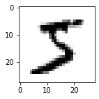

# MNIST数据集使用LeNet进行图像分类
本示例教程演示如何在MNIST数据集上用LeNet进行图像分类。
手写数字的MNIST数据集，包含60,000个用于训练的示例和10,000个用于测试的示例。这些数字已经过尺寸标准化并位于图像中心，图像是固定大小(28x28像素)，其值为0到1。该数据集的官方地址为：http://yann.lecun.com/exdb/mnist/

# 环境
本教程基于paddle-develop编写，如果您的环境不是本版本，请先安装paddle-develop版本。


```python
import paddle
print(paddle.__version__)
paddle.disable_static()
```

    0.0.0


# 加载数据集
我们使用飞桨自带的paddle.dataset完成mnist数据集的加载。


```python
print('download training data and load training data')
train_dataset = paddle.vision.datasets.MNIST(mode='train')
test_dataset = paddle.vision.datasets.MNIST(mode='test')
print('load finished')
```

    download training data and load training data
    load finished


取训练集中的一条数据看一下。


```python
import numpy as np
import matplotlib.pyplot as plt
train_data0, train_label_0 = train_dataset[0][0],train_dataset[0][1]
train_data0 = train_data0.reshape([28,28])
plt.figure(figsize=(2,2))
plt.imshow(train_data0, cmap=plt.cm.binary)
print('train_data0 label is: ' + str(train_label_0))
```

    train_data0 label is: [5]





# 2.组网
用paddle.nn下的API，如`Conv2d`、`Pool2D`、`Linead`完成LeNet的构建。


```python
import paddle
import paddle.nn.functional as F
class LeNet(paddle.nn.Layer):
    def __init__(self):
        super(LeNet, self).__init__()
        self.conv1 = paddle.nn.Conv2d(in_channels=1, out_channels=6, kernel_size=5, stride=1, padding=2)
        self.max_pool1 = paddle.nn.MaxPool2d(kernel_size=2,  stride=2)
        self.conv2 = paddle.nn.Conv2d(in_channels=6, out_channels=16, kernel_size=5, stride=1)
        self.max_pool2 = paddle.nn.MaxPool2d(kernel_size=2, stride=2)
        self.linear1 = paddle.nn.Linear(in_features=16*5*5, out_features=120)
        self.linear2 = paddle.nn.Linear(in_features=120, out_features=84)
        self.linear3 = paddle.nn.Linear(in_features=84, out_features=10)

    def forward(self, x):
        x = self.conv1(x)
        x = F.relu(x)
        x = self.max_pool1(x)
        x = F.relu(x)
        x = self.conv2(x)
        x = self.max_pool2(x)
        x = paddle.reshape(x, shape=[-1, 16*5*5])
        x = self.linear1(x)
        x = F.relu(x)
        x = self.linear2(x)
        x = F.relu(x)
        x = self.linear3(x)
        x = F.softmax(x)
        return x
```

# 3.训练方式一
组网后，开始对模型进行训练，先构建`train_loader`，加载训练数据，然后定义`train`函数，设置好损失函数后，按batch加载数据，完成模型的训练。


```python
import paddle
train_loader = paddle.io.DataLoader(train_dataset, places=paddle.CPUPlace(), batch_size=64)
# 加载训练集 batch_size 设为 64
def train(model):
    model.train()
    epochs = 2
    optim = paddle.optimizer.Adam(learning_rate=0.001, parameters=model.parameters())
    # 用Adam作为优化函数
    for epoch in range(epochs):
        for batch_id, data in enumerate(train_loader()):
            x_data = data[0]
            y_data = data[1]
            predicts = model(x_data)
            loss = paddle.nn.functional.cross_entropy(predicts, y_data)
            # 计算损失
            acc = paddle.metric.accuracy(predicts, y_data, k=2)
            avg_loss = paddle.mean(loss)
            avg_acc = paddle.mean(acc)
            avg_loss.backward()
            if batch_id % 100 == 0:
                print("epoch: {}, batch_id: {}, loss is: {}, acc is: {}".format(epoch, batch_id, avg_loss.numpy(), avg_acc.numpy()))
            optim.minimize(avg_loss)
            model.clear_gradients()
model = LeNet()
train(model)
```

    epoch: 0, batch_id: 0, loss is: [2.3064885], acc is: [0.109375]
    epoch: 0, batch_id: 100, loss is: [1.5477252], acc is: [1.]
    epoch: 0, batch_id: 200, loss is: [1.5201148], acc is: [1.]
    epoch: 0, batch_id: 300, loss is: [1.525354], acc is: [0.953125]
    epoch: 0, batch_id: 400, loss is: [1.5201038], acc is: [1.]
    epoch: 0, batch_id: 500, loss is: [1.4901408], acc is: [1.]
    epoch: 0, batch_id: 600, loss is: [1.4925538], acc is: [0.984375]
    epoch: 0, batch_id: 700, loss is: [1.5247533], acc is: [0.96875]
    epoch: 0, batch_id: 800, loss is: [1.5365943], acc is: [1.]
    epoch: 0, batch_id: 900, loss is: [1.5154861], acc is: [0.984375]
    epoch: 1, batch_id: 0, loss is: [1.4988302], acc is: [0.984375]
    epoch: 1, batch_id: 100, loss is: [1.493154], acc is: [0.984375]
    epoch: 1, batch_id: 200, loss is: [1.4974915], acc is: [1.]
    epoch: 1, batch_id: 300, loss is: [1.5089471], acc is: [0.984375]
    epoch: 1, batch_id: 400, loss is: [1.5041347], acc is: [1.]
    epoch: 1, batch_id: 500, loss is: [1.5145375], acc is: [1.]
    epoch: 1, batch_id: 600, loss is: [1.4904011], acc is: [0.984375]
    epoch: 1, batch_id: 700, loss is: [1.5121607], acc is: [0.96875]
    epoch: 1, batch_id: 800, loss is: [1.5078678], acc is: [1.]
    epoch: 1, batch_id: 900, loss is: [1.500349], acc is: [0.984375]


### 对模型进行验证
训练完成后，需要验证模型的效果，此时，加载测试数据集，然后用训练好的模对测试集进行预测，计算损失与精度。


```python
import paddle
test_loader = paddle.io.DataLoader(test_dataset, places=paddle.CPUPlace(), batch_size=64)
# 加载测试数据集
def test(model):
    model.eval()
    batch_size = 64
    for batch_id, data in enumerate(train_loader()):
        x_data = data[0]
        y_data = data[1]
        predicts = model(x_data)
        # 获取预测结果
        loss = paddle.nn.functional.cross_entropy(predicts, y_data)
        acc = paddle.metric.accuracy(predicts, y_data, k=2)
        avg_loss = paddle.mean(loss)
        avg_acc = paddle.mean(acc)
        avg_loss.backward()
        if batch_id % 100 == 0:
            print("batch_id: {}, loss is: {}, acc is: {}".format(batch_id, avg_loss.numpy(), avg_acc.numpy()))
test(model)
```

    batch_id: 0, loss is: [1.4659549], acc is: [1.]
    batch_id: 100, loss is: [1.4933192], acc is: [0.984375]
    batch_id: 200, loss is: [1.4779761], acc is: [1.]
    batch_id: 300, loss is: [1.4919193], acc is: [0.984375]
    batch_id: 400, loss is: [1.5036212], acc is: [1.]
    batch_id: 500, loss is: [1.4922347], acc is: [0.984375]
    batch_id: 600, loss is: [1.4765416], acc is: [0.984375]
    batch_id: 700, loss is: [1.4997746], acc is: [0.984375]
    batch_id: 800, loss is: [1.4831288], acc is: [1.]
    batch_id: 900, loss is: [1.498342], acc is: [0.984375]


### 训练方式一结束
以上就是训练方式一，通过这种方式，可以清楚的看到训练和测试中的每一步过程。但是，这种方式句法比较复杂。因此，我们提供了训练方式二，能够更加快速、高效的完成模型的训练与测试。

## 3.训练方式二
通过paddle提供的`Model` 构建实例，使用封装好的训练与测试接口，快速完成模型训练与测试。


```python
import paddle
from paddle.static import InputSpec
from paddle.metric import Accuracy
inputs = InputSpec([None, 784], 'float32', 'x')
labels = InputSpec([None, 10], 'float32', 'x')
model = paddle.Model(LeNet(), inputs, labels)
optim = paddle.optimizer.Adam(learning_rate=0.001, parameters=model.parameters())

model.prepare(
    optim,
    paddle.nn.loss.CrossEntropyLoss(),
    Accuracy(topk=(1, 2))
    )
```

### 使用model.fit来训练模型


```python
model.fit(train_dataset,
        epochs=2,
        batch_size=64,
        save_dir='mnist_checkpoint')
```

    Epoch 1/2
    step  10/938 - loss: 2.2434 - acc_top1: 0.1344 - acc_top2: 0.3719 - 14ms/step
    step  20/938 - loss: 2.0292 - acc_top1: 0.2836 - acc_top2: 0.4633 - 14ms/step
    step  30/938 - loss: 1.9341 - acc_top1: 0.3755 - acc_top2: 0.5214 - 14ms/step
    step  40/938 - loss: 1.8009 - acc_top1: 0.4469 - acc_top2: 0.5727 - 14ms/step
    step  50/938 - loss: 1.8000 - acc_top1: 0.4975 - acc_top2: 0.6125 - 13ms/step
    step  60/938 - loss: 1.6335 - acc_top1: 0.5417 - acc_top2: 0.6438 - 14ms/step
    step  70/938 - loss: 1.7931 - acc_top1: 0.5708 - acc_top2: 0.6643 - 13ms/step
    step  80/938 - loss: 1.6699 - acc_top1: 0.5961 - acc_top2: 0.6846 - 13ms/step
    step  90/938 - loss: 1.6832 - acc_top1: 0.6189 - acc_top2: 0.7069 - 13ms/step
    step 100/938 - loss: 1.6336 - acc_top1: 0.6409 - acc_top2: 0.7245 - 14ms/step
    step 110/938 - loss: 1.6598 - acc_top1: 0.6557 - acc_top2: 0.7376 - 13ms/step
    step 120/938 - loss: 1.6348 - acc_top1: 0.6708 - acc_top2: 0.7488 - 13ms/step
    step 130/938 - loss: 1.6223 - acc_top1: 0.6851 - acc_top2: 0.7601 - 13ms/step
    step 140/938 - loss: 1.5622 - acc_top1: 0.6970 - acc_top2: 0.7694 - 13ms/step
    step 150/938 - loss: 1.6455 - acc_top1: 0.7065 - acc_top2: 0.7767 - 14ms/step
    step 160/938 - loss: 1.6127 - acc_top1: 0.7154 - acc_top2: 0.7837 - 14ms/step
    step 170/938 - loss: 1.5963 - acc_top1: 0.7242 - acc_top2: 0.7898 - 14ms/step
    step 180/938 - loss: 1.6485 - acc_top1: 0.7310 - acc_top2: 0.7948 - 14ms/step
    step 190/938 - loss: 1.6666 - acc_top1: 0.7368 - acc_top2: 0.7992 - 14ms/step
    step 200/938 - loss: 1.7862 - acc_top1: 0.7419 - acc_top2: 0.8030 - 14ms/step
    step 210/938 - loss: 1.5479 - acc_top1: 0.7464 - acc_top2: 0.8064 - 14ms/step
    step 220/938 - loss: 1.5650 - acc_top1: 0.7515 - acc_top2: 0.8106 - 14ms/step
    step 230/938 - loss: 1.5822 - acc_top1: 0.7562 - acc_top2: 0.8141 - 14ms/step
    step 240/938 - loss: 1.5966 - acc_top1: 0.7608 - acc_top2: 0.8179 - 14ms/step
    step 250/938 - loss: 1.5551 - acc_top1: 0.7650 - acc_top2: 0.8213 - 14ms/step
    step 260/938 - loss: 1.5584 - acc_top1: 0.7699 - acc_top2: 0.8249 - 14ms/step
    step 270/938 - loss: 1.5933 - acc_top1: 0.7730 - acc_top2: 0.8273 - 14ms/step
    step 280/938 - loss: 1.5589 - acc_top1: 0.7769 - acc_top2: 0.8301 - 14ms/step
    step 290/938 - loss: 1.6513 - acc_top1: 0.7793 - acc_top2: 0.8315 - 14ms/step
    step 300/938 - loss: 1.5929 - acc_top1: 0.7821 - acc_top2: 0.8337 - 14ms/step
    step 310/938 - loss: 1.5672 - acc_top1: 0.7849 - acc_top2: 0.8360 - 14ms/step
    step 320/938 - loss: 1.5147 - acc_top1: 0.7879 - acc_top2: 0.8381 - 14ms/step
    step 330/938 - loss: 1.5697 - acc_top1: 0.7902 - acc_top2: 0.8397 - 14ms/step
    step 340/938 - loss: 1.5697 - acc_top1: 0.7919 - acc_top2: 0.8406 - 14ms/step
    step 350/938 - loss: 1.6122 - acc_top1: 0.7941 - acc_top2: 0.8423 - 14ms/step
    step 360/938 - loss: 1.5934 - acc_top1: 0.7960 - acc_top2: 0.8435 - 14ms/step
    step 370/938 - loss: 1.6258 - acc_top1: 0.7982 - acc_top2: 0.8451 - 14ms/step
    step 380/938 - loss: 1.6805 - acc_top1: 0.7996 - acc_top2: 0.8463 - 14ms/step
    step 390/938 - loss: 1.5997 - acc_top1: 0.8011 - acc_top2: 0.8475 - 14ms/step
    step 400/938 - loss: 1.6151 - acc_top1: 0.8029 - acc_top2: 0.8488 - 14ms/step
    step 410/938 - loss: 1.5800 - acc_top1: 0.8047 - acc_top2: 0.8499 - 14ms/step
    step 420/938 - loss: 1.5950 - acc_top1: 0.8060 - acc_top2: 0.8508 - 14ms/step
    step 430/938 - loss: 1.5533 - acc_top1: 0.8075 - acc_top2: 0.8517 - 14ms/step
    step 440/938 - loss: 1.6171 - acc_top1: 0.8086 - acc_top2: 0.8521 - 14ms/step
    step 450/938 - loss: 1.5756 - acc_top1: 0.8103 - acc_top2: 0.8533 - 14ms/step
    step 460/938 - loss: 1.5655 - acc_top1: 0.8121 - acc_top2: 0.8544 - 14ms/step
    step 470/938 - loss: 1.5816 - acc_top1: 0.8139 - acc_top2: 0.8555 - 14ms/step
    step 480/938 - loss: 1.6202 - acc_top1: 0.8148 - acc_top2: 0.8562 - 14ms/step
    step 490/938 - loss: 1.6223 - acc_top1: 0.8157 - acc_top2: 0.8567 - 14ms/step
    step 500/938 - loss: 1.5198 - acc_top1: 0.8167 - acc_top2: 0.8574 - 14ms/step
    step 510/938 - loss: 1.5853 - acc_top1: 0.8181 - acc_top2: 0.8583 - 14ms/step
    step 520/938 - loss: 1.5252 - acc_top1: 0.8196 - acc_top2: 0.8593 - 14ms/step
    step 530/938 - loss: 1.5265 - acc_top1: 0.8207 - acc_top2: 0.8601 - 14ms/step
    step 540/938 - loss: 1.5297 - acc_top1: 0.8217 - acc_top2: 0.8608 - 14ms/step
    step 550/938 - loss: 1.5743 - acc_top1: 0.8226 - acc_top2: 0.8613 - 13ms/step
    step 560/938 - loss: 1.6419 - acc_top1: 0.8237 - acc_top2: 0.8622 - 13ms/step
    step 570/938 - loss: 1.5556 - acc_top1: 0.8247 - acc_top2: 0.8630 - 13ms/step
    step 580/938 - loss: 1.5349 - acc_top1: 0.8254 - acc_top2: 0.8635 - 13ms/step
    step 590/938 - loss: 1.4915 - acc_top1: 0.8263 - acc_top2: 0.8640 - 13ms/step
    step 600/938 - loss: 1.5672 - acc_top1: 0.8277 - acc_top2: 0.8651 - 13ms/step
    step 610/938 - loss: 1.5464 - acc_top1: 0.8288 - acc_top2: 0.8659 - 13ms/step
    step 620/938 - loss: 1.6329 - acc_top1: 0.8292 - acc_top2: 0.8661 - 13ms/step
    step 630/938 - loss: 1.6121 - acc_top1: 0.8296 - acc_top2: 0.8662 - 13ms/step
    step 640/938 - loss: 1.5636 - acc_top1: 0.8305 - acc_top2: 0.8668 - 13ms/step
    step 650/938 - loss: 1.6227 - acc_top1: 0.8311 - acc_top2: 0.8672 - 13ms/step
    step 660/938 - loss: 1.5646 - acc_top1: 0.8319 - acc_top2: 0.8678 - 13ms/step
    step 670/938 - loss: 1.5620 - acc_top1: 0.8325 - acc_top2: 0.8681 - 13ms/step
    step 680/938 - loss: 1.4908 - acc_top1: 0.8333 - acc_top2: 0.8688 - 13ms/step
    step 690/938 - loss: 1.6010 - acc_top1: 0.8339 - acc_top2: 0.8691 - 13ms/step
    step 700/938 - loss: 1.5592 - acc_top1: 0.8346 - acc_top2: 0.8695 - 13ms/step
    step 710/938 - loss: 1.6226 - acc_top1: 0.8352 - acc_top2: 0.8699 - 13ms/step
    step 720/938 - loss: 1.5642 - acc_top1: 0.8362 - acc_top2: 0.8705 - 13ms/step
    step 730/938 - loss: 1.5807 - acc_top1: 0.8367 - acc_top2: 0.8707 - 13ms/step
    step 740/938 - loss: 1.5721 - acc_top1: 0.8371 - acc_top2: 0.8708 - 13ms/step
    step 750/938 - loss: 1.6542 - acc_top1: 0.8377 - acc_top2: 0.8711 - 13ms/step
    step 760/938 - loss: 1.5128 - acc_top1: 0.8385 - acc_top2: 0.8716 - 13ms/step
    step 770/938 - loss: 1.5711 - acc_top1: 0.8391 - acc_top2: 0.8721 - 14ms/step
    step 780/938 - loss: 1.6095 - acc_top1: 0.8395 - acc_top2: 0.8725 - 14ms/step
    step 790/938 - loss: 1.5348 - acc_top1: 0.8402 - acc_top2: 0.8730 - 14ms/step
    step 800/938 - loss: 1.5715 - acc_top1: 0.8407 - acc_top2: 0.8732 - 14ms/step
    step 810/938 - loss: 1.5880 - acc_top1: 0.8413 - acc_top2: 0.8737 - 14ms/step
    step 820/938 - loss: 1.6160 - acc_top1: 0.8418 - acc_top2: 0.8740 - 14ms/step
    step 830/938 - loss: 1.5585 - acc_top1: 0.8426 - acc_top2: 0.8746 - 14ms/step
    step 840/938 - loss: 1.5829 - acc_top1: 0.8429 - acc_top2: 0.8748 - 14ms/step
    step 850/938 - loss: 1.5348 - acc_top1: 0.8435 - acc_top2: 0.8753 - 14ms/step
    step 860/938 - loss: 1.5448 - acc_top1: 0.8438 - acc_top2: 0.8754 - 14ms/step
    step 870/938 - loss: 1.5463 - acc_top1: 0.8443 - acc_top2: 0.8759 - 14ms/step
    step 880/938 - loss: 1.5763 - acc_top1: 0.8449 - acc_top2: 0.8762 - 14ms/step
    step 890/938 - loss: 1.5699 - acc_top1: 0.8453 - acc_top2: 0.8764 - 14ms/step
    step 900/938 - loss: 1.5616 - acc_top1: 0.8456 - acc_top2: 0.8766 - 14ms/step
    step 910/938 - loss: 1.5026 - acc_top1: 0.8461 - acc_top2: 0.8771 - 14ms/step
    step 920/938 - loss: 1.5380 - acc_top1: 0.8467 - acc_top2: 0.8774 - 14ms/step
    step 930/938 - loss: 1.5993 - acc_top1: 0.8470 - acc_top2: 0.8777 - 14ms/step
    step 938/938 - loss: 1.4942 - acc_top1: 0.8473 - acc_top2: 0.8778 - 14ms/step
    save checkpoint at /Users/chenlong/online_repo/book/paddle2.0_docs/image_classification/mnist_checkpoint/0
    Epoch 2/2
    step  10/938 - loss: 1.5919 - acc_top1: 0.8875 - acc_top2: 0.9047 - 14ms/step
    step  20/938 - loss: 1.5900 - acc_top1: 0.8875 - acc_top2: 0.9062 - 14ms/step
    step  30/938 - loss: 1.5929 - acc_top1: 0.8891 - acc_top2: 0.9036 - 13ms/step
    step  40/938 - loss: 1.5855 - acc_top1: 0.8883 - acc_top2: 0.9027 - 13ms/step
    step  50/938 - loss: 1.6197 - acc_top1: 0.8916 - acc_top2: 0.9072 - 13ms/step
    step  60/938 - loss: 1.5084 - acc_top1: 0.8914 - acc_top2: 0.9078 - 13ms/step
    step  70/938 - loss: 1.5552 - acc_top1: 0.8904 - acc_top2: 0.9067 - 13ms/step
    step  80/938 - loss: 1.5700 - acc_top1: 0.8887 - acc_top2: 0.9049 - 13ms/step
    step  90/938 - loss: 1.6073 - acc_top1: 0.8866 - acc_top2: 0.9030 - 13ms/step
    step 100/938 - loss: 1.5754 - acc_top1: 0.8859 - acc_top2: 0.9022 - 13ms/step
    step 110/938 - loss: 1.5484 - acc_top1: 0.8848 - acc_top2: 0.9017 - 14ms/step
    step 120/938 - loss: 1.5904 - acc_top1: 0.8840 - acc_top2: 0.9020 - 14ms/step
    step 130/938 - loss: 1.5108 - acc_top1: 0.8852 - acc_top2: 0.9025 - 14ms/step
    step 140/938 - loss: 1.6199 - acc_top1: 0.8840 - acc_top2: 0.9016 - 14ms/step
    step 150/938 - loss: 1.5337 - acc_top1: 0.8842 - acc_top2: 0.9019 - 13ms/step
    step 160/938 - loss: 1.6094 - acc_top1: 0.8846 - acc_top2: 0.9023 - 13ms/step
    step 170/938 - loss: 1.5653 - acc_top1: 0.8843 - acc_top2: 0.9019 - 13ms/step
    step 180/938 - loss: 1.5978 - acc_top1: 0.8835 - acc_top2: 0.9011 - 13ms/step
    step 190/938 - loss: 1.5950 - acc_top1: 0.8833 - acc_top2: 0.9012 - 13ms/step
    step 200/938 - loss: 1.6422 - acc_top1: 0.8828 - acc_top2: 0.9002 - 13ms/step
    step 210/938 - loss: 1.5752 - acc_top1: 0.8831 - acc_top2: 0.9004 - 13ms/step
    step 220/938 - loss: 1.6635 - acc_top1: 0.8832 - acc_top2: 0.9001 - 13ms/step
    step 230/938 - loss: 1.5726 - acc_top1: 0.8823 - acc_top2: 0.8991 - 13ms/step
    step 240/938 - loss: 1.5702 - acc_top1: 0.8814 - acc_top2: 0.8981 - 13ms/step
    step 250/938 - loss: 1.5748 - acc_top1: 0.8814 - acc_top2: 0.8981 - 14ms/step
    step 260/938 - loss: 1.5589 - acc_top1: 0.8822 - acc_top2: 0.8988 - 14ms/step
    step 270/938 - loss: 1.5902 - acc_top1: 0.8823 - acc_top2: 0.8988 - 14ms/step
    step 280/938 - loss: 1.5646 - acc_top1: 0.8817 - acc_top2: 0.8982 - 14ms/step
    step 290/938 - loss: 1.6280 - acc_top1: 0.8819 - acc_top2: 0.8985 - 14ms/step
    step 300/938 - loss: 1.5697 - acc_top1: 0.8815 - acc_top2: 0.8982 - 14ms/step
    step 310/938 - loss: 1.5540 - acc_top1: 0.8814 - acc_top2: 0.8981 - 14ms/step
    step 320/938 - loss: 1.5598 - acc_top1: 0.8821 - acc_top2: 0.8988 - 14ms/step
    step 330/938 - loss: 1.5498 - acc_top1: 0.8824 - acc_top2: 0.8991 - 14ms/step
    step 340/938 - loss: 1.6276 - acc_top1: 0.8818 - acc_top2: 0.8984 - 14ms/step
    step 350/938 - loss: 1.5129 - acc_top1: 0.8821 - acc_top2: 0.8988 - 14ms/step
    step 360/938 - loss: 1.6158 - acc_top1: 0.8818 - acc_top2: 0.8984 - 14ms/step
    step 370/938 - loss: 1.5300 - acc_top1: 0.8820 - acc_top2: 0.8986 - 14ms/step
    step 380/938 - loss: 1.5718 - acc_top1: 0.8822 - acc_top2: 0.8988 - 14ms/step
    step 390/938 - loss: 1.5898 - acc_top1: 0.8825 - acc_top2: 0.8990 - 14ms/step
    step 400/938 - loss: 1.5177 - acc_top1: 0.8834 - acc_top2: 0.9000 - 14ms/step
    step 410/938 - loss: 1.6493 - acc_top1: 0.8831 - acc_top2: 0.8997 - 14ms/step
    step 420/938 - loss: 1.5071 - acc_top1: 0.8838 - acc_top2: 0.9002 - 14ms/step
    step 430/938 - loss: 1.5982 - acc_top1: 0.8840 - acc_top2: 0.9002 - 14ms/step
    step 440/938 - loss: 1.5649 - acc_top1: 0.8841 - acc_top2: 0.9003 - 14ms/step
    step 450/938 - loss: 1.5555 - acc_top1: 0.8844 - acc_top2: 0.9005 - 14ms/step
    step 460/938 - loss: 1.5536 - acc_top1: 0.8845 - acc_top2: 0.9005 - 14ms/step
    step 470/938 - loss: 1.5401 - acc_top1: 0.8851 - acc_top2: 0.9011 - 14ms/step
    step 480/938 - loss: 1.5549 - acc_top1: 0.8854 - acc_top2: 0.9013 - 14ms/step
    step 490/938 - loss: 1.5596 - acc_top1: 0.8858 - acc_top2: 0.9017 - 14ms/step
    step 500/938 - loss: 1.5059 - acc_top1: 0.8860 - acc_top2: 0.9018 - 14ms/step
    step 510/938 - loss: 1.6073 - acc_top1: 0.8858 - acc_top2: 0.9017 - 14ms/step
    step 520/938 - loss: 1.5588 - acc_top1: 0.8857 - acc_top2: 0.9016 - 14ms/step
    step 530/938 - loss: 1.6165 - acc_top1: 0.8859 - acc_top2: 0.9019 - 14ms/step
    step 540/938 - loss: 1.5884 - acc_top1: 0.8862 - acc_top2: 0.9023 - 14ms/step
    step 550/938 - loss: 1.6552 - acc_top1: 0.8863 - acc_top2: 0.9027 - 14ms/step
    step 560/938 - loss: 1.5529 - acc_top1: 0.8867 - acc_top2: 0.9030 - 14ms/step
    step 570/938 - loss: 1.5441 - acc_top1: 0.8866 - acc_top2: 0.9029 - 14ms/step
    step 580/938 - loss: 1.5438 - acc_top1: 0.8867 - acc_top2: 0.9029 - 14ms/step
    step 590/938 - loss: 1.5761 - acc_top1: 0.8868 - acc_top2: 0.9029 - 14ms/step
    step 600/938 - loss: 1.5384 - acc_top1: 0.8867 - acc_top2: 0.9029 - 14ms/step
    step 610/938 - loss: 1.5858 - acc_top1: 0.8871 - acc_top2: 0.9032 - 14ms/step
    step 620/938 - loss: 1.5524 - acc_top1: 0.8872 - acc_top2: 0.9034 - 14ms/step
    step 630/938 - loss: 1.6182 - acc_top1: 0.8875 - acc_top2: 0.9035 - 14ms/step
    step 640/938 - loss: 1.6326 - acc_top1: 0.8877 - acc_top2: 0.9037 - 14ms/step
    step 650/938 - loss: 1.5871 - acc_top1: 0.8877 - acc_top2: 0.9035 - 14ms/step
    step 660/938 - loss: 1.5403 - acc_top1: 0.8877 - acc_top2: 0.9034 - 14ms/step
    step 670/938 - loss: 1.5539 - acc_top1: 0.8879 - acc_top2: 0.9035 - 14ms/step
    step 680/938 - loss: 1.4918 - acc_top1: 0.8881 - acc_top2: 0.9036 - 14ms/step
    step 690/938 - loss: 1.6007 - acc_top1: 0.8882 - acc_top2: 0.9036 - 14ms/step
    step 700/938 - loss: 1.5539 - acc_top1: 0.8883 - acc_top2: 0.9037 - 14ms/step
    step 710/938 - loss: 1.6036 - acc_top1: 0.8882 - acc_top2: 0.9035 - 14ms/step
    step 720/938 - loss: 1.5943 - acc_top1: 0.8881 - acc_top2: 0.9035 - 14ms/step
    step 730/938 - loss: 1.5714 - acc_top1: 0.8881 - acc_top2: 0.9035 - 14ms/step
    step 740/938 - loss: 1.5095 - acc_top1: 0.8881 - acc_top2: 0.9035 - 14ms/step
    step 750/938 - loss: 1.5069 - acc_top1: 0.8882 - acc_top2: 0.9035 - 14ms/step
    step 760/938 - loss: 1.5816 - acc_top1: 0.8882 - acc_top2: 0.9035 - 14ms/step
    step 770/938 - loss: 1.5855 - acc_top1: 0.8880 - acc_top2: 0.9033 - 14ms/step
    step 780/938 - loss: 1.5599 - acc_top1: 0.8881 - acc_top2: 0.9034 - 14ms/step
    step 790/938 - loss: 1.6029 - acc_top1: 0.8879 - acc_top2: 0.9032 - 14ms/step
    step 800/938 - loss: 1.5839 - acc_top1: 0.8880 - acc_top2: 0.9033 - 14ms/step
    step 810/938 - loss: 1.5545 - acc_top1: 0.8882 - acc_top2: 0.9035 - 14ms/step
    step 820/938 - loss: 1.5458 - acc_top1: 0.8881 - acc_top2: 0.9036 - 14ms/step
    step 830/938 - loss: 1.5911 - acc_top1: 0.8879 - acc_top2: 0.9033 - 14ms/step
    step 840/938 - loss: 1.5845 - acc_top1: 0.8881 - acc_top2: 0.9035 - 14ms/step
    step 850/938 - loss: 1.5628 - acc_top1: 0.8880 - acc_top2: 0.9035 - 14ms/step
    step 860/938 - loss: 1.5596 - acc_top1: 0.8880 - acc_top2: 0.9035 - 14ms/step
    step 870/938 - loss: 1.5843 - acc_top1: 0.8882 - acc_top2: 0.9036 - 14ms/step
    step 880/938 - loss: 1.5393 - acc_top1: 0.8883 - acc_top2: 0.9036 - 14ms/step
    step 890/938 - loss: 1.5382 - acc_top1: 0.8882 - acc_top2: 0.9035 - 14ms/step
    step 900/938 - loss: 1.5910 - acc_top1: 0.8884 - acc_top2: 0.9036 - 14ms/step
    step 910/938 - loss: 1.5682 - acc_top1: 0.8886 - acc_top2: 0.9038 - 14ms/step
    step 920/938 - loss: 1.5736 - acc_top1: 0.8889 - acc_top2: 0.9039 - 14ms/step
    step 930/938 - loss: 1.5283 - acc_top1: 0.8888 - acc_top2: 0.9038 - 14ms/step
    step 938/938 - loss: 1.5582 - acc_top1: 0.8888 - acc_top2: 0.9038 - 14ms/step
    save checkpoint at /Users/chenlong/online_repo/book/paddle2.0_docs/image_classification/mnist_checkpoint/1
    save checkpoint at /Users/chenlong/online_repo/book/paddle2.0_docs/image_classification/mnist_checkpoint/final


### 使用model.evaluate来预测模型


```python
model.evaluate(test_dataset, batch_size=64)
```

    Eval begin...
    step  10/157 - loss: 1.5447 - acc_top1: 0.8953 - acc_top2: 0.9078 - 5ms/step
    step  20/157 - loss: 1.6185 - acc_top1: 0.8930 - acc_top2: 0.9078 - 5ms/step
    step  30/157 - loss: 1.6497 - acc_top1: 0.8917 - acc_top2: 0.9057 - 5ms/step
    step  40/157 - loss: 1.6318 - acc_top1: 0.8902 - acc_top2: 0.9055 - 5ms/step
    step  50/157 - loss: 1.5533 - acc_top1: 0.8856 - acc_top2: 0.9012 - 5ms/step
    step  60/157 - loss: 1.6212 - acc_top1: 0.8878 - acc_top2: 0.9036 - 5ms/step
    step  70/157 - loss: 1.5674 - acc_top1: 0.8839 - acc_top2: 0.9002 - 5ms/step
    step  80/157 - loss: 1.5409 - acc_top1: 0.8891 - acc_top2: 0.9043 - 5ms/step
    step  90/157 - loss: 1.6133 - acc_top1: 0.8903 - acc_top2: 0.9045 - 5ms/step
    step 100/157 - loss: 1.5535 - acc_top1: 0.8909 - acc_top2: 0.9044 - 5ms/step
    step 110/157 - loss: 1.5690 - acc_top1: 0.8916 - acc_top2: 0.9054 - 5ms/step
    step 120/157 - loss: 1.6147 - acc_top1: 0.8926 - acc_top2: 0.9055 - 5ms/step
    step 130/157 - loss: 1.5203 - acc_top1: 0.8944 - acc_top2: 0.9066 - 5ms/step
    step 140/157 - loss: 1.5066 - acc_top1: 0.8952 - acc_top2: 0.9068 - 5ms/step
    step 150/157 - loss: 1.5536 - acc_top1: 0.8958 - acc_top2: 0.9072 - 5ms/step
    step 157/157 - loss: 1.5855 - acc_top1: 0.8956 - acc_top2: 0.9076 - 5ms/step
    Eval samples: 10000


    {'loss': [1.585474], 'acc_top1': 0.8956, 'acc_top2': 0.9076}


### 训练方式二结束
以上就是训练方式二，可以快速、高效的完成网络模型训练与预测。

## 总结


以上就是用LeNet对手写数字数据及MNIST进行分类。本示例提供了两种训练模型的方式，一种可以快速完成模型的组建与预测，非常适合新手用户上手。另一种则需要多个步骤来完成模型的训练，适合进阶用户使用。


```python

```
