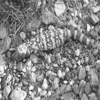

通过Sub-Pixel实现图像超分辨率
=============================

1.简要介绍
==========

在计算机视觉中，图像超分辨率（Image Super
Resolution）是指由一幅低分辨率图像或图像序列恢复出高分辨率图像。图像超分辨率技术分为超分辨率复原和超分辨率重建。

本示例简要介绍如何通过飞桨开源框架，实现图像超分辨率。包括数据集的定义、模型的搭建与训练。

参考论文：《Real-Time Single Image and Video Super-Resolution Using an
Efficient Sub-Pixel Convolutional Neural Network》

论文链接：https://arxiv.org/abs/1609.05158

2.环境设置
==========

导入一些比较基础常用的模块，确认自己的飞桨版本。

.. code:: ipython3

    import os
    import io
    import math
    import random
    import numpy as np
    import matplotlib.pyplot as plt
    from PIL import Image
    
    from IPython.display import display
    
    import paddle
    from paddle.io import Dataset
    from paddle.vision.transforms import transforms
    
    print(paddle.__version__)

.. parsed-literal::

    2.0.0-rc1

3.数据集
========

3.1 数据集下载
~~~~~~~~~~~~~~

本案例使用BSR_bsds500数据集，下载链接：http://www.eecs.berkeley.edu/Research/Projects/CS/vision/grouping/BSR/BSR_bsds500.tgz

.. code:: ipython3

    !wget --no-check-certificate --no-cookies --header "Cookie: oraclelicense=accept-securebackup-cookie" http://www.eecs.berkeley.edu/Research/Projects/CS/vision/grouping/BSR/BSR_bsds500.tgz
    !tar -zxvf BSR_bsds500.tgz

.. parsed-literal::

    --2020-12-14 18:41:57--  http://www.eecs.berkeley.edu/Research/Projects/CS/vision/grouping/BSR/BSR_bsds500.tgz
    正在解析主机 www.eecs.berkeley.edu (www.eecs.berkeley.edu)... 23.185.0.1
    正在连接 www.eecs.berkeley.edu (www.eecs.berkeley.edu)|23.185.0.1|:80... 已连接。
    已发出 HTTP 请求，正在等待回应... 301 Moved Permanently
    位置：https://www.eecs.berkeley.edu/Research/Projects/CS/vision/grouping/BSR/BSR_bsds500.tgz [跟随至新的 URL]
    --2020-12-14 18:41:58--  https://www.eecs.berkeley.edu/Research/Projects/CS/vision/grouping/BSR/BSR_bsds500.tgz
    正在连接 www.eecs.berkeley.edu (www.eecs.berkeley.edu)|23.185.0.1|:443... 已连接。
    已发出 HTTP 请求，正在等待回应... 301 Moved Permanently
    位置：https://www2.eecs.berkeley.edu/Research/Projects/CS/vision/grouping/BSR/BSR_bsds500.tgz [跟随至新的 URL]
    --2020-12-14 18:42:01--  https://www2.eecs.berkeley.edu/Research/Projects/CS/vision/grouping/BSR/BSR_bsds500.tgz
    正在解析主机 www2.eecs.berkeley.edu (www2.eecs.berkeley.edu)... 128.32.189.73
    正在连接 www2.eecs.berkeley.edu (www2.eecs.berkeley.edu)|128.32.189.73|:443... 已连接。
    已发出 HTTP 请求，正在等待回应... 200 OK
    长度：70763455 (67M) [application/x-tar]
    正在保存至: “BSR_bsds500.tgz”
    
    BSR_bsds500.tgz      39%[======>             ]  26.42M  7.43KB/s  用时 43m 21s   
    
    2020-12-14 19:40:27 (10.4 KB/s) - 在 27705344/70763455 字节处发生读取错误 (Success)。重试中。
    
    --2020-12-14 19:40:28--  (尝试次数： 2)  https://www2.eecs.berkeley.edu/Research/Projects/CS/vision/grouping/BSR/BSR_bsds500.tgz
    正在连接 www2.eecs.berkeley.edu (www2.eecs.berkeley.edu)|128.32.189.73|:443... 已连接。
    已发出 HTTP 请求，正在等待回应... 206 Partial Content
    长度：70763455 (67M)，剩余 43058111 (41M) [application/x-tar]
    正在保存至: “BSR_bsds500.tgz”
    
    BSR_bsds500.tgz      84%[+++++++========>    ]  56.77M  1.80KB/s  用时 77m 57s   
    
    2020-12-14 20:58:34 (6.64 KB/s) - 在 59523072 字节处连接关闭。重试中。
    
    --2020-12-14 20:58:36--  (尝试次数： 3)  https://www2.eecs.berkeley.edu/Research/Projects/CS/vision/grouping/BSR/BSR_bsds500.tgz
    正在连接 www2.eecs.berkeley.edu (www2.eecs.berkeley.edu)|128.32.189.73|:443... 已连接。
    已发出 HTTP 请求，正在等待回应... 206 Partial Content
    长度：70763455 (67M)，剩余 11240383 (11M) [application/x-tar]
    正在保存至: “BSR_bsds500.tgz”
    
    BSR_bsds500.tgz      84%[++++++++++++++++    ]  57.28M  3.25KB/s  用时 2m 8s     
    
    2020-12-14 21:15:46 (4.14 KB/s) - 在 60063744/70763455 字节处发生读取错误 (Success)。重试中。
    
    --2020-12-14 21:15:49--  (尝试次数： 4)  https://www2.eecs.berkeley.edu/Research/Projects/CS/vision/grouping/BSR/BSR_bsds500.tgz
    正在连接 www2.eecs.berkeley.edu (www2.eecs.berkeley.edu)|128.32.189.73|:443... 已连接。
    已发出 HTTP 请求，正在等待回应... 206 Partial Content
    长度：70763455 (67M)，剩余 10699711 (10M) [application/x-tar]
    正在保存至: “BSR_bsds500.tgz”
    
    BSR_bsds500.tgz      95%[++++++++++++++++==> ]  64.50M  3.25KB/s  用时 27m 17s   
    
    2020-12-14 21:43:10 (4.52 KB/s) - 在 67633152 字节处连接关闭。重试中。
    
    --2020-12-14 21:43:14--  (尝试次数： 5)  https://www2.eecs.berkeley.edu/Research/Projects/CS/vision/grouping/BSR/BSR_bsds500.tgz
    正在连接 www2.eecs.berkeley.edu (www2.eecs.berkeley.edu)|128.32.189.73|:443... 已连接。
    已发出 HTTP 请求，正在等待回应... 206 Partial Content
    长度：70763455 (67M)，剩余 3130303 (3.0M) [application/x-tar]
    正在保存至: “BSR_bsds500.tgz”
    
    BSR_bsds500.tgz      95%[+++++++++++++++++++ ]  64.52M  6.51KB/s  用时 2.5s      
    
    2020-12-14 21:59:26 (6.51 KB/s) - 在 67649536/70763455 字节处发生读取错误 (Success)。重试中。
    
    --2020-12-14 21:59:31--  (尝试次数： 6)  https://www2.eecs.berkeley.edu/Research/Projects/CS/vision/grouping/BSR/BSR_bsds500.tgz
    正在连接 www2.eecs.berkeley.edu (www2.eecs.berkeley.edu)|128.32.189.73|:443... 已连接。
    已发出 HTTP 请求，正在等待回应... 206 Partial Content
    长度：70763455 (67M)，剩余 3113919 (3.0M) [application/x-tar]
    正在保存至: “BSR_bsds500.tgz”
    
    BSR_bsds500.tgz      98%[+++++++++++++++++++ ]  66.58M  2.46KB/s  用时 9m 38s    
    
    2020-12-14 22:09:18 (3.66 KB/s) - 在 69812224 字节处连接关闭。重试中。
    
    --2020-12-14 22:09:24--  (尝试次数： 7)  https://www2.eecs.berkeley.edu/Research/Projects/CS/vision/grouping/BSR/BSR_bsds500.tgz
    正在连接 www2.eecs.berkeley.edu (www2.eecs.berkeley.edu)|128.32.189.73|:443... 已连接。
    已发出 HTTP 请求，正在等待回应... 206 Partial Content
    长度：70763455 (67M)，剩余 951231 (929K) [application/x-tar]
    正在保存至: “BSR_bsds500.tgz”
    
    BSR_bsds500.tgz     100%[+++++++++++++++++++>]  67.48M  2.57KB/s  用时 4m 26s    
    
    2020-12-14 22:13:52 (3.49 KB/s) - 已保存 “BSR_bsds500.tgz” [70763455/70763455])
    
    x BSR/
    x BSR/documentation/
    x BSR/documentation/Arbelaez_Maire_Fowlkes_Malik_TPAMI2010.pdf
    x BSR/bench/
    x BSR/bench/source/
    x BSR/bench/source/match.hh
    x BSR/bench/source/Matrix.cc
    x BSR/bench/source/Timer.cc
    x BSR/bench/source/csa_types.h
    x BSR/bench/source/csa.cc
    x BSR/bench/source/correspondPixels.cc
    x BSR/bench/source/build.sh
    x BSR/bench/source/match.cc
    x BSR/bench/source/Sort.hh
    x BSR/bench/source/csa_defs.h
    x BSR/bench/source/Timer.hh
    x BSR/bench/source/Exception.cc
    x BSR/bench/source/String.cc
    x BSR/bench/source/Array.hh
    x BSR/bench/source/kofn.hh
    x BSR/bench/source/Random.hh
    x BSR/bench/source/Exception.hh
    x BSR/bench/source/.gitignore
    x BSR/bench/source/kofn.cc
    x BSR/bench/source/build.m
    x BSR/bench/source/Random.cc
    x BSR/bench/source/Point.hh
    x BSR/bench/source/README
    x BSR/bench/source/Matrix.hh
    x BSR/bench/source/csa.hh
    x BSR/bench/source/String.hh
    x BSR/bench/bench_bsds500.m
    x BSR/bench/data/
    x BSR/bench/data/groundTruth/
    x BSR/bench/data/groundTruth/6046.mat
    x BSR/bench/data/groundTruth/2018.mat
    x BSR/bench/data/groundTruth/8068.mat
    x BSR/bench/data/groundTruth/5096.mat
    x BSR/bench/data/groundTruth/3063.mat
    x BSR/bench/data/segs/
    x BSR/bench/data/segs/6046.mat
    x BSR/bench/data/segs/2018.mat
    x BSR/bench/data/segs/8068.mat
    x BSR/bench/data/segs/5096.mat
    x BSR/bench/data/segs/3063.mat
    x BSR/bench/data/test_2/
    x BSR/bench/data/test_2/eval_bdry.txt
    x BSR/bench/data/test_2/eval_bdry_img.txt
    x BSR/bench/data/test_2/eval_bdry_thr.txt
    x BSR/bench/data/test_5/
    x BSR/bench/data/test_5/eval_RI_VOI.txt
    x BSR/bench/data/test_5/eval_cover_img.txt
    x BSR/bench/data/test_5/eval_cover_th.txt
    x BSR/bench/data/test_5/eval_cover.txt
    x BSR/bench/data/test_5/eval_RI_VOI_thr.txt
    x BSR/bench/data/ucm2/
    x BSR/bench/data/ucm2/6046.mat
    x BSR/bench/data/ucm2/2018.mat
    x BSR/bench/data/ucm2/8068.mat
    x BSR/bench/data/ucm2/5096.mat
    x BSR/bench/data/ucm2/3063.mat
    x BSR/bench/data/test_3/
    x BSR/bench/data/test_3/eval_bdry.txt
    x BSR/bench/data/test_3/eval_bdry_img.txt
    x BSR/bench/data/test_3/eval_bdry_thr.txt
    x BSR/bench/data/png/
    x BSR/bench/data/png/5096.png
    x BSR/bench/data/png/6046.png
    x BSR/bench/data/png/8068.png
    x BSR/bench/data/png/2018.png
    x BSR/bench/data/png/3063.png
    x BSR/bench/data/images/
    x BSR/bench/data/images/2018.jpg
    x BSR/bench/data/images/5096.jpg
    x BSR/bench/data/images/3063.jpg
    x BSR/bench/data/images/8068.jpg
    x BSR/bench/data/images/6046.jpg
    x BSR/bench/data/test_1/
    x BSR/bench/data/test_1/eval_RI_VOI.txt
    x BSR/bench/data/test_1/eval_cover_img.txt
    x BSR/bench/data/test_1/eval_bdry.txt
    x BSR/bench/data/test_1/eval_bdry_img.txt
    x BSR/bench/data/test_1/eval_cover_th.txt
    x BSR/bench/data/test_1/eval_cover.txt
    x BSR/bench/data/test_1/eval_bdry_thr.txt
    x BSR/bench/data/test_1/eval_RI_VOI_thr.txt
    x BSR/bench/data/test_4/
    x BSR/bench/data/test_4/eval_RI_VOI.txt
    x BSR/bench/data/test_4/eval_cover_img.txt
    x BSR/bench/data/test_4/eval_bdry.txt
    x BSR/bench/data/test_4/eval_bdry_img.txt
    x BSR/bench/data/test_4/eval_cover_th.txt
    x BSR/bench/data/test_4/eval_cover.txt
    x BSR/bench/data/test_4/eval_bdry_thr.txt
    x BSR/bench/data/test_4/eval_RI_VOI_thr.txt
    x BSR/bench/test_benchs.m
    x BSR/bench/benchmarks/
    x BSR/bench/benchmarks/match_segmentations.m
    x BSR/bench/benchmarks/match_segmentations2.m
    x BSR/bench/benchmarks/collect_eval_bdry.m
    x BSR/bench/benchmarks/create_isoF_figure.m
    x BSR/bench/benchmarks/seg2bdry.m
    x BSR/bench/benchmarks/boundaryBench.m
    x BSR/bench/benchmarks/correspondPixels.mexa64
    x BSR/bench/benchmarks/regionBench.m
    x BSR/bench/benchmarks/isoF.fig
    x BSR/bench/benchmarks/evaluation_bdry_image.m
    x BSR/bench/benchmarks/correspondPixels.m
    x BSR/bench/benchmarks/allBench.m
    x BSR/bench/benchmarks/plot_eval.m
    x BSR/bench/benchmarks/collect_eval_reg.m
    x BSR/bench/benchmarks/evaluation_reg_image.m
    x BSR/BSDS500/
    x BSR/BSDS500/data/
    x BSR/BSDS500/data/groundTruth/
    x BSR/BSDS500/data/groundTruth/train/
    x BSR/BSDS500/data/groundTruth/train/196015.mat
    x BSR/BSDS500/data/groundTruth/train/65132.mat
    x BSR/BSDS500/data/groundTruth/train/189011.mat
    x BSR/BSDS500/data/groundTruth/train/92059.mat
    x BSR/BSDS500/data/groundTruth/train/178054.mat
    x BSR/BSDS500/data/groundTruth/train/156079.mat
    x BSR/BSDS500/data/groundTruth/train/254033.mat
    x BSR/BSDS500/data/groundTruth/train/271008.mat
    x BSR/BSDS500/data/groundTruth/train/65010.mat
    x BSR/BSDS500/data/groundTruth/train/216041.mat
    x BSR/BSDS500/data/groundTruth/train/159045.mat
    x BSR/BSDS500/data/groundTruth/train/104022.mat
    x BSR/BSDS500/data/groundTruth/train/247085.mat
    x BSR/BSDS500/data/groundTruth/train/20008.mat
    x BSR/BSDS500/data/groundTruth/train/42078.mat
    x BSR/BSDS500/data/groundTruth/train/23080.mat
    x BSR/BSDS500/data/groundTruth/train/311068.mat
    x BSR/BSDS500/data/groundTruth/train/35070.mat
    x BSR/BSDS500/data/groundTruth/train/94079.mat
    x BSR/BSDS500/data/groundTruth/train/71046.mat
    x BSR/BSDS500/data/groundTruth/train/112082.mat
    x BSR/BSDS500/data/groundTruth/train/236017.mat
    x BSR/BSDS500/data/groundTruth/train/198023.mat
    x BSR/BSDS500/data/groundTruth/train/43070.mat
    x BSR/BSDS500/data/groundTruth/train/60079.mat
    x BSR/BSDS500/data/groundTruth/train/323016.mat
    x BSR/BSDS500/data/groundTruth/train/187039.mat
    x BSR/BSDS500/data/groundTruth/train/35008.mat
    x BSR/BSDS500/data/groundTruth/train/172032.mat
    x BSR/BSDS500/data/groundTruth/train/301007.mat
    x BSR/BSDS500/data/groundTruth/train/202012.mat
    x BSR/BSDS500/data/groundTruth/train/130034.mat
    x BSR/BSDS500/data/groundTruth/train/368016.mat
    x BSR/BSDS500/data/groundTruth/train/183087.mat
    x BSR/BSDS500/data/groundTruth/train/23084.mat
    x BSR/BSDS500/data/groundTruth/train/90076.mat
    x BSR/BSDS500/data/groundTruth/train/12074.mat
    x BSR/BSDS500/data/groundTruth/train/374020.mat
    x BSR/BSDS500/data/groundTruth/train/249061.mat
    x BSR/BSDS500/data/groundTruth/train/246016.mat
    x BSR/BSDS500/data/groundTruth/train/113016.mat
    x BSR/BSDS500/data/groundTruth/train/134008.mat
    x BSR/BSDS500/data/groundTruth/train/176019.mat
    x BSR/BSDS500/data/groundTruth/train/161062.mat
    x BSR/BSDS500/data/groundTruth/train/271031.mat
    x BSR/BSDS500/data/groundTruth/train/103041.mat
    x BSR/BSDS500/data/groundTruth/train/43083.mat
    x BSR/BSDS500/data/groundTruth/train/365025.mat
    x BSR/BSDS500/data/groundTruth/train/24063.mat
    x BSR/BSDS500/data/groundTruth/train/376001.mat
    x BSR/BSDS500/data/groundTruth/train/225017.mat
    x BSR/BSDS500/data/groundTruth/train/65019.mat
    x BSR/BSDS500/data/groundTruth/train/181018.mat
    x BSR/BSDS500/data/groundTruth/train/124084.mat
    x BSR/BSDS500/data/groundTruth/train/188005.mat
    x BSR/BSDS500/data/groundTruth/train/246053.mat
    x BSR/BSDS500/data/groundTruth/train/122048.mat
    x BSR/BSDS500/data/groundTruth/train/361084.mat
    x BSR/BSDS500/data/groundTruth/train/260081.mat
    x BSR/BSDS500/data/groundTruth/train/8143.mat
    x BSR/BSDS500/data/groundTruth/train/245051.mat
    x BSR/BSDS500/data/groundTruth/train/126039.mat
    x BSR/BSDS500/data/groundTruth/train/187071.mat
    x BSR/BSDS500/data/groundTruth/train/302003.mat
    x BSR/BSDS500/data/groundTruth/train/61086.mat
    x BSR/BSDS500/data/groundTruth/train/388016.mat
    x BSR/BSDS500/data/groundTruth/train/166081.mat
    x BSR/BSDS500/data/groundTruth/train/35058.mat
    x BSR/BSDS500/data/groundTruth/train/372047.mat
    x BSR/BSDS500/data/groundTruth/train/314016.mat
    x BSR/BSDS500/data/groundTruth/train/181091.mat
    x BSR/BSDS500/data/groundTruth/train/106020.mat
    x BSR/BSDS500/data/groundTruth/train/67079.mat
    x BSR/BSDS500/data/groundTruth/train/310007.mat
    x BSR/BSDS500/data/groundTruth/train/2092.mat
    x BSR/BSDS500/data/groundTruth/train/117054.mat
    x BSR/BSDS500/data/groundTruth/train/159029.mat
    x BSR/BSDS500/data/groundTruth/train/97017.mat
    x BSR/BSDS500/data/groundTruth/train/140055.mat
    x BSR/BSDS500/data/groundTruth/train/134052.mat
    x BSR/BSDS500/data/groundTruth/train/41025.mat
    x BSR/BSDS500/data/groundTruth/train/183055.mat
    x BSR/BSDS500/data/groundTruth/train/23025.mat
    x BSR/BSDS500/data/groundTruth/train/28096.mat
    x BSR/BSDS500/data/groundTruth/train/173036.mat
    x BSR/BSDS500/data/groundTruth/train/353013.mat
    x BSR/BSDS500/data/groundTruth/train/55067.mat
    x BSR/BSDS500/data/groundTruth/train/56028.mat
    x BSR/BSDS500/data/groundTruth/train/368078.mat
    x BSR/BSDS500/data/groundTruth/train/147062.mat
    x BSR/BSDS500/data/groundTruth/train/227046.mat
    x BSR/BSDS500/data/groundTruth/train/370036.mat
    x BSR/BSDS500/data/groundTruth/train/61060.mat
    x BSR/BSDS500/data/groundTruth/train/311081.mat
    x BSR/BSDS500/data/groundTruth/train/35091.mat
    x BSR/BSDS500/data/groundTruth/train/309004.mat
    x BSR/BSDS500/data/groundTruth/train/299091.mat
    x BSR/BSDS500/data/groundTruth/train/151087.mat
    x BSR/BSDS500/data/groundTruth/train/155060.mat
    x BSR/BSDS500/data/groundTruth/train/144067.mat
    x BSR/BSDS500/data/groundTruth/train/374067.mat
    x BSR/BSDS500/data/groundTruth/train/189003.mat
    x BSR/BSDS500/data/groundTruth/train/188091.mat
    x BSR/BSDS500/data/groundTruth/train/153077.mat
    x BSR/BSDS500/data/groundTruth/train/76002.mat
    x BSR/BSDS500/data/groundTruth/train/277095.mat
    x BSR/BSDS500/data/groundTruth/train/207056.mat
    x BSR/BSDS500/data/groundTruth/train/286092.mat
    x BSR/BSDS500/data/groundTruth/train/145053.mat
    x BSR/BSDS500/data/groundTruth/train/157036.mat
    x BSR/BSDS500/data/groundTruth/train/138032.mat
    x BSR/BSDS500/data/groundTruth/train/242078.mat
    x BSR/BSDS500/data/groundTruth/train/176039.mat
    x BSR/BSDS500/data/groundTruth/train/163014.mat
    x BSR/BSDS500/data/groundTruth/train/376020.mat
    x BSR/BSDS500/data/groundTruth/train/12003.mat
    x BSR/BSDS500/data/groundTruth/train/140075.mat
    x BSR/BSDS500/data/groundTruth/train/249087.mat
    x BSR/BSDS500/data/groundTruth/train/109034.mat
    x BSR/BSDS500/data/groundTruth/train/293029.mat
    x BSR/BSDS500/data/groundTruth/train/45077.mat
    x BSR/BSDS500/data/groundTruth/train/326038.mat
    x BSR/BSDS500/data/groundTruth/train/42044.mat
    x BSR/BSDS500/data/groundTruth/train/138078.mat
    x BSR/BSDS500/data/groundTruth/train/48055.mat
    x BSR/BSDS500/data/groundTruth/train/159091.mat
    x BSR/BSDS500/data/groundTruth/train/100075.mat
    x BSR/BSDS500/data/groundTruth/train/59078.mat
    x BSR/BSDS500/data/groundTruth/train/268002.mat
    x BSR/BSDS500/data/groundTruth/train/365073.mat
    x BSR/BSDS500/data/groundTruth/train/181079.mat
    x BSR/BSDS500/data/groundTruth/train/105053.mat
    x BSR/BSDS500/data/groundTruth/train/95006.mat
    x BSR/BSDS500/data/groundTruth/train/232038.mat
    x BSR/BSDS500/data/groundTruth/train/118035.mat
    x BSR/BSDS500/data/groundTruth/train/163062.mat
    x BSR/BSDS500/data/groundTruth/train/274007.mat
    x BSR/BSDS500/data/groundTruth/train/187003.mat
    x BSR/BSDS500/data/groundTruth/train/216053.mat
    x BSR/BSDS500/data/groundTruth/train/187029.mat
    x BSR/BSDS500/data/groundTruth/train/100098.mat
    x BSR/BSDS500/data/groundTruth/train/254054.mat
    x BSR/BSDS500/data/groundTruth/train/238011.mat
    x BSR/BSDS500/data/groundTruth/train/46076.mat
    x BSR/BSDS500/data/groundTruth/train/65074.mat
    x BSR/BSDS500/data/groundTruth/train/169012.mat
    x BSR/BSDS500/data/groundTruth/train/41004.mat
    x BSR/BSDS500/data/groundTruth/train/106025.mat
    x BSR/BSDS500/data/groundTruth/train/118020.mat
    x BSR/BSDS500/data/groundTruth/train/15088.mat
    x BSR/BSDS500/data/groundTruth/train/292066.mat
    x BSR/BSDS500/data/groundTruth/train/227040.mat
    x BSR/BSDS500/data/groundTruth/train/239007.mat
    x BSR/BSDS500/data/groundTruth/train/54005.mat
    x BSR/BSDS500/data/groundTruth/train/26031.mat
    x BSR/BSDS500/data/groundTruth/train/100080.mat
    x BSR/BSDS500/data/groundTruth/train/176035.mat
    x BSR/BSDS500/data/groundTruth/train/24004.mat
    x BSR/BSDS500/data/groundTruth/train/187083.mat
    x BSR/BSDS500/data/groundTruth/train/147021.mat
    x BSR/BSDS500/data/groundTruth/train/66075.mat
    x BSR/BSDS500/data/groundTruth/train/78019.mat
    x BSR/BSDS500/data/groundTruth/train/113044.mat
    x BSR/BSDS500/data/groundTruth/train/87065.mat
    x BSR/BSDS500/data/groundTruth/train/253036.mat
    x BSR/BSDS500/data/groundTruth/train/164074.mat
    x BSR/BSDS500/data/groundTruth/train/113009.mat
    x BSR/BSDS500/data/groundTruth/train/55075.mat
    x BSR/BSDS500/data/groundTruth/train/25098.mat
    x BSR/BSDS500/data/groundTruth/train/68077.mat
    x BSR/BSDS500/data/groundTruth/train/108041.mat
    x BSR/BSDS500/data/groundTruth/train/153093.mat
    x BSR/BSDS500/data/groundTruth/train/135069.mat
    x BSR/BSDS500/data/groundTruth/train/15004.mat
    x BSR/BSDS500/data/groundTruth/train/33066.mat
    x BSR/BSDS500/data/groundTruth/train/239096.mat
    x BSR/BSDS500/data/groundTruth/train/170054.mat
    x BSR/BSDS500/data/groundTruth/train/16052.mat
    x BSR/BSDS500/data/groundTruth/train/317080.mat
    x BSR/BSDS500/data/groundTruth/train/80099.mat
    x BSR/BSDS500/data/groundTruth/train/209070.mat
    x BSR/BSDS500/data/groundTruth/train/231015.mat
    x BSR/BSDS500/data/groundTruth/train/198004.mat
    x BSR/BSDS500/data/groundTruth/train/385028.mat
    x BSR/BSDS500/data/groundTruth/train/285036.mat
    x BSR/BSDS500/data/groundTruth/train/35010.mat
    x BSR/BSDS500/data/groundTruth/train/108073.mat
    x BSR/BSDS500/data/groundTruth/train/198054.mat
    x BSR/BSDS500/data/groundTruth/train/22093.mat
    x BSR/BSDS500/data/groundTruth/train/28075.mat
    x BSR/BSDS500/data/groundTruth/train/145014.mat
    x BSR/BSDS500/data/groundTruth/train/66039.mat
    x BSR/BSDS500/data/groundTruth/train/188063.mat
    x BSR/BSDS500/data/groundTruth/train/8049.mat
    x BSR/BSDS500/data/groundTruth/train/105019.mat
    x BSR/BSDS500/data/groundTruth/train/27059.mat
    x BSR/BSDS500/data/groundTruth/train/22090.mat
    x BSR/BSDS500/data/groundTruth/train/22013.mat
    x BSR/BSDS500/data/groundTruth/train/135037.mat
    x BSR/BSDS500/data/groundTruth/train/216066.mat
    x BSR/BSDS500/data/groundTruth/val/
    x BSR/BSDS500/data/groundTruth/val/223061.mat
    x BSR/BSDS500/data/groundTruth/val/38082.mat
    x BSR/BSDS500/data/groundTruth/val/106024.mat
    x BSR/BSDS500/data/groundTruth/val/86068.mat
    x BSR/BSDS500/data/groundTruth/val/197017.mat
    x BSR/BSDS500/data/groundTruth/val/260058.mat
    x BSR/BSDS500/data/groundTruth/val/157055.mat
    x BSR/BSDS500/data/groundTruth/val/189080.mat
    x BSR/BSDS500/data/groundTruth/val/86000.mat
    x BSR/BSDS500/data/groundTruth/val/167062.mat
    x BSR/BSDS500/data/groundTruth/val/302008.mat
    x BSR/BSDS500/data/groundTruth/val/156065.mat
    x BSR/BSDS500/data/groundTruth/val/291000.mat
    x BSR/BSDS500/data/groundTruth/val/12084.mat
    x BSR/BSDS500/data/groundTruth/val/241048.mat
    x BSR/BSDS500/data/groundTruth/val/175043.mat
    x BSR/BSDS500/data/groundTruth/val/175032.mat
    x BSR/BSDS500/data/groundTruth/val/208001.mat
    x BSR/BSDS500/data/groundTruth/val/126007.mat
    x BSR/BSDS500/data/groundTruth/val/21077.mat
    x BSR/BSDS500/data/groundTruth/val/102061.mat
    x BSR/BSDS500/data/groundTruth/val/304074.mat
    x BSR/BSDS500/data/groundTruth/val/42049.mat
    x BSR/BSDS500/data/groundTruth/val/109053.mat
    x BSR/BSDS500/data/groundTruth/val/143090.mat
    x BSR/BSDS500/data/groundTruth/val/14037.mat
    x BSR/BSDS500/data/groundTruth/val/300091.mat
    x BSR/BSDS500/data/groundTruth/val/24077.mat
    x BSR/BSDS500/data/groundTruth/val/105025.mat
    x BSR/BSDS500/data/groundTruth/val/58060.mat
    x BSR/BSDS500/data/groundTruth/val/147091.mat
    x BSR/BSDS500/data/groundTruth/val/241004.mat
    x BSR/BSDS500/data/groundTruth/val/285079.mat
    x BSR/BSDS500/data/groundTruth/val/182053.mat
    x BSR/BSDS500/data/groundTruth/val/87046.mat
    x BSR/BSDS500/data/groundTruth/val/196073.mat
    x BSR/BSDS500/data/groundTruth/val/108005.mat
    x BSR/BSDS500/data/groundTruth/val/220075.mat
    x BSR/BSDS500/data/groundTruth/val/361010.mat
    x BSR/BSDS500/data/groundTruth/val/148026.mat
    x BSR/BSDS500/data/groundTruth/val/69015.mat
    x BSR/BSDS500/data/groundTruth/val/295087.mat
    x BSR/BSDS500/data/groundTruth/val/33039.mat
    x BSR/BSDS500/data/groundTruth/val/42012.mat
    x BSR/BSDS500/data/groundTruth/val/16077.mat
    x BSR/BSDS500/data/groundTruth/val/45096.mat
    x BSR/BSDS500/data/groundTruth/val/148089.mat
    x BSR/BSDS500/data/groundTruth/val/76053.mat
    x BSR/BSDS500/data/groundTruth/val/229036.mat
    x BSR/BSDS500/data/groundTruth/val/296059.mat
    x BSR/BSDS500/data/groundTruth/val/376043.mat
    x BSR/BSDS500/data/groundTruth/val/89072.mat
    x BSR/BSDS500/data/groundTruth/val/69040.mat
    x BSR/BSDS500/data/groundTruth/val/160068.mat
    x BSR/BSDS500/data/groundTruth/val/351093.mat
    x BSR/BSDS500/data/groundTruth/val/43074.mat
    x BSR/BSDS500/data/groundTruth/val/97033.mat
    x BSR/BSDS500/data/groundTruth/val/41069.mat
    x BSR/BSDS500/data/groundTruth/val/130026.mat
    x BSR/BSDS500/data/groundTruth/val/101085.mat
    x BSR/BSDS500/data/groundTruth/val/69020.mat
    x BSR/BSDS500/data/groundTruth/val/167083.mat
    x BSR/BSDS500/data/groundTruth/val/385039.mat
    x BSR/BSDS500/data/groundTruth/val/145086.mat
    x BSR/BSDS500/data/groundTruth/val/108082.mat
    x BSR/BSDS500/data/groundTruth/val/65033.mat
    x BSR/BSDS500/data/groundTruth/val/101087.mat
    x BSR/BSDS500/data/groundTruth/val/103070.mat
    x BSR/BSDS500/data/groundTruth/val/227092.mat
    x BSR/BSDS500/data/groundTruth/val/108070.mat
    x BSR/BSDS500/data/groundTruth/val/134035.mat
    x BSR/BSDS500/data/groundTruth/val/216081.mat
    x BSR/BSDS500/data/groundTruth/val/85048.mat
    x BSR/BSDS500/data/groundTruth/val/119082.mat
    x BSR/BSDS500/data/groundTruth/val/62096.mat
    x BSR/BSDS500/data/groundTruth/val/3096.mat
    x BSR/BSDS500/data/groundTruth/val/253055.mat
    x BSR/BSDS500/data/groundTruth/val/170057.mat
    x BSR/BSDS500/data/groundTruth/val/299086.mat
    x BSR/BSDS500/data/groundTruth/val/54082.mat
    x BSR/BSDS500/data/groundTruth/val/123074.mat
    x BSR/BSDS500/data/groundTruth/val/219090.mat
    x BSR/BSDS500/data/groundTruth/val/210088.mat
    x BSR/BSDS500/data/groundTruth/val/304034.mat
    x BSR/BSDS500/data/groundTruth/val/271035.mat
    x BSR/BSDS500/data/groundTruth/val/78004.mat
    x BSR/BSDS500/data/groundTruth/val/163085.mat
    x BSR/BSDS500/data/groundTruth/val/236037.mat
    x BSR/BSDS500/data/groundTruth/val/38092.mat
    x BSR/BSDS500/data/groundTruth/val/66053.mat
    x BSR/BSDS500/data/groundTruth/val/55073.mat
    x BSR/BSDS500/data/groundTruth/val/19021.mat
    x BSR/BSDS500/data/groundTruth/val/86016.mat
    x BSR/BSDS500/data/groundTruth/val/253027.mat
    x BSR/BSDS500/data/groundTruth/val/159008.mat
    x BSR/BSDS500/data/groundTruth/val/41033.mat
    x BSR/BSDS500/data/groundTruth/val/8023.mat
    x BSR/BSDS500/data/groundTruth/val/37073.mat
    x BSR/BSDS500/data/groundTruth/val/296007.mat
    x BSR/BSDS500/data/groundTruth/val/306005.mat
    x BSR/BSDS500/data/groundTruth/test/
    x BSR/BSDS500/data/groundTruth/test/70090.mat
    x BSR/BSDS500/data/groundTruth/test/41085.mat
    x BSR/BSDS500/data/groundTruth/test/196062.mat
    x BSR/BSDS500/data/groundTruth/test/346016.mat
    x BSR/BSDS500/data/groundTruth/test/176051.mat
    x BSR/BSDS500/data/groundTruth/test/393035.mat
    x BSR/BSDS500/data/groundTruth/test/246009.mat
    x BSR/BSDS500/data/groundTruth/test/249021.mat
    x BSR/BSDS500/data/groundTruth/test/225022.mat
    x BSR/BSDS500/data/groundTruth/test/112056.mat
    x BSR/BSDS500/data/groundTruth/test/104055.mat
    x BSR/BSDS500/data/groundTruth/test/238025.mat
    x BSR/BSDS500/data/groundTruth/test/368037.mat
    x BSR/BSDS500/data/groundTruth/test/105027.mat
    x BSR/BSDS500/data/groundTruth/test/118015.mat
    x BSR/BSDS500/data/groundTruth/test/71076.mat
    x BSR/BSDS500/data/groundTruth/test/163004.mat
    x BSR/BSDS500/data/groundTruth/test/288024.mat
    x BSR/BSDS500/data/groundTruth/test/253092.mat
    x BSR/BSDS500/data/groundTruth/test/258089.mat
    x BSR/BSDS500/data/groundTruth/test/6046.mat
    x BSR/BSDS500/data/groundTruth/test/253016.mat
    x BSR/BSDS500/data/groundTruth/test/187099.mat
    x BSR/BSDS500/data/groundTruth/test/157087.mat
    x BSR/BSDS500/data/groundTruth/test/104010.mat
    x BSR/BSDS500/data/groundTruth/test/189029.mat
    x BSR/BSDS500/data/groundTruth/test/70011.mat
    x BSR/BSDS500/data/groundTruth/test/163096.mat
    x BSR/BSDS500/data/groundTruth/test/290035.mat
    x BSR/BSDS500/data/groundTruth/test/232076.mat
    x BSR/BSDS500/data/groundTruth/test/103006.mat
    x BSR/BSDS500/data/groundTruth/test/247003.mat
    x BSR/BSDS500/data/groundTruth/test/43051.mat
    x BSR/BSDS500/data/groundTruth/test/181021.mat
    x BSR/BSDS500/data/groundTruth/test/33044.mat
    x BSR/BSDS500/data/groundTruth/test/296058.mat
    x BSR/BSDS500/data/groundTruth/test/306051.mat
    x BSR/BSDS500/data/groundTruth/test/118031.mat
    x BSR/BSDS500/data/groundTruth/test/198087.mat
    x BSR/BSDS500/data/groundTruth/test/106005.mat
    x BSR/BSDS500/data/groundTruth/test/277053.mat
    x BSR/BSDS500/data/groundTruth/test/209021.mat
    x BSR/BSDS500/data/groundTruth/test/289011.mat
    x BSR/BSDS500/data/groundTruth/test/160006.mat
    x BSR/BSDS500/data/groundTruth/test/130066.mat
    x BSR/BSDS500/data/groundTruth/test/146074.mat
    x BSR/BSDS500/data/groundTruth/test/228076.mat
    x BSR/BSDS500/data/groundTruth/test/78098.mat
    x BSR/BSDS500/data/groundTruth/test/223060.mat
    x BSR/BSDS500/data/groundTruth/test/247012.mat
    x BSR/BSDS500/data/groundTruth/test/92014.mat
    x BSR/BSDS500/data/groundTruth/test/71099.mat
    x BSR/BSDS500/data/groundTruth/test/130014.mat
    x BSR/BSDS500/data/groundTruth/test/296028.mat
    x BSR/BSDS500/data/groundTruth/test/372019.mat
    x BSR/BSDS500/data/groundTruth/test/64061.mat
    x BSR/BSDS500/data/groundTruth/test/156054.mat
    x BSR/BSDS500/data/groundTruth/test/80085.mat
    x BSR/BSDS500/data/groundTruth/test/147077.mat
    x BSR/BSDS500/data/groundTruth/test/250047.mat
    x BSR/BSDS500/data/groundTruth/test/335088.mat
    x BSR/BSDS500/data/groundTruth/test/259060.mat
    x BSR/BSDS500/data/groundTruth/test/10081.mat
    x BSR/BSDS500/data/groundTruth/test/385022.mat
    x BSR/BSDS500/data/groundTruth/test/268074.mat
    x BSR/BSDS500/data/groundTruth/test/2018.mat
    x BSR/BSDS500/data/groundTruth/test/179084.mat
    x BSR/BSDS500/data/groundTruth/test/48017.mat
    x BSR/BSDS500/data/groundTruth/test/220003.mat
    x BSR/BSDS500/data/groundTruth/test/41096.mat
    x BSR/BSDS500/data/groundTruth/test/100099.mat
    x BSR/BSDS500/data/groundTruth/test/335094.mat
    x BSR/BSDS500/data/groundTruth/test/45000.mat
    x BSR/BSDS500/data/groundTruth/test/35028.mat
    x BSR/BSDS500/data/groundTruth/test/141012.mat
    x BSR/BSDS500/data/groundTruth/test/48025.mat
    x BSR/BSDS500/data/groundTruth/test/102062.mat
    x BSR/BSDS500/data/groundTruth/test/23050.mat
    x BSR/BSDS500/data/groundTruth/test/117025.mat
    x BSR/BSDS500/data/groundTruth/test/128035.mat
    x BSR/BSDS500/data/groundTruth/test/51084.mat
    x BSR/BSDS500/data/groundTruth/test/230063.mat
    x BSR/BSDS500/data/groundTruth/test/187058.mat
    x BSR/BSDS500/data/groundTruth/test/334025.mat
    x BSR/BSDS500/data/groundTruth/test/101084.mat
    x BSR/BSDS500/data/groundTruth/test/69007.mat
    x BSR/BSDS500/data/groundTruth/test/388018.mat
    x BSR/BSDS500/data/groundTruth/test/101027.mat
    x BSR/BSDS500/data/groundTruth/test/14092.mat
    x BSR/BSDS500/data/groundTruth/test/49024.mat
    x BSR/BSDS500/data/groundTruth/test/326085.mat
    x BSR/BSDS500/data/groundTruth/test/36046.mat
    x BSR/BSDS500/data/groundTruth/test/196088.mat
    x BSR/BSDS500/data/groundTruth/test/97010.mat
    x BSR/BSDS500/data/groundTruth/test/189006.mat
    x BSR/BSDS500/data/groundTruth/test/306052.mat
    x BSR/BSDS500/data/groundTruth/test/107072.mat
    x BSR/BSDS500/data/groundTruth/test/77062.mat
    x BSR/BSDS500/data/groundTruth/test/189013.mat
    x BSR/BSDS500/data/groundTruth/test/317043.mat
    x BSR/BSDS500/data/groundTruth/test/8068.mat
    x BSR/BSDS500/data/groundTruth/test/134067.mat
    x BSR/BSDS500/data/groundTruth/test/302022.mat
    x BSR/BSDS500/data/groundTruth/test/206062.mat
    x BSR/BSDS500/data/groundTruth/test/226060.mat
    x BSR/BSDS500/data/groundTruth/test/226033.mat
    x BSR/BSDS500/data/groundTruth/test/243095.mat
    x BSR/BSDS500/data/groundTruth/test/175083.mat
    x BSR/BSDS500/data/groundTruth/test/250087.mat
    x BSR/BSDS500/data/groundTruth/test/20069.mat
    x BSR/BSDS500/data/groundTruth/test/279005.mat
    x BSR/BSDS500/data/groundTruth/test/257098.mat
    x BSR/BSDS500/data/groundTruth/test/61034.mat
    x BSR/BSDS500/data/groundTruth/test/69022.mat
    x BSR/BSDS500/data/groundTruth/test/16068.mat
    x BSR/BSDS500/data/groundTruth/test/14085.mat
    x BSR/BSDS500/data/groundTruth/test/15011.mat
    x BSR/BSDS500/data/groundTruth/test/134049.mat
    x BSR/BSDS500/data/groundTruth/test/230098.mat
    x BSR/BSDS500/data/groundTruth/test/100007.mat
    x BSR/BSDS500/data/groundTruth/test/81066.mat
    x BSR/BSDS500/data/groundTruth/test/35049.mat
    x BSR/BSDS500/data/groundTruth/test/347031.mat
    x BSR/BSDS500/data/groundTruth/test/217013.mat
    x BSR/BSDS500/data/groundTruth/test/41029.mat
    x BSR/BSDS500/data/groundTruth/test/81090.mat
    x BSR/BSDS500/data/groundTruth/test/168084.mat
    x BSR/BSDS500/data/groundTruth/test/388006.mat
    x BSR/BSDS500/data/groundTruth/test/344010.mat
    x BSR/BSDS500/data/groundTruth/test/123057.mat
    x BSR/BSDS500/data/groundTruth/test/201080.mat
    x BSR/BSDS500/data/groundTruth/test/79073.mat
    x BSR/BSDS500/data/groundTruth/test/183066.mat
    x BSR/BSDS500/data/groundTruth/test/185092.mat
    x BSR/BSDS500/data/groundTruth/test/157032.mat
    x BSR/BSDS500/data/groundTruth/test/5096.mat
    x BSR/BSDS500/data/groundTruth/test/208078.mat
    x BSR/BSDS500/data/groundTruth/test/285022.mat
    x BSR/BSDS500/data/groundTruth/test/17067.mat
    x BSR/BSDS500/data/groundTruth/test/106047.mat
    x BSR/BSDS500/data/groundTruth/test/108036.mat
    x BSR/BSDS500/data/groundTruth/test/140088.mat
    x BSR/BSDS500/data/groundTruth/test/87015.mat
    x BSR/BSDS500/data/groundTruth/test/196040.mat
    x BSR/BSDS500/data/groundTruth/test/223004.mat
    x BSR/BSDS500/data/groundTruth/test/326025.mat
    x BSR/BSDS500/data/groundTruth/test/80090.mat
    x BSR/BSDS500/data/groundTruth/test/69000.mat
    x BSR/BSDS500/data/groundTruth/test/309040.mat
    x BSR/BSDS500/data/groundTruth/test/196027.mat
    x BSR/BSDS500/data/groundTruth/test/43033.mat
    x BSR/BSDS500/data/groundTruth/test/388067.mat
    x BSR/BSDS500/data/groundTruth/test/159002.mat
    x BSR/BSDS500/data/groundTruth/test/226043.mat
    x BSR/BSDS500/data/groundTruth/test/207038.mat
    x BSR/BSDS500/data/groundTruth/test/103029.mat
    x BSR/BSDS500/data/groundTruth/test/145079.mat
    x BSR/BSDS500/data/groundTruth/test/120003.mat
    x BSR/BSDS500/data/groundTruth/test/103078.mat
    x BSR/BSDS500/data/groundTruth/test/235098.mat
    x BSR/BSDS500/data/groundTruth/test/141048.mat
    x BSR/BSDS500/data/groundTruth/test/145059.mat
    x BSR/BSDS500/data/groundTruth/test/112090.mat
    x BSR/BSDS500/data/groundTruth/test/160067.mat
    x BSR/BSDS500/data/groundTruth/test/268048.mat
    x BSR/BSDS500/data/groundTruth/test/15062.mat
    x BSR/BSDS500/data/groundTruth/test/109055.mat
    x BSR/BSDS500/data/groundTruth/test/107045.mat
    x BSR/BSDS500/data/groundTruth/test/217090.mat
    x BSR/BSDS500/data/groundTruth/test/94095.mat
    x BSR/BSDS500/data/groundTruth/test/365072.mat
    x BSR/BSDS500/data/groundTruth/test/226022.mat
    x BSR/BSDS500/data/groundTruth/test/188025.mat
    x BSR/BSDS500/data/groundTruth/test/147080.mat
    x BSR/BSDS500/data/groundTruth/test/120093.mat
    x BSR/BSDS500/data/groundTruth/test/376086.mat
    x BSR/BSDS500/data/groundTruth/test/100039.mat
    x BSR/BSDS500/data/groundTruth/test/159022.mat
    x BSR/BSDS500/data/groundTruth/test/384089.mat
    x BSR/BSDS500/data/groundTruth/test/189096.mat
    x BSR/BSDS500/data/groundTruth/test/108069.mat
    x BSR/BSDS500/data/groundTruth/test/118072.mat
    x BSR/BSDS500/data/groundTruth/test/29030.mat
    x BSR/BSDS500/data/groundTruth/test/107014.mat
    x BSR/BSDS500/data/groundTruth/test/164046.mat
    x BSR/BSDS500/data/groundTruth/test/108004.mat
    x BSR/BSDS500/data/groundTruth/test/140006.mat
    x BSR/BSDS500/data/groundTruth/test/202000.mat
    x BSR/BSDS500/data/groundTruth/test/207049.mat
    x BSR/BSDS500/data/groundTruth/test/81095.mat
    x BSR/BSDS500/data/groundTruth/test/65084.mat
    x BSR/BSDS500/data/groundTruth/test/161045.mat
    x BSR/BSDS500/data/groundTruth/test/281017.mat
    x BSR/BSDS500/data/groundTruth/test/28083.mat
    x BSR/BSDS500/data/groundTruth/test/16004.mat
    x BSR/BSDS500/data/groundTruth/test/384022.mat
    x BSR/BSDS500/data/groundTruth/test/41006.mat
    x BSR/BSDS500/data/groundTruth/test/206097.mat
    x BSR/BSDS500/data/groundTruth/test/3063.mat
    x BSR/BSDS500/data/groundTruth/test/267036.mat
    x BSR/BSDS500/data/images/
    x BSR/BSDS500/data/images/train/
    x BSR/BSDS500/data/images/train/97017.jpg
    x BSR/BSDS500/data/images/train/124084.jpg
    x BSR/BSDS500/data/images/train/170054.jpg
    x BSR/BSDS500/data/images/train/249061.jpg
    x BSR/BSDS500/data/images/train/216066.jpg
    x BSR/BSDS500/data/images/train/22093.jpg
    x BSR/BSDS500/data/images/train/43083.jpg
    x BSR/BSDS500/data/images/train/254033.jpg
    x BSR/BSDS500/data/images/train/94079.jpg
    x BSR/BSDS500/data/images/train/159091.jpg
    x BSR/BSDS500/data/images/train/166081.jpg
    x BSR/BSDS500/data/images/train/130034.jpg
    x BSR/BSDS500/data/images/train/55075.jpg
    x BSR/BSDS500/data/images/train/106020.jpg
    x BSR/BSDS500/data/images/train/189011.jpg
    x BSR/BSDS500/data/images/train/61060.jpg
    x BSR/BSDS500/data/images/train/41004.jpg
    x BSR/BSDS500/data/images/train/95006.jpg
    x BSR/BSDS500/data/images/train/198054.jpg
    x BSR/BSDS500/data/images/train/67079.jpg
    x BSR/BSDS500/data/images/train/246053.jpg
    x BSR/BSDS500/data/images/train/370036.jpg
    x BSR/BSDS500/data/images/train/135037.jpg
    x BSR/BSDS500/data/images/train/61086.jpg
    x BSR/BSDS500/data/images/train/71046.jpg
    x BSR/BSDS500/data/images/train/151087.jpg
    x BSR/BSDS500/data/images/train/187003.jpg
    x BSR/BSDS500/data/images/train/15004.jpg
    x BSR/BSDS500/data/images/train/242078.jpg
    x BSR/BSDS500/data/images/train/22013.jpg
    x BSR/BSDS500/data/images/train/140055.jpg
    x BSR/BSDS500/data/images/train/2092.jpg
    x BSR/BSDS500/data/images/train/310007.jpg
    x BSR/BSDS500/data/images/train/112082.jpg
    x BSR/BSDS500/data/images/train/28075.jpg
    x BSR/BSDS500/data/images/train/187039.jpg
    x BSR/BSDS500/data/images/train/20008.jpg
    x BSR/BSDS500/data/images/train/268002.jpg
    x BSR/BSDS500/data/images/train/59078.jpg
    x BSR/BSDS500/data/images/train/163062.jpg
    x BSR/BSDS500/data/images/train/196015.jpg
    x BSR/BSDS500/data/images/train/147021.jpg
    x BSR/BSDS500/data/images/train/374067.jpg
    x BSR/BSDS500/data/images/train/163014.jpg
    x BSR/BSDS500/data/images/train/Thumbs.db
    x BSR/BSDS500/data/images/train/372047.jpg
    x BSR/BSDS500/data/images/train/65132.jpg
    x BSR/BSDS500/data/images/train/260081.jpg
    x BSR/BSDS500/data/images/train/271031.jpg
    x BSR/BSDS500/data/images/train/138032.jpg
    x BSR/BSDS500/data/images/train/113009.jpg
    x BSR/BSDS500/data/images/train/23025.jpg
    x BSR/BSDS500/data/images/train/16052.jpg
    x BSR/BSDS500/data/images/train/286092.jpg
    x BSR/BSDS500/data/images/train/326038.jpg
    x BSR/BSDS500/data/images/train/92059.jpg
    x BSR/BSDS500/data/images/train/159045.jpg
    x BSR/BSDS500/data/images/train/176019.jpg
    x BSR/BSDS500/data/images/train/239096.jpg
    x BSR/BSDS500/data/images/train/108073.jpg
    x BSR/BSDS500/data/images/train/135069.jpg
    x BSR/BSDS500/data/images/train/35058.jpg
    x BSR/BSDS500/data/images/train/103041.jpg
    x BSR/BSDS500/data/images/train/153077.jpg
    x BSR/BSDS500/data/images/train/317080.jpg
    x BSR/BSDS500/data/images/train/368016.jpg
    x BSR/BSDS500/data/images/train/12074.jpg
    x BSR/BSDS500/data/images/train/66039.jpg
    x BSR/BSDS500/data/images/train/144067.jpg
    x BSR/BSDS500/data/images/train/117054.jpg
    x BSR/BSDS500/data/images/train/118035.jpg
    x BSR/BSDS500/data/images/train/54005.jpg
    x BSR/BSDS500/data/images/train/323016.jpg
    x BSR/BSDS500/data/images/train/176035.jpg
    x BSR/BSDS500/data/images/train/153093.jpg
    x BSR/BSDS500/data/images/train/293029.jpg
    x BSR/BSDS500/data/images/train/41025.jpg
    x BSR/BSDS500/data/images/train/145053.jpg
    x BSR/BSDS500/data/images/train/46076.jpg
    x BSR/BSDS500/data/images/train/245051.jpg
    x BSR/BSDS500/data/images/train/302003.jpg
    x BSR/BSDS500/data/images/train/292066.jpg
    x BSR/BSDS500/data/images/train/24063.jpg
    x BSR/BSDS500/data/images/train/207056.jpg
    x BSR/BSDS500/data/images/train/100080.jpg
    x BSR/BSDS500/data/images/train/68077.jpg
    x BSR/BSDS500/data/images/train/246016.jpg
    x BSR/BSDS500/data/images/train/23084.jpg
    x BSR/BSDS500/data/images/train/45077.jpg
    x BSR/BSDS500/data/images/train/155060.jpg
    x BSR/BSDS500/data/images/train/66075.jpg
    x BSR/BSDS500/data/images/train/361084.jpg
    x BSR/BSDS500/data/images/train/113044.jpg
    x BSR/BSDS500/data/images/train/169012.jpg
    x BSR/BSDS500/data/images/train/189003.jpg
    x BSR/BSDS500/data/images/train/23080.jpg
    x BSR/BSDS500/data/images/train/365025.jpg
    x BSR/BSDS500/data/images/train/239007.jpg
    x BSR/BSDS500/data/images/train/108041.jpg
    x BSR/BSDS500/data/images/train/104022.jpg
    x BSR/BSDS500/data/images/train/80099.jpg
    x BSR/BSDS500/data/images/train/247085.jpg
    x BSR/BSDS500/data/images/train/277095.jpg
    x BSR/BSDS500/data/images/train/238011.jpg
    x BSR/BSDS500/data/images/train/225017.jpg
    x BSR/BSDS500/data/images/train/105053.jpg
    x BSR/BSDS500/data/images/train/181018.jpg
    x BSR/BSDS500/data/images/train/106025.jpg
    x BSR/BSDS500/data/images/train/27059.jpg
    x BSR/BSDS500/data/images/train/374020.jpg
    x BSR/BSDS500/data/images/train/172032.jpg
    x BSR/BSDS500/data/images/train/65074.jpg
    x BSR/BSDS500/data/images/train/176039.jpg
    x BSR/BSDS500/data/images/train/385028.jpg
    x BSR/BSDS500/data/images/train/232038.jpg
    x BSR/BSDS500/data/images/train/301007.jpg
    x BSR/BSDS500/data/images/train/198023.jpg
    x BSR/BSDS500/data/images/train/159029.jpg
    x BSR/BSDS500/data/images/train/188063.jpg
    x BSR/BSDS500/data/images/train/25098.jpg
    x BSR/BSDS500/data/images/train/42078.jpg
    x BSR/BSDS500/data/images/train/249087.jpg
    x BSR/BSDS500/data/images/train/90076.jpg
    x BSR/BSDS500/data/images/train/181079.jpg
    x BSR/BSDS500/data/images/train/56028.jpg
    x BSR/BSDS500/data/images/train/122048.jpg
    x BSR/BSDS500/data/images/train/164074.jpg
    x BSR/BSDS500/data/images/train/100075.jpg
    x BSR/BSDS500/data/images/train/188091.jpg
    x BSR/BSDS500/data/images/train/188005.jpg
    x BSR/BSDS500/data/images/train/24004.jpg
    x BSR/BSDS500/data/images/train/253036.jpg
    x BSR/BSDS500/data/images/train/181091.jpg
    x BSR/BSDS500/data/images/train/100098.jpg
    x BSR/BSDS500/data/images/train/227046.jpg
    x BSR/BSDS500/data/images/train/209070.jpg
    x BSR/BSDS500/data/images/train/156079.jpg
    x BSR/BSDS500/data/images/train/187029.jpg
    x BSR/BSDS500/data/images/train/187083.jpg
    x BSR/BSDS500/data/images/train/183055.jpg
    x BSR/BSDS500/data/images/train/173036.jpg
    x BSR/BSDS500/data/images/train/183087.jpg
    x BSR/BSDS500/data/images/train/138078.jpg
    x BSR/BSDS500/data/images/train/134052.jpg
    x BSR/BSDS500/data/images/train/35010.jpg
    x BSR/BSDS500/data/images/train/178054.jpg
    x BSR/BSDS500/data/images/train/309004.jpg
    x BSR/BSDS500/data/images/train/236017.jpg
    x BSR/BSDS500/data/images/train/87065.jpg
    x BSR/BSDS500/data/images/train/28096.jpg
    x BSR/BSDS500/data/images/train/376020.jpg
    x BSR/BSDS500/data/images/train/147062.jpg
    x BSR/BSDS500/data/images/train/35008.jpg
    x BSR/BSDS500/data/images/train/43070.jpg
    x BSR/BSDS500/data/images/train/376001.jpg
    x BSR/BSDS500/data/images/train/22090.jpg
    x BSR/BSDS500/data/images/train/388016.jpg
    x BSR/BSDS500/data/images/train/368078.jpg
    x BSR/BSDS500/data/images/train/134008.jpg
    x BSR/BSDS500/data/images/train/311068.jpg
    x BSR/BSDS500/data/images/train/285036.jpg
    x BSR/BSDS500/data/images/train/60079.jpg
    x BSR/BSDS500/data/images/train/12003.jpg
    x BSR/BSDS500/data/images/train/299091.jpg
    x BSR/BSDS500/data/images/train/35070.jpg
    x BSR/BSDS500/data/images/train/55067.jpg
    x BSR/BSDS500/data/images/train/118020.jpg
    x BSR/BSDS500/data/images/train/314016.jpg
    x BSR/BSDS500/data/images/train/113016.jpg
    x BSR/BSDS500/data/images/train/311081.jpg
    x BSR/BSDS500/data/images/train/15088.jpg
    x BSR/BSDS500/data/images/train/274007.jpg
    x BSR/BSDS500/data/images/train/254054.jpg
    x BSR/BSDS500/data/images/train/48055.jpg
    x BSR/BSDS500/data/images/train/8049.jpg
    x BSR/BSDS500/data/images/train/140075.jpg
    x BSR/BSDS500/data/images/train/145014.jpg
    x BSR/BSDS500/data/images/train/202012.jpg
    x BSR/BSDS500/data/images/train/109034.jpg
    x BSR/BSDS500/data/images/train/8143.jpg
    x BSR/BSDS500/data/images/train/271008.jpg
    x BSR/BSDS500/data/images/train/157036.jpg
    x BSR/BSDS500/data/images/train/33066.jpg
    x BSR/BSDS500/data/images/train/353013.jpg
    x BSR/BSDS500/data/images/train/78019.jpg
    x BSR/BSDS500/data/images/train/231015.jpg
    x BSR/BSDS500/data/images/train/26031.jpg
    x BSR/BSDS500/data/images/train/227040.jpg
    x BSR/BSDS500/data/images/train/198004.jpg
    x BSR/BSDS500/data/images/train/365073.jpg
    x BSR/BSDS500/data/images/train/161062.jpg
    x BSR/BSDS500/data/images/train/105019.jpg
    x BSR/BSDS500/data/images/train/216053.jpg
    x BSR/BSDS500/data/images/train/35091.jpg
    x BSR/BSDS500/data/images/train/126039.jpg
    x BSR/BSDS500/data/images/train/216041.jpg
    x BSR/BSDS500/data/images/train/187071.jpg
    x BSR/BSDS500/data/images/train/76002.jpg
    x BSR/BSDS500/data/images/train/42044.jpg
    x BSR/BSDS500/data/images/train/65010.jpg
    x BSR/BSDS500/data/images/train/65019.jpg
    x BSR/BSDS500/data/images/val/
    x BSR/BSDS500/data/images/val/295087.jpg
    x BSR/BSDS500/data/images/val/351093.jpg
    x BSR/BSDS500/data/images/val/167083.jpg
    x BSR/BSDS500/data/images/val/236037.jpg
    x BSR/BSDS500/data/images/val/119082.jpg
    x BSR/BSDS500/data/images/val/210088.jpg
    x BSR/BSDS500/data/images/val/299086.jpg
    x BSR/BSDS500/data/images/val/105025.jpg
    x BSR/BSDS500/data/images/val/58060.jpg
    x BSR/BSDS500/data/images/val/45096.jpg
    x BSR/BSDS500/data/images/val/54082.jpg
    x BSR/BSDS500/data/images/val/163085.jpg
    x BSR/BSDS500/data/images/val/189080.jpg
    x BSR/BSDS500/data/images/val/302008.jpg
    x BSR/BSDS500/data/images/val/55073.jpg
    x BSR/BSDS500/data/images/val/109053.jpg
    x BSR/BSDS500/data/images/val/69020.jpg
    x BSR/BSDS500/data/images/val/182053.jpg
    x BSR/BSDS500/data/images/val/108082.jpg
    x BSR/BSDS500/data/images/val/108005.jpg
    x BSR/BSDS500/data/images/val/175032.jpg
    x BSR/BSDS500/data/images/val/38082.jpg
    x BSR/BSDS500/data/images/val/304074.jpg
    x BSR/BSDS500/data/images/val/86000.jpg
    x BSR/BSDS500/data/images/val/Thumbs.db
    x BSR/BSDS500/data/images/val/291000.jpg
    x BSR/BSDS500/data/images/val/21077.jpg
    x BSR/BSDS500/data/images/val/196073.jpg
    x BSR/BSDS500/data/images/val/38092.jpg
    x BSR/BSDS500/data/images/val/69015.jpg
    x BSR/BSDS500/data/images/val/86068.jpg
    x BSR/BSDS500/data/images/val/160068.jpg
    x BSR/BSDS500/data/images/val/208001.jpg
    x BSR/BSDS500/data/images/val/219090.jpg
    x BSR/BSDS500/data/images/val/42012.jpg
    x BSR/BSDS500/data/images/val/43074.jpg
    x BSR/BSDS500/data/images/val/78004.jpg
    x BSR/BSDS500/data/images/val/66053.jpg
    x BSR/BSDS500/data/images/val/86016.jpg
    x BSR/BSDS500/data/images/val/296007.jpg
    x BSR/BSDS500/data/images/val/123074.jpg
    x BSR/BSDS500/data/images/val/306005.jpg
    x BSR/BSDS500/data/images/val/19021.jpg
    x BSR/BSDS500/data/images/val/271035.jpg
    x BSR/BSDS500/data/images/val/12084.jpg
    x BSR/BSDS500/data/images/val/260058.jpg
    x BSR/BSDS500/data/images/val/361010.jpg
    x BSR/BSDS500/data/images/val/62096.jpg
    x BSR/BSDS500/data/images/val/3096.jpg
    x BSR/BSDS500/data/images/val/126007.jpg
    x BSR/BSDS500/data/images/val/130026.jpg
    x BSR/BSDS500/data/images/val/253027.jpg
    x BSR/BSDS500/data/images/val/376043.jpg
    x BSR/BSDS500/data/images/val/143090.jpg
    x BSR/BSDS500/data/images/val/170057.jpg
    x BSR/BSDS500/data/images/val/385039.jpg
    x BSR/BSDS500/data/images/val/159008.jpg
    x BSR/BSDS500/data/images/val/134035.jpg
    x BSR/BSDS500/data/images/val/216081.jpg
    x BSR/BSDS500/data/images/val/89072.jpg
    x BSR/BSDS500/data/images/val/220075.jpg
    x BSR/BSDS500/data/images/val/223061.jpg
    x BSR/BSDS500/data/images/val/148026.jpg
    x BSR/BSDS500/data/images/val/33039.jpg
    x BSR/BSDS500/data/images/val/147091.jpg
    x BSR/BSDS500/data/images/val/167062.jpg
    x BSR/BSDS500/data/images/val/285079.jpg
    x BSR/BSDS500/data/images/val/42049.jpg
    x BSR/BSDS500/data/images/val/41033.jpg
    x BSR/BSDS500/data/images/val/156065.jpg
    x BSR/BSDS500/data/images/val/8023.jpg
    x BSR/BSDS500/data/images/val/108070.jpg
    x BSR/BSDS500/data/images/val/101087.jpg
    x BSR/BSDS500/data/images/val/229036.jpg
    x BSR/BSDS500/data/images/val/241004.jpg
    x BSR/BSDS500/data/images/val/85048.jpg
    x BSR/BSDS500/data/images/val/300091.jpg
    x BSR/BSDS500/data/images/val/41069.jpg
    x BSR/BSDS500/data/images/val/241048.jpg
    x BSR/BSDS500/data/images/val/102061.jpg
    x BSR/BSDS500/data/images/val/175043.jpg
    x BSR/BSDS500/data/images/val/197017.jpg
    x BSR/BSDS500/data/images/val/296059.jpg
    x BSR/BSDS500/data/images/val/253055.jpg
    x BSR/BSDS500/data/images/val/304034.jpg
    x BSR/BSDS500/data/images/val/37073.jpg
    x BSR/BSDS500/data/images/val/87046.jpg
    x BSR/BSDS500/data/images/val/24077.jpg
    x BSR/BSDS500/data/images/val/14037.jpg
    x BSR/BSDS500/data/images/val/103070.jpg
    x BSR/BSDS500/data/images/val/148089.jpg
    x BSR/BSDS500/data/images/val/157055.jpg
    x BSR/BSDS500/data/images/val/97033.jpg
    x BSR/BSDS500/data/images/val/76053.jpg
    x BSR/BSDS500/data/images/val/106024.jpg
    x BSR/BSDS500/data/images/val/101085.jpg
    x BSR/BSDS500/data/images/val/65033.jpg
    x BSR/BSDS500/data/images/val/69040.jpg
    x BSR/BSDS500/data/images/val/145086.jpg
    x BSR/BSDS500/data/images/val/227092.jpg
    x BSR/BSDS500/data/images/val/16077.jpg
    x BSR/BSDS500/data/images/test/
    x BSR/BSDS500/data/images/test/163004.jpg
    x BSR/BSDS500/data/images/test/209021.jpg
    x BSR/BSDS500/data/images/test/285022.jpg
    x BSR/BSDS500/data/images/test/103029.jpg
    x BSR/BSDS500/data/images/test/33044.jpg
    x BSR/BSDS500/data/images/test/250047.jpg
    x BSR/BSDS500/data/images/test/107014.jpg
    x BSR/BSDS500/data/images/test/159022.jpg
    x BSR/BSDS500/data/images/test/10081.jpg
    x BSR/BSDS500/data/images/test/2018.jpg
    x BSR/BSDS500/data/images/test/196088.jpg
    x BSR/BSDS500/data/images/test/77062.jpg
    x BSR/BSDS500/data/images/test/289011.jpg
    x BSR/BSDS500/data/images/test/277053.jpg
    x BSR/BSDS500/data/images/test/268048.jpg
    x BSR/BSDS500/data/images/test/79073.jpg
    x BSR/BSDS500/data/images/test/156054.jpg
    x BSR/BSDS500/data/images/test/5096.jpg
    x BSR/BSDS500/data/images/test/97010.jpg
    x BSR/BSDS500/data/images/test/228076.jpg
    x BSR/BSDS500/data/images/test/238025.jpg
    x BSR/BSDS500/data/images/test/16068.jpg
    x BSR/BSDS500/data/images/test/81090.jpg
    x BSR/BSDS500/data/images/test/69007.jpg
    x BSR/BSDS500/data/images/test/106047.jpg
    x BSR/BSDS500/data/images/test/347031.jpg
    x BSR/BSDS500/data/images/test/49024.jpg
    x BSR/BSDS500/data/images/test/28083.jpg
    x BSR/BSDS500/data/images/test/187058.jpg
    x BSR/BSDS500/data/images/test/235098.jpg
    x BSR/BSDS500/data/images/test/198087.jpg
    x BSR/BSDS500/data/images/test/Thumbs.db
    x BSR/BSDS500/data/images/test/112056.jpg
    x BSR/BSDS500/data/images/test/249021.jpg
    x BSR/BSDS500/data/images/test/103078.jpg
    x BSR/BSDS500/data/images/test/253092.jpg
    x BSR/BSDS500/data/images/test/161045.jpg
    x BSR/BSDS500/data/images/test/189013.jpg
    x BSR/BSDS500/data/images/test/20069.jpg
    x BSR/BSDS500/data/images/test/71099.jpg
    x BSR/BSDS500/data/images/test/384022.jpg
    x BSR/BSDS500/data/images/test/243095.jpg
    x BSR/BSDS500/data/images/test/365072.jpg
    x BSR/BSDS500/data/images/test/130014.jpg
    x BSR/BSDS500/data/images/test/296028.jpg
    x BSR/BSDS500/data/images/test/259060.jpg
    x BSR/BSDS500/data/images/test/257098.jpg
    x BSR/BSDS500/data/images/test/104055.jpg
    x BSR/BSDS500/data/images/test/157032.jpg
    x BSR/BSDS500/data/images/test/247012.jpg
    x BSR/BSDS500/data/images/test/29030.jpg
    x BSR/BSDS500/data/images/test/189096.jpg
    x BSR/BSDS500/data/images/test/16004.jpg
    x BSR/BSDS500/data/images/test/247003.jpg
    x BSR/BSDS500/data/images/test/223060.jpg
    x BSR/BSDS500/data/images/test/226022.jpg
    x BSR/BSDS500/data/images/test/309040.jpg
    x BSR/BSDS500/data/images/test/108004.jpg
    x BSR/BSDS500/data/images/test/17067.jpg
    x BSR/BSDS500/data/images/test/140088.jpg
    x BSR/BSDS500/data/images/test/120093.jpg
    x BSR/BSDS500/data/images/test/107045.jpg
    x BSR/BSDS500/data/images/test/35049.jpg
    x BSR/BSDS500/data/images/test/128035.jpg
    x BSR/BSDS500/data/images/test/118072.jpg
    x BSR/BSDS500/data/images/test/14085.jpg
    x BSR/BSDS500/data/images/test/80090.jpg
    x BSR/BSDS500/data/images/test/145079.jpg
    x BSR/BSDS500/data/images/test/306051.jpg
    x BSR/BSDS500/data/images/test/102062.jpg
    x BSR/BSDS500/data/images/test/176051.jpg
    x BSR/BSDS500/data/images/test/64061.jpg
    x BSR/BSDS500/data/images/test/346016.jpg
    x BSR/BSDS500/data/images/test/41029.jpg
    x BSR/BSDS500/data/images/test/157087.jpg
    x BSR/BSDS500/data/images/test/146074.jpg
    x BSR/BSDS500/data/images/test/288024.jpg
    x BSR/BSDS500/data/images/test/108069.jpg
    x BSR/BSDS500/data/images/test/217090.jpg
    x BSR/BSDS500/data/images/test/81066.jpg
    x BSR/BSDS500/data/images/test/14092.jpg
    x BSR/BSDS500/data/images/test/384089.jpg
    x BSR/BSDS500/data/images/test/189006.jpg
    x BSR/BSDS500/data/images/test/36046.jpg
    x BSR/BSDS500/data/images/test/163096.jpg
    x BSR/BSDS500/data/images/test/208078.jpg
    x BSR/BSDS500/data/images/test/250087.jpg
    x BSR/BSDS500/data/images/test/226043.jpg
    x BSR/BSDS500/data/images/test/15062.jpg
    x BSR/BSDS500/data/images/test/41006.jpg
    x BSR/BSDS500/data/images/test/175083.jpg
    x BSR/BSDS500/data/images/test/335094.jpg
    x BSR/BSDS500/data/images/test/232076.jpg
    x BSR/BSDS500/data/images/test/92014.jpg
    x BSR/BSDS500/data/images/test/3063.jpg
    x BSR/BSDS500/data/images/test/183066.jpg
    x BSR/BSDS500/data/images/test/179084.jpg
    x BSR/BSDS500/data/images/test/335088.jpg
    x BSR/BSDS500/data/images/test/141048.jpg
    x BSR/BSDS500/data/images/test/101084.jpg
    x BSR/BSDS500/data/images/test/189029.jpg
    x BSR/BSDS500/data/images/test/326085.jpg
    x BSR/BSDS500/data/images/test/71076.jpg
    x BSR/BSDS500/data/images/test/372019.jpg
    x BSR/BSDS500/data/images/test/296058.jpg
    x BSR/BSDS500/data/images/test/196062.jpg
    x BSR/BSDS500/data/images/test/220003.jpg
    x BSR/BSDS500/data/images/test/185092.jpg
    x BSR/BSDS500/data/images/test/206097.jpg
    x BSR/BSDS500/data/images/test/101027.jpg
    x BSR/BSDS500/data/images/test/134049.jpg
    x BSR/BSDS500/data/images/test/225022.jpg
    x BSR/BSDS500/data/images/test/281017.jpg
    x BSR/BSDS500/data/images/test/78098.jpg
    x BSR/BSDS500/data/images/test/112090.jpg
    x BSR/BSDS500/data/images/test/108036.jpg
    x BSR/BSDS500/data/images/test/70011.jpg
    x BSR/BSDS500/data/images/test/168084.jpg
    x BSR/BSDS500/data/images/test/393035.jpg
    x BSR/BSDS500/data/images/test/226060.jpg
    x BSR/BSDS500/data/images/test/147077.jpg
    x BSR/BSDS500/data/images/test/145059.jpg
    x BSR/BSDS500/data/images/test/388006.jpg
    x BSR/BSDS500/data/images/test/141012.jpg
    x BSR/BSDS500/data/images/test/317043.jpg
    x BSR/BSDS500/data/images/test/267036.jpg
    x BSR/BSDS500/data/images/test/118031.jpg
    x BSR/BSDS500/data/images/test/140006.jpg
    x BSR/BSDS500/data/images/test/230063.jpg
    x BSR/BSDS500/data/images/test/279005.jpg
    x BSR/BSDS500/data/images/test/87015.jpg
    x BSR/BSDS500/data/images/test/123057.jpg
    x BSR/BSDS500/data/images/test/388067.jpg
    x BSR/BSDS500/data/images/test/70090.jpg
    x BSR/BSDS500/data/images/test/48025.jpg
    x BSR/BSDS500/data/images/test/246009.jpg
    x BSR/BSDS500/data/images/test/130066.jpg
    x BSR/BSDS500/data/images/test/117025.jpg
    x BSR/BSDS500/data/images/test/160006.jpg
    x BSR/BSDS500/data/images/test/201080.jpg
    x BSR/BSDS500/data/images/test/120003.jpg
    x BSR/BSDS500/data/images/test/80085.jpg
    x BSR/BSDS500/data/images/test/48017.jpg
    x BSR/BSDS500/data/images/test/100007.jpg
    x BSR/BSDS500/data/images/test/100099.jpg
    x BSR/BSDS500/data/images/test/253016.jpg
    x BSR/BSDS500/data/images/test/290035.jpg
    x BSR/BSDS500/data/images/test/35028.jpg
    x BSR/BSDS500/data/images/test/100039.jpg
    x BSR/BSDS500/data/images/test/376086.jpg
    x BSR/BSDS500/data/images/test/385022.jpg
    x BSR/BSDS500/data/images/test/23050.jpg
    x BSR/BSDS500/data/images/test/188025.jpg
    x BSR/BSDS500/data/images/test/107072.jpg
    x BSR/BSDS500/data/images/test/217013.jpg
    x BSR/BSDS500/data/images/test/69022.jpg
    x BSR/BSDS500/data/images/test/134067.jpg
    x BSR/BSDS500/data/images/test/118015.jpg
    x BSR/BSDS500/data/images/test/94095.jpg
    x BSR/BSDS500/data/images/test/164046.jpg
    x BSR/BSDS500/data/images/test/81095.jpg
    x BSR/BSDS500/data/images/test/181021.jpg
    x BSR/BSDS500/data/images/test/268074.jpg
    x BSR/BSDS500/data/images/test/160067.jpg
    x BSR/BSDS500/data/images/test/103006.jpg
    x BSR/BSDS500/data/images/test/302022.jpg
    x BSR/BSDS500/data/images/test/388018.jpg
    x BSR/BSDS500/data/images/test/207049.jpg
    x BSR/BSDS500/data/images/test/8068.jpg
    x BSR/BSDS500/data/images/test/106005.jpg
    x BSR/BSDS500/data/images/test/43051.jpg
    x BSR/BSDS500/data/images/test/109055.jpg
    x BSR/BSDS500/data/images/test/258089.jpg
    x BSR/BSDS500/data/images/test/41085.jpg
    x BSR/BSDS500/data/images/test/105027.jpg
    x BSR/BSDS500/data/images/test/6046.jpg
    x BSR/BSDS500/data/images/test/41096.jpg
    x BSR/BSDS500/data/images/test/196027.jpg
    x BSR/BSDS500/data/images/test/61034.jpg
    x BSR/BSDS500/data/images/test/207038.jpg
    x BSR/BSDS500/data/images/test/306052.jpg
    x BSR/BSDS500/data/images/test/15011.jpg
    x BSR/BSDS500/data/images/test/326025.jpg
    x BSR/BSDS500/data/images/test/51084.jpg
    x BSR/BSDS500/data/images/test/159002.jpg
    x BSR/BSDS500/data/images/test/147080.jpg
    x BSR/BSDS500/data/images/test/196040.jpg
    x BSR/BSDS500/data/images/test/230098.jpg
    x BSR/BSDS500/data/images/test/223004.jpg
    x BSR/BSDS500/data/images/test/202000.jpg
    x BSR/BSDS500/data/images/test/187099.jpg
    x BSR/BSDS500/data/images/test/334025.jpg
    x BSR/BSDS500/data/images/test/65084.jpg
    x BSR/BSDS500/data/images/test/344010.jpg
    x BSR/BSDS500/data/images/test/226033.jpg
    x BSR/BSDS500/data/images/test/45000.jpg
    x BSR/BSDS500/data/images/test/104010.jpg
    x BSR/BSDS500/data/images/test/43033.jpg
    x BSR/BSDS500/data/images/test/206062.jpg
    x BSR/BSDS500/data/images/test/368037.jpg
    x BSR/BSDS500/data/images/test/69000.jpg

3.2 数据集概览
~~~~~~~~~~~~~~

``BSR ├── BSDS500 │   └── data │       ├── groundTruth │       │   ├── test │       │   ├── train │       │   └── val │       └── images │           ├── test │           ├── train │           └── val ├── bench │   ├── benchmarks │   ├── data │   │   ├── ... │   │   └── ... │   └── source └── documentation``

可以看到我们需要的图片文件在BSR/BSDS500/images文件夹下，train、test各200张，val为100张。

3.3 数据集类定义
~~~~~~~~~~~~~~~~

飞桨（PaddlePaddle）数据集加载方案是统一使用Dataset（数据集定义） +
DataLoader（多进程数据集加载）。

首先我们先进行数据集的定义，数据集定义主要是实现一个新的Dataset类，继承父类paddle.io.Dataset，并实现父类中以下两个抽象方法，__getitem__和\ **len**\ ：

.. code:: python

   class MyDataset(Dataset):
       def __init__(self):
           ...

       # 每次迭代时返回数据和对应的标签
       def __getitem__(self, idx):
           return x, y

       # 返回整个数据集的总数
       def __len__(self):
           return count(samples)

.. code:: ipython3

    class BSD_data(Dataset):
        """
        继承paddle.io.Dataset类
        """
        def __init__(self, mode='train',image_path="BSR/BSDS500/data/images/"):
            """
            实现构造函数，定义数据读取方式，划分训练和测试数据集
            """
            super(BSD_data, self).__init__()
            
            self.mode = mode.lower()
            if self.mode == 'train':
                self.image_path = os.path.join(image_path,'train')
            elif self.mode == 'val':
                self.image_path = os.path.join(image_path,'val')
            else:
                raise ValueError('mode must be "train" or "val"')
                
            # 原始图像的缩放大小
            self.crop_size = 300
            # 缩放倍率
            self.upscale_factor = 3
            # 缩小后送入神经网络的大小
            self.input_size = self.crop_size // self.upscale_factor
            # numpy随机数种子
            self.seed=1337
            # 图片集合
            self.temp_images = []
            # 加载数据
            self._parse_dataset()
        
        def transforms(self, img):
            """
            图像预处理工具，用于将升维(100, 100) => (100, 100,1)，
            并对图像的维度进行转换从HWC变为CHW
            """
            if len(img.shape) == 2:
                img = np.expand_dims(img, axis=2)
            return img.transpose((2, 0, 1))
            
        def __getitem__(self, idx):
            """
            返回 缩小3倍后的图片 和 原始图片
            """
            
            # 加载原始图像
            img = self._load_img(self.temp_images[idx])
            # 将原始图像缩放到（3, 300, 300）
            img = img.resize([self.crop_size,self.crop_size], Image.BICUBIC)
    
            #转换为YCbCr图像
            ycbcr = img.convert("YCbCr")
    
            # 因为人眼对亮度敏感，所以只取Y通道
            y, cb, cr = ycbcr.split()
            y = np.asarray(y,dtype='float32')
            y = y / 255.0
    
            # 缩放后的图像和前面采取一样的操作
            img_ = img.resize([self.input_size,self.input_size], Image.BICUBIC)
            ycbcr_ = img_.convert("YCbCr")
            y_, cb_, cr_ = ycbcr_.split()
            y_ = np.asarray(y_,dtype='float32')
            y_ = y_ / 255.0
    
            # 升纬并将HWC转换为CHW
            y = self.transforms(y)
            x = self.transforms(y_)
    
            # x为缩小3倍后的图片（1, 100, 100） y是原始图片（1, 300, 300）
            return x, y
    
    
        def __len__(self):
            """
            实现__len__方法，返回数据集总数目
            """
            return len(self.temp_images)
        
        def _sort_images(self, img_dir):
            """
            对文件夹内的图像进行按照文件名排序
            """
            files = []
    
            for item in os.listdir(img_dir):
                if item.split('.')[-1].lower() in ["jpg",'jpeg','png']:
                    files.append(os.path.join(img_dir, item))
    
            return sorted(files)
        
        def _parse_dataset(self):
            """
            处理数据集
            """
            self.temp_images = self._sort_images(self.image_path)
            random.Random(self.seed).shuffle(self.temp_images)
            
        def _load_img(self, path):
            """
            从磁盘读取图片
            """
            with open(path, 'rb') as f:
                img = Image.open(io.BytesIO(f.read()))
                img = img.convert('RGB')
                return img

3.4 PetDataSet数据集抽样展示
~~~~~~~~~~~~~~~~~~~~~~~~~~~~

实现好BSD_data数据集后，我们来测试一下数据集是否符合预期，因为BSD_data是一个可以被迭代的Class，我们通过for循环从里面读取数据进行展示。

.. code:: ipython3

    # 测试定义的数据集
    train_dataset = BSD_data(mode='train')
    val_dataset = BSD_data(mode='val')
    
    print('=============train dataset=============')
    x, y = train_dataset[0]
    x = x[0]
    y = y[0]
    x = x * 255
    y = y * 255
    img_ = Image.fromarray(np.uint8(x), mode="L")
    img = Image.fromarray(np.uint8(y), mode="L")
    display(img_)
    display(img_.size)
    display(img)
    display(img.size)

.. parsed-literal::

    =============train dataset=============

.. parsed-literal::

    (100, 100)

.. image:: super_resolution_sub_pixel_files/super_resolution_sub_pixel_10_3.png

.. parsed-literal::

    (300, 300)

4.模型组网
==========

Sub_Pixel_CNN是一个全卷积网络，网络结构比较简单，这里采用Layer类继承方式组网。

.. code:: ipython3

    class Sub_Pixel_CNN(paddle.nn.Layer):
    
        def __init__(self, upscale_factor=3, channels=1):
            super(Sub_Pixel_CNN, self).__init__()
            
            self.conv1 = paddle.nn.Conv2D(channels,64,5,stride=1, padding=2)
            self.conv2 = paddle.nn.Conv2D(64,64,3,stride=1, padding=1)
            self.conv3 = paddle.nn.Conv2D(64,32,3,stride=1, padding=1)
            self.conv4 = paddle.nn.Conv2D(32,channels * (upscale_factor ** 2),3,stride=1, padding=1)
    
        def forward(self, x):
            x = self.conv1(x)
            x = self.conv2(x)
            x = self.conv3(x)
            x = self.conv4(x)
            x = paddle.nn.functional.pixel_shuffle(x,3)
            return x

4.1 模型封装
~~~~~~~~~~~~

.. code:: ipython3

    # 模型封装
    model = paddle.Model(Sub_Pixel_CNN())

4.2 模型可视化
~~~~~~~~~~~~~~

调用飞桨提供的summary接口对组建好的模型进行可视化，方便进行模型结构和参数信息的查看和确认。

.. code:: ipython3

    model.summary((1,1, 100, 100))

.. parsed-literal::

    ---------------------------------------------------------------------------
     Layer (type)       Input Shape          Output Shape         Param #    
    ===========================================================================
       Conv2D-5      [[1, 1, 100, 100]]   [1, 64, 100, 100]        1,664     
       Conv2D-6     [[1, 64, 100, 100]]   [1, 64, 100, 100]       36,928     
       Conv2D-7     [[1, 64, 100, 100]]   [1, 32, 100, 100]       18,464     
       Conv2D-8     [[1, 32, 100, 100]]    [1, 9, 100, 100]        2,601     
    ===========================================================================
    Total params: 59,657
    Trainable params: 59,657
    Non-trainable params: 0
    ---------------------------------------------------------------------------
    Input size (MB): 0.04
    Forward/backward pass size (MB): 12.89
    Params size (MB): 0.23
    Estimated Total Size (MB): 13.16
    ---------------------------------------------------------------------------
    

.. parsed-literal::

    {'total_params': 59657, 'trainable_params': 59657}

5.模型训练
----------

5.1 启动模型训练
~~~~~~~~~~~~~~~~

使用模型代码进行Model实例生成，使用prepare接口定义优化器、损失函数和评价指标等信息，用于后续训练使用。在所有初步配置完成后，调用fit接口开启训练执行过程，调用fit时只需要将前面定义好的训练数据集、测试数据集、训练轮次（Epoch）和批次大小（batch_size）配置好即可。

.. code:: ipython3

    model.prepare(paddle.optimizer.Adam(learning_rate=0.001,parameters=model.parameters()),
                  paddle.nn.MSELoss()
                 )
    
    # 使用GPU训练
    #paddle.set_device('gpu')
    
    # # 使用CPU训练
    paddle.set_device('cpu')
    
    # 启动模型训练，指定训练数据集，设置训练轮次，设置每次数据集计算的批次大小，设置日志格式
    model.fit(train_dataset,
              epochs=20,
              batch_size=16,
              verbose=1)

.. parsed-literal::

    The loss value printed in the log is the current step, and the metric is the average value of previous step.
    Epoch 1/20
    step 13/13 [==============================] - loss: 0.0423 - 2s/step          
    Epoch 2/20
    step 13/13 [==============================] - loss: 0.0146 - 1s/step          
    Epoch 3/20
    step 13/13 [==============================] - loss: 0.0069 - 1s/step          
    Epoch 4/20
    step 13/13 [==============================] - loss: 0.0058 - 1s/step          
    Epoch 5/20
    step 13/13 [==============================] - loss: 0.0058 - 1s/step          
    Epoch 6/20
    step 13/13 [==============================] - loss: 0.0037 - 1s/step          
    Epoch 7/20
    step 13/13 [==============================] - loss: 0.0047 - 1s/step          
    Epoch 8/20
    step 13/13 [==============================] - loss: 0.0043 - 1s/step          
    Epoch 9/20
    step 13/13 [==============================] - loss: 0.0035 - 1s/step          
    Epoch 10/20
    step 13/13 [==============================] - loss: 0.0027 - 1s/step          
    Epoch 11/20
    step 13/13 [==============================] - loss: 0.0023 - 2s/step          
    Epoch 12/20
    step 13/13 [==============================] - loss: 0.0038 - 1s/step          
    Epoch 13/20
    step 13/13 [==============================] - loss: 0.0024 - 1s/step          
    Epoch 14/20
    step 13/13 [==============================] - loss: 0.0035 - 2s/step          
    Epoch 15/20
    step 13/13 [==============================] - loss: 0.0042 - 2s/step          
    Epoch 16/20
    step 13/13 [==============================] - loss: 0.0031 - 1s/step          
    Epoch 17/20
    step 13/13 [==============================] - loss: 0.0034 - 2s/step          
    Epoch 18/20
    step 13/13 [==============================] - loss: 0.0019 - 2s/step          
    Epoch 19/20
    step 13/13 [==============================] - loss: 0.0033 - 2s/step          
    Epoch 20/20
    step 13/13 [==============================] - loss: 0.0043 - 1s/step          

6.模型预测
==========

6.1 预测
~~~~~~~~

我们可以直接使用model.predict接口来对数据集进行预测操作，只需要将预测数据集传递到接口内即可。

.. code:: ipython3

    predict_results = model.predict(val_dataset)

.. parsed-literal::

    Predict begin...
    step 100/100 [==============================] - 31ms/step          
    Predict samples: 100

6.2 定义预测结果可视化函数
~~~~~~~~~~~~~~~~~~~~~~~~~~

.. code:: ipython3

    import math
    import matplotlib.pyplot as plt
    from mpl_toolkits.axes_grid1.inset_locator import zoomed_inset_axes
    from mpl_toolkits.axes_grid1.inset_locator import mark_inset
    
    def psnr(img1, img2):
        """
        PSMR计算函数
        """
        mse = np.mean( (img1/255. - img2/255.) ** 2 )
        if mse < 1.0e-10:
            return 100
        PIXEL_MAX = 1
        return 20 * math.log10(PIXEL_MAX / math.sqrt(mse))
    
    def plot_results(img, title='results', prefix='out'):
        """
        画图展示函数
        """
        img_array = np.asarray(img, dtype='float32')
        img_array = img_array.astype("float32") / 255.0
    
        fig, ax = plt.subplots()
        im = ax.imshow(img_array[::-1], origin="lower")
    
        plt.title(title)
        axins = zoomed_inset_axes(ax, 2, loc=2)
        axins.imshow(img_array[::-1], origin="lower")
    
        x1, x2, y1, y2 = 200, 300, 100, 200
        axins.set_xlim(x1, x2)
        axins.set_ylim(y1, y2)
    
        plt.yticks(visible=False)
        plt.xticks(visible=False)
    
        mark_inset(ax, axins, loc1=1, loc2=3, fc="none", ec="blue")
        plt.savefig(str(prefix) + "-" + title + ".png")
        plt.show()
        
    def get_lowres_image(img, upscale_factor):
        """
        缩放图片
        """
        return img.resize(
            (img.size[0] // upscale_factor, img.size[1] // upscale_factor),
            Image.BICUBIC,
        )
    
    def upscale_image(model, img):
        '''
        输入小图，返回上采样三倍的大图像
        '''
        # 把图片复转换到YCbCr格式
        ycbcr = img.convert("YCbCr")
        y, cb, cr = ycbcr.split()
        y = np.asarray(y, dtype='float32')
        y = y / 255.0
        img = np.expand_dims(y, axis=0) # 升维度到（1,w,h）一张image
        img = np.expand_dims(img, axis=0) # 升维度到（1,1,w,h）一个batch
        img = np.expand_dims(img, axis=0) # 升维度到（1,1,1,w,h）可迭代的batch
        
        out = model.predict(img) # predict输入要求为可迭代的batch
    
        out_img_y = out[0][0][0] # 得到predict输出结果
        out_img_y *= 255.0
    
        # 把图片复转换回RGB格式
        out_img_y = out_img_y.reshape((np.shape(out_img_y)[1], np.shape(out_img_y)[2]))
        out_img_y = Image.fromarray(np.uint8(out_img_y), mode="L")
        out_img_cb = cb.resize(out_img_y.size, Image.BICUBIC)
        out_img_cr = cr.resize(out_img_y.size, Image.BICUBIC)
        out_img = Image.merge("YCbCr", (out_img_y, out_img_cb, out_img_cr)).convert(
            "RGB"
        )
        return out_img
    
    def main(model, img, upscale_factor=3):
        # 读取图像
        with open(img, 'rb') as f:
            img = Image.open(io.BytesIO(f.read()))
        # 缩小三倍
        lowres_input = get_lowres_image(img, upscale_factor)
        w = lowres_input.size[0] * upscale_factor
        h = lowres_input.size[1] * upscale_factor
        # 将缩小后的图片再放大三倍
        lowres_img = lowres_input.resize((w, h)) 
        # 确保未经缩放的图像和其他两张图片大小一致
        highres_img = img.resize((w, h))
        # 得到缩小后又经过 Efficient Sub-Pixel CNN放大的图片
        prediction = upscale_image(model, lowres_input)
        psmr_low = psnr(np.asarray(lowres_img), np.asarray(highres_img))
        psmr_pre = psnr(np.asarray(prediction), np.asarray(highres_img))
        # 展示三张图片
        plot_results(lowres_img, "lowres")
        plot_results(highres_img, "highres")
        plot_results(prediction, "prediction")
        print("psmr_low:", psmr_low, "psmr_pre:", psmr_pre)

6.3 执行预测
~~~~~~~~~~~~

从我们的预测数据集中抽1个张图片来看看预测的效果，展示一下原图、小图和预测结果。

.. code:: ipython3

    main(model,'BSR/BSDS500/data/images/test/100007.jpg')

.. parsed-literal::

    Predict begin...
    step 1/1 [==============================] - 75ms/step
    Predict samples: 1

.. image:: super_resolution_sub_pixel_files/super_resolution_sub_pixel_26_1.png

.. image:: super_resolution_sub_pixel_files/super_resolution_sub_pixel_26_2.png

.. image:: super_resolution_sub_pixel_files/super_resolution_sub_pixel_26_3.png

.. parsed-literal::

    psmr_low: 30.381882136539197 psmr_pre: 29.074438702896636

7.模型保存
==========

将模型保存到 checkpoint/model_final ，并保留训练参数

.. code:: ipython3

    model.save('checkpoint/model_final',training=True)
