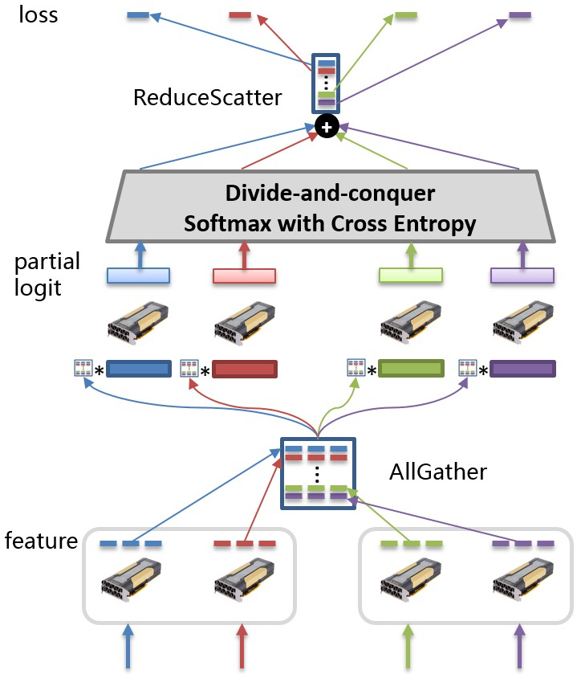
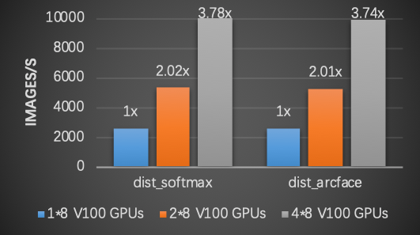

飞桨大规模分类库简介
===================

图像分类技术日趋成熟，ResNet网络在ImageNet数据集上的top5准确率已超过96%。然而，如何高效地完成百万类别甚至是更大规模的分类任务，则是一个极具挑战性的课题。

从多分类神经网络的实现角度分析，其最后一层通常是由全连接层和Softmax构成的组合层，全连接层输出结点数挂钩分类任务的类别数，所以对应的参数量随分类类别数的增长而线性增长。因此，当类别数非常大时，神经网络训练过程占用的显存空间也会很大，甚至是超出单张GPU卡的显存容量，导致神经网络模型无法训练。

以新闻推荐系统为例，假设要对百万类细分类别的新闻条目进行分类，那么仅存储全连接层参数就需要约2GB的显存空间（这里假设神经网络最后一层隐层的输出结点的维度为512，并假设以32比特浮点数表示数据）。再考虑神经网络训练过程中生成的数量庞多的中间变量，那么训练过程中需要的存储总量往往会超出单张GPU卡的显存容量。

该如何解决这个问题呢？常用的做法是“拆分”。考虑到全连接层的线性可分性，可以将全连接层参数切分到多张GPU卡，采用模型并行方案，减少每张GPU卡的参数存储量。

以下图为例，全连接层参数按行切分到不同的GPU卡上。每次训练迭代过程中，各张GPU卡分别以各自的训练数据计算隐层的输出特征(feature)，并通过集合通信操作AllGather得到汇聚后的特征。接着，各张GPU卡以汇聚后的特征和部分全连接层参数计算部分logit值(partial logit)，并基于此计算神经网络的损失值。

这个方案可以有效解决全连接层参数量随分类类别数线性增长导致的显存空间不足的问题。然而，为了实现这一方案，开发者需要基于现有的深度学习平台设计和实现上例描述的所有操作，包括全连接层参数的切分和集合通信等，动辄需要数百行实现代码，大大增加了开发者的负担。

现在，开发者的福音来了，飞桨近期开源了基于核心框架构建的大规模分类库(PLSC: PaddlePaddle Large Scale Classification)，为用户提供了大规模分类任务从训练到部署的全流程解决方案。只需数行代码，即可实现千万类别分类的神经网络。并且，通过PLSC库提供的serving功能用户可以快速部署模型，提供一站式服务。

简单易用，五行代码实现千万类别神经网络
--------------------------------------

飞桨大规模分类库PLSC（以下简称PLSC）封装了大规模分类神经网络实现，提供简洁易用的高层API，用户通过五行代码即可实现千万类别分类神经网络。

安装飞桨
^^^^^^^^

可以参考官网下载并安装飞桨: `飞桨安装文档 <https://www.paddlepaddle.org.cn/install/quick>`_。

安装PLSC
^^^^^^^^

执行下面的命令安装PLSC。

.. code-block:: shell

   pip install plsc

准备模型训练配置代码，保存为train.py文件
^^^^^^^^^^^^^^^^^^^^^^^^^^^^^^^^^^^^^^^^

使用PLSC组建分类神经网络主要包括下面三个步骤：

#. 
   从plsc包导入Entry类，Entry类封装PLSC所有API的接口类；

#. 
   实例化Entry类的对象；

#. 
   调用Entry类的train方法，开始训练过程。

默认情况下，该训练脚本使用的loss值计算方法为'dist_arcface'，即将全连接层参数切分到多张GPU卡的模型并行方案，需要使用两张或以上的GPU卡。

.. code-block:: python

   from plsc import Entry
   if __name__ == "main":
           ins = Entry()
           ins.set_class_num(1000000) #设置分类类别数
           ins.train()

启动训练任务
^^^^^^^^^^^^

可以使用下面的命令行启动训练任务，其中selected_gpus参数用于指定训练中使用的GPU卡。

.. code-block:: shell

   python -m paddle.distributed.launch \
               --selected_gpus=0,1,2,3,4,5,6,7 \
               train.py

PLSC训练效果达到SOTA精度
------------------------

PLSC库在多个数据集上可以取得SOTA的训练精度，下表列出PLSC库分别使用MS1M-ArcFace和CASIA数据集作为训练数据，在不同验证数据集上取得的精度。

.. list-table::
   :header-rows: 1

   * - 模型
     - 训练集
     - lfw
     - agendb_30
     - cfp_ff
     - cfp_fp
     - MegaFace (Id/Ver)
   * - ResNet50
     - MS1M-ArcFace
     - 0.99817
     - 0.99827
     - 0.99857
     - 0.96314
     - 0.980/0.993
   * - ResNet50
     - CASIA
     - 0.98950
     - 0.90950
     - 0.99057
     - 0.91500
     - N/A

备注：上述模型训练使用的loss_type为'dist_arcface'。更多关于ArcFace的内容请参考

**ArcFace:** Additive Angular Margin Loss for Deep Face Recognition

https://arxiv.org/abs/1801.07698

LSC支持多机分布式训练和千万规模分类
-----------------------------------

PLSC支持多机分布式训练。一方面，通过多机分布式训练可以将全连接层参数切分到更多的GPU卡，从而支持千万类别分类，并且飞桨大规模分类库理论上支持的分类类别数随着使用的GPU卡数的增加而增加。例如，单机8张V100 GPU配置下支持的最大分类类别数相比不使用PLSC扩大2.52倍。

另一方面，使用多机分布式训练可以有效提升训练速度。

通过下面几行命令即可启动多机分布式训练。其中，cluster_node_ips参数用于指定所有训练节点的ip地址列表，node_ip参数用于指定当前训练节点的ip地址。

.. code-block:: shel

   python -m paddle.distributed.launch \
           --cluster_node_ips="127.0.0.1,127.0.0.2" \
           --node_ip="127.0.0.1" \
           --selected_gpus=0,1,2,3,4,5,6,7 \
           train.py

下图给出使用不同数量的节点时的训练速度（吞吐）。实验中使用的训练数据集为MS1M-ArcFace，分类类别数为85742，每个节点配备8张NVIDIA V100 GPUs，backbone模型为ResNet50。如图所示，使用飞桨大规模分类库可以取得近似线性的加速比。

PLSC提供从训练到部署的全流程解决方案
------------------------------------

用户完成分类神经网络训练后，通常要基于得到的预训练模型部署预测服务。通过飞桨大规模分类库提供的serving功能可实现快速部署。

飞桨大规模分类库提供支持预测服务部署的serving端和client端。serving端基于飞桨服务器端部署库Paddle Serving开发，使用serving端功能可以基于预训练模型快速部署预测服务。client端则提供了和serving端的交互功能，用户通过client端提交查询请求并获取预测结果。只需三步即可完成部署。

安装serving端和client端
^^^^^^^^^^^^^^^^^^^^^^^

.. code-block:: shell

   pip install plsc-serving ujson

通过下面的脚本部署serving端
^^^^^^^^^^^^^^^^^^^^^^^^^^^

.. code-block:: python

   from plsc_serving.run import PLSCServer
   fs = PLSCServer()
   # 设定使用的模型路径
   fs.with_model(model_path = '/XXX/XXX')
   # gpu_index指定使用的gpu，port指定使用的端口
   fs.run(gpu_index = 0, port = 8010)

通过下面的脚本使用client端功能
^^^^^^^^^^^^^^^^^^^^^^^^^^^^^^

.. code-block:: python

   from face_service import FaceService
   with open('./data/00000000.jpg', 'rb') as f:
       image = f.read()
   fc = FaceService()
   # 添加server端连接
   fc.connect('127.0.0.1:8010')
   #调用server端预测
   result = fc.encode([image])
   print(result[0])
   fc.close()

PLSC支持混合精度训练
--------------------

单机8张Nvidia Tesla v100 GPU配置下，混合精度比常规单精度训练速度提升42%。

使用混合精度训练可以提升训练的速度，同时减少训练使用的显存开销。开启混合精度训练方法如下：

.. code-block:: python

   from plsc import Entry

   def main():
       ins = Entry()
       ins.set_mixed_precision(True)
       ins.train()
   if __name__ == "__main__":
       main()

在单机8张Nvidia Tesla v100 GPU配置下，对比resnet50模型单精度训练和混合精度训练的效果，混合精度训练速度可提升42%：

.. list-table::
   :header-rows: 1

   * - 模型
     - 单精度训练
     - 混合精度训练
     - 加速比
   * - ResNet50
     - 2567 images/s
     - 3643 images/s
     - 1.42

关于混合精度训练的内容请参考：

https://arxiv.org/abs/1710.03740

PLSC支持Base64格式图像数据预处理
--------------------------------

实际业务中，一种常见的数据存储格式是将图像数据编码为base64格式，训练数据文件的每一行存储一张base64格式编码的图像数据和该图像的标签，并通常以制表符('\t')分隔图像数据和图像标签。

神经网络训练过程中，通常需要对训练数据做全局shuffle。此外，需要切分训练数据，确保每张GPU卡使用相同数量的训练数据。对Base64格式的数据做全局shuffle的开销较大，若在训练过程中执行全局shuffle，会严重影响训练速度。

飞桨大规模分类库内置Base64格式数据预处理工具，可以对训练数据做全局shuffle，并将训练数据均分到多个数据文件，确保数据文件的数量和训练中使用的GPU卡数相同，且每个数据文档包含相同数量的训练数据。训练效率显著提升。

PLSC支持fine-tuning训练时GPU卡数的动态调整
------------------------------------------

我们有时需要基于预训练模型做fine-tuning这种场景下，fine-tuning阶段的训练GPU卡数和预训练阶段使用的GPU卡数可能不同，尤其是当预训练和fine-tuning是分别由不同的组织执行时。考虑全连接层参数是根据使用的GPU卡数切分的这一情形，当fine-tuning阶段和预训练阶段使用不同的GPU卡数时，在加载模型参数前，用户需要重构模型参数，以适应fine-tuning阶段的GPU卡数。为了简化用户操作，飞桨大规模分类库提供了自动化的模型参数重构功能。当fine-tuning阶段使用的GPU卡数和预训练阶段不同时，飞桨大规模分类库在加载预训练模型参数时会自动根据fine-tuning阶段使用的GPU卡数重构预训练模型参数，以适应fine-tuning阶段的GPU卡数。

PLSC助力百度AI口罩检测方案快速上线
----------------------------------

面对疫情，百度近期攻克了戴口罩人脸识别技术难关，快速上线了AI口罩检测方案，并在地铁、园区、厂区等场所上线，高效保障防疫工作。

百度AI口罩检测方案采用百度最新的PyramidBox-lite检测算法，加入超过10万张口罩人脸训练数据。为了解决数百万ID数据训练问题，采用飞桨大规模分类库PLSC实现了快速训练。在准确率不变的情况下，召回率提升30%，佩戴口罩的人脸检测准确率超过99%。

更多飞桨PLSC的应用方法，欢迎访问飞桨PLSC项目地址：

https://github.com/PaddlePaddle/PLSC
