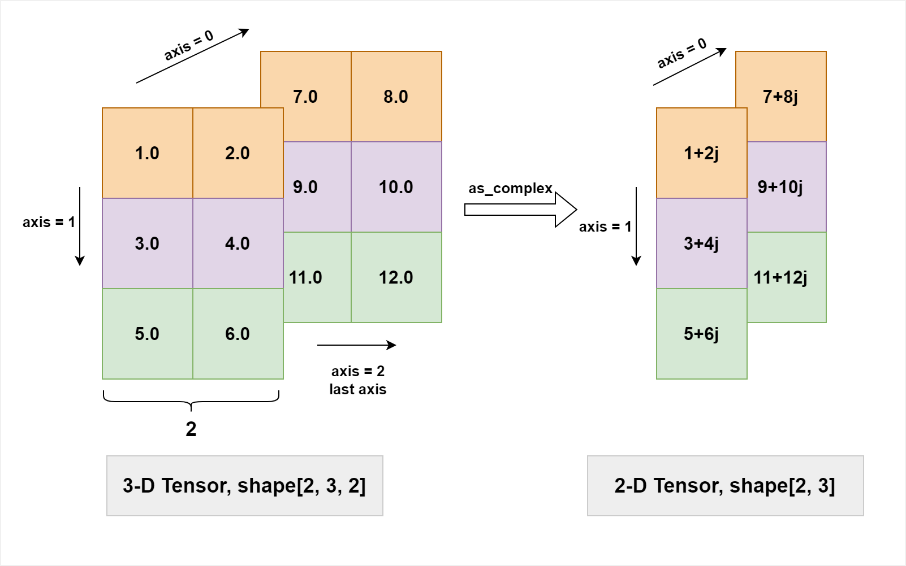

.. _cn_api_paddle_as_complex:

as_complex
-------------------------------

.. py:function:: paddle.as_complex(x, name=None)

将实数 Tensor 转为复数 Tensor。

输入 Tensor 的数据类型是 'float32' 或者 'float64'，输出 Tensor 的数据类型相应为 'complex64' 或者 'complex128'。

输入 Tensor 的形状是 ``(*, 2)`` (其中 ``*`` 表示任意形状)，亦即，输入的最后一维的大小必须是 2，这对应着复数的实部和虚部。输出 Tensor 的形状是 ``(*,)``。

下图展示了一个as_complex简单的使用情形。一个形状为[2, 3, 2]的实数Tensor经过as_complex转换，最后一个长度为2的维度被合并为复数，形状变为[2, 3]。

参数
:::::::::
    - **x** (Tensor) - 输入 Tensor，数据类型为：float32 或 float64。
    - **name** (str，可选) - 具体用法请参见 :ref:`api_guide_Name`，一般无需设置，默认值为 None。

返回
:::::::::
输出 Tensor，数据类型是 'complex64' 或 'complex128'，与 ``x`` 的数值精度一致。

代码示例
:::::::::

COPY-FROM: paddle.as_complex
