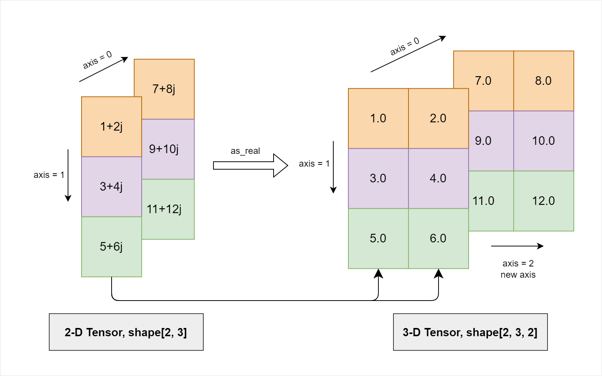

.. _cn_api_paddle_as_real:

as_real
-------------------------------

.. py:function:: paddle.as_real(x, name=None)

将复数 Tensor 转为实数 Tensor。

输入 Tensor 的数据类型是 'complex64' 或者 'complex128'，输出 Tensor 的数据类型相应为 'float32' 或者 'float64'。

输入 Tensor 的形状是 ``(*,)`` (其中 ``*`` 表示任意形状)，输出 Tensor 的形状是 ``(*, 2)``，亦即，输出的形状是在输入形状后附加一个 ``2``，因为一个复数的实部和虚部分别表示为一个实数。

下图展示了一个 as_real 简单的使用情形。一个形状为[2, 3]的复数 Tensor 经过 as_real 转换，拆分出一个长度为 2 的维度，形状变为[2, 3, 2]。

参数
:::::::::
    - **x** (Tensor) - 输入 Tensor，数据类型为：'complex64' 或 'complex128'。
    - **name** (str，可选) - 具体用法请参见 :ref:`api_guide_Name`，一般无需设置，默认值为 None。

返回
:::::::::
输出 Tensor，数据类型是 'float32' 或 'float64'，与 ``x`` 的数值精度一致。

代码示例
:::::::::

COPY-FROM: paddle.as_real
