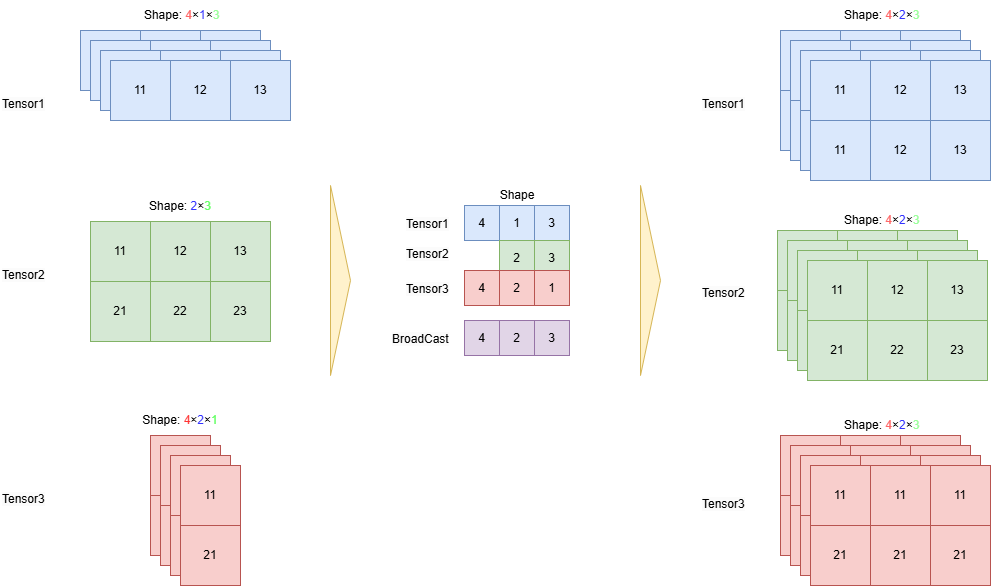

.. _cn_api_paddle_broadcast_tensors:

broadcast_tensors
-------------------------------

.. py:function:: paddle.broadcast_tensors(input, name=None)

根据 Broadcast 规范对一组输入 ``input`` 进行 Broadcast 操作
输入应符合 Broadcast 规范

.. note::
    如想了解更多 Broadcasting 内容，请参见 `Tensor 介绍`_ .

    .. _Tensor 介绍: ../../guides/beginner/tensor_cn.html#id7

下图展示将三个 Tensor 广播到同一维度的过程。三个 Tensor 的尺寸分别为 [4, 1, 3]、[2, 3]、[4, 2, 1]，在广播时，会从最后一个维度开始对齐，对于每一个维度，任意两个 Tensor 的在该维度大小相等；或者其中一个 Tensor 的维度等于 1；或者其中一个 Tensor 的维度不存在。在下图中，最后一个维度中，Tenser3 取值为 1，Tensor1 和 Tensor2 取值为 3，所有 Tensor 的该维度被扩张为3；倒数第二个维度中，Tenser1 取值为 2，Tensor2 和 Tensor3 取值为 2，所有 Tensor 的该维度被扩张为2；倒数第三个维度中，Tenser2 为空，Tensor1 和 Tensor3 取值为 4，所有 Tensor 的该维度被扩张为4。最终，所有 Tensor 都被扩张到 [4, 2, 3]。

参数
:::::::::
    - input (list(Tensor)|tuple(Tensor)) - 一组输入 Tensor，数据类型为：bool、float32、float64、complex64、complex128、int32 或 int64。所有的输入 Tensor 均需要满足 rank <= 5。
    - **name** (str，可选) - 具体用法请参见 :ref:`api_guide_Name`，一般无需设置，默认值为 None。

返回
:::::::::
``list(Tensor)``，一组 Broadcast 后的 ``Tensor``，其顺序与 ``input`` 一一对应。

代码示例
:::::::::

COPY-FROM: paddle.broadcast_tensors
