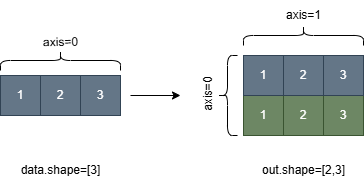

.. _cn_api_paddle_broadcast_to:

broadcast_to
-------------------------------

.. py:function:: paddle.broadcast_to(x, shape, name=None)

根据 ``shape`` 指定的形状广播 ``x``，广播后，``x`` 的形状和 ``shape`` 指定的形状一致。

``x`` 的维数和 ``shape`` 的元素数应小于等于 6，并且 ``shape`` 中的元素数应该大于等于 ``x`` 的维数。扩展的维度的维度值应该为 1。

下图展示了一个形状为[1,2,3]的一维张量通过 broadcast_to 操作转变为形状为[2,3]的张量，在广播中，原第一个元素变成了第一个维度的两个元素，第二个元素变成了第二个维度的两个元素。
通过比较这两个图，我们可以看到第一个图的张量已经扩大，扩大后的张量的形状是[2,3]。颜色变化显示了元素的变化，并且据此，我们可以清楚地看出形状变化前后各元素的对应关系。

参数
:::::::::
    - **x** (Tensor) - 输入的 Tensor，数据类型为：bool、float16、float32、float64、int32、int64、uint8 或 uint16。
    - **shape** (tuple|list|Tensor) - 给定输入 ``x`` 扩展后的形状，若 ``shape`` 为 list 或者 tuple，则其中的元素值应该为整数或者是形状为 1-D 或 0-D 的 Tensor，若 ``shape`` 类型为 Tensor，则其应该为 1-D Tensor。
    - **name** (str，可选) - 具体用法请参见 :ref:`api_guide_Name`，一般无需设置，默认值为 None。

返回
:::::::::
``Tensor``，数据类型与 ``x`` 相同。

代码示例
:::::::::

COPY-FROM: paddle.broadcast_to
