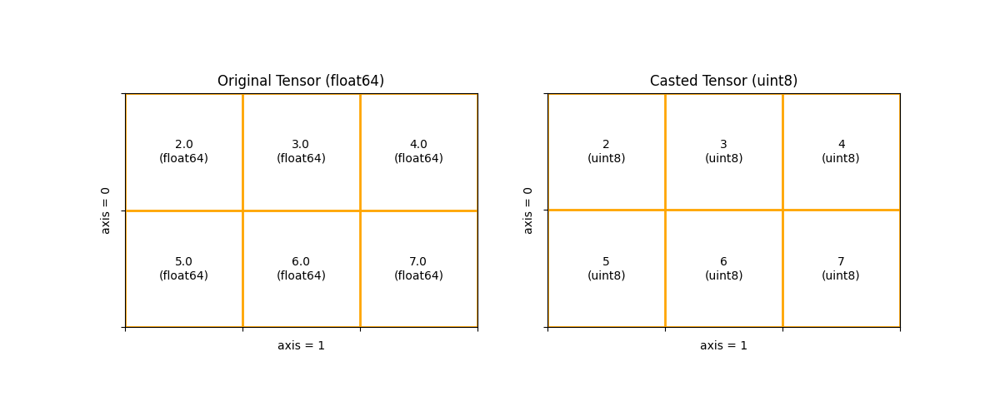

.. _cn_api_paddle_cast:

cast
-------------------------------

.. py:function:: paddle.cast(x, dtype)

将 ``x`` 的数据类型转换为 ``dtype`` 并输出。支持输出和输入的数据类型相同。

下图展示了一个例子：将输入的 float64 类型 Tensor 转化为 uint8 类型 Tensor

参数
::::::::::::

    - **x** (Tensor) - 输入多维 Tensor，支持的数据类型为：bool、float16、float32、float64、uint8、int32、int64。
    - **dtype** (str|np.dtype) - 输出 Tensor 的数据类型。支持的数据类型为：bool、float16、float32、float64、int8、int32、int64、uint8。

返回
::::::::::::
Tensor，维度与 ``x`` 相同，数据类型为 ``dtype``。

代码示例
::::::::::::

COPY-FROM: paddle.cast
