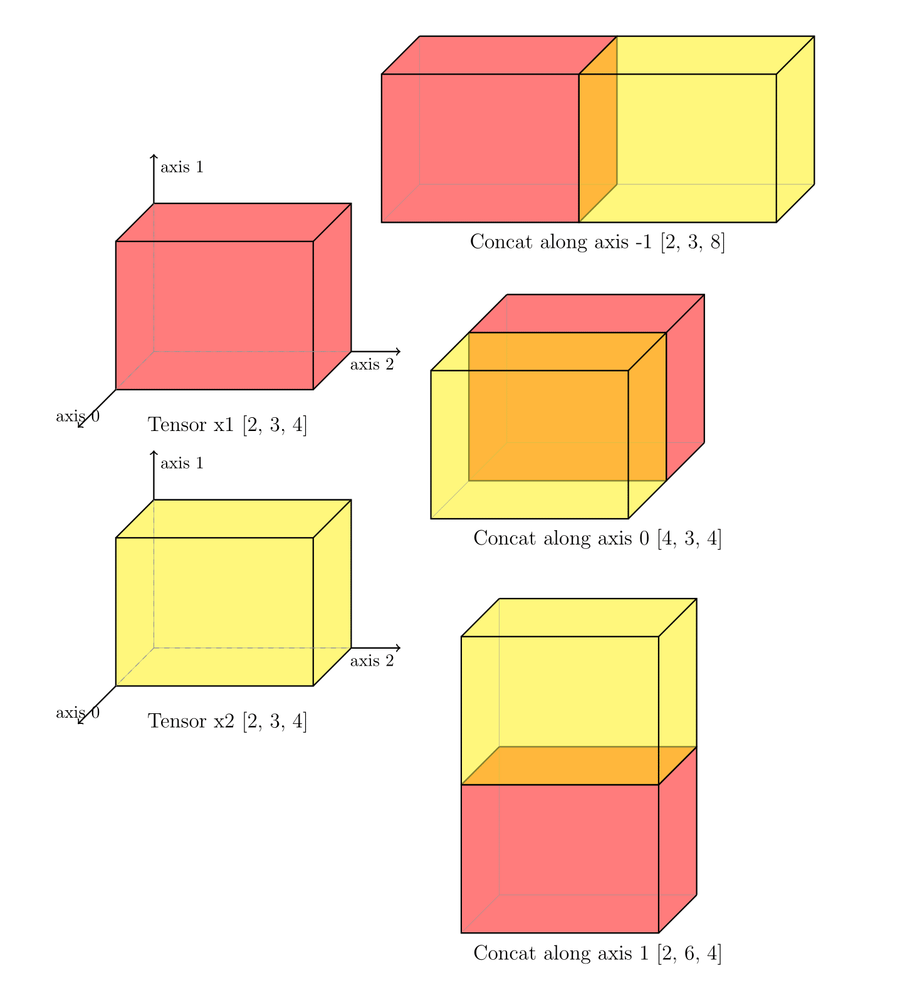

.. _cn_api_paddle_concat:

concat
-------------------------------

.. py:function:: paddle.concat(x, axis=0, name=None)

对输入沿参数 ``axis`` 轴进行联结，返回一个新的 Tensor。该 API 不支持输入 0-D Tensor，因为其必须指定沿着某个轴拼接，而 0-D Tensor 没有轴。

下图展示了 concat 操作的典型情况——两个形状为 [2, 3, 4] 的三维张量通过 concat 操作沿着不同的``axis`` 轴拼接为不同形状的二维张量，我们可以清晰地看到不同维度拼接的效果。

参数
::::::::::::

    - **x** (list|tuple) - 待联结的 Tensor list 或者 Tensor tuple，支持的数据类型为：bool、float16、bfloat16、float32、float64、int8、uint8、int16、uint16、int32、int64、complex64、complex128， ``x`` 中所有 Tensor 的数据类型应该一致。
    - **axis** (int|Tensor，可选) - 指定对输入 ``x`` 进行运算的轴，可以是整数或者形状为[]的 0-D Tensor，数据类型为 int32 或者 int64。 ``axis`` 的有效范围是 [-R, R)，R 是输入 ``x`` 中 Tensor 的维度，``axis`` 为负值时与 :math:`axis + R` 等价。默认值为 0。
    - **name** (str，可选) - 具体用法请参见 :ref:`api_guide_Name`，一般无需设置，默认值为 None。

返回
::::::::::::
联结后的 Tensor，数据类型和 ``x`` 中的 Tensor 相同。

代码示例
::::::::::::

COPY-FROM: paddle.concat
