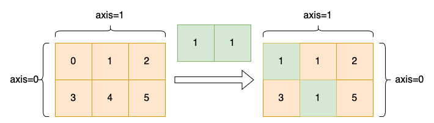

.. _cn_api_paddle_diagonal_scatter:

diagonal_scatter
-------------------------------

.. py:function:: paddle.diagonal_scatter(x, y, offset=0, axis1=0, axis2=1, name=None)

根据参数 ``offset``、``axis1``、``axis2``，将张量 ``y`` 填充到张量 ``x`` 的对应位置。

这个函数将会返回一个新的 ``Tensor``。

参数 ``offset`` 确定从指定的二维平面中获取对角线的位置：

    - 如果 offset = 0，则嵌入主对角线。
    - 如果 offset > 0，则嵌入主对角线右上的对角线。
    - 如果 offset < 0，则嵌入主对角线左下的对角线。

参数
::::::::::::

    - **x** (Tensor) - 输入张量，张量的维度至少为 2 维，支持 float16、float32、float64、bfloat16、uint8、int8、int16、int32、int64、bool、complex64、complex128 数据类型。
    - **y** (Tensor) - 嵌入张量，将会被嵌入到输入张量中，支持 float16、float32、float64、bfloat16、uint8、int8、int16、int32、int64、bool、complex64、complex128 数据类型。
    - **offset** (int, 可选) - 从指定的二维平面嵌入对角线的位置，默认值为 0，即主对角线。
    - **axis1** (int, 可选) - 对角线的第一个维度，默认值为 0。
    - **axis2** (int, 可选) - 对角线的第二个维度，默认值为 1。
    - **name** (str，可选) - 具体用法请参见 :ref:`api_guide_Name`，一般无需设置，默认值为 None。

下图展示了一个例子: x 是一个 [[0,1,2],[3,4,5]] 的二维张量，通过 diagonal_scatter 在 axis1=0， axis2=1构成的二维平面内，向其主对角线填充了一个 [1,1] 的张量。

返回
::::::::::::
``Tensor``，返回一个根据给定的轴 ``axis`` 和偏移量 ``offset``，将张量 ``y`` 填充到张量 ``x`` 对应位置的新 ``Tensor``。

代码示例
::::::::::::

COPY-FROM: paddle.diagonal_scatter
