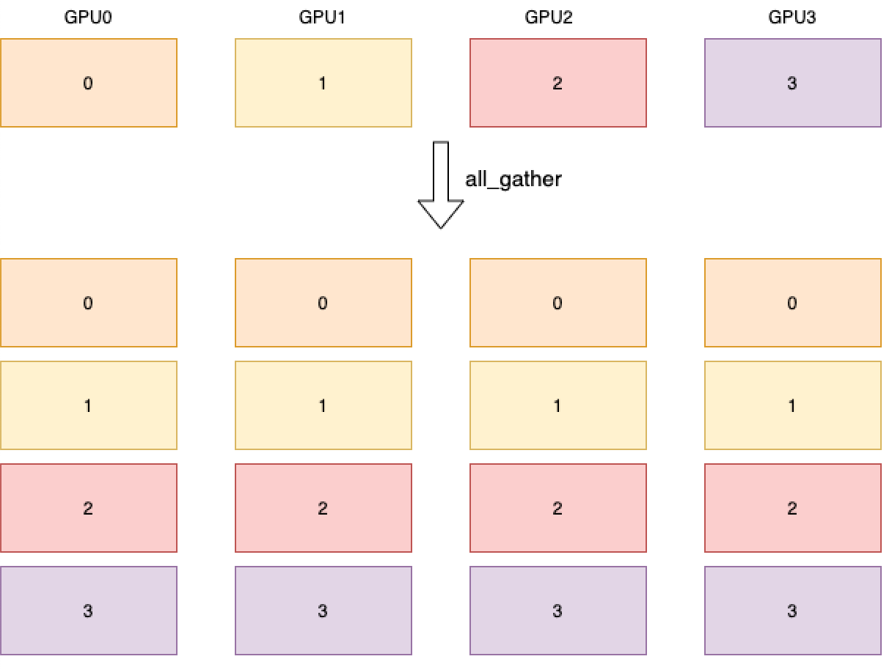

.. _cn_api_distributed_all_gather:

all_gather
-------------------------------

.. py:function:: paddle.distributed.all_gather(tensor_list, tensor, group=None, sync_op=True)

组聚合，聚合进程组内的指定 tensor，随后将聚合后的 tensor 列表发送到每个进程。

如下图所示，4 个 GPU 分别开启 1 个进程，进程拥有的数据用其在组内的 rank 表示。
聚合操作后，每个进程都会得到所有进程拥有的数据。

参数
:::::::::
    - **tensor_list** (List[Tensor]) - 用于保存聚合结果的 tensor 列表。若不为空，其中每个 tensor 的数据类型必须与输入的 tensor 保持一致。
    - **tensor** (Tensor) - 待聚合的 tensor。支持的数据类型包括：float16、float32、float64、int32、int64、int8、uint8、bool、bfloat16、complex64、complex128。
    - **group** (Group，可选) - 执行该操作的进程组实例（通过 ``new_group`` 创建）。默认为 None，即使用全局默认进程组。
    - **sync_op** (bool，可选) - 该操作是否为同步操作。默认为 True，即同步操作。

返回
:::::::::
无返回值。

代码示例
:::::::::
COPY-FROM: paddle.distributed.all_gather
