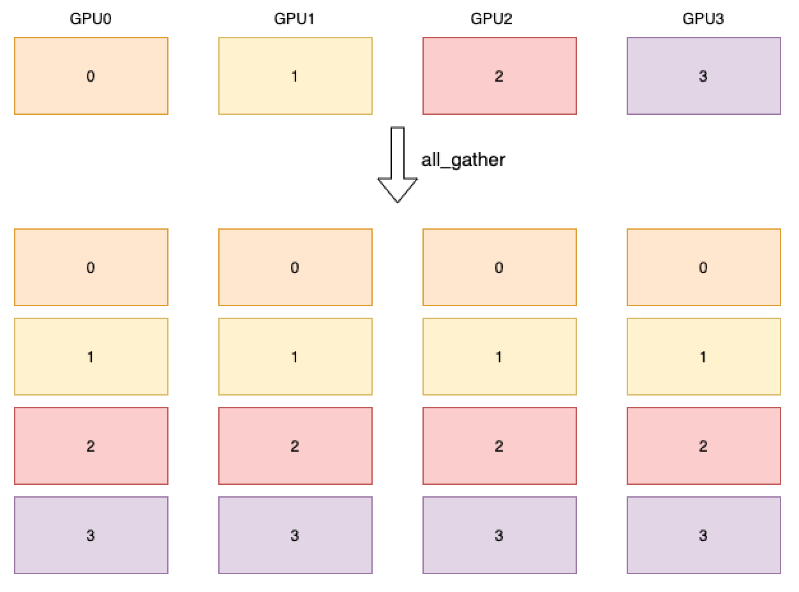

.. _cn_api_distributed_all_gather:

all_gather
-------------------------------

.. py:function:: paddle.distributed.all_gather(tensor_list, tensor, group=0)

进程组内所有进程的指定 tensor 进行聚合操作，并返回给所有进程聚合的结果。
如下图所示，4 个 GPU 分别开启 4 个进程，每张卡上的数据用卡号代表，
经过 all_gather 算子后，每张卡都会拥有所有卡的数据。

参数
:::::::::
    - **tensor_list** (list) - 操作的输出 Tensor 列表。列表中的每个元素均为 Tensor，每个 Tensor 的数据类型为：float16、float32、float64、int32、int64、int8、uint8、bool、complex64、complex128。
    - **tensor** (Tensor) - 操作的输入 Tensor。Tensor 的数据类型为：float16、float32、float64、int32、int64、int8、uint8、bool、complex64、complex128。
    - **group** (int，可选) - 工作的进程组编号，默认为 0。

返回
:::::::::
无

代码示例
:::::::::
COPY-FROM: paddle.distributed.all_gather
