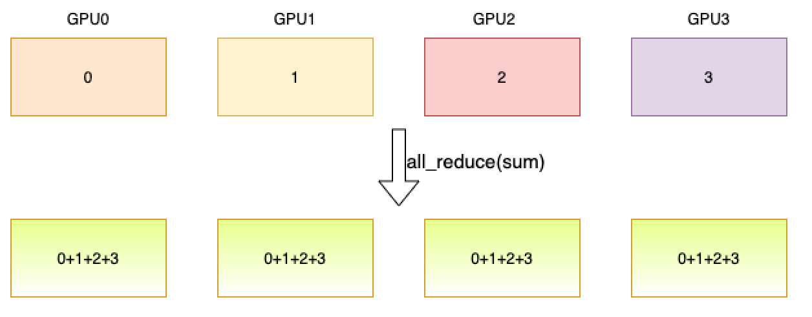

.. _cn_api_distributed_all_reduce:

all_reduce
-------------------------------

.. py:function:: paddle.distributed.all_reduce(tensor, op=ReduceOp.SUM, group=None, sync_op=True)

规约进程组内的一个 tensor，随后将结果发送到每个进程。

如下图所示，4 个 GPU 分别开启 1 个进程，进程拥有的数据用其在组内的 rank 表示，规约操作为求和。
规约操作后，每个进程都会得到所有进程数据的总和。

参数
:::::::::
    - **tensor** (Tensor) - 输入的 tensor。返回结果也将保存到该 tensor 中。支持的数据类型包括：float16、float32、float64、int32、int64、int8、uint8、bool、bfloat16。
    - **op** (ReduceOp.SUM|ReduceOp.MAX|ReduceOp.MIN|ReduceOp.PROD，可选) - 归约的操作类型，包括求和、取最大值、取最小值和求乘积。默认为求和。
    - **group** (Group，可选) - 执行该操作的进程组实例（通过 ``new_group`` 创建）。默认为 None，即使用全局默认进程组。
    - **sync_op** (bool，可选) - 该操作是否为同步操作。默认为 True，即同步操作。

返回
:::::::::
``Task``。通过 ``Task``，可以查看异步操作的执行状态以及等待异步操作的结果。

代码示例
:::::::::
COPY-FROM: paddle.distributed.all_reduce
