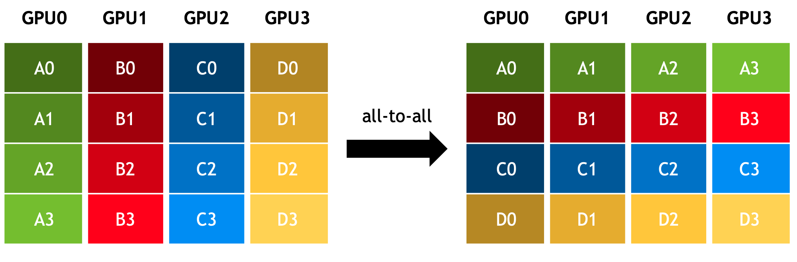

.. _cn_api_paddle_distributed_alltoall:

alltoall
-------------------------------

.. py:function:: paddle.distributed.alltoall(in_tensor_list, out_tensor_list, group=None, sync_op=True)

将 in_tensor_list 中的一组 tensor 分发到每个进程，随后在每个进程上将分发结果聚合到 out_tensor_list。

如下图所示，2 个 GPU 分别开启 1 个进程，rank=0 的进程的 in_tensor_list 包含 0_0 和 0_1 两个 tensor，rank=1 的进程的 in_tensor_list 包含 1_0 和 1_1 两个 tensor。
操作后，rank=0 的进程的 out_tensor_list 会包含 0_0 和 1_0 两个 tensor，rank=1 的进程的 out_tensor_list 会包含 0_0 和 1_1 两个 tensor。

简单来说，该操作类似于 scatter + gather。更直观地，如果将全部进程上的数据看作一个矩阵，该操作类似于对矩阵进行转置。

参数
:::::::::
    - **in_tensor_list** (List[Tensor]) - 输入的 tensor 列表。支持的数据类型包括：float16、float32、float64、int32、int64、int8、uint8、bool、bfloat16。
    - **out_tensor_list** (List[Tensor]) - 用于保存操作结果的 tensor 列表。其中每个 tensor 的数据类型必须与输入的 tensor 保持一致。
    - **group** (Group，可选) - 执行该操作的进程组实例（通过 ``new_group`` 创建）。默认为 None，即使用全局默认进程组。
    - **sync_op** (bool，可选) - 该操作是否为同步操作。默认为 True，即同步操作。

返回
:::::::::
无返回值。

代码示例
:::::::::
COPY-FROM: paddle.distributed.alltoall
