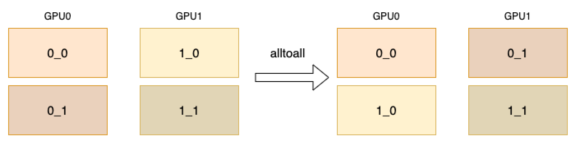

.. _cn_api_distributed_alltoall:

alltoall
-------------------------------

.. py:function:: paddle.distributed.alltoall(in_tensor_list, out_tensor_list, group=None, use_calc_stream=True)

将in_tensor_list里面的tensors分发到所有参与的卡并将结果tensors汇总到out_tensor_list，如下图所示。

参数
:::::::::
    - in_tensor_list (list) - 包含所有输入Tensors的一个列表。在列表里面的所有元素都必须是一个Tensor，Tensor的数据类型必须是float16、float32、 float64、int32、int64。
    - out_tensor_list (Tensor) - 包含所有输出Tensors的一个列表。在列表里面的所有元素数据类型要和输入的Tensors数据类型一致。
    - group (Group, 可选) - new_group返回的Group实例，或者设置为None表示默认地全局组。默认值：None。
    - use_calc_stream (bool，可选) - 标识使用计算流还是通信流。默认值：True。

返回
:::::::::
无

代码示例
:::::::::
COPY-FROM: paddle.distributed.alltoall