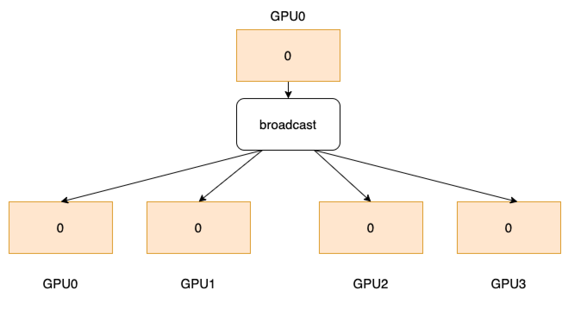

.. _cn_api_distributed_broadcast:

broadcast
-------------------------------

.. py:function:: paddle.distributed.broadcast(tensor, src, group=None, sync_op=True)

将一个 tensor 发送到每个进程。

如下图所示，4 个 GPU 分别开启 1 个进程，rank=0 的进程拥有数据 0。
广播操作后，数据 0 会被发送到所有进程上。

参数
:::::::::
    - **tensor** (Tensor) - 在目标进程上为待广播的 tensor，在其他进程上为用于接收广播结果的 tensor。支持的数据类型包括：float16、float32、float64、int32、int64、int8、uint8、bool、bfloat16。
    - **src** (int) - 目标进程的 rank，该进程传入的 tensor 将被发送到其他进程上。
    - **group** (Group，可选) - 执行该操作的进程组实例（通过 ``new_group`` 创建）。默认为 None，即使用全局默认进程组。
    - **sync_op** (bool，可选) - 该操作是否为同步操作。默认为 True，即同步操作。

返回
:::::::::
动态图模式下，若为同步操作，无返回值；若为异步操作，返回 ``Task``。通过 ``Task``，可以查看异步操作的执行状态以及等待异步操作的结果。

静态图模式下，无返回值。

代码示例
:::::::::
COPY-FROM: paddle.distributed.broadcast
