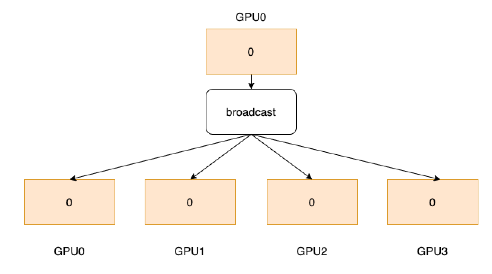

.. _cn_api_distributed_broadcast:

broadcast
-------------------------------

.. py:function:: paddle.distributed.broadcast(tensor, src, group=0)

广播一个 Tensor 给其他所有进程。
如下图所示，4 个 GPU 分别开启 4 个进程，GPU0 卡拥有数据，经过 broadcast 算子后，会将这个数据传播到所有卡上。

参数
:::::::::
    - **tensor** (Tensor) - 如果当前进程编号是源，那么这个 Tensor 变量将被发送给其他进程，否则这个 Tensor 将接收源发送过来的数据。Tensor 的数据类型为：float16、float32、float64、int32、int64。
    - **src** (int) - 发送源的进程编号。
    - **group** (int，可选) - 工作的进程组编号，默认为 0。

返回
:::::::::
无

代码示例
:::::::::
COPY-FROM: paddle.distributed.broadcast
