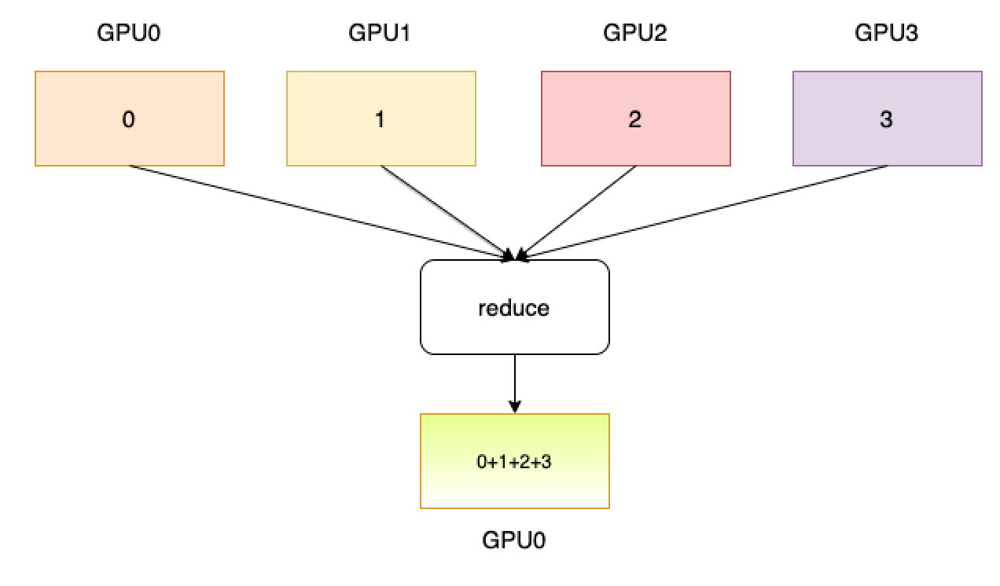

.. _cn_api_distributed_reduce:

reduce
-------------------------------

.. py:function:: paddle.distributed.reduce(tensor, dst, op=ReduceOp.SUM, group=0)

进程组内所有进程的指定tensor进行归约操作，并返回给所有进程归约的结果，如下图所示（https://images.nvidia.com/events/sc15/pdfs/NCCL-Woolley.pdf）。

参数
:::::::::
    - tensor (Tensor) - 操作的输入Tensor，结果返回至目标进程号的Tensor中。Tensor的数据类型为：float16、float32、float64、int32、int64。
    - dst (int) - 返回操作结果的目标进程编号。
    - op (ReduceOp.SUM|ReduceOp.MAX|ReduceOp.Min|ReduceOp.PROD，可选) - 归约的具体操作，比如求和，取最大值，取最小值和求乘积，默认为求和归约。
    - group (int，可选) - 工作的进程组编号，默认为0。

返回
:::::::::
无

代码示例
:::::::::
.. code-block:: python

        import numpy as np
        import paddle
        from paddle.distributed import init_parallel_env

        paddle.set_device('gpu:%d'%paddle.distributed.ParallelEnv().dev_id)
        init_parallel_env()
        if paddle.distributed.ParallelEnv().local_rank == 0:
            np_data = np.array([[4, 5, 6], [4, 5, 6]])
        else:
            np_data = np.array([[1, 2, 3], [1, 2, 3]])
        data = paddle.to_tensor(np_data)
        paddle.distributed.reduce(data, 0)
        out = data.numpy()
        # [[5, 7, 9], [5, 7, 9]]
