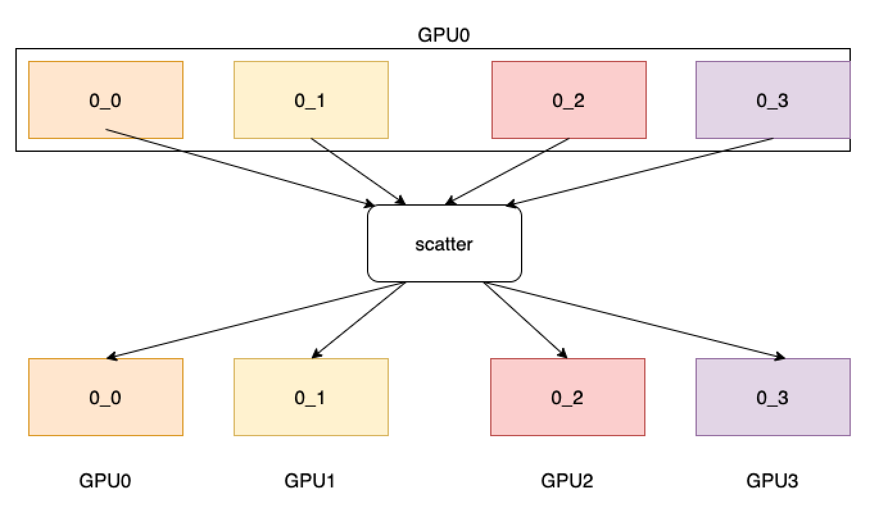

.. _cn_api_distributed_scatter:

scatter
-------------------------------

.. py:function:: paddle.distributed.scatter(tensor, tensor_list=None, src=0, group=None, sync_op=True)

将一组来自指定进程的 tensor 分发到每个进程。

如下图所示，4 个 GPU 分别开启 1 个进程，将分发 rank=0 的进程拥有的数据。
分发操作后，rank=0 的进程拥有的数据被平均分配到每个进程上。

参数
:::::::::
    - **tensor** (Tensor) - 用于接收数据的 tensor，数据类型必须与输入的 tensor 列表保持一致。
    - **tensor_list** (List[Tensor]，可选) - 将被分发的 tensor 列表。默认为 None。支持的数据类型包括：float16、float32、float64、int32、int64、int8、uint8、bool、bfloat16。
    - **src** (int，可选) - 目标进程的 rank，该进程的 tensor 列表将被分发到其他进程中。默认为 0，即分发 rank=0 的进程上的 tensor 列表。
    - **group** (Group，可选) - 执行该操作的进程组实例（通过 ``new_group`` 创建）。默认为 None，即使用全局默认进程组。
    - **sync_op** (bool，可选) - 该操作是否为同步操作。默认为 True，即同步操作。

返回
:::::::::
动态图模式下，若为同步操作，无返回值；若为异步操作，返回 ``Task``。通过 ``Task``，可以查看异步操作的执行状态以及等待异步操作的结果。

静态图模式下，无返回值。

代码示例
:::::::::
COPY-FROM: paddle.distributed.scatter
