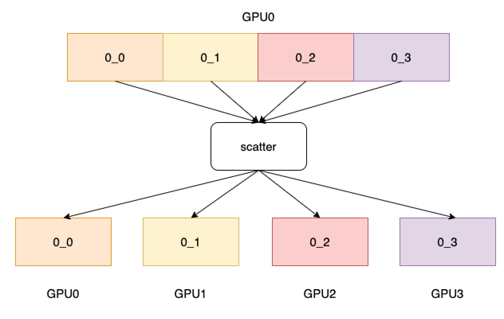

.. _cn_api_distributed_scatter:

scatter
-------------------------------

.. py:function:: paddle.distributed.scatter(tensor, tensor_list=None, src=0, group=0)

进程组内指定进程源的 tensor 列表分发到其他所有进程中。
如下图所示，4 个 GPU 分别开启 4 个进程，scatter 的源选择为第 0 张卡，
经过 scatter 算子后，会将第 0 张卡的数据平均分到所有卡上。

参数
:::::::::
    - **tensor** (Tensor) - 操作的输出 Tensor。Tensor 的数据类型为：float16、float32、float64、int32、int64。
    - **tensor_list** (list，可选) - 操作的输入 Tensor 列表，默认为 None。列表中的每个元素均为 Tensor，每个 Tensor 的数据类型为：float16、float32、float64、int32、int64。
    - **src** (int，可选) - 操作的源进程号，该进程号的 Tensor 列表将分发到其他进程中。默认为 0。
    - **group** (int，可选) - 工作的进程组编号，默认为 0。

返回
:::::::::
无

代码示例
:::::::::
COPY-FROM: paddle.distributed.scatter
