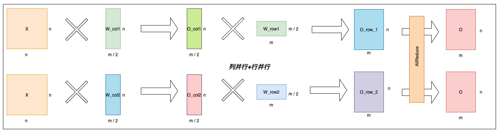

.. _cn_api_distributed_split:

split
-------------------------------

.. py:function:: paddle.distributed.split(x, size, operation, axis=0, num_partitions=1, gather_out=True, weight_attr=None, bias_attr=None, name=None)

切分指定操作的参数到多个设备，并且并行计算得到结果。

当前，支持一下三种情形。

情形 1：并行 Embedding
    Embedding 操作的参数是个 NxM 的矩阵，行数为 N，列数为 M。并行 Embedding 情形下，参数切分到 num_partitions 个设备，每个设备上的参数是 (N/num_partitions + 1)行、M 列的矩阵。其中，最后一行作为 padding idx。

    假设将 NxM 的参数矩阵切分到两个设备 device_0 和 device_1。那么每个设备上的参数矩阵为(N/2+1)行和 M 列。device_0 上，输入 x 中的值如果介于[0, N/2-1]，则其值保持不变；否则值变更为 N/2，经过 embedding 映射为全 0 值。类似地，device_1 上，输入 x 中的值 V 如果介于[N/2, N-1]之间，那么这些值将变更为(V-N/2)；否则，值变更为 N/2，经过 embedding 映射为全 0 值。最后，使用 all_reduce_sum 操作汇聚各个卡上的结果。

    单卡 Embedding 情况如下图所示

    .. image:: ./img/split_embedding_single.png
        :width: 800
        :height: 350
        :alt: single_embedding
        :align: center

    并行 Embedding 情况如下图所示

    .. image:: ./img/split_embedding_split.png
        :width: 800
        :alt: split_embedding
        :align: center

情形 2：行并行 Linear
    Linear 操作是将输入变量 X(N*N)与权重矩阵 W(N*M)进行矩阵相乘。行并行 Linear 情形下，参数切分到 num_partitions 个设备，每个设备上的参数是 N/num_partitions 行、M 列的矩阵。

    单卡 Linear 情况如下图所示，输入变量用 X 表示，权重矩阵用 W 表示，输出变量用 O 表示，单卡 Linear 就是一个简单的矩阵乘操作，O = X * W。

    .. image:: ./img/split_single.png
        :width: 800
        :alt: single_linear
        :align: center

    行并行 Linear 情况如下图所示，顾名思义，行并行是按照权重矩阵 W 的行切分权重矩阵为
    [[W_row1], [W_row2]]，对应的输入 X 也按照列切成了两份[X_col1, X_col2]，分别与各自对应的权重矩阵相乘，
    最后通过 AllReduce 规约每张卡的输出得到最终输出。

    .. image:: ./img/split_row.png
        :width: 800
        :alt: split_row
        :align: center

情形 3：列并行 Linear
    Linear 操作是将输入变量 X(N*N)与权重矩阵 W(N*M)进行矩阵相乘。列并行 Linear 情形下，参数切分到 num_partitions 个设备，每个设备上的参数是 N 行、M/num_partitions 列的矩阵。

    单卡并行 Linear 可以看上面对应的图，列并行 Linear 情况如下图所示。列并行是按照权重矩阵 W 的列切分权重矩阵为[W_col1, W_col2]，
    X 分别与切分出来的矩阵相乘，最后通过 AllGather 拼接每张卡的输出得到最终输出。

    .. image:: ./img/split_col.png
        :width: 800
        :alt: split_col
        :align: center

我们观察到，可以把上述按列切分矩阵乘法和按行切分矩阵乘法串联起来，从而省略掉一次 AllGather 通信操作，如下图所示。同时，我们注意到 Transformer 的 Attention 和 MLP 组件中各种两次矩阵乘法操作。因此，我们可以按照这种串联方式分别把 Attention 和 MLP 组件中的两次矩阵乘法串联起来，从而进一步优化性能。

参数
:::::::::
    - **x** (Tensor) - 输入 Tensor。Tensor 的数据类型为：float16、float32、float64、int32、int64。
    - **size** (list|tuple) - 指定参数形状的列表或元组，包含 2 个元素。
    - **operation** (str) - 指定操作名称，当前支持的操作名称为'embedding'或'linear'。
    - **axis** (int，可选) - 指定沿哪个维度切分参数。默认值：0。
    - **num_partitions** (int，可选) - 指定参数的划分数。默认值：1。
    - **gather_out** (bool，可选) - 是否聚合所有设备的计算结果。默认地，聚合所有设备的计算结果。默认值：True。
    - **weight_attr** (ParamAttr，可选) - 指定参数的属性。默认值：None。
    - **bias_attr** (ParamAttr，可选) - 指定偏置的属性。默认值：None。
    - **name** (str，可选) - 具体用法请参见 :ref:`api_guide_Name`，一般无需设置，默认值为 None。

返回
:::::::::
Tensor

代码示例
:::::::::
COPY-FROM: paddle.distributed.split
