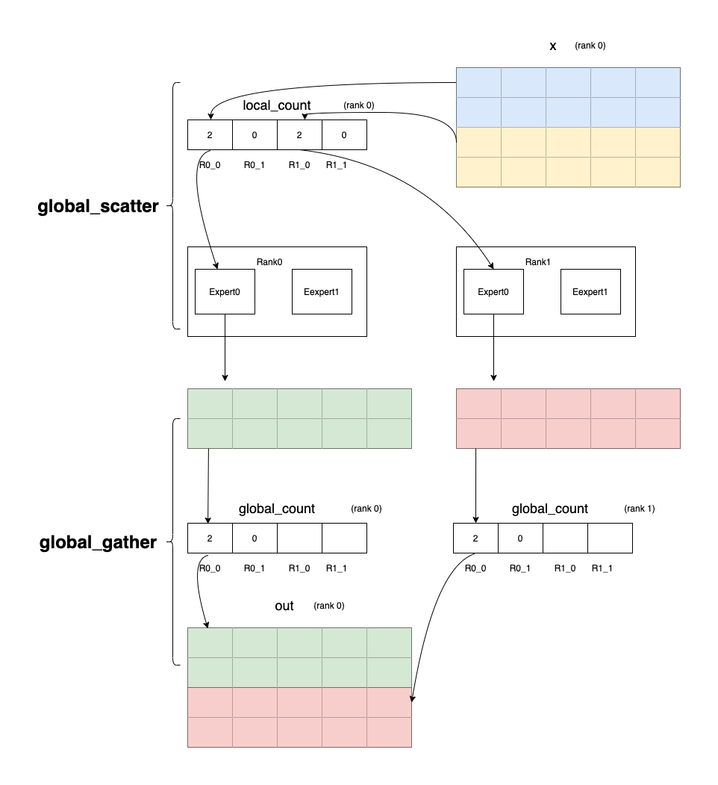

.. _cn_api_distributed_utils_global_scatter:

global_scatter
-------------------------------

.. py:function:: paddle.distributed.utils.global_scatter(x, local_count, global_count, group=None, use_calc_stream=True)

根据local_count将x的数据分发到n_expert * world_size个expert，然后根据global_count接收数据，如下图所示。
其中expert是用户定义的专家网络，n_expert是指每张卡拥有的专家网络数目，world_size是指运行网络的显卡数目。

参数
:::::::::
    - x (Tensor) - 输入Tensor。Tensor的数据类型必须是float16、float32、 float64、int32、int64。
    - local_count (Tensor) - 拥有n_expert * world_size个数据的Tensor，用于表示有多少数据发送。Tensor的数据类型必须是int64。
    - global_count (Tensor) - 拥有n_expert * world_size个数据的Tensor，用于表示有多少数据接收。Tensor的数据类型必须是int64。
    - group (Group, 可选) - new_group返回的Group实例，或者设置为None表示默认地全局组。默认值：None。
    - use_calc_stream (bool，可选) - 标识使用计算流还是通信流。默认值：True，表示使用计算流。

返回
:::::::::
Tensor， 从所有expert接收的数据，按照每个expert排列。

代码示例
:::::::::
COPY-FROM: paddle.distributed.utils.global_scatter