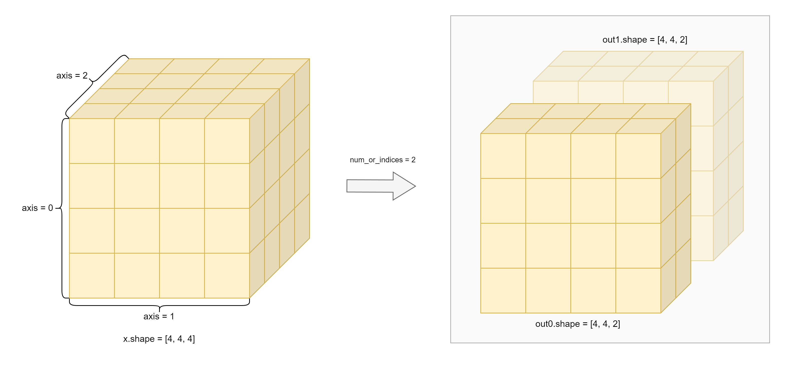

.. _cn_api_paddle_dsplit:

dsplit
-------------------------------

.. py:function:: paddle.dsplit(x, num_or_indices, name=None)

``dsplit`` 全称 Depth Split ，即深度分割，将输入 Tensor 沿着深度轴分割成多个子 Tensor，等价于将 :ref:`cn_api_paddle_tensor_split` API 的参数 axis 固定为 2。

.. note::
   请确保使用 ``paddle.dsplit`` 进行变换的 Tensor 维度数量不少于 3。

如下图，Tenser ``x`` 的 shape 为[4, 4, 4]，经过 ``paddle.dsplit(x, num_or_indices=2)`` 变换后，得到 ``out0`` 和 ``out1`` 两个 shape 均为[4, 4, 2]的子 Tensor :

参数
:::::::::
       - **x** (Tensor) - 输入变量，数据类型为 bool、bfloat16、float16、float32、float64、uint8、int8、int32、int64 的多维 Tensor，其维度必须大于 2。
       - **num_or_indices** (int|list|tuple) - 如果 ``num_or_indices`` 是一个整数 ``n`` ，则 ``x`` 拆分为 ``n`` 部分。如果 ``num_or_indices`` 是整数索引的列表或元组，则在每个索引处分割 ``x`` 。
       - **name** (str，可选) - 具体用法请参见 :ref:`api_guide_Name`，一般无需设置，默认值为 None。

返回
:::::::::

list[Tensor]，分割后的 Tensor 列表。

代码示例
:::::::::

COPY-FROM: paddle.dsplit
