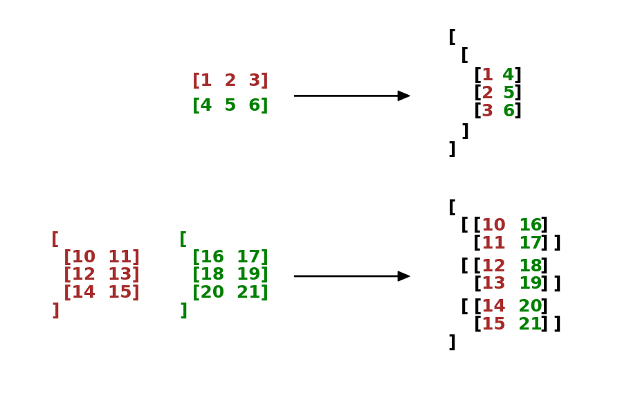

.. _cn_api_paddle_dstack:

dstack
-------------------------------

.. py:function:: paddle.dstack(x, name=None)

沿深度轴堆叠输入 ``x`` 中的所有张量。所有张量必须具有相同的数据类型。

参数
::::::::::::

    - **x** (list[Tensor]|tuple[Tensor]) - 输入 ``x`` 可以是张量的 list 或 tuple， ``x`` 中张量的数据类型必须相同。支持的数据类型： ``float16`` 、 ``float32`` 、 ``float64`` 、 ``int32`` 、 ``int64`` 或 ``bfloat16`` 。
    - **name** (str，可选) - 具体用法请参见 :ref:`api_guide_Name`，一般无需设置，默认值为 None。

返回
::::::::::::
Tensor，与输入数据类型相同的堆叠张量。

也可以参考下方的图示来理解 ``dstack`` 是如何对张量进行变换的。图片展示了两个个形状为 [3] 的一维张量以及两个形状为 [3, 2] 的二维张量，这些张量在深度方向上堆叠后的结果。其中，形状为 [3] 的一维张量在堆叠时会被扩展为形状为[1, 3]的二维张量。

代码示例
::::::::::::

COPY-FROM: paddle.dstack
