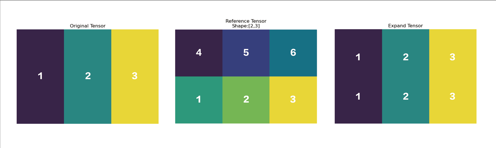

.. _cn_api_paddle_expand_as:

expand_as
-------------------------------

.. py:function:: paddle.expand_as(x, y, name=None)

根据 ``y`` 的形状扩展 ``x``，扩展后，``x`` 的形状和 ``y`` 的形状相同。

``x`` 的维数和 ``y`` 的维数应小于等于 6，并且 ``y`` 的维数应该大于等于 ``x`` 的维数。扩展的维度的维度值应该为 1。

下图展示了一个一维张量通过 expand_as 操作转变为形状为[2,3]的张量。目标张量的形状为[2,3]，通过expand_as，一维张量扩展成形状为[2,3]的张量。

参数
:::::::::
    - **x** (Tensor) - 输入的 Tensor，数据类型为：bool、float32、float64、int32 或 int64。
    - **y** (Tensor) - 给定输入 ``x`` 扩展后的形状。
    - **name** (str，可选) - 具体用法请参见 :ref:`api_guide_Name`，一般无需设置，默认值为 None。
返回
:::::::::
Tensor，数据类型与 ``x`` 相同。

代码示例
:::::::::

COPY-FROM: paddle.expand_as
