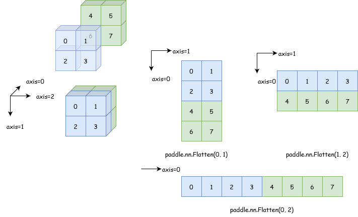

.. _cn_api_paddle_flatten:

flatten
-------------------------------

.. py:function::  paddle.flatten(x, start_axis=0, stop_axis=-1, name=None)

根据给定的 start_axis 和 stop_axis 将连续的维度展平。

.. note::
  在动态图模式下，输出 Tensor 将与输入 Tensor 共享数据，并且没有 Tensor 数据拷贝的过程。如果不希望输入与输出共享数据，请使用 ``Tensor.clone``，例如 ``flatten_clone_x = x.flatten().clone()`` 。

例如：

.. code-block:: text

    Case 1:

      给定
        X.shape = (3, 100, 100, 4)
      且
        start_axis = 1
        stop_axis = 2

      得到：
        Out.shape = (3, 100 * 100, 4)

    Case 2:

      给定
        X.shape = (3, 100, 100, 4)
      且
        start_axis = 0
        stop_axis = -1

      得到：
        Out.shape = (3 * 100 * 100 * 4)

下图展示了一个[2, 2, 2]的 Tensor 在经过不同参数的 Flatten 后的形状，数据依次为 0 到 7。

可以看到，在通过不同参数的 Flatten 后，Tensor 在 start_axis 与 stop_axis 维度间按照升序顺序重新排列元素。

参数
::::::::::::

  - **x** (Tensor) - 多维 Tensor，数据类型可以为 float16、float32、float64、int8、int32 或 int64。
  - **start_axis** (int) - flatten 展开的起始维度。
  - **stop_axis** (int) - flatten 展开的结束维度。
  - **name** (str，可选) - 具体用法请参见 :ref:`api_guide_Name`，一般无需设置，默认值为 None。

返回
::::::::::::
 ``Tensor``，一个 Tensor，它包含输入 Tensor 的数据，但维度发生变化。输入将按照给定的 start_axis 和 stop_axis 展开。数据类型与输入 x 相同。

代码示例
::::::::::::

COPY-FROM: paddle.flatten
