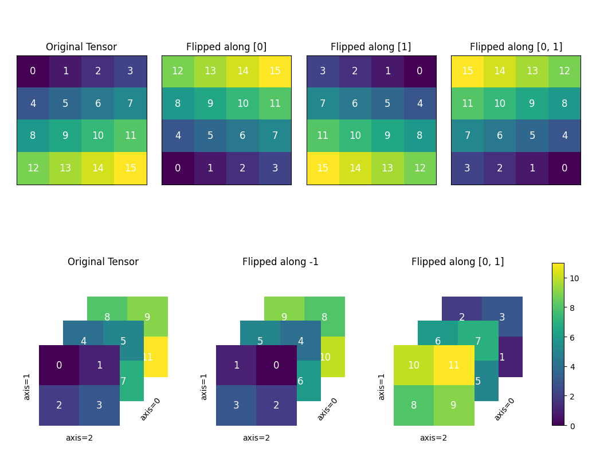

.. _cn_api_paddle_flip:

flip
-------------------------------

.. py:function:: paddle.flip(x, axis, name=None)

沿指定轴反转 n 维 Tensor。

下图展示了一个 flip 的情形——一个形状为[4,4]的二维张量和一个形状为[3,4,4]的三维张量在指定轴上进行翻转。通过比较，可以清晰地看到张量在翻转前后的变化。图例中展示了沿不同轴进行翻转的结果。

参数
::::::::::::

    - **x** (Tensor) - 输入的 Tensor。维度为多维，数据类型为 bool、int32、int64、float32 或 float64。
    - **axis** (list|tuple|int) - 需要翻转的轴。当 axis 是 int 型时，且 axis<0，实际的计算维度为 ndim(x) + axis；axis 是 list 或 tuple 时，``axis[i] < 0`` 时，实际的计算维度为 ndim(x) + axis[i]，其中 i 为 axis 的索引。
    - **name** (str，可选) - 具体用法请参见 :ref:`api_guide_Name`，一般无需设置，默认值为 None。

返回
::::::::::::
Tensor，在指定 axis 上翻转后的 Tensor，与输入 x 数据类型相同。

代码示例
::::::::::::

COPY-FROM: paddle.flip
